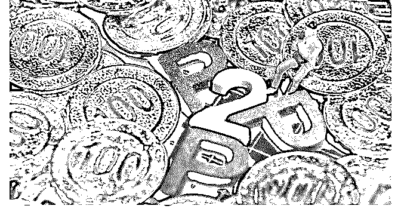

# 富布斯 :互金行业十年发展，

互金行业十年发展，有人赚的盆满钵满，香车美女皆收，有 人如履薄冰，甚至踩雷入坑，从人人追捧到频频暴雷，这个 行业到底经历了什么样的动荡，从原有的 CPA、CPS 到高达 50 元的 CPC，互金行业还有哪些流量生意？我邀请了 分享他过 去在从程序员、再到互金行业的流量生意和摸爬打滚的创业 故事

-------------------------------

大家好，我是李一笑，之前 2 年干过贷款超市，也就是为各类 贷款甲方导流的业务，也算是互联网金融的一个子行业，略 赚了些钱。当然现在已经不在国内做了。

创业之前，我和富布斯一样，最早也是程序员，后来转做产 品，都是流量相关的产品平台，包括 Affiliate，Network, DSP 和 SSP 等等，2015 年被上市公司收购了。2016 年后国内的移动 流量开始往头条系和腾讯系聚集，在加上社交媒体流量的兴 起，独立第三方的广告技术平台的日子就不好过了，大都选 择了转型，比如国内做头条和腾讯的代理，国外做 Google 和 FB 的代理等等

接下去说到重点了，2017 年的时候我开始创业做贷款超市， 这个业务简单的说就是做个 app，放上各类线上信贷产品的链 接，有人通过链接申请了就向广告主甲方收钱，CPA 或者 CPS。一边买流量一遍卖流量，在市场行情火热的时候也很容 易扩大规模。早期也沾了微信公众号的红利，一开始微信也 没有注意信贷类的关键字，多注册些有钱包，借，贷之类的

公众号很容易就可以获得自然流量，做个 h5 放几个链接，可 以直接变现，也可以导入 app 做留存。贷款流量的特点是量 小，单价高，几万 UV 就能做到千万级别的月流水。红利期消 失后，就是常规的信息流投放，比拼流量利用效率了，实际 上做到最后放贷的甲方都会利用尾量变现做贷超，做贷超的 公司也有很多开始放贷，还有些流量的玩法比较灰色，就不 细说了。

在 16 年以前，信贷导流不是一个很赚钱的生意，因为放贷和 电商不一样，电商只要满足用户的喜好，卖货收钱就行了， 而放贷不一样，不仅要放出去还要能保证收回来，决定了大 多数的申请人无法借到钱，也不能为甲方产生收益，甲方不 能赚钱的行业，流量的利润空间显然也是有限的，要想赚钱 就需要甲方通过率高，而且额度低，让更多的借款人能借到 钱，而且还需要借多家才能满足。

这个转机在 2016 年出现了，那一年 P2P 出现第一次较大规模的 暴雷潮，还没想着跑路的公司迫切寻找一种能够产生高收益 的信贷业务来覆盖运营成本并兑付投资人的收益，结果发现 给所谓优质用户放大额贷款不是门好生意，利息收不高，坏 账也不低，真正的好生意是给信用卡也办不出的次级用户放 1000 到 3000 小额贷款，借款的需求总是存在的，和借不到钱 相比，借款人也并不排斥付出更高的利息。很多的 P2P 公司也 依靠这个业务填补了窟窿，虽然现在我们知道只是暂时填 补，实际上能够坚持到 2019 年还没有暴雷的 P2P 公司都靠 2016 兴起的现金贷业务续了一次命。凭心而论，在 2017 年 12 月 前，主流的现金贷公司的实际利息并不高，虽然超过了法定 的 36%，也在借款人普遍的接受范围内，比真正的线下高炮 还是要低不少的，高额的利润主要来自于加足资金杠杆后的 规模化，巅峰时期，掌 X 一个月放款 80 亿，现金 X 卡一个月 50 亿，能做那么大得规模也意味着这些公司也在追求合规化， 希望可以被监管，连纳税都是实足缴的。在这个时期，贷款

超市虽然赚钱，但是利润率不高，因为甲方既有规模又集 中，普遍只为新客付费，贷超承受越来越高的流量成本买来 的用户经常已经是大甲方的老用户，并不计费，影响了收 益，卖流量的生意要想利润高，甲方最好的情况就是小而分 散。

2017 年 12 月第一次由监管引起的动荡产生了， P2P 网贷风险 专项整治工作领导小组办公室下发了《关于规范整顿“现金 贷”业务的通知》，当天晚上就造成了所有平台的踩踏式的逾 期潮，2018 年春节后逾期率有好转，也始终位置在高位，直 到 2018 年 6 月。P2P 网贷风险专项整治工作领导小组办公室并 不是一个很强力的部门，但是在当时很多 P2P 公司看来，不遵 守规定就不能获得预期中在 2018 年 6 会进行的 P2P 备案资格这 一免死金牌，而现实是很打脸的，因为 2018 年 6 月备案又延期 了，第一批撑不住的 P2P 反倒是那些坚持所谓合规，从没做过 现金贷，所以也不够钱填窟窿的公司。

挺过逾期潮的公司就开始放飞自我了，既然没有合规的可能 那就赚钱吧，互金行业的从业者有的自己入场放贷，有的输 出系统提供给江浙一带的各类金主，尤其是后者大幅度降低 了外行入场的门槛，一下子冒出了超过万家甲方，这种市场 状态也是贷超的好时光，甲方小而分散还赚钱，都是新品无 库存，注册转化高，付款快，进而从原有的 CPA 和 CPS 的结算 方式外出现 CPC 的结算，暨按每次点击计费，而且价格可不 是一般广告平台的几毛钱，而是 10 元起，今年 315 前最高有人 卖到 50 元，能接受那么高的流量成本自然也是因为甲方的利 润足够高，或者说甲方认为他们的利润足够高。放贷的风险 是滞后的，账面上的利润在钱收回来的时候才知道是不是真 的利润，只是账面上的利润数字总是会给很多老板错觉让他 们放手买量，并且不断的推高利息缩短期限。系统公司，第 三方风控服务公司和数据公司的组合把线上放贷的门槛降低 到充钱就能放的程度，加速了外行金主涌入的速度，也加快

了行业被全面监管的时间。

纵观这些年的互联网金融行业，整体上就是先鼓励上高楼， 然后再拆梯子，拆完再逼人跳楼的过程。一刀切的监管管不 了潜在的借款需求，造成的现象就是越监管实际的利息越来 越高，用年化 36%这样一个并不合理也没人说得清楚为什么 是这个数字的标准来作为是否违法的分界线，只能拦住大公 司，总有民间借贷从业者把法律风险也作为风险溢价加在利 息上，在银行体系借不到钱的人最终还是要承受更高的利 息，除非银行不在意坏账。

PDL 这种赚钱的业务显然不会没有政策风险，本来 PDL 作为 P2P 的一个分支，监管会有种看着老鼠躲在瓷器店的感觉，但 是一旦连瓷器(P2P)都不想要了，那么监管之下就无从遁形 了，到了今天 PDL 已经成了接近 bo 菜的行业了，当然即使是 现在也还是有人在做，利润也不低，这个时候比拼的就是法 律风险的承受度了。

今年下半年开始主要做东南亚几个国家（印尼，印度，越南 和菲律宾）的贷超，从 2017 年开始国内大小互金公司都有出 海放贷的，东南亚总是第一站。

我个人比较看好印度和印尼，想在东南亚互联网市场做得深 入一些，除了互金外，也在探索其它的机会，希望和熟悉东 南亚市场的朋友多交流，

微信：scott2148

另外手上有一些东南亚市场 PDL 产品的 CPI offer，目前投 FB 和 Google，还没有投过 Affiliate，如果哪位朋友有兴趣的话也 可以聊聊。

2019-11-06(13 赞)

关注公众号"懒人找资源"，星球资源一站式服务