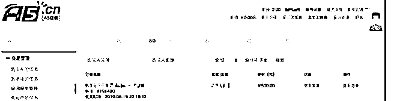

# 搞 Aff 赚佣金看起

富布斯 : 搞 Aff 赚佣金看起来是做别人的嫁衣，真正赚大头的 还是广告主。国内也有一批 Aff 转型广告主做黑五产品赚老外 的钱，放着好好 made in china 资源不用也是浪费。问题是广告 主承担的投入资金和库存风险也不小，从选品到生产到推广 销售、售后一堆麻烦事啊！

我就不擅长做广告主，没有别人的格局大，所以只能做嫁 衣，赚小钱！但 Aff 的佣金未必都是最少的，我上个月做的一 个国内的网站开发单子，接到手是 8000 块，由于我当时时间 也比较紧凑，就到 A5 找了个人做这个单子，价格是 500 块。就 是说我什么都不用做，纯赚 7500\. 钱虽不多，但佣金比例达到 90%以上了。

任务订单记录见图一 这种事情在各行各业司空见惯。首先，这个订单我花 500 元找

别人做的质量并不差，因为我提的需求很清晰，对结果质量

把控很好，所以这并不是一分钱一分货的买卖。而是，从认

知和信息差、以及时间成本的这几个层面考虑。

让我花时间做这个任务，8000 的确是底价了。这是我的时间 成本，但是总有比我更熟练、时间成本更低的人愿意以订单 量获取利润的。因为我大学时期也干过这样的活，我在这篇 文章里聊过我的大学收入结构：

大概是上周，我跟一个朋友在撸串的时候说到这个事，他很 惊讶问我，你接一个网站都这么廉价了？

看吧，同样一个信息，每个人理解的可能都存在巨大的价值 认知差。除了技术熟练程度、还有时间上成本各不相同！

空手套利的案例到处都见。这个案例完全可以成立一家技术 公司，印上响当当名片，牛逼哄哄的公司官网，捣腾些客户 案例上去，逢人推一名片，网络推一推，本地广告投几个， 套利的空间是有的。

还有在 第 8 期分享的案例，都不需要投入什么创业成本和技术 能力，研究这个模式所存在的一些机会，做好「中间人经 济」就行！

[谈谈我这些年的互联网赚钱经历](https://mp.weixin.qq.com/s/YG-BAywyQPNPae4EGX1xUA) [`t.zsxq.com/j6QrNnQ`](https://t.zsxq.com/j6QrNnQ)

2019-10-05(11 赞)

富布斯 :

关注公众号"懒人找资源"，星球资源一站式服务