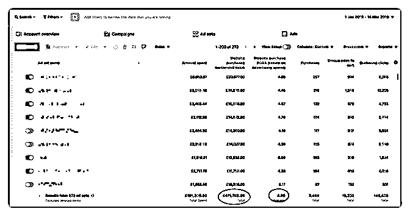
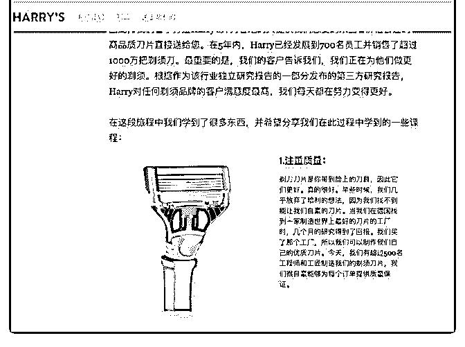
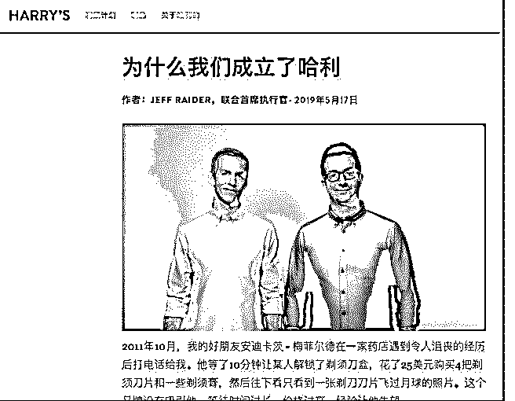
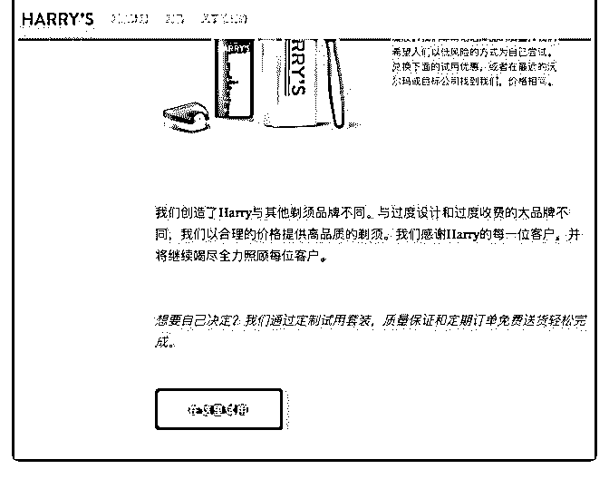
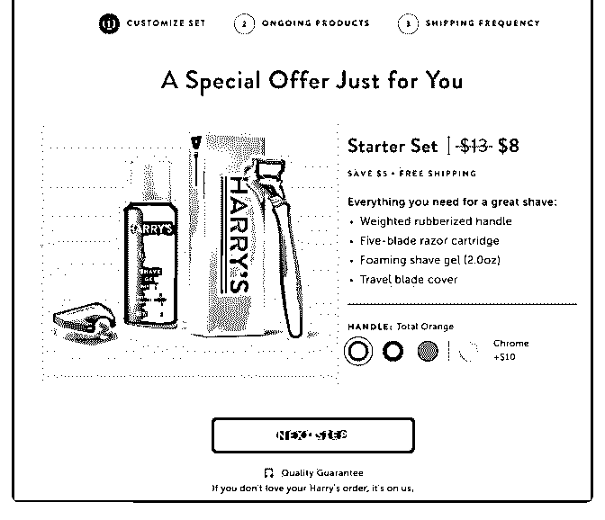

# 今天 Jersy 分享

jersy : 今天 Jersy 分享一个高客单价（超过 100 美金）玩法

案例主人公是一家 FB 投放服务公司，帮客户做电商，销售额 超过 20 万欧元/月，产品平均客单价达到 100 欧元，算起来一个 月可以卖掉 2000 台，一天卖 66 台，平均 ROAS 为 4，即一单广 告成本为 25 欧元。（图一）

首先大家需要明确的是用户转化是有一个过程的，以前做低 客单价的（15-29 美金）的产品，因为产品价格低且吸引力很 强，95%用户都是首次观看广告即购买，但是高客单价的产 品不可能这样玩，因为单价高，用户的决策周期很可能会很 长，产品是否吸引我？是否值这个钱？是否健康是否会对安 全产生隐患？

这就要求我们用广告多次触达用户，先看首页，再看详情 页，最后再送个优惠券这样一系列的过程。下文中主人公的 广告策略也是遵循这个路径做的：多次广告触达。

1-将着陆页变成博客页面，而不是产品页面 这里也是贯彻了之前多次转化的思想，将用户引导到博客文

章会降低用户的抵御意识，同时这篇文章主要就是介绍你们

的产品，比如公司理念，产品亮点等，说服用户为什么非要

从你这买产品。

比如这个案例： 说故事，为什么创立 harrys 这个剃须刀品牌（图二）

产品优点（图三）：

1\. 质量过硬（世界上最好的刀片工厂），用户多（已经卖了

100 万台）

2\. 砍掉中间商，让利给消费者，那吉利做反面例子，说我们

只有他们价格的一半

3\. 热衷慈善，热心社区

4\. 首单优惠（不再说虚的，用折扣引导用户转化）

最后放置了一个转到产品详情页的按钮（图四）

反思：按我的推测，博客-详情页的流程设计让用户经过一次 跳转，会降低转化率，但是会提高详情页的转化率，这样做 这么一个转跳才有意义。

这里我的思考是：博文和详情页的本质区别是什么？ 回看一下案例中博客的内容，其实营销意味很强，都是为了

说服你我们为什么好，用户为什么要买，但是详情页描述就

不能放这些内容了吗？如果我把博文的内容放到产品详情页

的描述中去，让用户直接去产品详情页，会怎么样？

如果我把博文和产品详情页结合起来，做成一个页面，上面 文章，下面详情页，用户无需转条，那么是不是效果会跟 好？

这里还可以思考：转跳是什么？为什么需要转跳？ 如上，如果我来做，至少会做四组测试：

1\. 博客——产品详情页

2\. 常规产品详情页

3\. 产品详情页，放入博客内容

4\. 取消转跳，将两个页面结合成一个

其他例子：

2-用户 Review 非常有用，把他们用在你的素材里 当你去亚马逊买东西的时候？你是先看产品描述还是立刻跳

到用户 Review 里看看真实评价？

Review 最重要的是平衡，这个产品确实不错，但是也有点缺 点，过分夸大吹嘘给人感觉太假，广告效果不会好的。

对于独立站，通常用户购买后很少会主动评价，使用一些 Review 类插件，可以在用户购买后主动发邮件给用户，邀请 用户 review，这是一个高效获取 Review 的方式。

3-在着陆页放置“Facebook Exclusive“即 Facebook 用户专享优惠 码

以我的经验来说，产品全价用户购买意愿是没有被完全释放 的，他觉得什么时候买都行，或者就是犹犹豫豫下不定主 意，高客单价产品这个现象会更严重。 所以适时的刺激就很重要了，一个是限时，还剩三天下架， 一个是折扣，尤其是 Facebook 用户专享折扣码。

4-动态素材功能 啥是动态素材功能？就是准备五个图片素材，五条文

案，Facebook 会自动帮你将这些文案和素材自由组合，并且

测试出最好的图片和文案组合。

当我们找到最好的素材后，我们会复制帖子 ID 到所有广告， 这样可以帮助我们积累所有社交互动到同一个帖子里。

我们发现当花费增加时，广告 ROAS 会逐渐增加，我们推测这 是因为帖子的社交互动越积越多的原因。

不过，所有广告都有效果下降的一天，这一般都是因为受众 枯竭，我们可以把之前的流程再做一遍，继续循环往复。一 般在广告寿终正寝前，平均可以消耗 15k 欧元，我们最好的单 条广告曾产生过超过 100k 欧元的销售额。

我的思考：这个动态素材功能我认为优先级是低于广告测试 的，因为对于视频广告来说，百分之七八十的重点都在视频 本身，而不是文案，如果是图片广告，可能文案作用更大 吧，这个我不是很清楚，希望圈友懂得解惑。

5-再营销时使用不同素材 再营销就是多次触达用户的一个必备实践。

之所以要换素材，是因为再营销时用户已经看过一遍素材

了，再用相同的素材用户大概率会疲倦和厌烦。

案例中我们使用的素材时创始人亲口讲述公司创立理念，包 括本人照片和一个优惠码。

我的思考：这里案例里素材的选用存疑，无论公司的故事说 的再动听，用户其实应该只关心产品才对，所以我对此不是 很相信，待测试。

6-初始受众要足够大

初始定位广告时，受众至少大于两百万，在涨预算时如果受 众过小，会明显限制广告效果。当你提高预算时，三百万大 小的受众会明显比 50 万大小的受众容易涨预算。

同时尝试把 1%，1%-2%，2%-3%的相似受众结合在一起跑， 他们自己的效果很不错。

7-投广告前先关心基础建设 作为一个广告投手，我犯的最大错误就是幻想只要我修改竞

拍值或者使用一些牛逼的定位策略，广告效果就会大幅改

善。

电商中产品和素材才是最重要的，所以在你去 FB 代理开户 前，先拍好素材，测试好着陆页，这些准备工作的重要性大

过广告。

8-最后总结一下：

1\. 产品和素材最重要，做广告前先做好这两件事

2\. 高客单价产品需要多次触达用户，才能转化

3\. 着陆页用说服性博客内容，再转跳至产品详情页

4\. 着陆页提供 Facebook 用户专享折扣码，可以提高转化率

5\. 重定向广告时不能用旧素材，需要更换素材

6\. 用户 Review 可以被当作广告素材，但是注意要用词中肯，

有夸有踩

原帖： 最后欢迎大家提问讨论，毕竟这篇帖子的内容有些我也是存

疑的。[Harry's+-+Quality+Men’s+Shaving+Products.+Fair+Pri...](https://www.harrys.com/go/msn-pro-1/?fbclid=IwAR34X5kG9O30wPPy3mugKNmiSoSV1OghYrJKb6vWlC3ldEMQVqQTZT043cM)

[7+reasons+guys+are+loving+Filippo+Lore](http://journal.filippoloreti.com/7-reasons/?fbclid=IwAR1Wxg1sHmpSIAIO398HJyVqxOWb3ulvbf6UjFA7eK-udohHh-q-jYv0bG8)ti

[How+does+quip+compare+to+your+manual+or+electric+t...](https://www.getquip.com/blog/how-does-quip-compare-to-your-manual-or-electric-toothbrush?fbclid=IwAR3gRuQGyR9vJHXobnwkyzDkHMlPsy9fPgTtLRBePQgVEL9AtK92Ge3dOdw)  [`www.facebook.com/groups/adbuyers/search/?q...`](https://www.facebook.com/groups/adbuyers/search/?query=high%20value&epa=SEARCH_BOX) 2019-07-17(17 赞)

评论区：

孤岛# : 感谢大佬分享，受益了

富布斯 : 梳理一下案例的整个 sale funnel 很有价值

关注公众号"懒人找资源"，星球资源一站式服务