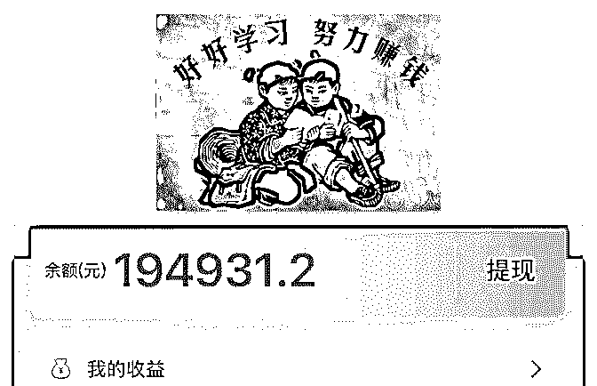
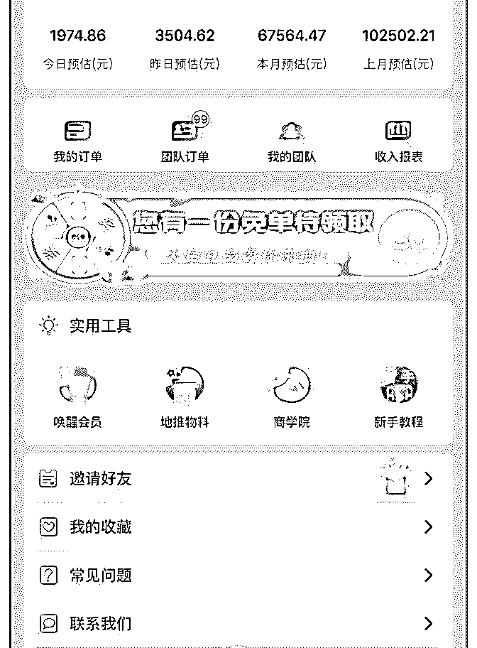

# 赚钱的项目大部分人

富布斯 : 赚钱的项目大部分人都不方便说，方便说的大部分都 是过去才能赚的项目！ 老富有一位“单纯”的朋友却打破常 规，竟把自己现在月赚 6 位数的项目全抖出来了。

我们知道 Affiliate 是一个追逐佣金的物种，在国内这个物种我 们俗称为：淘客！我记得最早的淘客从 2008 年就已经开始流 行起来了，经过 11 年的迭代，最近几年听到更多的是淘客们 哀嚎，淘客真的很难赚到佣金了吗？

机会可能永远都在，只是玩法变了！

老富的这位朋友 ，去年才真正开始入场淘客，作为一位初入 茅庐的新手：

他是如何在短短一年实现月入 20 万+的？ 他有什么不一样的入场捷径做到后来者居上？

接下来我们听听 娓娓道来现在仍可复制的淘客实操经验和他 的佣金故事！

富布斯：胜利你好，很高兴邀请你参加「Affiliate 营销圈」分 享你的佣金故事，认识你那么久知道你一直以来都在专注淘 客领域的掘金探索，跟 Affiliate 一样赚了很多佣金，可以给大 家介绍下你是怎么进入到这个领域吗？

胜利：富哥好、大家好，我自知我的履历极其一般，所以能 在高手如云的「Affiliate 营销圈」和大家分享一点我的淘客故 事，发自内心的觉得非常荣幸。

我是 08 年毕业，直至 2016 年 5 月我的工作一直是环境工程行业 技术员（新加坡工作），2015 年 3 月至 2016 年 8 月，我和国内 高中同学合伙搞网络推广（我只投钱，不负责具体运营）， 由于不专业、不盈利加上最重要的理念不合 2016 年 8 月散伙。

2016 年底，从 XX 大咖会了解到淘客这个行业，2017 年 2 月花 了 12888 加入我现在老板的社群 X 盟会，从那时才开始比较全 面的了解这个行业，但由于我是零基础，加上那时候非常不 专注（看两篇文章就觉得是赚钱机会），所以虽然群内一帮 淘客高手，但是始终进步缓慢，直到 18 年 3 月我的老板做【高 佣联盟】才比较认真的对待淘客。

富布斯：说说你在这个领域掘到第一桶金的故事，你是怎么 做到月入 6 位数的？

胜利：淘客经历过网站、QQ 群、自媒体、微信群、返利等形 式，到 17 年下半年开始流行 APP（微信 17 年 6 月开始大量封杀 微信号，转型 APP 也是迫不得已）；目前我做两个平台：

【高佣联盟】和【芝麻鲸选】。

先聊【高佣联盟】，高佣联盟是 18 年 3 月上线，是固定佣金比 例的免费代理型淘客 APP，目前主推：淘宝、天猫、拼多多 和京东 CPS，等级稍高点拿全团队推广分佣。我的主要流量来 自公众号截流，补充流量：百度、公众号派单等，公众号现 在依然平均每天新增 150+粉丝；高佣联盟每天贡献佣金 3000+，月 10 万左右，由于非常稳定，我交给同事负责，我精 力在【芝麻鲸选】上。

芝麻鲸选和高佣有重叠的部分，但版块丰富很多，想象力很 大，不仅有 CPS，还有拼购和自营商城等，所以今年 3 月底老 板提出来做这个新平台后，我毫无犹豫的入局了，4 月初到现 在几乎每天工作 18 小时以上，今年 5 月 3 号社交电商鼻祖云集

的上市，更加坚定把重心转移到芝麻鲸选上。

刚开始做芝麻鲸选时，我带着 20-30 个高佣联盟的心腹过来， 到目前为止，用了两个半月，我的芝麻鲸选团队总人数已经 突破 12 万，平均每天新增 1500+。APP 是 5 月 25 号上线，问题 无数，还没有开始培训代理，也没有建各种素材群的情况 下，每天依靠代理自己选品，自己出单，每天佣金 2000+，我 已经非常满意。

简单总结下：做代理型项目，早期专注怼流量，从海量的不 精准人群筛选出优秀的人，这个过程比较漫长，会消磨大部 分的意志，坚持下来后再做下一个同类型项目可以秒起步。

富布斯：作为一名优秀运营操盘手，给大家分享下你的淘客

APP 运营经验。

胜利：我觉得这个问题是本次分享最核心的地方，也是我个 人感悟最深的。

代理制项目，如果老平台走下坡路，代理或自己主动找新项 目后一定会有人员流失问题，过渡到新平台的过程中，原有 的层级也极易被打乱。从高佣联盟到芝麻鲸选，在最初期我 就预见到会有这个问题，所以我一开始拉来做芝麻鲸选 20-30 个人都是我高佣联盟的一级代理，后来即使有我的老平台二 级、三级等代理想做我的新平台直属，我还是会让他们找之 前的老上级，最大程度的保持原有等级关系不变，越级抢代 理是一种自杀行为。由于我做了一个好的榜样，我的一级代 理继续找老平台的二级代理，二级代理找三级代理，层层复 制，层级关系最大程度的保持原有的样子。以上过程花了一 个礼拜左右，最核心的前三级代理关系捋顺了，启动粉阶段 完成的很好，接来下就是裂变了。

由于芝麻鲸选是新项目，大家热情都很高涨，同时很多人不 太清楚这个项目的很多细节，我顺势建了微信群，注册后可 以拉进来，目前建了 19 个，有了这些普通群，我又从这里面 过滤出了核心群及准核心群，对应不同的门槛。

譬如：核心群门槛（门槛不断调高）是团队人数满 500 人，外 加 500 元群红包，而准核心群门槛只有一个，团队人数满 100 人就可以进，准核心群给核心群储备人才用的，这两个群是 我自己重点维护，19 个普通群是我的 3 个群管理员维护。

仅仅有核心群还不行，社群活跃不活跃关键是看新鲜血液， 如果一直是同样一批人早晚会没有话题聊的，我在核心群设 立了淘汰制，长期潜水、不贡献价值的人即使再大的咖也会 被请出去。核心群人数会控制在 100 人，6 月底开始会根据贡 献的佣金及团队人数等几个考核标准来决定谁可以留在核心 群，每月筛选一次，最大程度保持群活跃度。

只有淘汰，没有相应的福利是不能服众的，群内随机红包很 多很多，我发红包 500 起步，还有各种拉新奖励，赠送流量等 多种福利，核心群约等于福利群，所以在群里的人珍惜机 会，不在群里的都努力想进来。

为了给我自己及大家更多的赋能，我从核心群里筛选出一批 有才华的人，组建成我自己的服务团队，和他们的关系是半 员工半代理，目前这个服务团队的规模是 40 多人，结合行业 特点及一般公司的部门去组建我的服务团队，目前有：运营 部、技术部、培训部、研发部、招商部等。

服务团队的待遇除了核心群的所有福利外，还外加分我的总 收益，我挣得多他们分的多，所以即使知道我的钱来自他们 贡献的佣金，但一旦和他们切身利益相关，给我大团队服务 都非常用心。

也许大家有疑问，目前我的收入也仅仅只是来自每天 5000+佣 金，能支持这么大的盘子吗？对于佣金，我不是看的太重， 本身有点积蓄，所以即使全部分出去都行。我需要团队，代 理制项目，代理=钱，我需要足够多有能力的代理，代理建购 物群或朋友圈出单，会带动后面的招商，我的佣金用来养团 队，招商挣钱，这是初步的思路，其实还可以继续延伸下 去。

富布斯：你是怎么看待现如今和未来几年的淘客行业的？ 胜利：由于微信内限制越来越大，返利淘客会越来越难玩下 去；共享型淘客 APP 生存空间会越来越少；纯导购型 APP 也会 逐渐被淘汰出局；但淘宝直播、快手直播等淘客形式会继续 增长。 淘客 APP 不再单纯是一个领优惠券的平台，会结合本地拼 购、自营商城、实体 CPS 等。

富布斯：你未来有什么样的目标和展望？ 胜利：我个人的目标是：1、一年内培养一千名小 KOL，小 KOL 指的是有 100 名铁杆粉丝；2、个人财务小目标年佣金 500 万。

富布斯：你对现在想入场的新手有什么建议？ 胜利：对于新人，我有 5 个建议：

1、花多点时间在选择上，选择一个有积累性的长久项目，并

且是阳光的；

2、项目需要结合自己的优势，因为每个细分领域都有无数高 手；

3、一旦认定方向，每天需花费相当大精力与时间在上面，方 可有所建树； 4、多和行业一线从业者交流，别人三两句话可能节约自己几

个月的摸索时间，一线从业者最容易接触到的渠道就是付费 社群； 5、专注再专注，新人非常不建议做两个及以上的项目。

富布斯：感谢胜利的真诚且结实的干货分享，你目前最需要 在「Affiliate 营销圈」对接什么的资源？

胜利：1、最迟今年 8 月，我开始做招商，如果圈里哪位朋友 有店铺需要 CPS 推广的（ab 单也算），我们可以聊聊； 2、圈里想尝试做淘客 app 的，也欢迎交流，我的微信：

360154563。

2019-06-22(84 赞)

评论区：

Joey : 好厉害

Orca : 这是什么 app

夏厚义 : 太厉害了，什么时候分享啊？

洋 yang : 厉害

后三排 : 最近要做的一个项目就是这个，有兴趣一起来玩的朋友加微信。35910232。

兴国 : 这是 花生日记 吗？

镜魇 : 高佣联盟

丸子 : 我感觉应该类似花生日记，但是花生的规模应该更大

关注公众号"懒人找资源"，星球资源一站式服务

# #手机订阅 CPA

鱼儿 : #手机订阅 CPA offer 仅个人总结，可能手中数据不能以偏概全，因为每个都有所 偏重的地区，所以欢迎大家补充指教。

从转化数据上看，RU, MX, MM, IN, ID, UA, BD, BY, PK 这类

国家气势依旧很猛，转化好，CR 高，价格普遍低，1-2 click

flow, 胜在量大，盈利不可小觑，同时也存在，出量大广告主

对质量要求更高，流量容易被屏蔽。解决办法，让 am 给你换

渠道号，你自己换流量，屏蔽过的流量千万不能再跑同一广

告主的同一国家 offer。但量优，能控制投诉率，那没的 说，cap 都是你的

TH，MY 是元老市场了，TH-truemove（capture）/ais（direct aoc, OTP）/MY-celcom 占据大， truemove 现在绝大部分都是有验证码的，google 验证码（数字/ 图片），突破验证码变得尤为重要。

还有就是，MY 的 digi 那边政策规定一个用户每天订阅的内容 不能超过 10 块钱（当地货币），整体 filter 也越来越多，增加 了难度。 接下来就是欧洲国家，竞争大，转化难，建议不要大量跑 的，保守一点才能走得更远。例如 DE 单个 offer cap, 不要超过 50/d. 如果流量充足，可以多分摊几个国家跑/分摊到不同 offer，可 以降低风险.

建议，还没有突破验证码，对 pin 吃力的渠道，可以多尝试较 偏的小国家，欠发达国家，CIS，AF，SEA，ME 的小国家都 挺多的，1-2 click flow.

有了解到 in app，WAP 流量能带来不错的表现，不知这对跑订 阅的有没有帮助。

现在在坐高铁，今天也要继续学习～～

2019-06-22(22 赞)

评论区：

杜超雨 : 很棒的分享！！

富布斯 : 星球又赞赏不了了，私信我一下

Sean- 家有二虎* : 感谢分享

刘国兴 : 墨西哥的定阅不是全部停了吗？

鱼儿 : 是停了好多，这边 Movistar 还是在跑

鱼儿 : 才进星球，不知道咋私你[委屈]

关注公众号"懒人找资源"，星球资源一站式服务

# hi,大家好，我是

jersy : hi,大家好，我是 Jersy，这次被富总邀请过来给大家分 享，诚惶诚恐。

知识星球比较私密，客套话就不说了，来点实际的东西。 我最早是在网易当产品经理的，算是正统的互联网公司，做

为入门级产品经理，每天接触的都是业务范围内的东西，画

画原型图求求程序员这种活。

我记得有一天晚上我看到了亦仁的一篇如何通过谷歌发掘海 外细分市场的文章，框架性地介绍了如何从无到有开始一个 小生意，而且他说每个人都应该创业，都应该不止做一份工 作。我看完以后非常震撼，仿佛思路一下被打开，这不正是 适合所有人的一个精益创业的思路吗？

文章中列举了一些创业方向，比如 Review 站，英文工具站， 接着我就看到了 10beasts 那个站长的文章，大家应该都听过这 个站点，短时间内暴富的神话，几年内都是英文 SEO 圈子内 的热门话题。而且站长还开了一个网站叫 Nichepai，事无巨细 地介绍了他做网站的过程，好像跟着做就能想她一样暴富一 样，于是我一边上班一边跟着做了下去，买链，和写手沟 通，二手域名，抱大神大腿，虽然各种被坑，花了很多冤枉 钱，但这是我第一次系统地尝试操盘一件事，相对于按部就 班地上班，这种自己掌控自己生活的感觉实在太好了。大概 花了大半年，网站收入涨到了几千刀。

随后大家知道的，Dropshipping 火了起来，海外流量圈子很多 都转型 FB+Shopify 这种爆款产品的模式了，我嫌弃 SEO 时间 慢，又转了 Dropshipping，这次我不甘心拘泥于个人玩票，从

网易辞职，并且找来了几个朋友一起合伙。

嗯，这次又是零基础进坑，包括我朋友和我对海外付费流量 一无所知，我虽然做过 SEO，但这和 FB 买量又是另一回事， 而且涉及到了电商的模块，可以说是完全崭新的东西，好在 那时候比较傻，算是无知无畏，说搞也就搞了。

我记得第一个产品，单次转化成本大概 60 刀吧，不知道听谁 说 fb 广告优化有什么机器学习的东西，需要一直让他获取转 化积累数据，然后第一个产品跑了几千刀也没见后续转好。 后来又学到了相似受众，用之前积累的数据做相似受众，跑 WC，一下就爆了，预算加到几千刀/天 广告跑的稳稳的，8- 10 刀左右一个转化，不敢相信付费流量这么快这么爽。

第一个产品撞了狗屎运跑了出来，第二个第三个就没那么顺 利了，要么小规模盈利预算加不起来，要么产品太旧已经被 人洗完了。这个过程中我开始分析 Dropshipping 这个模式，我 觉得这个东西就是骗人啊，产品质量垃圾，完全没有复购， 这种模式也能行得通吗？可能是跑的不好，我内心就有点抗 拒：到底行不行啊？

后来多亏了我的另一个朋友分析是产品太旧的原因，找程序 员开发了一款爬虫软件，专门扒一些大网站的新款产品，扒 下来了就测，除此之外我们自己也去淘宝找产品测试。事实 证明之前确实是产品太旧的原因，我们新品的测试成功率达 到了 10%以上，每个测试成功的产品至少轻松跑个十几万美 金。

到去年中年末，明显感觉到爆品在变少，我感觉可能不好做 了，于是大家合集收收心，分钱就得了，最终 Dropshipping 项 目营收大几百万。

这个过程中亦仁找我开大航海活动，就是带领船员做 dropshipping，实话说我当时才没想做这个东西呢，费功夫还 没钱，但是因为是亦仁邀请的，毕竟心里有着感激之情，所 以也就接了，最后成果也还不错，办了三期，每一期一个 月，都是在用心教，成果也都不错，最好的几百刀/几千刀/天 的也不少，更重要的是我知道影响力也是很有价值的一件 事。

过去我总觉得高手都是不露声色的，那些到处晃来晃去的都 是半桶水，我才看不上呢，我就是要钻研最牛逼最高深的东 西，那些 Pixel 怎么安装的东西我才懒得看，都是垃圾。

但是我后来意识到并不是人家水，而是我目光太狭窄了，亦 仁给我说过多次，影响力其实作用很大，要当个意见领袖。

接着随着团队解散，我面临选择，最后我来了深圳，选择跨 境电商的方向，从一个流量玩家转型跨境电商独立站玩家， 因为我觉得相较于流量，国内供应链待释放的空间更大。同 时兼独立站领域的 KOL，因为我尝到了做一个 KOL 的好处。 这个方向算是我过去经验的累计所作出的选择。

回顾我并不长的“创业”生涯，我的心得有这么几个： 别因为一个行业而拴死自己，我做产品经理和做 SEO 期间，

都认识了准备把这些事情做一辈子的朋友，这里不是说做一

辈子不好，而是他们选择做一辈子并不是因为某种“匠人”精 神，而是思维固化不愿意接受新事物，就像当年对做 KOL 非 常抗拒的我一样。

不要小富即安，有机会就要做大，小生意本身的抗风险能力 弱自身竞争壁垒也未建立，今年能挣钱不代表明年也能挣 钱，Dropshipping 就是典型的流量变现，供应链端毫无壁垒，

流量端的竞争力我也自认没那么牛逼，所以我认为

Dropshipping 是建立不了壁垒的，就是一波流，挣波块钱。

最后，生活最终还是为了幸福感，随着我创业我会接触到各 种比我牛逼百倍的人，然后就开始比，比天比地，我为什么 没那么牛逼，我为什么挣得没有别人多，我.... 我就越来越焦 虑，后来发觉有人和我说你这个年纪已经做的挺不错的啦， 我才发觉我好像也没那么差，所以钱还是要挣，但是比较要 有度，有些毫无意义的比较自己应该有能力辨别了，这个时 代已经够焦虑了，不要再让无脑自媒体文章煽动自己的焦虑 了，有点空多做点让自己有幸福感的事儿把。

2019-06-21(73 赞)

评论区：

谢书林 : 今年正在做这个事情，大神领导大家搞大航海，来得正是时候，非常期待！

富布斯 : [强]很真诚接地气的分享，随着业务逐渐繁忙，此次很幸运邀请到他担任船长， 大家抓住这次机会上船吧[微笑]

meek : jersy 老师，我在这里，一定要带我上船啊

石头 : jersy 大神哦.上次准备参加他培训的.非常优秀的老师.

秋生 : 老师太优秀了，对 dropshipping 有不一样的看法

Sean- 家有二虎* : 感谢船长的分享

hank : 非常看好你的项目，加油

佳 : 求上船

关注公众号"懒人找资源"，星球资源一站式服务