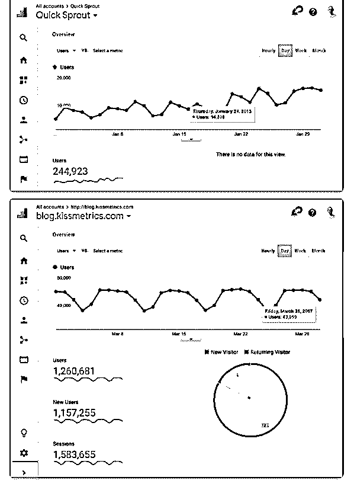
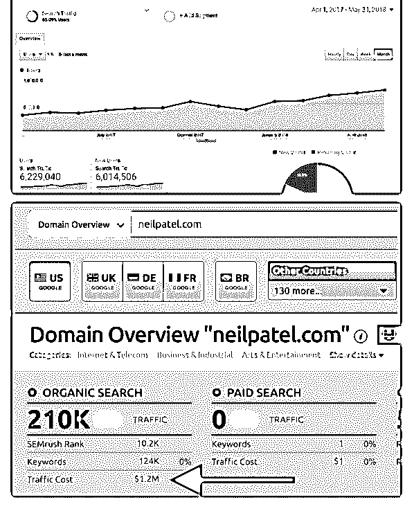
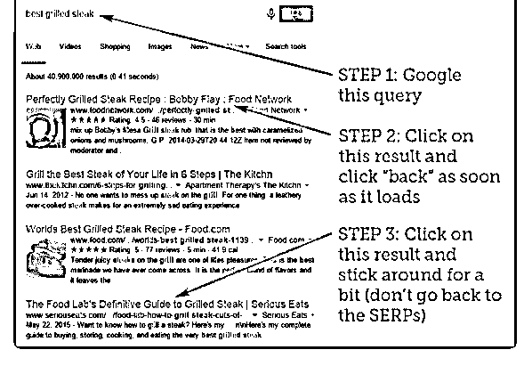
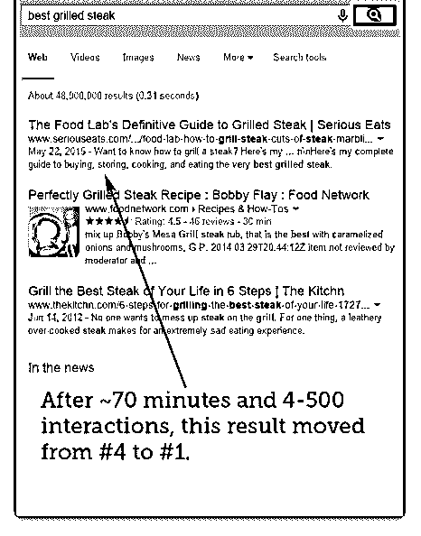
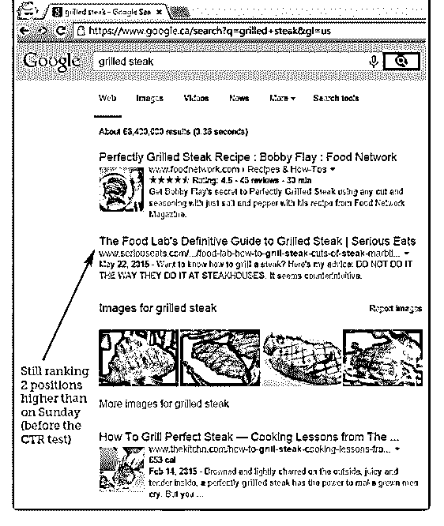

# 新人小白，入圈时间

eternal : 新人小白，入圈时间比较晚，没赶上 niche LC 大航海 计划很可惜。正在根据新手教程和大家提到的一些外国权威 同行的博客进行学习。

今天刚好看到 Neil Patel 的一篇文章，感觉很有趣，就顺便翻 译了一下，希望能对像我一样的新人有一些启发。 这篇文章并没有单纯讲解技术点，而是从策略层面阐述小型 网站如何击败实力强劲的对手。

英文水平有限，有些细节翻译不到位，请包涵。以下为译 文，原文在 neilpatel.com

——————————————————————

当你没有 SEO 预算的时候，如何超越大公司？

搜索引擎优化有一个公式，只要你遵循它，就会得到排名。 内容+ SEO 友好代码+用户体验+外链=排名

听起来很简单，对吧？这个公式并不很复杂，但它需要努力 和耐心。

然而，现在 SEO 的挑战不是公式，时间或耐心。它更多地取 决于你如何击败比你有更多钱的人，因为从理论上讲，他们 可以做更多的事情，这应该会让他们超越你。

但我喜欢 SEO，因为这是一个让你可以击败大公司的渠道， 即使你的预算比他们少。

这是如何实现的呢？ 让我们先从你必须做的两个心理转变开始。

心理转变 # 1: 速度就是一切

大多数人不会告诉你的是，大公司需要花更多的钱来得到同 样的结果，而你只需要花很少的钱。 他们的组织中有太多的员工和层级，以至于无法快速、灵活 地进行调动。换句话说，一切都进展缓慢。他们花钱是希望 这能让他们走得更快。但现实是，花更多的钱并不一定能让 他们更快得到结果。 如果你想打败他们，你首先要做的就是专注于执行。如果你 不能快速行动，你就不会赢。

这是你最大的优势。

我之所以能走到今天这一步，是因为我的执行速度。现在我 们的规模不断扩大，事情变得更慢了。 例如，因为我的业务一直在不断增长，我们现在优先考虑的 是什么使我们的收入最大，我敢打赌 SEO 不再像以前那样优 先。 不仅仅是对我，对所有和我规模相当甚至更大的公司都是如 此。

你必须记住，我们有多个办公室，数百名员工... ... 我们必须 关注支付账单的费用。

那么我们如何弥补呢？我们花更多的钱希望它能解决它。就 像我现在写的内容较少一样，我花钱买 Ubersuggest 和 Backlinks 之类的东西，希望它有所帮助。

但这并不能解决所有问题。 关键是，如果你能快速行动，它将给你一个巨大的优势。

心理转变 # 2: 精力旺盛胜过金钱 让我们重述一下搜索引擎优化的公式：内容+ SEO 友好代码

+用户体验+外链=排名 我知道谷歌有超过 200 个排名因素，但上面的公式包含了其中 的大部分。 现在你可能会想，如果你想创作内容或建立外链你必须花 钱，但情况并非如此。

在我之前的市场营销博客 Quick Sprout 中，我通过和其他作者 合作使它壮大。 在当时的营销界，我并不那么有名，但我遇到了像 Brian Dean 这样的人，与他合著了一本关于链接建设的指南。 那本指南超过两万字，Brian 免费完成了大部分工作。

我也和 Ritika Puri 做了类似的事情，我们创建了一个营销心理

学指南。

每当我与其他作家和营销人员合作创作这些深度指南时，我 的流量就会一飞冲天。 我第一次发表这样一篇文章时，我的流量在两个月内上升了 117% 。

现在这个策略依然适用。

另一个提高 SEO 流量的方法是让人们免费为你的网站贡献内 容。

我在收购 KISSmetrics 博客之前就这样做了。 在它的高峰期， 每月独立访客达到 1260681。

我们通过一个简单的方法增加了 KISSmetrics 的流量，我们在 自己的领域找到了大量作者，请他们贡献文章。

起初，我们不得不支付一些费用，因为我们的博客不为人 知，几乎没有任何访问者。但是，当我们给一部分在竞争对 手网站上撰写客座博客的知名作者支付报酬后，我们就拥有 了一个很好的基础。我们仍然没有太多的流量，但有这些权 威作者发布的文章足以说服其他作者免费提交内容。

这是一个直到今天仍然有效的简单方法。

不要认为你需要很多钱来解决你的营销问题，你只需要跳出 思维的定式。

上述部分已经讨论了你需要进行的两个心理转变，接下来让 我们关注在四个“快速制胜”策略，在最短的时间内产生最大 的成果。

这些“快速制胜”策略是众所周知的，但是只有不到 1% 的 seo

人人专注于它们。

快速制胜 # 1: Land and expand

有人说你创造的内容越多，你得到的流量就越多。 但实际上，写更多的内容并不能保证更多的流量。内容营销 市场已经发生了变化，互联网上有超过 10 亿个博客。 随着人们每天生产如此多的内容，谷歌现在可以选择给什么 内容排名，什么内容不排名。

你的 top 10 页面产生的流量会在网站总流量中占据很大比重。 我网站的前 10 个页面占了我流量的 29.23% 。考虑到我有 5171 篇博客文章，这真是太疯狂了。对于你的网站，你的前 10 个 页面可能会占据你 40% 的流量，因为你可能没有我这么多的 内容。

所以，与其把大部分时间花在写新内容上，为什么不从你的 内容中获得更多的流量呢。

我称之为 Land and expand。 换句话说，你已经拥有的网页在 谷歌上获得了搜索流量和排名，不妨调整一下，这样你就可 以获得 2 到 3 倍的搜索流量。

最重要的是，对于大多数网站，这种方法可以在一个月内得 到结果。如果你的网站权重较低，会在两个月内得到结果。

快速制胜 # 2: 优化收入，而不是流量 你的目标是增加你的搜索流量，对吗？

但是当你获得更多的搜索流量时，你的收入发生了什么变化

呢？

看看我本人的例子：我的搜索流量增长了 123% ，而我的收入 只增长了 12.5% ... ... 这可不划算。 是的，你想为优化网站，一边在谷歌中取得更高排名。但是 如果它不能增加你的收入，那又有什么意义呢？

你需要做的是，查看你网站上创造较多收入的那些页面，并 首先优化这些页面，这样它们在谷歌上的排名就会更高。

你可以通过在 Google Analytics 中设置目标追踪来做到这一点。 一旦你建立了目标追踪，你就会知道你应该把注意力集中在 哪些页面上，这样你带来的那些额外的访问者就会变成收 入。 然后你可以把这些额外的收入再投资到你的营销计划中。

快速制胜 # 3: 优化点击量，而不是排名 问自己一个问题，如果每个人都用谷歌搜索，点击第二个结

果而不是第一个结果，你认为会发生什么？

实际上，这种行为会告诉谷歌，人们更喜欢第二个名单，它

会把排名移到第一位。

为了证明这个理论，Rand Fishkin 告诉他所有的 Twitter 粉丝

去搜索"最好的烤牛排"，然后点击第四个网站，而不是第一 个。

70 分钟内，第四个网站的排名就上升到了第一位。

排名的提高不仅仅与你正在创建的内容或者你正在建立的外 链有关。 如果人们不想点击你的网站，你的排名会持续下降。 如果人们点击你的网站比点击竞争对手更多，那么即使你没 有建立足够多的外链，你的排名也会飙升。

那么如何提高你的点击率呢？ 你不会想让你的朋友点击你的列表，因为这只是暂时的影 响，你的排名只会在很短的时间内上升。 正确的做法是优化 title tag 和 meta description，以鼓励人们点击 你的网站而不是竞争对手的。

快速制胜 # 4: 更新你的旧文章 你有没有注意到，随着时间的推移，你的排名有所波动？ 无

论你在搜索引擎优化方面做得多好，无论你有多少钱，都不

能保证你会在榜首。

你想知道为什么你的排名下降吗？ 大多数人认为这是一种惩罚。 但是谷歌非常友好(信不信由 你) ，他们的目标不是惩罚网站。 他们的目标是把最好的网 站（用户最喜欢的网站）排在最前面。

试想一下，如果谷歌因为假定“宝马”违规建立外链而惩罚 它，并从索引中删除它，你认为当人们搜索"宝马"的时候会发 生什么？

如果宝马没有出现，人们会生气的。 他们不会生宝马的气，他们会生谷歌的气，他们可能不会再

用谷歌了。

谷歌的目标不是惩罚你的网站、对你苛刻、破坏你的排名。 他们的目标很简单——把对最终用户最好的网站放在顶部。

当你的排名下降时，通常是因为其他人创建了一个更有价值 体验度更好的页面。

想要解决这个问题，保持你的排名，甚至爬得更高，就需要 不断更新你的旧内容。 这个方法很有效，我目前有 3 个全职人员更新我的旧内容。 你不必像我一样疯狂，但是你应该更新你的旧内容。

总结 金钱并不能阻止你击败竞争对手。唯一阻碍你的就是你自 己。 通过转变心态和采取快速制胜策略，事情会向好的方向发 展。

我从来没有让我的竞争对手妨碍到我。 我不在乎他们是否比我有钱，也不在乎他们干这行多久了。 如果我能从零开始走到这里，你也可以。 没有什么能真正阻止你获胜。 你准备好击败你的竞争对手了吗？

2019-05-29(18 赞)

评论区：

富布斯 : 同在维护多站群，以上基本认同.加精了.[强] 3 篇精华免下年续费.5 篇返门票 eternal : 谢谢鼓励[嘿哈]

天涯浪子 : 用什么站群软件？

关注公众号"懒人找资源"，星球资源一站式服务