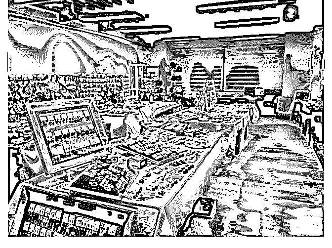

# 上周四去广州出差几

富布斯 : 上周四去广州出差几天，和一位做出口日本外贸的老 板彭总谈合作事项，昨天刚回来！有几点体会分享一下：

背景：我和彭总认识是基于 9 年之前我在广州工作时候的老同 事介绍和推荐，彭总公司是出口高档包包和首饰，包包工厂 在广州白云，首饰工厂在浙江义乌！订单主要来自日本，因 为他老婆是日本人，他日文非常好，也非常了解日本人及日 本文化！因此跟日本客户沟通特别有一套.获得不少几百万级 别的加工订单.

1，不要被“职业牢”，做自己，折腾你喜欢的事情，尤其是还 年轻的时候！

彭总当年是中山大学的硕士毕业，是当时省高考的至少 Top50 吧，毕业后在广东省人大工作，后在一次安排日本出差中， 慢慢发现自己不太适合在机关单位上班，还是喜欢自己折 腾，于是出来创业，虽然也谈不上很成功，但现在大几千万 的资产应该还是有的. 按照他说的，如果当年在稳定的机关单 位熬下来，现在也是处长，但肯定不是他想要的生活.

2，打工一定要跟对老板 就是现在推荐我跟彭总认识的老同事，和我共事时他只是一

个仓库主管，拿着 7000 块的月薪（8 年前）。直到辞职后他也 没攒下什么钱，当时已经结婚生娃了。但离在广州买房买车

的距离真的有很大的距离（当时广州房价 1.5 万-2.5 万），现 在广州房价好点的位置都 5 万起，我的同事去年成功买了 房，4.5 万/平买的，首付 300 万（老板帮付了接近 200 万），房 贷接近 2 万。同样的工作能力，但跟对了老板可能就是不一样

的人生。

3，做事，要么不做，做就做到最细致，做到最好 这是彭总跟我说的，他以前也是大老粗，做什么事情就只求

按时完成。自从和日本人打交道之后，他不断的被要求各种

细节，日本人对于细节的苛刻已经超出他的认知了，他只能

花高价请优秀的 QC（在工厂里是质量检查）岗位，在这个过 程中还经常不断国内日本两边跑，自己跟日本人沟通各种问

题，他坦承跟日本人学到非常多的东西，很多时候都是被日 本人的严谨驱动的. 做事做到极致.

附件是我参观彭总公司的首饰样版间拍的

2019-05-27(32 赞)

评论区：

dasu : 是的，台湾工厂也是这样被日本人教育出来的，所以同样的产品台湾的价格就卖得比大陆的好 小码农 : 下次来广州，记得约我。[奸笑]

兴国 : 学习了，受益良多！ 富布斯 : 这次行程来去匆匆

富布斯 : 彭总说如果达不到日本人的要求.订单就只能黄了.一个长期能提供百万级订单的客户就丢了.

关注公众号"懒人找资源"，星球资源一站式服务