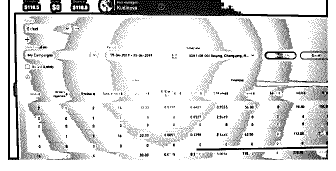
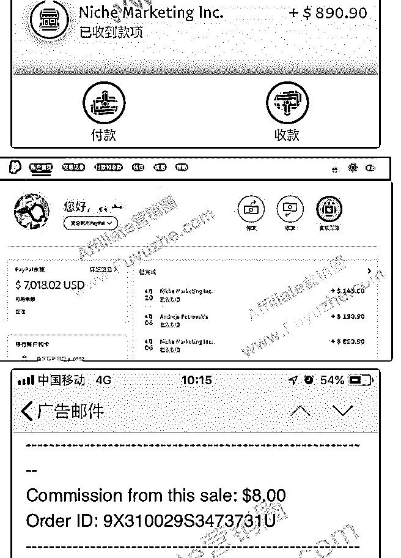
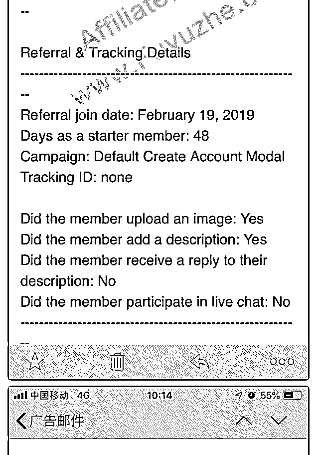
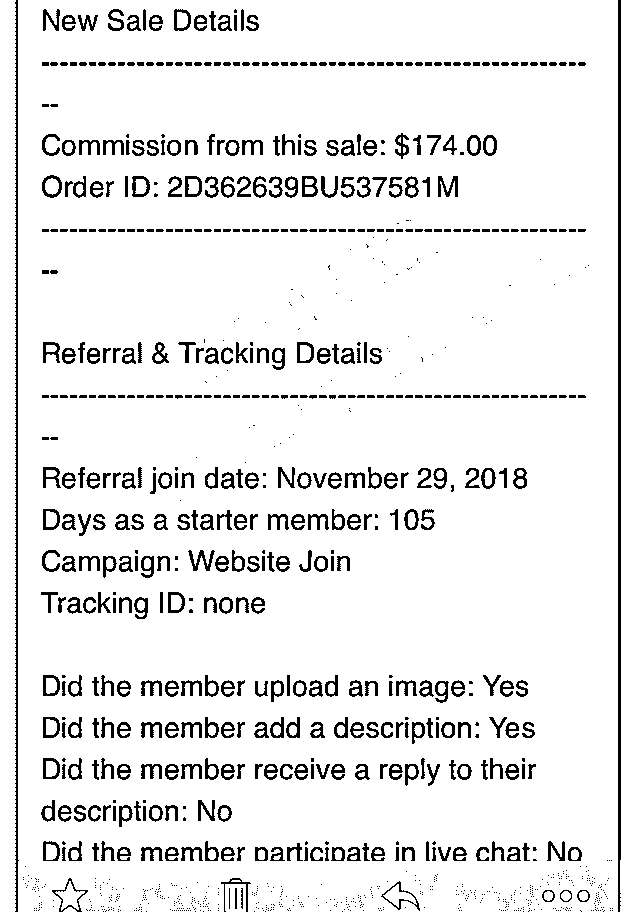

# 马上五一，一年近半

laogu : 马上五一，一年近半，是时候总结下了。参加了 native 特训营。刚开始担心犯错看教程花了很长时间。 翻译了一部分 40 天新手教程后， 开始动手注册了各个联盟和各个流量源。

弄清楚了 追踪系统怎么设置。 好在咱是多年的程序员，读英文文档，搞技术，不再话下。

1.  刚开始跑 afflow ，popads 没怎么盈利。

    2.后来跑 cod 有些收益。不过在联盟 hold 住不少,不知道最后能

    否结算。

    3.目前用的追踪系统是 bemob

    整体感觉跟当年做百度竞价，百度网盟差不多。只不过是做 国外的生意，美元结算。 终于从懵懂的新手开始入门了，刚开始觉得挺难，迈过一道 门后回头看，其实挺简单的。有句话说的好:"天下事有难易 乎,为之,则难者亦易矣；不为,则易者亦难矣."，还是要多动 手。

    感谢富大的悉心指导，关键是还送了流量源的优惠券，和联 盟结算的优惠券，两头送钱，想不盈利都难

    有兴趣的大家可以一起交流，最后发张这周联盟的统计数 据。

    2019-04-26(25 赞)

    评论区：

    石头 : cod 是什么流量平台

    Sean- 家有二虎* : [`www.offervault.com/cash+on+delivery-affili...`](https://www.offervault.com/cash%2Bon%2Bdelivery-affiliate-programs/)

    dasu : cod 是货到付款的意思，他的意思是跑的是 cod 的 offer

    来自火星的 : 同报了特训营，能交流一下吗？ 我微 besserxufei88226

    · : 可以留个微信交流下吗

    

    

    关注公众号"懒人找资源"，星球资源一站式服务

    # I'm back!

    富布斯 : I'm back! 又可以继续在星球畅聊了！

    最近忙着带娃，但还是有保持一些基本收入的，图 1、2 是我 3 月到现在 PayPal 收款渠道的被动收入，我在做的小 Project 很 多，可能是格局没有别人大，所以收入比较零散，大钱小钱 看到有利可图都尝试，但前提条件是不用我去花太多时间运 营维护，做 Affiliate 最大的成本就是时间。

    截图没有别的意思，就借此切入聊聊今天的话题。了解我的 都知道，我向来不晒收入的，也从不在任何分享和教程里夸 夸其谈 XXX 能赚多少之类，一来在很多低调大牛面前老富的 收入水平还远没有到可以晒的底气，二来容易误导新人，期 望过高，真正自己做起来却座座都是迈不过的大山。毕竟， 哪有赚钱没有门槛的行业呢?

    这里分享几点适合通过兼职实现增加被动收入的一些个人看 法和技巧：

    一，找动力 很多人都想拓展一些副业增加收入，尤其是对上班族的那点 死工资来说，风险也不比创业小。突然一场大病除了没有收 入来源，或者困在类似最近京东的 996 被逼走人的窘态，如果 你看到这还没有动力和意识付出行动建立多管道收入，那就 真的只能顺其自然了[皱眉]

    二，找方向 可以参考下我一直遵循的几点：

    1，从自己感兴趣的开始

    2，挖掘自己最擅长的技能周边

    3，从身边接触到的人和资源发现

    4，从有利可图的点子入手。

    5，直接抄袭别人的模式并加以改进

    6，国内外互搬好的产品、模式、创新、Niche，打信息差

    7，多点出现频率高的广告、多看别人的套路，再研究优化一

    套自己的

    8，褥大平台的羊毛，从平台庞大的用户量里定制满足一小部 分人群需求

    9，每天阅读行业新闻、大牛的博客、付费社区，不要总是想 着免费索取，别人又不是你爸爸，比如付费买本书，几十块 获得的是可能别人花了一年时间写经验，这里面只要有几句 话让你醍醐灌顶、茅塞顿开，提升了认知，解决了一些问题 就节约不少的弯路成本了。

    等等......

    开头提到我做 Project 的思维和格局可能都没有别人那么大，一 开始就考虑的周全和缜密，要做到多大的规模和宏伟澎湃的 计划。我觉得搞 Affiliates 的应该尽可能发挥它应有的“轻”模 式，不生产、不囤货、不售后，不纠缠，进退自如。重点是 要，多找有利可图的 Offer，测试、测试、快速测试！Offer 千 千万万，这个不行换一个，完全不用纠缠！不管是 Niche Marketing 还是 Media buy，测试永远是盈利最好的开始。

    三，关于 Offer 这块我重点讲下，作为中间人，要想从中获利，上有广告 主，下有掏钱的金主！广告主需要 Lead 质量，金主需要好产 品推荐，Aff 本质就是找到好产品推荐给真正需要的人。所以 不要看这个 Offer 的 Payout 高就无脑推广，群众的眼睛是雪亮 的，用户不全都是傻逼，好产品才能实现三方共赢。

    我觉得很多 Aff 都没有真正花时间去了解过 Offer 就开始推广 了。连 Offer 的特点和 Targeting 的人群都不清楚，更不会花时 间做个基础调研，无异于鸡同鸭讲，最后发现用户往往都不 买单。

    这样就会给我们抛出一个决策问题，到底是 Offer 本身不行、 还是流量质量不佳，抑或是 LP 文案太烂？陷入整个 Sale Funnel 的混乱，无从着手优化，结果冤枉了一个好的 Offer。

    在选 Offers 的时候，我们知道有不少 Upsell 或者两步单的特 点，比如之前在大航海计划讲过的一个 Offer，当你引导用户 注册并完成头像上传，就能获得 1 美刀，用户订阅一个月会员 可以获得 8 美金，下图是前几天完成的一个 8 美金的 Lead：

    图 3 同一天，还有一位用户续费了年费会员，就是 174 美金！这位

    用户是去年 18 年时候推荐的，因为这是 Lifetime Commissions

    的 Offer，所以后面只要他续费都能获得佣金，续费也说明广

    告主的产品好用户才买单。

    图 4 两步单子的 offer 有提成，比如 offer 价格是 50 刀，它有第二步

    加价换购，用户再买另一个产品你又有 50 刀，总共转化 100

    刀。

    对于选 Offer 方面，我个人综合考量原则就是有优势，比如相 比别人更高的 Payout，手上有更匹配的优质流量，或者说对于 Offer、受众更熟悉，这些其它 Aff 不具备的东西都有可能成为 你竞争的壁垒。

    那么怎么获得比别人更高的 Payout？可以直接发邮件跟老外 谈，告诉他你的 Affiliate 经历经验，你对产品的热情和会如何 推广产生共赢，情真意切的，很大概率上会收到你想要的结 果。我曾经用这个方法申请的 Offer（数字产品）经常达到原 有佣金的 2-3 倍，这样你的推广预算和产出比自然高出不少。

    推 Offer 可以用免费流量、也可以用付费流量，我一般在测试 Project 前先充分考虑清楚整个过程所需要用到的技术原型和运 营维护环节，因为我以前是做技术的，反正能自动化的环节 就不要人肉完成，用技术去实现，自己实现不了就外包让专 业的人赚这点钱，毕竟技术是可以复用的，如果一个功能可 以帮你解决所有 Project 的问题，性价比就超值了。

    关于申请 Offers，我建议尽量先去了解广告主有没有自己的 Affiliate 系统，因为现在很多广告主的 Offer 并不一定会上架到 联盟，毕竟联盟也要分一杯羹，经过中间商差价后的 Commissions，对于 Affiliate 就没有太大的动力了，反过来对于 广告主要么只能继续让利要么拉不到好的 Aff 完成更多的销 售，所以还不如自己搞个 Affiliate 系统合作。

    那么问题又来了，广告主会不会私自扣量？如何结算？基本 不会，Niche Marketing 产品结算大都是月结的，Media buy 联 盟一般周结的多。对于 Niche Marketing，我合作的有些广告主 的 CPS Offer，直接使用 Dropshiping 系统，在国内推广的时 候，用户在我的网站下单可以使用的是微信或支付宝，完成 订单后，广告主会自动从我信用卡扣去给到我的产品单价， 然后发货信息由广告主系统发出，相当于完成销售即结算。 在此过程中，我不需要任何的操作，从销售到结算，连外汇 结汇的环节都省了。当广告主有产品更新，直接 Wordpress 后 台的 Dropshiping 下载更新即可，没有任何运营和维护压力， 这也是我推荐 Affiliate 的一种相对理想的被动收入模式。

    

    2019-04-12(53 赞)

    评论区：

    石头 : 跟着富哥走，美金天天有

    

    

    

    

    关注公众号"懒人找资源"，星球资源一站式服务