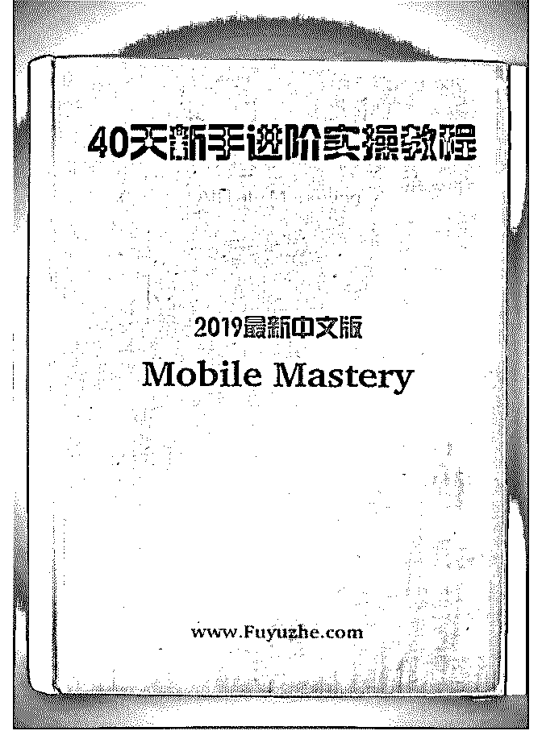

# 前些天我发起了《4

富布斯 : 前些天我发起了《40 天新手进阶 Mobile Mastery 实操 教程》2019 中文版翻译计划，借助组织的力量，快速将去年 的教程更新升级以帮助到圈里的新手更好的跟着学习操作。

翻译计划得到了很多圈友的鼎力相助，让本次计划数日内即 全部完成。在此特别感谢以下朋友的贡献：

目前还在进一步的校验，后面会在星球里逐课的提供给有需 要的圈友跟进学习。今天先提供第一天的教程.后面的陆续会 更新.欢迎继续关注[`t.zsxq.com/2bMrjaE`](https://t.zsxq.com/2bMrjaE)

2019-03-15(36 赞)

关注公众号"懒人找资源"，星球资源一站式服务