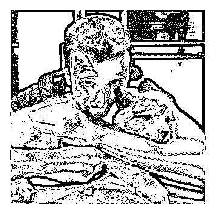

# 大概在半年前我参加

zFish : 大概在半年前我参加了一个国外优惠券聚合平台的项 目，项目背景简单介绍下：网站聚合展示很多品牌的最新优 惠券，用户可以在里面查看及搜索不同品牌的最新优惠券， 优惠券分为两类，用户点击后有展示优惠码的，也有点击后 跳转到品牌折扣页的，通过 Google 相应品牌折扣关键词引 流。网站的优惠券来源于两类渠道，一类是 Aff 网盟平台，我 们网站对接了三个平台，包括 shareasale、linkshare、CJ。另一 类是社交平台，主要是 Twitter 平台。第一类平台通过接口对 接拉取数据自动入库上架至我们网站，人工主要在这几个网 盟平台申请各品牌的优惠券 offer 即可。对于网盟平台的优惠 券 offer，用户点击优惠券跳转到品牌官网后购买此商品我们 有佣金提成，不同商品的提成佣金率不同。第二类如 Twitter 平台的优惠券没有提成，不过量特别大，可以扩充我们的优 惠券数量，也可以提高我们网站的页面数量和 Google 收录页 面。

一开始我们网站只是对接了三个网盟平台，此时网站的第一 版本已经上线，优惠券数量大概有三万个有效的，品牌页为 三千个，我们网站的设计是以品牌页为聚合的，也就是第一 版网站只有大概三千多个页面，为了提高 Google 的收录页 面，我们开始做 SEO 优化，基本的 SEO 优化有网站 Html 优化、 Sitemap、Title、Keywords、Description、Meta、品牌索引页 面、长尾词建设、外链建设、url 优化、站内搜索等。外链建 设在短时间内就做到了上万个以上了，长尾词也做到了七八 千个，所以页面暴增到了一万二左右，长尾词页面内也做了 SEO 优化，包括相似长尾词推荐，相似品牌推荐等。当时日 志监控观察到 Google 爬虫每日爬取频率变高，收录也到了两 三千，有一些品牌词已经有了排名，一切都在向好的方向发 展。这其中有个隐患是我们当时上线时没有预料到的，也为

项目以后出现问题埋了一个雷，就是我们刚上线时用的是一 个新的普通的域名，但是项目组因为某些原因得到了一个大 概有 10 年历史的老域名，这个老域名自己有一些外链可以带 来一些流量，应该是之前做过一些网站导致外链带来的量， 本以为这个老域名可以带来不错的收录权重，所以就在上线 一周后立即切换成这个老域名了，现在网站已经有两个版本 了，一个是老版本新域名，一个是新版本老域名（自带流 量），因为项目组人力有限，就主要给这个老域名的网站上 加新功能，之前的新域名就没人维护暂时通过 robots 屏蔽爬虫 放置了一段时间。

很快我们发现了问题所在，Google 在收录页面的时候一直有 问题，先是缓存一直 404，然后我们网站加载速度很慢，在 google page speed 测速里面评分在 60 分左右，所以我们花了一 周时间去给网站提速，加了 CDN，优化了网站渲染的代码逻 辑，简化前端 JS 和 CSS 文件大小，优化图片大小等，然后网站 速度得到了提升，加载可以在 2 秒内完成，服务器响应时间控 制在了 200ms 内，但是 Google 的缓存页面一直有问题，最后 SEO 们排查说这是 Google 的问题，而且 Google 官方也说这是 Google 内部服务器的问题，只要索引正常就没问题，当时我 们也就没管这个问题。不过始终困扰我们的问题是 Google 的 收录页面一直不稳定，早上是几百个，下午又变成几千个 了，而且 Google 带来的 SEO 流量一天也徘徊在几十个左右。

项目第二期着重提高 Google 收录页面，当时 SEO 们认为是网页 相似度太高了，所以我们花了一两周时间去研究是不是我们 网站的内容太相似了，所以对于可能相似的页面做了一些随 机差异化处理，让网站的某一部分每次刷新都随机，虽然这 种方式对爬虫不太优化，但是可以确保网页的相似度变低， 我写了一个 python 的程序去检查我们全站的上万个页面，先用 爬虫爬取了两天时间爬取到页面然后自动去渲染截图下来， 然后从 html 里抽取出文本，对文本计算余弦相似度，最后随机

筛选出一千个页面，两两比较相似度画对比图，发现全站的 相似度并不高，而且竞品的网站的相似度和我们差距也不是 很大，因为大家数据都是从网盟平台拿到的，所以数据应该 是差不多的。然后 Google 的缓存终于正常了，不过显示的却 是移动端的界面，这其实很奇怪，因为 Google 有两个版本的 bot，一个是移动端，一个是 PC 端，我们网站会通过 UA 检测 给与不同模板的 html 代码，只是 Google 最终给的是移动端的缓 存版本，移动端缓存版本显示还不正常，最后排查是前端的 一个组件是用了某个 Google 不兼容的技术导致的，最终把这 个问题 fix 后，又是一周时间去观察，收录还是不正常。

第三期还是解决收录不正常的问题，然后我们把问题聚焦在 了内容上，因为内容都是从网盟拉取过来的接口数据，所以 差异化和竞品差不多，为了提高网站的内容，我们选择了爬 取社交网站的信息来生成优惠券，因为很多品牌会在设交站 发布自家品牌的优惠券信息，所以我们调研后确定爬取 Twitter 的推文，我搭建了一个 Twitter 的分布式爬虫系统，定时 每秒去 Twitter 里搜索优惠券相关的关键词，然后爬取相关推 文入库，然后后台有个 python 程序每天定时去库里拿到前一天 爬取到的推文，经过算法处理后生成了优惠券格式的信息， 另外一个脚本任务会自动把这些生成的信息经过去重后发布 到我们网站里。加入了 Twitter 的优惠券后，我们的优惠券数 量很快就翻倍了，页面也达到了七八万的规模。因为之前我 们分析认为长尾词页面过多了，所以停掉了长尾词页面，外 链也开始不断减少，但是此时收录还是不稳定，此时 bing 的收 录页面都上两万了，但是 Google 的还在两三千徘徊，很不稳 定，有时候下午是一万六，早上又变成两千了。和竞品相 比，实在是很诡异。

最终我们认为问题大概率出在了域名上，因为不断的排查测 试都没有解决问题，就是域名一直没有去测试，因为域名换 了后很多工作都白做了，但是我们又想去测试是不是域名导

致的问题，所以又把之前的新域名启用了，在之前的新域名 做了一个简化版的优惠券系统，用来和老域名这个网站做对 比，观察了一段时间后，之前新域名的系统收录也出问题 了，SEO 们认为是之前我们在发布系统的时候两个域名曾经 发生过关联，可能会被 Google 检测出来，然后这法子就行不 通，此时我们又准备去启用一个域名去测试，同时制定了一 个建设一个流量站去给优惠券平台导流的计划。不过所有的 这一切都没来得及去做，公司最终以项目时间过长为由停掉 了开发新功能的计划，只是把网站放着等待收录正常。

2019-02-21(15 赞)

评论区：

麦田 : 请问一下你们这个项目的团队有多少人？都需要哪些人来做那些事？ 因为我也计划做类似的网站，但没有团队，所 以请教下你做参考，谢谢！

zFish : 一个产品，一个后端，一个前端，三个 seo，一个测试 麦田 : 加个微信交流下：penyou

麦田 : 另外，你们团队有配置了广告投放和社交媒体营销的人员吗？ zFish : 公司有专门投放的部门

dingt3 : 公司做过优惠券站点，卡在了封号和结算上了，后面就没做了

富布斯 : [强]感谢 zFish 分享. 是 Yeahmobi 的工程师.海外项目开发经验丰富.大家多多找他交流

麦田 : 优惠券站结算有什么问题？会被封号？

关注公众号"懒人找资源"，星球资源一站式服务

# Finch.本人敬

富布斯 : Finch.本人敬仰的一位高中辍学的超级 Aff 大牛.专注 了十年的 CPA，赚了不少的钱，他的部分语录（每周更 新）：

1，Affiliate Marketing 一个没有砍杀的战场,无数赚钱的机会就 在 affiliate marketing 行业中，一个个属于你的推广链接正等着 你把它们分发给有兴趣的人，然后你只要坐等收钱。

2，要成为一个 affiliate，你需要一些癫狂。这项工作经常需要 你自己独立埋头苦干几个小时。你可以组件一个团队干这 个，或者利用协作空间，但是事实上大部分 affiliate 不会这么 做。大概大家都很享受这个过程。

3，这个行业吸引很多内向型的人，不善社交的，以及那些没 有主观意愿去在传统社会组织往上攀爬的意愿的人。你应该 天生爱上解决 affiliate marketing 带来的数据化的问题的任何解 决机会。

4，你不是一定需要各种编程、设计等软件技能来进入 affiliate marketing，但是它能让你的起步更加轻松。

5，Finch 的信条：坚持只和一家 Affiliate Network 工作 6，在你刚起步的时候上量是最危险的——特别是广告主还没

有计算过你带来的流量的 leads 和 sales 比例。这点必须记住。

7，你、其它 AFF、联盟、广告主、流量平台、用户 == 六 种“势力”关系。如果你不建立正确的关系，或者把他们结合 变成你的优势，你迟早会累垮。

8，你选的领域，以及它所包含的 offers，必须是你某种程度上 熟悉的。必须可以让你从床上起来就可以让你不抱有商业目 的时候仍然可以驱使你去行动

Finch 博客： 每周更新.....[Finch+Sells+|+Affiliate+Marketing+Blog](https://finchsells.com/)

2019-01-20(19 赞)

评论区：

watson : 小小年纪就植发了， 看来联盟做得很辛苦

James.N.Re* : [呲牙]到达大牛这种收入级别，何惧掉点头发

Perry XU : 看大家都叫星主富大，我也这么叫吧[呲牙]，想请问富大一直提到的”你、其它 AFF、联盟、广告主、流量平台、

用户 == 六种“势力”关系这点，有资料可以看么，找了博客和星球都没找到，求解答，感恩

关注公众号"懒人找资源"，星球资源一站式服务