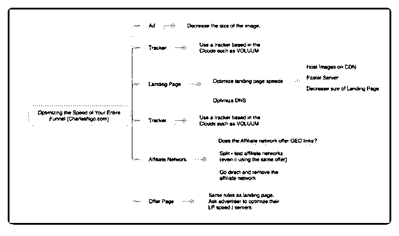

# 今天大咖说分享的主

富布斯 : 今天大咖说分享的主题是：新手必读的 Affiliate Marketing 的 22 条经验法则，大咖主角：是 Aff 业内公认的大 牛：Charles Ngo。

我们知道 Affiliate Marketing 是一个不断变化的行业，但什么不 会改变？

Charles Ngo 给我们分享了 22 条不管在过去十年和未来十年不 变的经验法则，新人可以借鉴学习的（作者将该系列会分三 部分，每月更新一部分）：

1，占据市场先机

Affiliate marketing Campaigns 可以分为四个周期： 测试阶段：有一定的风险，会损耗一些资金，但这个阶段往

往又先发优势，一旦盈利，利润也是最高的。

成长阶段：在其它 Aff 抢入之前，你需要更努力，放大规模， 建立竞争壁垒。这个阶段往往被验证过有利可图的，所以是 盈利的最佳时期

高潮阶段：已涌入大量竞争对手、各种 SPY，仍然有钱赚， 但需要获得更新的 Angles 和更多的流量.

下降阶段：少部分 Aff 盈利，利润也逐渐微薄

2，75%的竞争来自于 Offer

Split test 会让很多人不知所措，别人都说 80%的利润来自于

20%的努力，但是他认为 64%的利润来自于 4%的努力，所以 最重要的是 Offer。

尽可能的拿到独家的 Offer 跑，或者拿 offer 到不同的渠道和 Geo 上跑跑看，还有尽可能让广告主满意，特别是流量的质量。

3，建立竞争壁垒保护你的利润 第一，大部分 AM 的工资是根据 Aff 产生的收入获得提成 第二，竞争对手可能会看到你的广告，或者出现某些 SPY 工 具上 那么什么是竞争壁垒？Creatives、Angles、Banner、LP 对你的 Campaign 盈利很重要，但这些都不是竞争壁垒。

所谓竞争壁垒，比如可以是开发个内部工具，自动对流量源 Bidding，获得独家 Offer，专业的流量源经验（例如其它人拿 不到的流量库存），跟联盟和广告主的关系可以拿到更优质 的数据和 Payout。其次就是技术和人力的高效保障。

4，对速度的追求 网站的加载速度越快，赚的钱就越多！然后他给了一张加载 速度优化思维导图参考，见图 1

5，谁测试的更多谁就是赢家 没有人告诉你做这个赚钱，做那个不赚钱，你需要一遍又一 遍的自我发现，成功的 Aff 都是从实验室里走出来的。

6，擅于沟通 在美国、英国、澳大利亚、新加坡的英语都不尽相同，西班 牙和智利的西班牙语完全不同，就是说，你所翻译的 LP 非常 重要。想象一下你写的文案别人都看不理解，怎么会转换 呢？最简单就是 Split test 不同人翻译的 LP 页面。

Charles Ngo 网站：

后面两部分请继续关 注[#1+Affiliate+Marketing+Website+|+CharlesNgo.com](https://charlesngo.com/) 2019-01-15(10 赞)

关注公众号"懒人找资源"，星球资源一站式服务