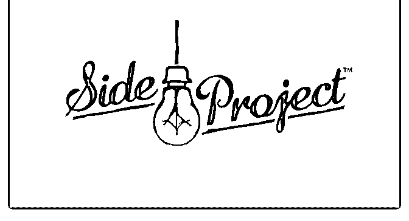

# 为什么做 Side

富布斯 : 为什么做 Side Project？

如今很多人被“职业牢”，薪水不高不低，人际复杂，发展瓶 颈，前途迷茫，生活开支索取的一端总是固定的，收入永远 跑不过物价房价，辞职的后果简直不要想太多。

求不得，舍不掉，我建议是不要轻易辞掉工作，先尝试一些 Side Project。尤其是铁饭碗和二线以下城市的混吃等死的工作 是可以有几个小时的 Lunch break 的！

一，什么是 Side Project？ 一般我们每个人都会有自己的正职，比如在一个公司里上班

白领，在家的全职妈妈，攻读学业中的大学生，创业中的

Boss，甚至很多公司。在这个正职以外，你总会有一些可支 配的业余时间，投资自己做一些事情，在国外通常管这就可

以叫做 Side project，在国内通俗是叫副业、兼职赚钱、业余项 目。

在国外 Side project 观念非常流行，比如 Google 的工程师每天上 班都有 20%的工作时间自由支配，做自己喜欢的项目，据说 这些从工程师的 20%业余时间中做的项目都借助 Google 前期的 资源和用户基数，成为如今我们看到的伟大 Google 产品。

做 Side project 的动力要么是兴趣，要么是有利可图。而在不同 的行业和个人技能有着不同的类型和模式，比如程序员就是 最典型的 Side project 践行者，除了可以通过业余项目学习和提 高自己的技术职业竞争力，验证想法和能力之外，还可以美 化简历帮你得到一份好工作，做得好 Project 还可以增加收入，

我身边就看多很多朋友做 APP 的 Side project 月收入大于在公司 的薪水的。

二，把 Side project 变成创业项目的案例

①，Instagram 创始人凯文是程序员，每天下班后会做一些 side project 的功能提高自己的技术能力，他发现其中分享照片 的功能很受欢迎，于是就找了一些人把想法变成最后的成品 就是现在 Instagram，后来 Facebook 以 10 亿美金收购。

②，之前听说国内某上市公司靠卖两套北京学区房保壳，当 年 130 万元买的两套房经评估，市场价值为 2829.1 万元！净赚 2142.88 万！增值 16 倍！而 2016 年上半年，该公司实际亏损为

2235.44 万元，这也是公司 Side project 的一种形式，建议该公

司转型做房地产。

③，陈士骏是 facebook 前 15 号员工，在 FB 上班的时候消失了 一段时间做 Side project，回来工作后立刻辞职；他离开 fb 后， 创办了 YouTube

④，Directlyrics（歌词网站）是一个 10 年的 side project，自己 投入很少的时间，一台云服务器，请了个 Part time 的编辑每天 添加内容，全屏广告 CPM 能达到$30，主要靠搜索引擎带来流 量，十年下来累计访客 10 亿，高峰时月收入$10 万；

⑤，Del.icio.us 创始人开始做简单的收集链接的网站，白天在 摩根斯坦利上班，晚上做这个 side project。后来成立公司全职 做，融了$1 百万（$3 百万估值），之后融不到钱，以不到$3 千万卖给 Yahoo。

这样的案例比比皆是，能把喜欢的事做成赚钱的事业，真是 不错。

新人可以把 Affiliate 作为 Side project 兼职去尝试，毕竟干这行 成本并不高，觉得买流量成本高可以玩免费流量，卖信息差 套利，你也不需要像案例中达到多大的规模和高度，在做成 之前谁也不知道 Project 能量有多大，但能从副业中坚持下来做 成小生意，先赚个小目标，养家糊口，持续保持动力就很不 错了。

三，行动起来 很多人永远都停留在阅读状态，而没有开始 Side project 的借口

是：白天上班，晚上回家太累。其实做 side project 没有 deadline

的，不必要求自己做的太晚，贵在坚持，工作日每晚干 1 小

时，周末给到 2 小时，只要你能坚持一个月下来，不知不觉就

有很可观的工作量。

不要抱怨时间不够用，统计看看自己的手机每天屏幕使用时 间，分一点精力做这件事情。

我每天花 1 个小时去健身房，1 小时学习英语，N 个小时更新博 客和公众号、在圈里不定期分享和回答问题，去年官方给我 统计去年在星球写了 22 万字数，相当于一本 16 开的 200 页的纸 质书，我也觉得很吃惊。如果我不做上面这些，除了自己必 要项目工作内容之外，可能很大部分也是分配给看看电影、 刷刷手机之类的而已。

四，竞争有的时候不重要

对于想通过 side project 赚点小钱的人来说，不要太担心同一个 领域有多强大的竞争对手，马总说过大象是很难踩死蚂蚁 的，他们已经帮你教育了市场，每个人的口感千差万别，做 你擅长且能做的更好的垂直细分领域，在一块大市场里满足

一小撮受众用户的口感就已了不得。

五，如何找 Side project？

①，从兴趣和技能开始，写作能力好的就从自媒体相关行业 挖掘，技术能力好的就从产品角度开发软件满足需求，能说 会卖的做电子商务、跨境电商卖货，有领域经验的做顾问咨 询、或开班录教程提供价值和经验，会玩流量的做 Affiliate 推 广 Offer 赚佣金，具体看上篇《》。实在啥都不会的，就学会 模仿踏踏实实搬运，三百六十行，行行都会有状元.

②，认知和思维。首先你需要不断的学习和提升自己的认 知，才会有对某样事物、事件、产品、捕捉商机的敏锐思 维。适当的投资自己，这个是长期来说最有价值的，不要指 望互联网上有任何人会给你一本暴富秘籍，然后按部就班无 脑做就能赚钱的好事，但是赚钱总是有方法有规律和套路可 循的，我们可以更多的依靠自己认知思维和触类旁通找到适 合自己的 Side project。

铅华褪尽留本色，大浪淘沙始见金。没有任何事情是一蹶而 就的，能不能做到日利润百千美金，问问自己有没有坚持不 折不扣专注干满几个月，不管成败，付出的肯定不会浪 费。[写给](https://mp.weixin.qq.com/s/sntImKKaCC0fjh9S8m5fMw)[2019](https://mp.weixin.qq.com/s/sntImKKaCC0fjh9S8m5fMw)[新人入门](https://mp.weixin.qq.com/s/sntImKKaCC0fjh9S8m5fMw)[Affiliate](https://mp.weixin.qq.com/s/sntImKKaCC0fjh9S8m5fMw)[的一些建议](https://mp.weixin.qq.com/s/sntImKKaCC0fjh9S8m5fMw)

2019-01-11(21 赞)

评论区：

Fork : 非常赞[呲牙]

兴国 : 写的真好！

关注公众号"懒人找资源"，星球资源一站式服务