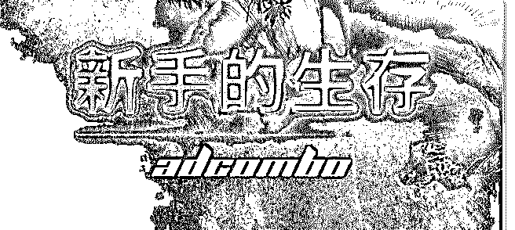

# 新手的生存流量货币

Zheniya（珍妮* : 新手的生存 流量货币化是一项诱人的业务。它吸引了越来越多的新手。

在规划的第一阶段，业余爱好者都充满了热情，但当涉及到

在联盟网注册时，他们就要失望了——因为大多数联盟都不 接受新人。

为什么联盟经理拒绝接受业余爱好者？为什么联盟不能给新 手一个机会？如果每个地方都只要成熟的开发者，那新手又 该如何积累经验呢？如果你想了解这些问题的答案，那就请 继续读下去。

联盟（出乎意料！）是服务行业的一部分。联盟是一家为其 客户（开发者和广告商）服务的平台。平台的收入取决于客 户互动的强度。为了增加收入，就需要有更多的客户。这个 问题不言自明：为什么联盟拒绝接受新手？现有的成熟网站 管理员没有一个是天生就会考虑盈利方案的。但联盟总是要 求确认你在该领域的经验。

为了清楚地了解为什么会发生这种情况，以及新手应该做什 么，你需要深入了解开发者和联盟之间交互的特殊性。这种 互动的特殊性需要严格的合作方式——互惠互利，以口头协 议为基础，没有任何书面合同。这意味着：虽然开发者在联 盟中注册时同意网络的条款和条件，但他仍是自由之身。条 款和条件是按照以下方式设计的：无论是开发者还是联盟， 都可以随时停止他们的互动，不受法律义务的约束。换言 之：没有人欠任何人任何东西。没有私人恩怨，只有公事公 办。

考虑到这种不稳定的情况，再去想象一下联盟（同时是中介 者和担保方）要履行其在广告商和联盟间的协议中的义务是 多么的困难。例如，一个联盟就一定数量的潜在客户与广告 商进行协商。但是，由于开发者既不欠联盟的，也不欠广告 商的，所以很难在潜在客户方面做出任何保证。开发者随时 都可以停止向联盟的登陆页发送流量，并将流量传输给另一 家联盟的其他 offer。市场上的供应正在增加，这就让开发者 不必承担任何义务，也让他可以更改他想合作的联盟，就像 女人换衣服一样。

为了在联盟营销领域生存，开发者需要灵活。广告销售平台 的运营原则一直在变化，完美的方案也可能不再有用，offer 的季节性影响着销售的质量和数量。能一直带来大笔收入的 offer 并不多。你需要改变你的工作方式，以及流量来源、 offer 和横幅广告。开发者同时加入几家附属联盟，以充分利 用每家联盟中的好机会，这是相当常见的一种现象。开发者 为了轻松赚钱是不会只跟同一家联盟合作的。所以，联盟总 是变化无常。

每家联盟总是对新开发者很感兴趣。每家联盟都对广告商负 有保证潜在客户数量的义务。在这方面，每家联盟在任何时 候都必须有一组能带来潜在客户的开发者。开发者时不时地 就会离开：有些人的完美计划变得无用，其他人则去其他地 方测试新的 offer 了；有些人在这个或那个 offer 上赔了钱；其 他人则转移到了其他商业领域。流量货币化是一种获取收入 的不稳定方式。由于这种联盟不断需要新的开发者加入。如 果没有新的开发者——销量低、收入低，联盟就会陷入麻烦 之中！

为什么联盟只接受有经验的开发者？问题是没有人愿意培养 新手。其他职业技能都可以在学校、学院和大学里学习。但 是，目前还没有一个机构能教授如何发送流量以及将流量货

币化。是的，你可以碰碰运气，为自己请一位导师，但在大 多数情况下，这都只是在白白浪费钱而已。在联盟营销中培 养一个新手意味着从零开始培养一个开发者：需要为一个新 手提供机会、激励他，还要跟他们分享成熟同事的经验。所 以这些都需要联盟中的工作人员付出额外努力。

如果你从零开始培训一个开发者，而他翅膀硬了以后却去了 别家联盟。这是很让人痛心的。如上所述，联盟并不亏欠开 发者什么，而培训一个新手既费时又费力。得到的结果与消 耗的资源不匹配。因此，联盟往往会接受成熟的开发者，他 们：a）可以不断带来潜在客户，b）不问愚蠢的问题，而且 c）不需要花费很长时间就能赚到$50。

一个新手会问很多无关的问题，要求一个成功的方案，请求 帮助、建议、复查等等——虽然这都很正常。在这种情况 下，联盟经理要立即给新手提供帮助。没有经验的开发者是 问题的主要来源：社区中有许多抱怨、自负和愤怒的帖子。

总而言之： 尽管联盟营销作为一项业务正在不断发展中，而且在世界各

地也都越来越流行，但在未来几年，新手进入联盟的程序依

然不会改变。

要想从一开始就从事联盟营销工作，那就有必要找一个与新 手合作的联盟。或者你也可以尝试说服联盟经理，让他相信 你有必要的经验，你知道如何在这个行业中行事，而且你也 不会给他带来任何麻烦。

迈出第一步永远都是最困难的——你疑虑重重，你害怕不可 预知的未来和你将要承受的巨大责任。除此之外，联盟经理 还会给那些急于求成的新手增加一些额外的困难，这样他们

就会三思而后行了。旅程刚开始的时候总是最艰难的，但请 不要忘记千里之行始于足下。不勇往直前，就只能举步不 前。只要采取行动（即使行动缓慢），也终将取得难以置信 的成果。

祝你拥有超多流量和转化率。感谢阅读。 加入我们吧~ [AdCombo](https://adcombo.com/publisher/)

2018-12-24(8 赞)

评论区：

麻帅 : (⊙o⊙)哇，那我昨天才注册的，是不是不会被通过了[撇嘴]

西欧西 : 作为小白的我给自己打个 call，

关注公众号"懒人找资源"，星球资源一站式服务