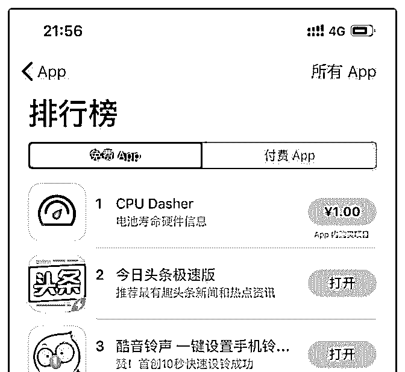
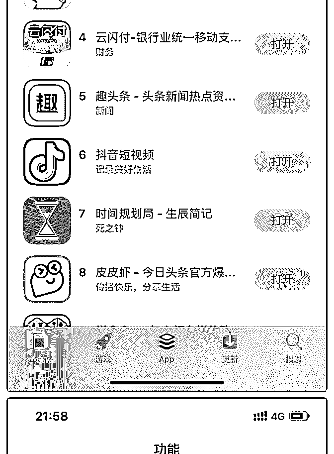
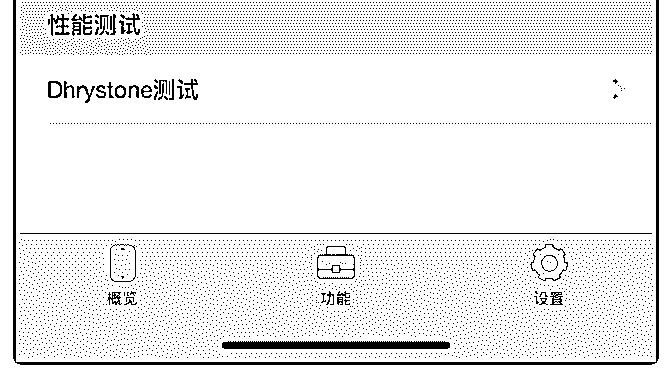
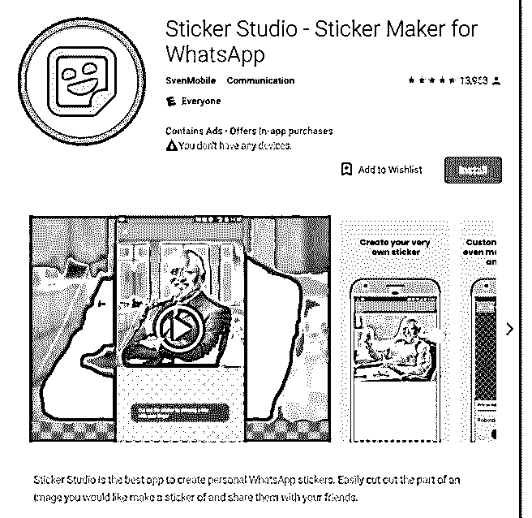

# 第 10 期：Side

富布斯 : 第 10 期：Side Project：一款 WhatsApp 延伸小应用产出 9000 美元/月

前天 在第 9 期里敏锐的发现一款《人生必读的 100 本书》APP 盈利良好，然后找专家 查了下果然暴利：这位开发者做了多 款不起眼的售价几块的产品，一天收入高达 20 万。它的 CPU Dasher 售价 1 元，总榜第一，在他开发的各个 APP 里又相互导 流推荐自家的 APP，有一种当年做站群思路的赶脚。着实厉 害，不说了，我也赶紧去做 APP 了。。。。

今天分享的这位作者同样是通过一些小业余 APP 项目实现暴 利增长的！

作者 Seven van der Zee 是一名 18 岁的荷兰小伙子，利用空余时 间做了不少 Side Project，其中一个小业余项目就是一款用于 WhatsApp 和 AcceptCryp.to 的贴纸 App：Sticker Studio，作者透 露目前广告收入是 300$/天，相当于 9000$/月。

Sticker Studio 是作者最新的一个业余项目，推出不久就已经在 Android 商店获得了巨大的下载量和过万的 5 星评价，但可惜 Seven van der Zee 并没有告诉我们它是如何推广和增长的！

Seven van der Zee 说目前这款产品所面临的最大挑战是来自 Android 的屏幕适配问题，有太多的机型和不同的尺寸屏幕需 要处理，这点老富作为曾经的 iOS 开发者非常理解作者所说的 挑战是有多蛋疼。

竞争对手方面，Seven van der Zee 主要是关注用户需求，比如 Whatsapp 上并不是每个人都懂英语，如何开发一款支持多国

本地语言的应用是这个项目的突破点。

Sticker Studio 的 Google Play 下载地址： [`play.google.com/store/apps/details?id=stic...`](https://play.google.com/store/apps/details?id=stickermaker.android.stickermaker&hl=en) 2018-11-30(12 赞)

评论区：

watson : 怪不得这个作者在微博上说做了独立开发者后再也不想回去工作了，一月收入这么高，还工作个毛。不说了，我去 做 APP 了

富布斯 : 像他这样的如果上班，估计也就 20-30K/月，屈才了 watson : 那个 100 本书看是今年 5 月上线的，居然这么快就第二了 watson : 你上面写错了吧？是一月收入 20 万？

富布斯 : 1 天，数据来自 Tom 叔！

watson : 擦，一个月一套房啊，一年就经济自由了

鹏小宝 : 当年应该好好学编程的

在路上 : 谁用收费的？

富布斯 :

关注公众号"懒人找资源"，星球资源一站式服务