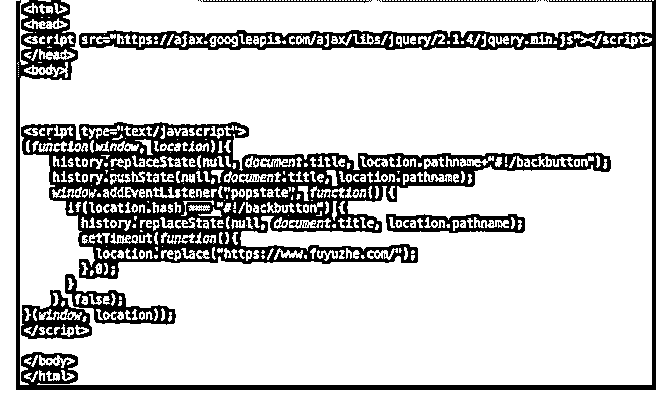

# 分享一个在 Land

分享一个在 Landing Pages（着陆页）上有用的控制浏览器后退

脚本. 这个脚本的原理是在用户进入到你的 LP 的时候，会自动

向访问者的浏览器里插入一条历史记录 URL，URL 你可以自

己定义。

应用场景是这样的，比如你投放了广告是在 Google 上显示， 那么用户从 Google 上点击你的广告进来到你预先准备的 Landing Page。但是用户看了你的 Landing Page 之后发现不是很 喜欢，想退回到 Google。

这时，用户点击浏览器左上角的后退按钮，正常情况下是回 到了 Google！而使用了这个脚本以后，它会在用户的浏览器 历史记录 Google 的前面插入了你脚本定义的 URL 在历史记录 了。当用户第一次点击的时候，是返回到你指定的 Url，而不 是 Google。当用户点击第二次返回按钮，才会正常回到 Google。

那么问题来了，我们是花了钱买来的流量，当然希望尽最大 努力挽留用户并产生转换。用户即将退出时一般会点击后退 按钮，这个脚本就是在后退按钮上做最后的挽救，你可以定 义这几种 Url：

1，将用户发送到 smartlink 平台 2，将用户发送另一个同类的 Offer 上

3，将用户发送一个完全不一样的 Offer 上

4，如果你有几个 LP 进行 Split test 的话，把用户发送另一个 LP

上

5，直接阻止用户后退

哪种最好？我也不知道，不同的 Offer 和人群而异，需要自己 测试！

脚本代码如下，只需要将“替换你的域名”修改成你想要跳转 的 Url，然后放到你的 LP 首页代码中：

2018-11-28(10 赞)

评论区：

ZaichengQi : 有种玩法是回退的页面跟 Google 长得像，可以钓鱼。。。不过回退已经引起很多问题，以后估计会有所改变。

关注公众号"懒人找资源"，星球资源一站式服务