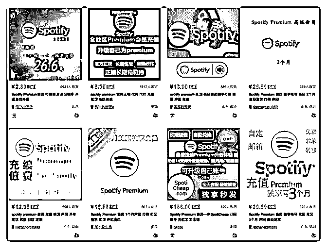
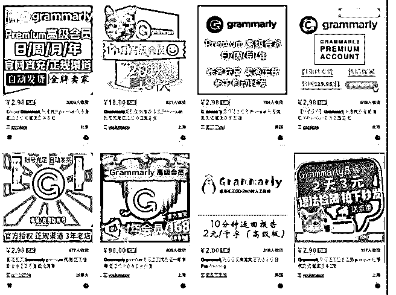

# 第 8 期:那些简单不

富布斯 : 第 8 期:那些简单不起眼的国内外信息差搬运套路，人 人可操作

原计划下周二更新的第 8 期 分享，由于有事，今天提前发布 了。

本期分享的一个小项目思路，兢兢业业的执行，应该可以赚 个小目标，至少也值回 N 个星球门票。

前段偶然发现一个老外的网站，直觉告诉我这种不起眼的信 息差搬到国内是有利可图的。

这个老外出很多常见的 Premium 账号，价格非常低。于是我在 国内的某宝搜索了一下，这些国外的软件、Premium 账号在某 宝上销量都非常大，说明类似的需求大。

图 1

比如：这个老外的站，Spotify Premium 一年卖 15 刀（相当于 人民币 105 元），某宝店家一般 150-200 元之间，按照它们的 销量来看，如果有 30-50 的差价优势，也挺暴利的，毕竟是空 手套白狼。

其次还有，HD Netlfix Accoun，Microsoft Office 365，Windows 的激活码，随便拿一个来举例收入都很惊人。

图 2 比如：Grammarly，语法检测，针对大学生来说 4，5，6 月需

求量就是全年最大的。我在这里不一一分析，点到即止，感 兴趣自己去研究一下需求。

NBA International League Pass，这个东西在国内也有市场，我 在群里讨论过，这个在腾讯的 NBA 会员价格比，差价很大。

不要低估这种信息差套路，玩法比较 low，但往往这种利用大 平台褥羊毛的满足小众需求的小项目，利润都很惊人。比如 前几年有人在某宝帮 iPhone 手机查询丢失位置，光满足这个需 求一个月就超过 10 万的利润。

这里只是一个套路，可能对某些人来说一文不值，也可能有 人从分析中加以变通利用则受益巨大。可以借这个思路挖掘 别的平台和账号，卖信息差，满足某一小众人的需求，赚点 小钱绰绰有余，做好了那就无限可能了。

这个网站我在谷歌搜索了一下，没有什么负面信息。自己也 买过账号测试，使用暂时没有发现什么问题。另外，如果你 要购买账号，不要使用 V 屁 N 付款，其它未评估的请风险自 担。

还有很多很多账号大家感兴趣自己去挖掘下需求，我就不一 一分析。

这个老外的网站我已经发布到社区里了：

[以上是其中一个，类似的站点自行挖掘](https://bbs.fuyuzhe.com/affiliate/210.html)[.](https://bbs.fuyuzhe.com/affiliate/210.html)[【原创】第](https://bbs.fuyuzhe.com/affiliate/210.html)[8](https://bbs.fuyuzhe.com/affiliate/210.html)[期](https://bbs.fuyuzhe.com/affiliate/210.html)[:](https://bbs.fuyuzhe.com/affiliate/210.html)[那些](https://bbs.fuyuzhe.com/affiliate/210.html)  [简单不起眼的信息差暴利搬运套路，人人可操作](https://bbs.fuyuzhe.com/affiliate/210.html)[+-+Affiliate](https://bbs.fuyuzhe.com/affiliate/210.html)[营](https://bbs.fuyuzhe.com/affiliate/210.html)  [销圈](https://bbs.fuyuzhe.com/affiliate/210.html)

2018-11-18(15 赞)

评论区：

风影 : 这个项目风险太大，我看了外国评论的差评都是关于中途账号失效而客服解决不及时的。在淘宝上已经有包月的细

分服务了，大约每个月换一次账号，他们操作的手法应该是大量注册新人账号来套取价格差

富布斯 : 嗯，这个思路可以作抛砖引玉，流程细节大家自己完善。淘宝那帮人能做说明是有解决方案的.

谢书林 : 新人学习中，还不知道怎么搞

关注公众号"懒人找资源"，星球资源一站式服务