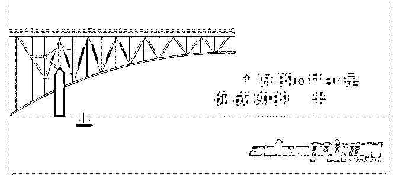

# 大家好！作为一名联

Zheniya（珍妮* : 大家好！ 作为一名联盟经理，我一直都在见证不断重复的场景：有人

欢喜有人忧。一些新手在联盟营销中取得成功，而其他人却

遭遇失败。一些新手轻而易举就能从网络中获得第一桶金；

而其他人却因没达到最低付款额而感到失望。

这些倍感失望的营销人员变成了后来那些声称 CPA 营销赚不 到钱的人。

他们中的大多数人之所以失败完全是因为一个极其简单的错 误——他们选错了 offer。让我来解释一下：CPA 的大多数 offer 对新手而言都差不多。新手不知道：两个进行同等推广（例 如：相同的流量来源）的类似 offer 可能会有基本不同的转化 率。我的意思是，新手甚至都不会怀疑，offer 背后的广告商 都有他自己的麻烦，如条件、条款、登录页、跟踪软件等 等。这些问题对实际转化率的影响很大。 所以，如果一群新手联盟营销人员很幸运地选了一个好的 offer——他们就能快速轻松地获得首个积极成果。而另一组 新手则失败了，因为他们在 offer 的选择上不太走运。

要想在联属营销中取得成功，你就应该非常谨慎地选择

offer。你需要分析很多东西以免出错。

请阅读下列步骤，以免在选择 offer 时失败。

1\. 向你的联盟经理询问关于网络 offer 的详细描述。让他告诉 你目前最受欢迎的 offer 是哪些。跟他询问最实用的实际 offer 列表，而不是最热门的 offer 列表。

每个联盟经理都能知悉总体统计数据：offer 每日获得的潜在 客户数量、实际转化率、实际 EPC 和其他值。 大多数网络都是根据 offer 的 EPC 来形成他们的热门 offer 列表 的。在大多数情况下，offer 中潜在客户的数量没有被计算在 内。这就是为什么这些热门列表与现实相差甚远，而且这些 列表中的一些 offer 实际上可能并不赚钱。顺便说一 下，AdCombo 通常会根据 offer 的所有指标制作热门 offer 列 表。 更重要的是，在 AdCombo，你还需要注意一个指标。就是核 准率——这是一个百分比值，表示从潜在客户到真实销售量 的平均转化率。如你所知，只有真实销售量是在“货到付 款”模式下付款的。

2.让联盟经理即时为你提供实际转化率（比率）、实际 EPC 和 offer 每天获得的潜在客户数。同时，询问有关 offer 的寿命和 广告商的付款纪律（如果他及时付款）的信息。 你的联盟经理有时不会透露潜在客户的确切数目，但他会给 你提供大概的信息，例如每天的潜在客户数是 100+/500+/1000+/10k+。一个 offer 的转化率越高，效果越好。 尝试一个 10k+的 offer 是个好主意。 如果一个 offer 有相当好的统计数据（足够的 EPC 和转化率、大 量的潜在客户，而且这个 offer 在网络中存在了相当长的一段 时间），这就意味着有人在这个 offer 上赚了很多钱，那么， 你也可以。这样的 offer 就是一个很好的开始。 有时联盟经理拒绝透露有关 offer 的任何信息。有几个原因可 能会导致这种情况，但通常他们拒绝提供任何信息，是因为 他们没有任何信息可以提供。当没有人在做这个 offer，而且 统计数据中也没有任何可用信息时，就会发生这种情况。你 最好跳过这样的 offer，去找一个更好的。

3.要求你的联盟经理给你提供关于广告商的任何信息：广告商 与网络合作了多久、他有多少 offer 以及他的付款纪律。

如果网络会推广自己的 offer——那你就可以毫无顾虑地访问 该网络。如果该网络转售了另一个网络的 offer——那你最好 彻底忘掉它。如果双方的关系中有第三方存在——那 offer 的 质量肯定非常低。 联盟经理经常会在没有广告商的充分反馈和任何统计数据的 情况下，将新 offer 发给发布者。不建议新手去做这种 offer。

4.在处理流量时，把自己的期望放在一边。好的 offer 转换不仅 仅在于结构良好又美观的登录页面。它取决于诸多与普通人 通常认为的好广告理念不一致的因素。数字胜于雄辩。 登录页和 offer 可能是完美无暇的，但 offer 的品质水准（潜在 客户的跟踪、潜在客户的记录、呼叫中心的效率、内容）很 差。所有这些因素都与广告商和联盟网络有关。虽然联盟方 遭遇的挫折最多，但联盟方本身不会影响这些因素。

5.从入门级 offer 开始吧，因为它的转化率很高，而且潜在客户 的费用还不到 10 块钱。试着选择那些能立即见效的 offer。 当你选择小额贷款和保险这些时，需要相当长一段时间才能 看到结果。在这方面，联盟方在获得有关流量的所有信息之 前都无法评估自己的工作质量。另一个是支付软件安装、应 用程序下载（不涉及被吸引用户的回归）、礼品卡的赠送等 等的 offer。

使用来自不同广告商的相同 offer 的简单例子：

● 一个大型广告商在提交电子邮件的帮助下推广 offer，以增

加订阅数。广告商只接受唯一地址，也会过滤可疑的电子邮

件，并且不会为同一地址重复付费。所有 offer 都有一个相同 的订阅者名单（基础）。如果一个电子邮件在只涉及一个

offer 的基础/名单中，那么其他所有 offer 的转化都不在考虑范 围内。广告商让庞大的基础/名单成功运作起来，而且一直持 续到现在。

● 发布新产品/服务并安排新的订阅者基础名单的广告商。所

有电子邮件均可接受，并且只有一个条件：潜在客户应在需 要的地理位置内完成。

两个 offer 都会有相同的登录页面和相同的转化条件（提交电 子邮件）。乍一看，一个新手会认为这两个 offer 是完全一样 的。主要区别是： 如果使用第一个，即使是成熟的联盟方也很难赚到钱。 如果使用第二个，即使是业余的联盟方也能获得潜在客户。 结论： 新手的成功至少有 50%在于 offer 的选择。我并不是在开玩 笑，offer 本身——占了 50%，合适的方案和流量来源——占了 另外 50%。

如果你选错了 offer——你所有的努力都将毫无意义。为了避 免失败——在 100%的情况下，您都应该永远在开始访问之前 明确关于 offer 的所有信息。遵循这些简单的规则，你就不会 失败得那么频繁了。请记住，联盟营销总是起起伏伏的。不 可能每次都获得 100%的利润。强者生存。所以要强大起来。

下次再聊。 Adcombo 等待你~ [AdCombo](https://adcombo.com/publisher/) 2018-11-16(18 赞)

评论区：

富布斯 : [强]感谢珍妮分享 狼噬夜 : 对新手很有帮助 Zheniya（珍妮* : 么么哒~

Zheniya（珍妮* : 这就是我们的目的呀 泠羽 : ADcomob 是你们的联盟吗

魔术师 : 新手能加入吗 兴国 : 谢谢分享！

帝都牛人 : 新手，请多关照

关注公众号"懒人找资源"，星球资源一站式服务