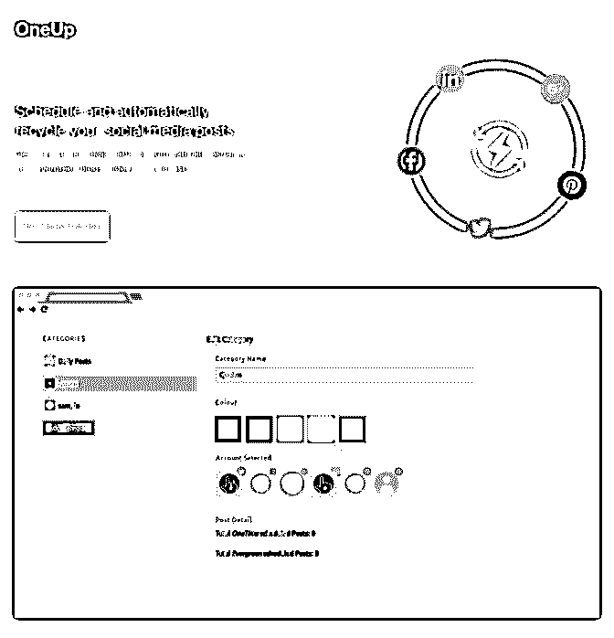
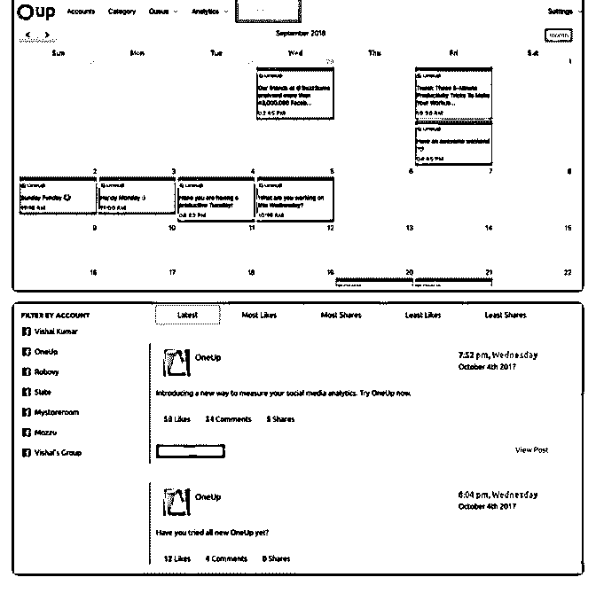

# 《Logojoy：

《Logojoy：月入 70000$的智能生成 Logo 的网站》

有多少组织就有多少 logo，logo 作为一个组织甚至于个人的标 志起着关键性的作用，从国家、企业、个人工作者，没有不 想做好并且作为自己长期使用的，哪怕耗费再大的精力

本次案例分享的是一个根据用户的喜好智能生成 logo 的网站 通过机器学习来生成根据用户需求设计的[logo](https://bbs.fuyuzhe.com/affiliate/202.html) [同时同步至富裕者论坛](https://bbs.fuyuzhe.com/affiliate/202.html) [Logojoy](https://bbs.fuyuzhe.com/affiliate/202.html)[：月入](https://bbs.fuyuzhe.com/affiliate/202.html)[70000$](https://bbs.fuyuzhe.com/affiliate/202.html)[的智能生成](https://bbs.fuyuzhe.com/affiliate/202.html)

[+Logo](https://bbs.fuyuzhe.com/affiliate/202.html)[的网站](https://bbs.fuyuzhe.com/affiliate/202.html)[+-+Affiliate](https://bbs.fuyuzhe.com/affiliate/202.html)[营销圈](https://bbs.fuyuzhe.com/affiliate/202.html)

2018-10-30(7 赞)

评论区：

浪子人生 : 你好 怎么登入？ 需要邀请码，如何获取邀请码

关注公众号"懒人找资源"，星球资源一站式服务

# 20181024

ZaichengQi : 20181024 landing page hosting 方案整理

上周买了 adp mobile，马上投入 spy offer，偷 lander 中。程序员 的老毛病犯了，抑制不住想要找自己喜欢的 hosting 方案。

1.  常见的，vps（vultr，digital ocean，linode，aws ec2）上用 nginx 做 static host，前面加上 cloudflare/cloudfront 等全球 region 覆盖广的 cdn，这个方案也很省钱，5 刀每月的 vps 足够，cdn 可 以选择付费或者收费。收费 cdn 一般一个 TB 流量差不多每个月 100 美金。

2.  s3 bucket，Google cloud storage。开启 static hosting，加上

    cdn。存储和 cdn 都要付费，当然 cdn 可以选择免费的

    cloudflare，方便稳定省钱。用支持 s3 的工具，像 FTP 一样拖到

    bucket 里，再从 cdn 做一个域名指向，搞定。

3.  github page，gitlab page，加上 cloudflare cdn。免费，有 cdn，

    速度保证静态网页也不会达到 github，gitlab 的用量限制

4.  我最喜欢的 netlify，支持自动部署，git 集成，ab testing，跨

洋 cdn 网络。收费版 49 刀每月，1T 流量，免费版，每个月 100g

流量。

大家都是怎么选择 hosting 方案的呢？可以交流一下。后面我 会持续更新我的 lander 工作流。确定我喜欢的方案。

2018-10-24(10 赞)

评论区：

富布斯 : adp 不如拿来几个人用分摊下降低成本. ZaichengQi : 嗯嗯，在群里找小伙伴一起分担

.o0 : 真心不错，感谢分享。

watson : 赞~~~期待调研报告， 我也去搞一个。

Orca : 请问现在选择的是哪个方案呢[呲牙]

富布斯 :

关注公众号"懒人找资源"，星球资源一站式服务

# OneUp 一款月收

OneUp 一款月收 500$的自动循环发布社交内容的 Saas 工具

我们知道在社交媒体某个时段发布内容并不能保证被所有的 粉丝和目标用户看到的，比如我们在微信上发布一条朋友圈 信息，假设你的好友拥有几千个好友，那么你的消息很快就 会被沉下去，被阅读的几率极其低，在国外的社交媒体被阅 读率只有 5%。

本案例的联合创始人 Davis Baer，去年开发了 OneUp 就是一款 通过自动循环定时重新分享你的博客、视频或播客来帮助你 获得更多的社交媒体流量的 SAAS 工具。OneUp 的目标人群是 创业公司创始人，电子商务店老板，小企业主，博主，播 客，YouTubers 和社交媒体经理，目前它支持 Facebook、 Twitter、Instagram、Pinterest 等，作为上线才几个月的产品， 目前收入只有 500$/月，显然 OneUp 目标肯定不止于此，因为 同类竞争对手 MeetEdgar 和 Buffer 已经年收几百万美元，说明 这个 Niche 需求是市场被验证过是可以成功的.

冷启动：

OneUp 的诞生起源于联合创始人 Vishal Kumar 去年的作为业余 小项目，他本身就是技术联合创始人，并且之前已经有了几

年的社交媒体管理经历，所以这个产品在那时就已经开始构 思并更新迭代。除了 Web 版本，OneUp 目前还开发了 Chrome 插件版的.

推广：

一开始 OneUp 在 Product Hunt 上推出后获得不俗的表现，获得 首批付费用户，在 2.0 版本开始在 Product Hunt 获得了超过 500 个赞，之后 OneUp 认为 Quora 的用户质量更高，所以又专注于 在 Quora 回答高质量的答案。

我通过 similarweb 上看到，OneUp 官网目前流量主要是通过 Product Hunt 搜索过来的，其次是外链、社交媒体，搜索流量 几乎可以忽略不计了。

Davis Baer 表示他们已经在计划不同付费推广渠道曝光产品.

盈利模式： OneUp 目前可以 7 天免费试用，7 天之后收费从 10 美元/月---99 美元/月不等。区别就是在于你的账户数量、用户数、以及平 时发布的帖子数量，越多当然越贵。

总结 我们刚刚开始说了，OneUp 是一款初创产品，它目前产品的 很多灵感和设计都基于用户的需求反馈，在产品更新迭代过 程中，最大的困难就是各个社交平台的 API 总是在不断的变 化，这样很大程度增加了 OneUp 的更新维护成本。

OneUp 的主要竞争对手其实是已经年入几百万美金的 MeetEdgar 和 Buffer，这是一个被验证过的成功产品，所以作 为后来者还需要寻找产品的差异化和用户体验，这不禁让我 想起了一句话：“走别人的路，让别人无处可走”。

OneUp 官网： 原文链接： Chrome 插件链

接：[OneUp:+Schedule+and+recycle+your+social+media+cont...](https://www.oneupapp.io/)

[Quitting+My+Miserable+Day+Job+to+Build+and+Grow+a+...](https://www.indiehackers.com/interview/quitting-my-miserable-day-job-to-build-and-grow-a-profitable-business-973c37b03b)

[`chrome.google.com/webstore/detail/oneup/nf...`](https://chrome.google.com/webstore/detail/oneup/nfihappcoloadkogdfpoaeefhikofiib?hl=zh-CN)

2018-10-23(5 赞)

关注公众号"懒人找资源"，星球资源一站式服务