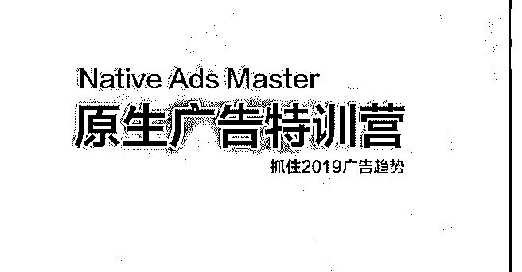

# 之前圈友一直想来上

之前圈友一直想来上海找我喝茶，但由于再过几个月准备升 级奶爸，所以外面的工作和社交暂时先放放。

看到全球最大的联盟营销 STM 私密社区 2018 报告，Native Ads 目前是 2019 年的趋势，Native 的流量不管从质量和量级上以后 会更优更大，竞争明年也会随之增大，有竞争说明有市场潜 力，正好也有时间顺便带着个小兄弟跑 Native 的 Offer，我们这 些天测了几个 Lander 和流量源后盈利。然后一直想写个 Spy App，如果没有太好的 Angles，我觉得新手能借助工具 Spy 到 Vertical 里大牛的 Landers，有个不错的流量源测 Offer 就能盈 利。也认同大牛说的一个 Vertical 最好有一个 Masterminds 的协 同效应。所以我筹划了个本期训练营，但本人精力有限，需 要限制人数以保证效果。

这篇可以帮助你了解 特训营课程可以让你作为快速进入行业的捷径，相当于投资

买时间和经验，其价值自己斟酌理解。如果有足够多的时间

和能力自学，可根据我整理的大纲和社区上发布的一些不错

的视频教程自学即可.

已订阅过《Affiliate Mastery 完美中文版视频教程》，或者知识 星球的内部会员，那么参加本期特训营可以减掉你之前所支 付的费用。

具体特训营大纲点击这里：

联系 QQ/微信：718079[什么是](https://mp.weixin.qq.com/s/uhAgBulIIo_YnTn3D1gUyA)[Native+Ads(](https://mp.weixin.qq.com/s/uhAgBulIIo_YnTn3D1gUyA)[原生广告](https://mp.weixin.qq.com/s/uhAgBulIIo_YnTn3D1gUyA)[)](https://mp.weixin.qq.com/s/uhAgBulIIo_YnTn3D1gUyA)[？](https://mp.weixin.qq.com/s/uhAgBulIIo_YnTn3D1gUyA)

[Native+Ads+Master](https://shimo.im/docs/1bMwsRHwDoIH9iUE/)[特训营](https://shimo.im/docs/1bMwsRHwDoIH9iUE/)

2018-10-17(9 赞)

评论区：

watson : 680 刀？需要准备多少预算？ 富布斯 : 感兴趣可以微信咨询.

关注公众号"懒人找资源"，星球资源一站式服务