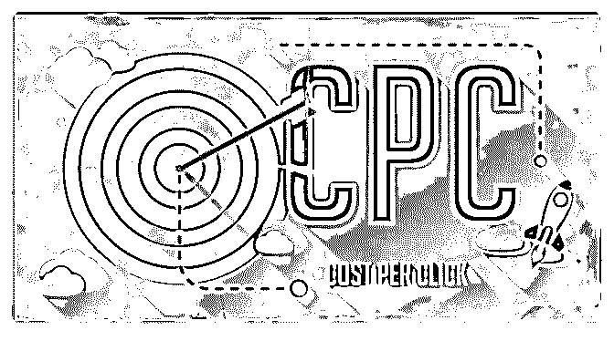
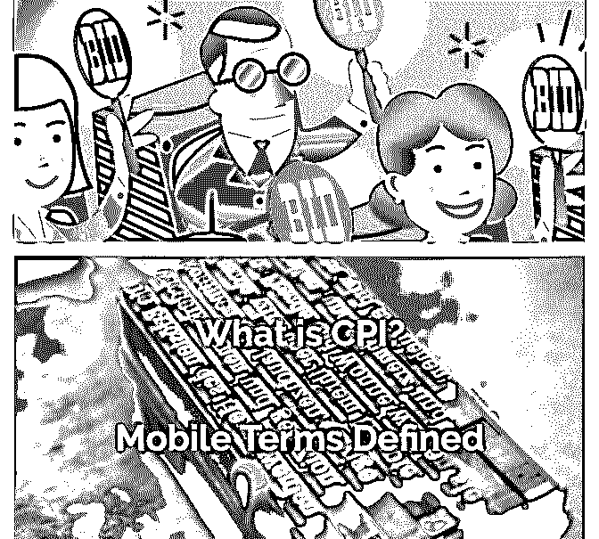

# 《Mobile M

富布斯 : 《Mobile Mastery 中文视频教程》里第十一课的文档 分享，Bidding 模式，CPM/CPC/CPI, 都是一些基础但很重要的 概念。看任何教程，不建议照葫芦画瓢，理解概念和原理、 销售漏斗以及前面 Jacky 前辈所说的，对流量的感觉才是最值 钱的。

[下载地址：](https://bbs.fuyuzhe.com/affiliate/180.html)[Affiliate+Marketing](https://bbs.fuyuzhe.com/affiliate/180.html)[中文教程系列七：](https://bbs.fuyuzhe.com/affiliate/180.html)[Bidding](https://bbs.fuyuzhe.com/affiliate/180.html)[模式](https://bbs.fuyuzhe.com/affiliate/180.html)[+-](https://bbs.fuyuzhe.com/affiliate/180.html)

[+Affiliate](https://bbs.fuyuzhe.com/affiliate/180.html)[营销](https://bbs.fuyuzhe.com/affiliate/180.html)[...](https://bbs.fuyuzhe.com/affiliate/180.html)

2018-09-13(1 赞)

关注公众号"懒人找资源"，星球资源一站式服务