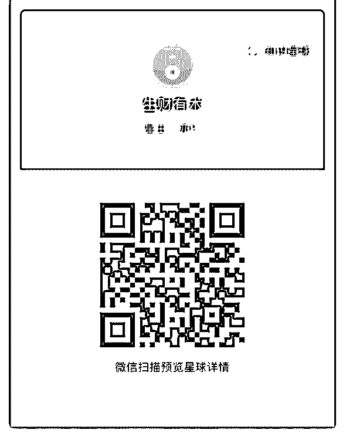
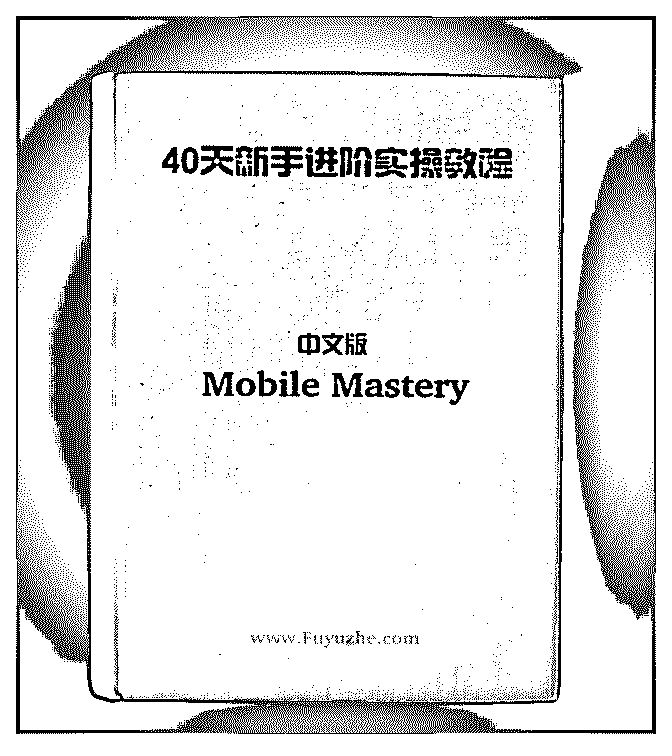
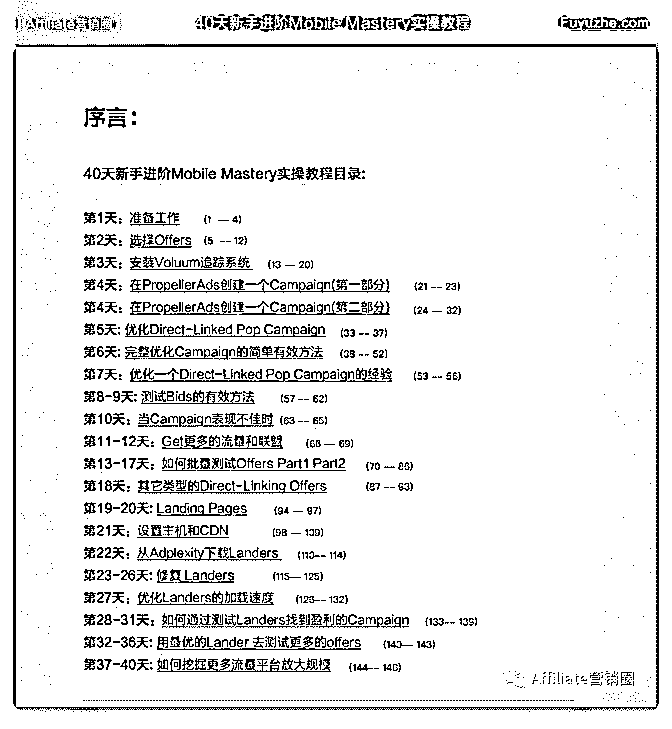

# 大家好，我是纯 af

猪五十七 : 大家好，我是纯 affiliate 小白，正式入行一个月时 间，本人是文科生，法律专业，误打误撞进入了 affiliate 行 业，今天想和大家做一次分享，讲讲自己的体会。大多数做 affiliate 都有一点技术基础，而我完全是一个技术的门外汉。 可想而知难度十分巨大，这段时间我自己学习了架设 vps，学 习了建站，实践了申请 offer，跑 campaign，几个 offer 跑下来， 和很多人一样有转化也遇到了一些问题。但今天我主要想讲 一下心态和价值观的问题。

1、 我从来不后悔进入这个行业，相反我认为行业内有很 多正能量的人才，我们的社会正在经历巨大变革，每一次变 革都有一个缺口，而打开这个缺口的正是我们这群有理想、 有情怀、有知识、有信仰的人。

2、 我们身边永远不缺聪明人，但缺少专注的人。追名逐 利是这个时代的标签，但是我相信每个行业真正走到最后的 是一群“傻”人，或者说真正静下心来认认真真把一件事情坚 持到底的人才是真正的聪明人。

3、 做这个行业需要多交流，要把自己的体验讲出来，分 享自己的经验，我和圈里某位大哥交流之后，学习了很多， 也少走了很多弯路。我们交流的更多的是理念的问题，不涉 及项目本身。譬如我提出一个分饼的概念，很多人喜欢做零 和博弈，这对于一个相对资源有限的环境来说是有效的。但 我们所处的 affiliate 行业是一个上千亿的市场，我们需要的是 做饼的理念，大家一起把饼做大，做正相博弈才是出路。 4、 实践是唯一的王道，一开始我就是走了弯路，妄图了 解行业的每个细节而忽视了整体的操作，多亏有大哥提醒， 我才慢慢的开始摸索测试，慢慢的从一个整体了解了行业的 大概。这个行业有很多教程，但实操永远是最好的教程。 我说这些，是想告诉和我一样的新人在做之前树立一个好的 价值观，哪怕是一点点的帮助也是好的，我会一以贯之摸索

前进，谢谢大家。

2018-09-06(25 赞)

评论区：

富布斯 : [强]已加精.

关注公众号"懒人找资源"，星球资源一站式服务

# Super Aff

富布斯 : Super Affiliate 一直让人艳羡和膜拜的角色。今天我很 荣幸邀请到 前辈，就是隐形的江湖流量大牛之一。他是 Mobile affiliate 行业的超级 Affiliate，他不是传说中的日入万 刀，而是日利润万刀，有着非常丰富的行业经验和赚钱故 事。

以下是转载自《生财有术》知识星球：星主亦仁对 的采访分 享：

接下来我们就来听听 Jacky 分享他的第一桶金的故事以及对

affiliate 这个行业的看法。

亦仁：Jacky 你好，很高兴邀请到你来参加生财有术“生财合伙 人”栏目，认识你很久，知道你是一个 Super Affiliate，也在 affiliate 行业赚了很多钱，可以给大家介绍下你是怎么进入到 这个行业的吗？

Jacky: "人生就是一场康波；在经济周期运动涌现的机会和陷 阱中，有人幸运着，有人沉沦了"

那一年 2009，工业和信息化部为中国移动、中国电信和中国 联通发放了 3 张第三代移动通信（3G）牌照。移动互联网还在 襁褓之中。 年轻的王二小在一所理工科类的读大三，学痴一枚，喜欢听 new age 音乐，最喜欢看的书是商界，虽然穷困潦倒沉迷 dota，但是对各种商业套路非常着迷。一日在校内 BBS 闲逛， 偶遇一位学长讲授创业经历。学长做的是一款视频格式转换 共享软件，所谓共享软件，就是 free trial，但是需要购买 license 来使用完整功能的软件。他讲了自己是如何通过将共享

软件卖到全球，在大学就月入万刀的，我当时看了帖子很震 撼，虽然内容没了解透，但是觉得他一个人做开发、做美 工、做营销、做售后非常非常酷。我立即约了这位学长喝咖 啡当面请教，学长跟我讲了很多，印象最深刻的是一句话 是“理工科生，一定也要懂营销懂市场”。之后的几天，我通 过搜索，以及当时最大的 CNSW(共享软件联盟)论坛去搜集大 量的相关信息。我逐渐了解了一个中国早期的 affiliate 出海行 业，了解了中国共享软件出海第一人周奕，认识了做 sem 日烧 上万的长颈叔叔。了解了这个行业过后，我决定自己亲自试 水做 affiliate。在做了一些市场调研过后，我选中了备份恢复 软件这个 niche，然后去 regnow、avangate、shareit 等平台上去 找了这块的所有产品，经过一番对比之后，我挑中了其中 1 款。接下来就是注册域名，写软文，以及按 seo 的一些 tricks 对 站点进行优化。有了这些基础之后，我开始了各种免费拉流 量的尝试（主要是因为大学没钱），去各种 PC 论坛发帖、搜 关键词长尾的 blog 留言等等。做了漫长的三个月，我终于刷出 来了人生 affiliate 的第一单，40 美金的产品，佣金 24 美金。别 人的成功都是刺激的，自己的现实是骨感的。3 个月的付出换 来一顿饭钱，虽然出单了，但是后续的几天又回归鸭蛋了， 距离我日入百刀的目标差距太大。我开始思考继续深入还是 换打法。我注意到共享软件论坛的人气越来越差了，隐隐约 约的感觉共享软件开始走下坡路了。于是，我决定拓宽视 野，转型做 amazon 的 affiliate，不再局限于软件这个领域了。 借着 SEMRush+Wordpress 两大神器，我开始尝试各种细分的 niche，从内存条到皮带到高尔夫球杆，无奇不有。Amazon 的 佣金不高，当时赚的钱只能当零花，生活还得继续，于是我 还是按部就班的毕业工作着。不过 affiliate 也跟我带来了很多 乐趣，学到了很多知识，比如因为写高尔夫球杆软文，学习 到了高尔夫一套球杆有三木九铁一推。

亦仁：给我们分享下你的第一桶金的故事吧，你是怎么做到 日利润万刀的？

Jacky：2013 年，移动互联网大潮开始，捡钱的时代来了。 因为在 PC 时代就进入了 affiliate 行业，我一直在默默了解着相 关行业的咨询。有一天，我偶尔看到一篇新闻，内容是 59% 的美国消费者都拥有智能手机了，移动流量正指数增长，部 分大型网站已经超越 PC 流量。因为干 affiliate 对流量的敏感， 这则新闻让我心跳足足加速了几天，我感觉到一个全新的大 时代要来了，剩下的就是找能把我这只猪吹飞起来的风口 了。于是，我开始全力转向移动端，加上工作的积蓄，我可 以直接从付费流量 PPC 开始了，不用再苦逼的 SEO 了。野蛮生 长的市场就要粗暴的干，要干就先干最大的那个。于是，我 挑了一些国外的付费订阅的产品，在谷歌上投放起来，本来 还准备等数据出来优化广告关键词的，结果直接就是 300%ROI，只需要抢量抢排名就行了，这也许就是风口的力 量吧。那段时间就是不断的花钱，不断的收钱恢复信用卡额 度。各种移动流量平台也雨后春笋，像 airpush, leadbolt，jumptap 等等等等，而且一开始都是流量极其便宜， 很容易就能赚钱的。13 年下半年，国内的互联网巨头们开始 盯上了出海这个方向，金山首当其冲。大量的移动应用单子 涌现，如 cleanmaster，360，mobogenie 等等。我也依靠着 affiliate 对流量这块的先发优势，迅速扩大着自己的 revenue。 从一天上万个下载，到日入万刀，到日利润万刀。。。好日 子持续了一年，社会资本开始进入，广告主开始疯狂的压榨 渠道的空间，行业不再是高利润，而是一个资本喜好的高流 水、故事美的市场了，红利逐渐消失。 有一个比较有趣的故事，某安全厂商按 cpa 跟渠道进行结算， 给出的价格是 0.15 美金一个安装，渠道架设好了账户，通过努 力跑出最大的量，并且将成本优化到了 0.03 美金。在厂商看到 账户这一成本的当晚，单方面撕毁了协议，邮件通知渠道按 0.04 美金进行结算。就这样也就算了，还要拖几个月不付款， 并且最后付款的时候更新了质量考核 KPI 并且回溯，扣了大把 的安装量。大部分渠道辛苦一年，10 个点左右的利润，年底

再被扣几十万美金，无力支撑出局。

亦仁：作为一个优秀的投手，期待给大家分享下你的广告投 放经验。

Jacky: 很多人想成为优秀的投手。我总结了一下自己的经验， 广告投的比较优秀的，大抵两种，一种是 Gaming System，一 种是 Gaming People；当然，帮品牌广告主做品牌广告的艺术 家投手，不在我讨论的范围。

Gaming System，是指对广告投放系统熟悉，并且能够通过自 己的测试试探出系统算法，通过顺从算法，将投放结果最优 化。黑帽和白帽都算。白帽里面，举个简单的例子：在同一 个系统上面，投同一个产品，你如何能够 pk 掉竞争对手，抢 到最多的量，并且让竞争损耗最小？优秀的投手会做大量的 测试，去了解这个系统，比如他的竞价系统是 GFP（Generalized First Price）还是 GSP（Generalized Second Price）还是 VCG（Vickrey-Clarke-Groves）竞价机制，如果是 GFP，需要创建大量的不同出价的广告，以及微小差价来获 取最优 bid；如果是 GSP，可以采取极高 bid 来抢量；如果是 VCG，需要更多的手工设置来干涉。黑帽就不多说了，有个 有趣的例子，很早很早以前，Google Adwords 系统有个 bug， 你可以通过大量创建极高 bid 但是极小 budget 的广告，来获取 大量的免费流量，为啥呢，bid 高了流量刹不住车，一脚油门 就送超过你的 budget 了，但是 billing 模块不会多扣你钱，这个 bug 持续了很长时间；后来 facebook 高薪挖了很多谷歌的工程 师过去开发广告系统，结果也把 bug 带过去了，很多人用这个 trick 薅了 facebook 上百万羊毛。Gaming System 不是教你投机， 对于投手而言，每个平台都是战场，利用规则就是你杀死对 手的方式。

Gaming People，是指利用素材，以及素材的展现方式去诱导

用户产生某种行为。同样黑帽白帽都有。白帽来说，优秀的 投手，往往熟谙心理学，会结合广告投放的场景以及用户看 到广告时可能所处的状态等，来使用不同类型的素材，用什 么样类型的按钮，什么样的颜色配色，突出什么样的文字。 举一个很经典的例子，同样在 facebook 上面投放某个 app 的广 告，优秀的同志可以将所有的手机型号找出来，然后做玩家 用各个手机型号使用的素材图，另外在文案上也注明某某手 机型号用户，然后分手机型号来投广告；哪个 app 做不到适配 手机？但是优秀的同志让用户产生了优越感，作为回报，用 户成本也从十几美分降到了一两美分。黑帽就太多了，大家 可能都接触过很多吧，比如模仿手机系统的素材，比如恐吓 用户下载安全产品的素材等等，这些过激的大部分会被广告 平台干掉，那么怎么不被平台干掉？这里面又有很多黑帽， 不去引申了。如何把握素材的 aggressive 程度，就像肝腰合炒 的火候一样，也是一门手艺。

亦仁：你怎么看这两三年 affiliate 行业？

Jacky:Affiliate 行业是一个非常趋利的行业。大部分的 affiliate 都 是 c 位，市场好的时候，抓住机会就疯狂的打钱和升级，市场 不好，大多数就开始抱团了。这两三年，很明显的是抱团的 趋势了，前期 farm 比较多的，现在资本化的资本化了，钱赚 够的开始养身了，还有一些前期没有抓住机会的，现在再来 升级和 farm，已经很难很难了。不过市场每年总会有新的热 点出来，保持好敏锐的嗅觉，还是有人能从每年的热点里面 赚得盆满钵满，比如这两三年的 shopify，COD。

亦仁：非常棒的分享，给生财有术的小伙伴分享一些你对未 来的展望吧~

Jacky:这些年我一直盯着国外市场比较多，国内的市场发展的 速度更快，竞争更激烈，也涌现出了非常多的牛人。以前曾

航写过一本书叫移动的帝国，写的非常好，讲述了日本先进 的移动互联网生态是如何影响世界，以及优秀模式的复制与 蔓延。我觉得未来，大部分还没有仔细了解过海外的朋友， 可以考虑把国内优秀的玩法，优秀的运营带到国际市场了， 那里没有四巨头，没有那么多头破血流，或许能够给你更丰 厚的回报。

以上! 看了非常受用，感谢 Jacky 分享，也很荣幸邀请到 Jacky 加入本

圈和大家一起交流。各位有什么需要和 Jacky 交流的可评论区

留言.

2018-09-06(17 赞)

评论区： 然后呢 : 厉害

AAAA 网猫 : 请教一下嘉宾，在如今这种形势下，给刚入行的新手主要有什么建议？麻烦说赐教个一两条要点。。谢谢

王二小 : 嗯，现在进入的话，就是一定要沉下心来，目前机会都比较深了，easy money 不多，多测试多加圈子交流，发现热

点就加大投入。

笨子 001 : 请问有没有线下的培训

王二小 : 没有呢，这个东西不是简单培训就能赚钱的，自己多试水，经验和你对流量的感觉才是最值钱的，与其参加培

训，不如把钱花在测试上，不懂再搜再问

富布斯 :

关注公众号"懒人找资源"，星球资源一站式服务

# 40 天新手进阶 Mo

40 天新手进阶 Mobile Mastery 实操教程已更新完毕. 全书 PDF 格

式,150 页！！

本实操指南的具体介绍和目录可以在这里看到：

不知道有多少人会需要？反正是消耗了很大的时间和精力制 作了. 内容基本是根据 STM 大牛的力作译编。学习下 Aff 大牛 的思路，对 Newbie 来说应该还是有很大的帮助和借鉴意义的.

看到外面随便一个基础操作目录都收别人几千块的培训费， 那么我们洋洋洒洒 150 页内容的实操指南。目的就是能帮助到 大家可以从入门到进阶，不会收取任何费用，也不会拿来出 售，仅供「Affiliate 营销圈」内部交流学习使用。

但也会有个下载门槛，达到任意一个条件即可跟我索要下载 地址：

1，提供价值：在圈里不吝分享你的观点、思路，被精华 2 条.

2，提供资源：在官方社区分享优质资源被赏金币 500 以上的.

3，注入新鲜血液：即日起点击分享并邀请 1 名新人入圈，同 时你还将获得 50%佣金.

[4](https://mp.weixin.qq.com/s/UYCTGeNSvchgwfRiFLyNcg)[，原创投稿：投稿一篇原创](https://mp.weixin.qq.com/s/UYCTGeNSvchgwfRiFLyNcg)[Aff](https://mp.weixin.qq.com/s/UYCTGeNSvchgwfRiFLyNcg)[相关文章](https://mp.weixin.qq.com/s/UYCTGeNSvchgwfRiFLyNcg)[.](https://mp.weixin.qq.com/s/UYCTGeNSvchgwfRiFLyNcg)[《](https://mp.weixin.qq.com/s/UYCTGeNSvchgwfRiFLyNcg)[40](https://mp.weixin.qq.com/s/UYCTGeNSvchgwfRiFLyNcg)[天新手进阶](https://mp.weixin.qq.com/s/UYCTGeNSvchgwfRiFLyNcg)

[Mobile+Mastery](https://mp.weixin.qq.com/s/UYCTGeNSvchgwfRiFLyNcg)[实操教程》电子书](https://mp.weixin.qq.com/s/UYCTGeNSvchgwfRiFLyNcg)[PDF150](https://mp.weixin.qq.com/s/UYCTGeNSvchgwfRiFLyNcg)[页](https://mp.weixin.qq.com/s/UYCTGeNSvchgwfRiFLyNcg)

2018-09-01(28 赞)

评论区：

Andy : 怎么获得这本电子书 秋生 : 对我来说都好有难度呀

南宫七杀 : 书在哪里获取？[微笑]

富布斯 : 帖子已经说明了，麻烦认真看下

A+云和山 : 对新人来说很难啊

Joke : 有点难度[捂脸]

蓝土豆 : 只好努力爬楼 ， 投稿

富布斯 :

关注公众号"懒人找资源"，星球资源一站式服务