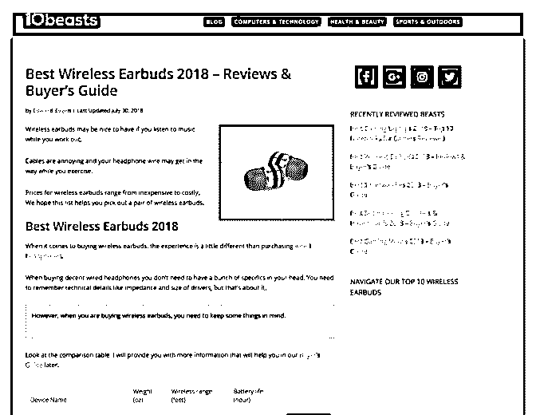
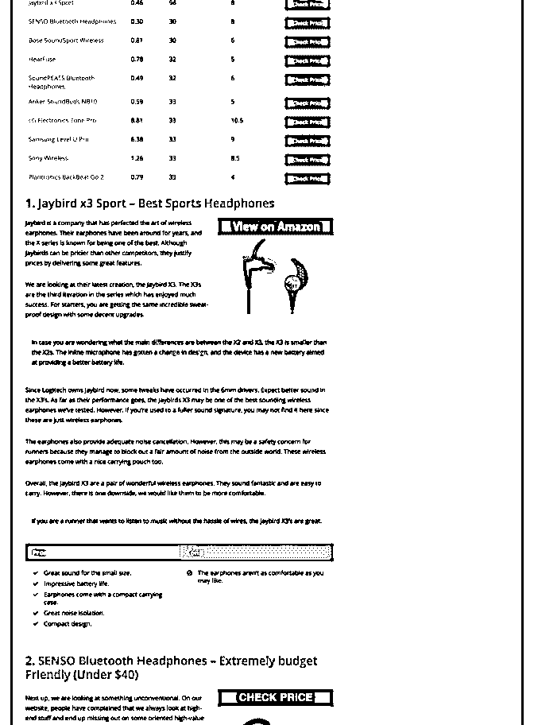
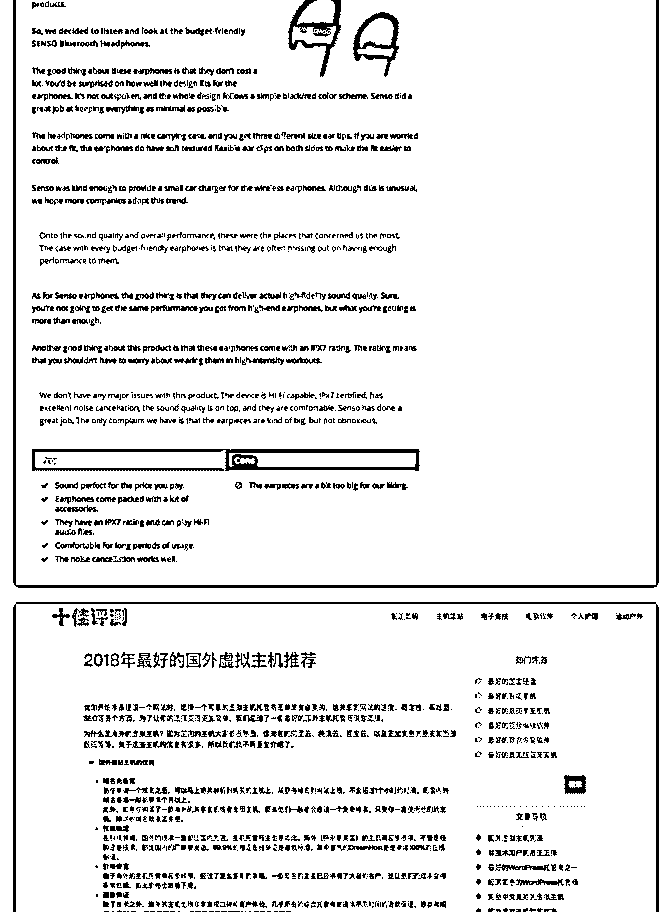
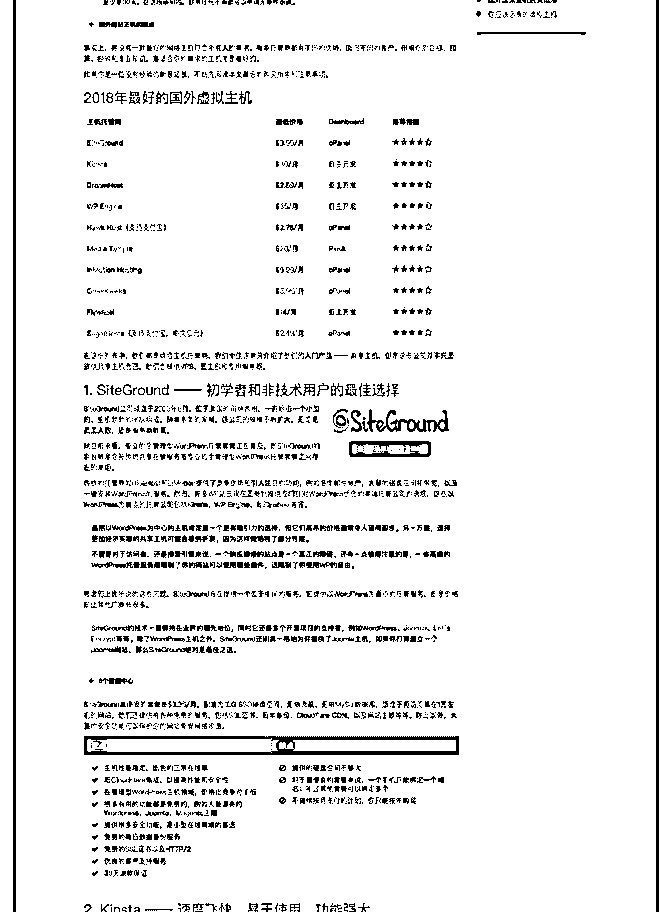
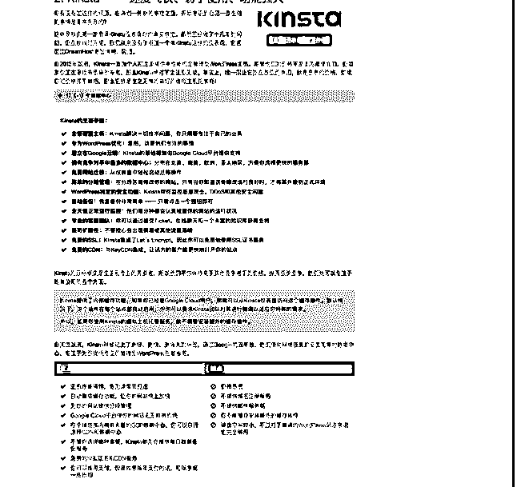

# 之前我发过一篇亚马

富布斯 : 之前我发过一篇亚马逊联盟 Niche 站的套利文章：

《》

作者 Luqman8 个月完成月入赚 4 万美元佣金。这个案例被国内 无数人拿来分析学习，但是看完之后又有多少人真正去模仿 和实践？

国内就有人模仿了 10Beasts.com（图 1），这个站地址是：

（图 2） （中文版本的十佳评测） 评测模式和外观基本和 10Beasts.com 一模一样。从阅读的舒适

度和内容来看，我认为做的还不错。

它推荐的自然是国外的主机、VPS、虚拟机、Wordpress 主 题、插件、SEO 工具之类的，这些评测推荐确实对于海外营 销、跨境电商都是高频率使用产品。而国外的这种类型的联 盟佣金也是发放最多的，尤其这种工具和服务类的产品，很 多都是 Lifetime commissions 的。熬个 1、2 年，好好做 SEO 把关 键词排名优化上去，就算达不到 10Beasts.com 的级别，基本也 能做不错的睡后收入。

不过作为建设一年多的站，按照我的个人要求，它的 SEO 做 的还真不怎么样。关键词排名、外链、权重都很欠缺，当然 跟一开始的关键词部署有很大的关系，就是定位跨领域太大 了，相关性也不够强，10Beasts.com 只定位在 IT 领域的. 国内 这位山寨的 10besty.com 则是个人护理、软件、运动户外全都 做在里面。如果是我做的话，我应该会深耕一个细分领域，

其它的可以另外再买个域名分开做，也就多一个微不足道的 域名成本而已。

这种站盈利方式不仅限于佣金，比如你现在去百度搜索：“最 佳国外主机”，前五名都是竞价广告，第六名自然排名就是它 的站。我们知道只要有竞价的关键词，你的关键词能自然排 名到第一页，就是有价值的。所以也可能会有顶部的广告商 会找你发软文、做硬广，为什么？因为竞价广告成本高啊， 随时都可能被竞争对手找人恶意点你广告提高 CPC 成本。

通过分析这个案例希望可以给大家起到抛转引玉作用。[[微 笑](https://www.fuyuzhe.com/amazon-affiliate-niche.html?mip)[]](https://www.fuyuzhe.com/amazon-affiliate-niche.html?mip)[国外亚马逊联盟](https://www.fuyuzhe.com/amazon-affiliate-niche.html?mip)[Niche](https://www.fuyuzhe.com/amazon-affiliate-niche.html?mip)[站月赚](https://www.fuyuzhe.com/amazon-affiliate-niche.html?mip)[4](https://www.fuyuzhe.com/amazon-affiliate-niche.html?mip)[万美元案例分享](https://www.fuyuzhe.com/amazon-affiliate-niche.html?mip)[(](https://www.fuyuzhe.com/amazon-affiliate-niche.html?mip)[一](https://www.fuyuzhe.com/amazon-affiliate-niche.html?mip)[)+|+](https://www.fuyuzhe.com/amazon-affiliate-niche.html?mip)[富裕](https://www.fuyuzhe.com/amazon-affiliate-niche.html?mip)  [者联盟国外网赚博](https://www.fuyuzhe.com/amazon-affiliate-niche.html?mip)[客十佳评测](https://www.10besty.com/)

2018-08-21(16 赞)

富布斯 :

关注公众号"懒人找资源"，星球资源一站式服务