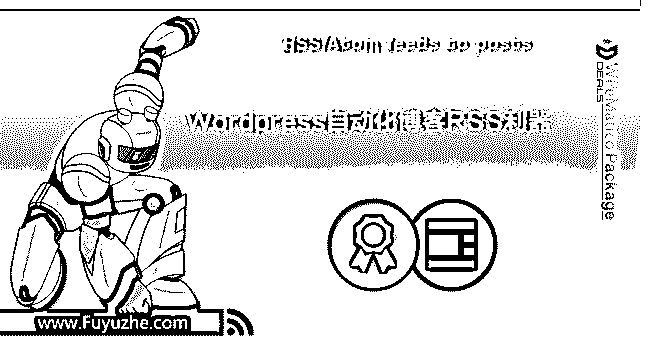
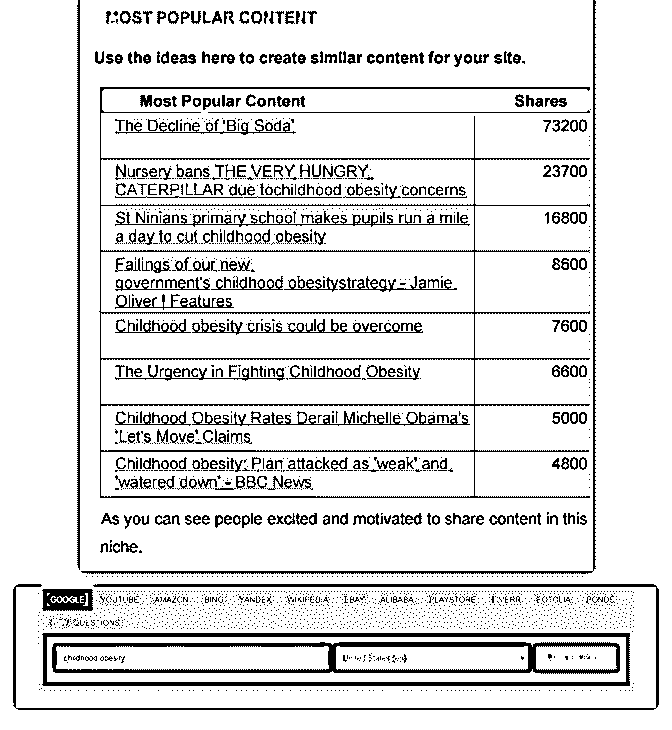
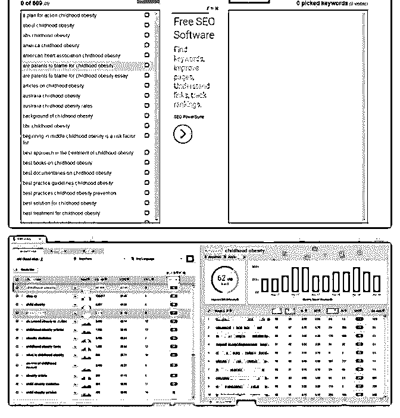
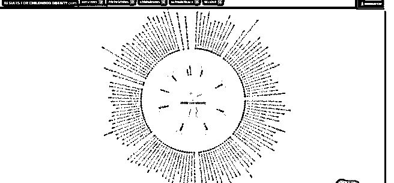
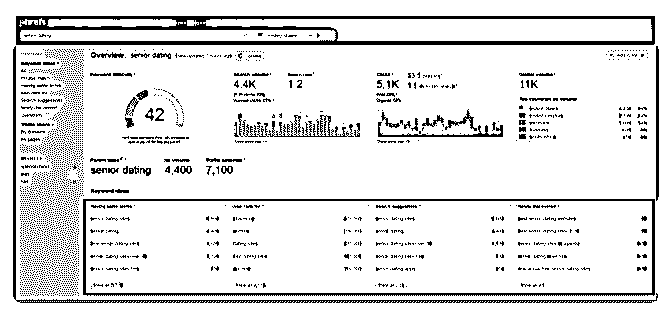
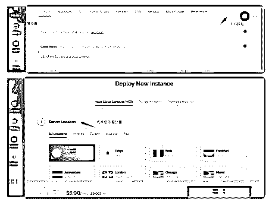
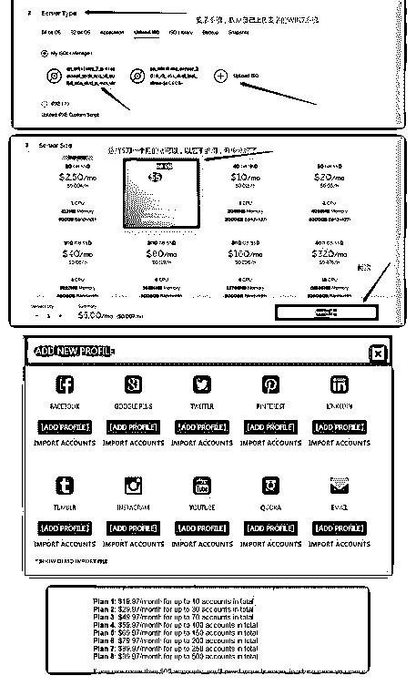
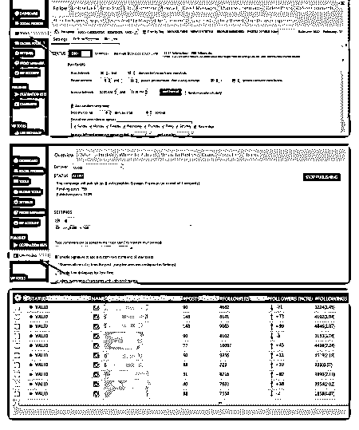

# 如今的搜索引擎算法

如今的搜索引擎算法基本可以完全杜绝和抛弃那些采集的垃

圾站了。但是道高一尺魔高一丈，自动化的爬虫技术仍然有

很多是使用场景。我一直都跟大家说，只要是能用机器去完

成的工作，就不要让人去重复做这件事情，对于每个人来说

每一天都不会重来，即使你现在是二十来岁的阳光少年，人

生也就剩 2 万多天而已。把不擅长的事情外包给别人做，把重 复的工作交给机器做，把更多时间留给自己可以输出更有价

值的事情上，你的工作和项目、生活才会发生质的变化。

上周咱们大航海计划众筹了一款 Wordpress 工具，使用了一 周，大概跟大家分享下使用场景和基本安装设置。WPeMatico 是一款基于 RSS 和 Atom 的 Wordpress 自动化采集插件，它的功 能非常强大，也非常的完善，几乎可以满足市面上大部分的 自动化采集需求。开头讲了现在采集站=垃圾站，但是采集和 自动化并非一无是处，它还是可以帮助我们做很多的事情。 所谓工欲善其事必先利其器，刀掌握在你手里，就看你怎么 用了，我大概列一下它的使用场景：

1，可以基于 RSS 和 Atom 成为一个聚合网站，在国外比较成功 的聚合网站有几个。

(这个是我自己瞎搞的） 2，适合做图片主题的站，自定义标题和 Alt 标签，SEO 不会太

差。

3，适合抓取国外的站，然后自动翻译为中文。WPeMatico Polyglot 支持抓取页面后翻译为 107 种语言，基于 Google Cloud Translation API，Google Translate 和 Yandex Translate API。

4，适合去抓取那些屏蔽百度、Google、移动端的内容做 SEO。（注意版权问题）

5，适合补充网站内容，非常规的精准匹配 Adsense 广告。

6，适合抓取一些有用的数据做分析。实时全网监控数据和通 知。[AllTop.com+-+Popular+News+Sites+for+Any+Topic](https://alltop.com/)  [Popurls+|+Mother+of+news+aggregators](http://popurls.com/)  [THEWEBLIST.net+|+what+people+are+clicking+on+today](https://theweblist.net/)  [Affiliate+Marketing](http://www.affow.com/)[海外营销干货导航](http://www.affow.com/)

2018-08-19(5 赞)

评论区：

Ashton : 富老大，请问现在还可以参加这个众筹吗 富布斯 : 已经团完了[皱眉]

关注公众号"懒人找资源"，星球资源一站式服务

# NicheLC

Booger : NicheLC 加勒比海盗号 一拿到 niche 报告后就开始找感兴趣的 niche,但是太多了，看到 头都晕，真不知道从何下手，也一直拖着写日记，后面看到 富哥提供的《如何评估 niche 是否有利可图》后，大概也有了 方向，然后找了几个自己感兴趣的 niche,翻译细看了下，然后 根据自己的方法开始分析自己选的 niche!嗯，我就说说我是怎 么选 niche 的吧！

怎样选 Niche：

1\. 这个领域的还有什么是不饱和的，我可以做什么？

*   Niche 是否可持续发展

3\. 我能比竞争对手做得更好吗？

第 1,2 个问题我们都可以从利基报告哪里找到或者可以再深入

去分析，这里就说下我是怎么看这些信息吧！比如我们先从

Market Size & Worth 中了解到这个利基的市场有多大，消费规 模有多少（市场大，消费金额高，也说明这个利基是有利

的，当然竞争也是相对的，我个人愿意找竞争有一些的，后 面再写要怎样从竞争对手中找的对方的缺点重而超越它们）

然后看 DEMOGRAPHICS

从中可以看到人群比例，比如男性，女性比例，年龄范围 等，我们就可以从相关的数据中去定位自己利基的人群等。

接着就看 NICHE GROWTH & MONTHLY SEARCHES

从中可以看到这个利基在一年的搜索情况和需求情况，根据 这个可以看出自己选的利基给你持续赚钱的几率和持久性。

最后看 Most Popular Content

我们从这些受欢迎的内容里知道每个需求对应的用户搜索量 有多少，也可以知道他们想要解决问题的痛点，然后可以确 定我们选择 offer 的方向，最重要的还是为我们以后搭建网站 的内容提供了内容方向，其实这里的信息不止这些，这要看 每个人的理解了，所以利基报告值得大家好好分析下，因为 这份报告给我们省了好多时间和麻烦，在这里真的要好好谢 谢富哥！

做到这里大概可以选择到你可以做的 niche 了，然后就可以去 寻找你的 offer 了。

第三个问题，我就根据下面的一起说吧。

Niche 调研和关键词选择 当我们选好 niche 后，我就要对它调研和关键词的选择了，其 实利基报告里也有关于 niche 的调研和关键词的选择，但我还 是觉得自己再去调研一次比较好，这样不但能加深你对这个 niche 的理解也可以为你接下来给网站增加内容创作时提供一 些思路！ 首先是关键词的选择，我选关键词，我会在报告里挑选几个 搜索量大和竞争容易的词为词根去找长尾关键词，报告里有 些长尾词也是可以直接拿来用的!我选择用商业类长尾词策 略，因为商业类的词排名时间短，它的转化率也会更高。 我的方法是：

（其实有很多工具，根据自己的情况用工具就行，知道怎么 找长尾词就好）

Ubersuggest.io

输入你的关键词得到更多的长尾关键词，保存下来：

然后再把这些长尾关键刷选一次，得到一些精准竞争小的长 尾关键词（这些关键词可以用来做内容也可以用来接下来的

关键词竞争度分析） 竞争度分析

（可以用富哥介绍的 jaxxy 工具）

判断竞争度的指标：1.看域名权重 2.看页面的优化（里面内容 的构成；关键词的使用等等）3.看外链的数量和质量（之后内 容建设我们可以从他们外链哪里提取相关内容）

受众分析 我们为什么要做受众分析，因为我们打算去创建的内容不一 定是用户想要的，然后我们一味的去模仿别人已经成功的内 容话题又显得却缺乏创意，而且成本也是非常高的，如果我 们通过信息收集然后去了解用户的真实想法，再根据这些信 息为方向去满足他们的需求，我们会更容易成功。

方法： Answerthepublic.com(用上面搜集的长尾关键词（也可以用跟 这个工具找长尾词）在这里跑一遍，里面有问题，对比等， 然后分析里面提供的信息，再把这些你认为有用的信息收集 记录下来)

去一些问答网站（quora.com），用长尾词跑，然后记录讨论 最多，赞或者顶的次数最多和想要答案最多的话题(这些话题 就是提高转化率最好的内容方向了) 记录好这些话题后，其他的就看你自己了（因为我也还在研 究中），写的不是很好，希望对大家有帮 助！[Free+keyword+research+tool+-+Find+longtail+and+rel...](https://www.keyword.io/)  [KWFinder+-+Keyword+research+and+analysis+tool](https://kwfinder.com/)

2018-08-06(11 赞)

评论区：

富布斯 : 思路很清晰，分析很到位.加精了，感谢分享思路

麦田 : 最后一张图是那个网站？好像是一个回答搜索引擎，但忘记网址了，

melody : answerthepublic.com 是这个

关注公众号"懒人找资源"，星球资源一站式服务

# #大航海计划#

清风落叶 : #大航海计划# #Niche LC# #圣玛利亚号# 刚开始拿到富大发的 Niche 报告，我也是一脸茫然，太多了， 有点无从下手。当我仔细看了报告，我发现其中有很多非常 值得参考也很有价值的地方。这份报告包含了 Niche 的介绍、 市场规模、目标人群、增长量、每月搜索量、相关论坛博 客、社交网络、affiliate 联盟等等各个方面。那么我们如何使 用 Niche 报告？

1\. 怎么获得竞争度低的 Niche 词？ 从报告中的 Excel 表筛选出 seo 难度容易、title 竞争低、月搜索 高的词。在某一些竞争激烈的 Niche 市场，通过 Excel 筛选出的 词太少，月搜索量也很少。那么我们可以把 PDF 中的列出的 Google，Amazon，yahoo，bing 的搜索 keyword，以及 SUB- NICHES TO EXPLORE、May also be interested 中的词，全部 弄到 ahrefs 中做 Keywords Explorer，用 ahrefs 的 Also rank for 和 Search suggestions 可以得到很多 keywords，根据月搜索量在 300-1000 筛选一下，得到一批 keywords。

1.  如何找 Affiliate Programs？ PDF 中已经列出了一些，其中 amazon 的佣金低，不太适合小 众的 niche。其他的 Affiliate Programs 要查一下产品评价，口碑 如何，google 一下“产品名+reviews”。如果 PDF 中的不合适， 那就自己搜索“niche 词+Affiliate Programs”找一下。

2.  筛选有商业价值的，能和自己的 Affiliate 匹配的 keywords。 如果网站是靠流量，靠挂谷歌广告赚钱的话，那么只要搜索 词能带来流量就行。但如果我们是做 Affiliate，那么不能带来 转化的搜索词是没有意义的，比如：我们做 dating，用户搜索 ourtime login，用户的意图很明显是要登陆 ourtime 这个 dating 网

站，很难给我们带来转化。还有一些词比较宽泛，不够精准 和我们 Affiliate 不匹配也要排除掉。比如：我们的 Affiliate 是面 向 50 岁及以上人群的 dating，那么 Over 50 dating 这个词比 dating 更匹配，难度也低一些。经过筛选，那么我们的核心 keywords 就出来了。

4\. 网站内容从哪里获得？ 在 Niche 报告的 PDF 中，老外列出了和 niche 相关的社交媒体内 容，以及博客、论坛、最受欢迎的 content 等等，这些都是很 好的参考来源。还有一个 MOST COMMON TOPICS AND QUESTIONS（最常见的主题和问题），这个非常棒，这些都 是用户最关心的，那么我们就围绕这些主题写内容。

以上就是我个人的一点点选 Niche 思路。

2018-08-05(8 赞)

评论区：

富布斯 : 已赞赏+精华 清风落叶 : [呲牙]谢谢富大。

steven : 批量运营社交账号

关注公众号"懒人找资源"，星球资源一站式服务

批量运营社交账号大

大家好，我是王圣志，来自青岛，外贸圈的小白一枚，今天给大家分享我刚刚接触到的，批

量运营社交账号。我会的很少，大家一起交流进步。

社交账号的作用不言而喻，所以我比较直接，没有太多的话。批量运行国外的社交账号，

需要用到的东西包括 服务器，代理（可以简单的理解为 IP 地址）和 我们今天要说到的运行 账号的软件 MP3，当然也包括你已经注册好的账号。 1.社交平台账号：可以注册，也可以购买。

2.服务器：因为我们需要软件全天 24 小时都在运行，在本地电脑上运行不是很现实，所以服 务器是最理想的选择。免费的服务器有谷歌和亚马逊的，不建议用。因为后期账号增多，数

据增大时，服务器明显就不够用，建议使用付费的服务器，我用的是 Vultr,按时收费的。自 定义安装的 WIN7 系统。

服务器操作流程如下：

第一步：购买 VPS 服务器 VPS 服务器需要选择国外的，首选国际知名的 vultr，速度不错、稳定且性价比高，按小时计 费，能够随时开通和删除服务器，新服务器即是新 ip。 vultr 注册地址：（这是我的 affiliate 链接，可以赚取点佣金[偷笑]） 注册并邮件激活账号，充值后即可购买服务器。充值方式是支付宝或 paypal，使用 paypal 有银 行卡（包括信用卡）即可。

开通服务器按照文章底部的图 1-4 步骤操作就可以了，安装好后，设置好系统的用户名和密 码。

3.代理：平常运行社交账号，同一社交平台大家一般只有 1-3 个账号，IP 地址不会成为问题。 但是当大批量同时运行账号的时候，IP 就会成为问题，不可能 500 个或者是 2000 个账号同时 运行时都用同一个 IP，封号只是秒秒钟的事。所以合理的给社交账号安排运行所需要的 IP 地 址是很重要的一件事。

代理分为独立 IP（private proxy）和共享 IP （share proxy），从字面意思就能看出来，我们需 要的是独立 IP。因为共享 IP，不知道有多少人在用，也不知道他们用来做什么，所以为了保 证 账号的安全，一般都是购买独立 IP。 一般独立 IP 比共享 IP 贵，现在大部分出售代理 IP 的网站，独立 IP 的价格一般是 5 个代理每月 10 刀左右的样子。这个大家可以搜索下，有很多这样的网站。一个账号用几个代理比较合适？ 安全起见，当然是一对一，我的是 1 个代理运行同一社交平台的 2 个账号. 延伸理解：如果有 10 个社交平台，每天社交平台有 2 个账号，那一个代理就可以运行 20 个账 号。

独立 IP 的格式是这样的：ip:port:proxyusername:proxypassword ip 和 port，在购买独立 IP 时，网站会直接给出。 proxyusername 和 proxypassword，是你在购买独立 ip 时，在所购买的网站上，自己设置就可 以。

4.MP3 这个软件相信有的朋友应该知道或者在用,这个软件非常火，火到什么程度。 在 BHW 论坛上，16 年的时候，Cryogenesis 这个人通过运行 MP3，跑的是 INS 账号，7 个月内从 OGads 这家联盟网站赚到 11,000 多美元。 这点钱对做联盟的来说，不是很高，但是性价比高，也有点符合 LC。可以想一想，前期设置 好一切所需要的东西，当有一定的粉丝后，后面每天都是躺赚。Cryogenesis 给出的数据是每 天可以赚到到 50 刀。当然这是 16 年的时候，现在竞争太多了，具体是什么样的数据，我也没 有做过，不敢乱发言。

这是他的帖子链接，大家有兴趣可以去看看。

。

很多人也是从这个帖子中知道的 MP3。很可惜的是因为 MP3 的知名度太高了，被 FACEBOOK 给封杀了，你在市面上找不到可以注册 MP3 的网站，所以相当于转入半个地下 了。注册的话，只能通过已经在用 MP3 的人来介绍。 很冷的是，虽然你介绍人来注册 MP3，但是确没有任何的佣金。这就是为什么很多人不想告 诉别人，也不原分享的原因。

MP3 可以支持 10 家社交，包括 FACEBOOK,GOOGLE

PLUS,TWITTER,PINTEREST,LINKEDIN,TUMBLR,INSTAGRAM,YOUTUBE,QUORA,EMAIL.

图五

完全可以自动化，个性化的设置来运行账号.价格也不贵，10 个账号每月 19.97 刀，账号越多 越便宜。

下面是它的费用情况.图六 自动化表现在：通过软件，你设置好社交账号所需要的参数时，完全可以不用管它，MP3 会 根据你设置的参数，时时刻刻都在运行账号。只你要合理设置参数，账号一般不会出现封号. 以 INS 为例，通过 MP3，你可以 Follow，Follow Back,Unfollow,like,Comment,Contact,Direct Messages 等等。设置好后，剩下的让软件来运行就可以了.图七 更重要的是 MP3 还自带 BROWSE,通过 BROWSE 打开社交账号，完全没有封号的危险。因为 BROWSE 打开社交账号时，就是根据这个账号的代理 IP 进行的操作。 你可以通过 MP3 找到和你 niche 相关的大账号，通过 follow，like,comment 他们的粉丝，来获取 到最最精准的粉丝。另一方面软件的个性化设置则体现在各种参数的设置上。 MP3 也可以自动化的发布已经设置好的帖子图片到不同的账号。图八 图九是我接触两个月的效果，做的一般，大家一起交流进步。

MP3[软件最新下载链接： 密码：](https://pan.baidu.com/s/1IyD4Zf6pQfy5U5sB1R5eBg) [4kk3](https://pan.baidu.com/s/1IyD4Zf6pQfy5U5sB1R5eBg)[SSD+VPS+Servers,+Cloud+Servers+and+Cloud+Hosting+b... Problem+loading+page](https://pan.baidu.com/s/1IyD4Zf6pQfy5U5sB1R5eBg)[百度网](https://pan.baidu.com/s/1IyD4Zf6pQfy5U5sB1R5eBg)  [盘](https://pan.baidu.com/s/1IyD4Zf6pQfy5U5sB1R5eBg)[+](https://pan.baidu.com/s/1IyD4Zf6pQfy5U5sB1R5eBg)[请输入提取密码](https://pan.baidu.com/s/1IyD4Zf6pQfy5U5sB1R5eBg)

2018-07-24(39 赞)

评论区：

富布斯 : 很有价值，感谢分享 steven : 谢谢富哥[呲牙]

Joke : 666 啊

Joke : 留个联系方式有吗？[捂脸]

housei. fa* : 希望有机会可以交流一下[强][强]

关注公众号"懒人找资源"，星球资源一站式服务