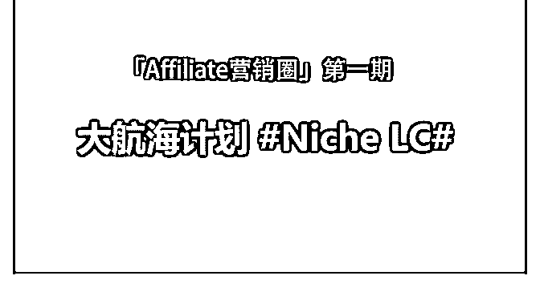

# 应大家的需求，准备

富布斯 : 应大家的需求，准备开一期针对 Niche LC 航海计划. 一起来玩个实战项目，毕竟一个人做会枯燥无味、也无法自 律。而一群志同道合的朋友则可以共同出谋划策，共同监 督。俗话说“三个臭皮匠，顶个诸葛亮”，一起体验撸美金学 习之旅，现征集船员报名.在报名前务必先看三遍以下航海计 划的要求再报名！

什么是 LC（lifetime commissions）？ 你推荐的用户，为广告商带来的初次消费后、未来的所有续

费、以及其它产品的关联销售都能获得佣金收入，而不仅仅

是一次性收入。即使用户更换了电脑购买产品或者服务时，

你可以再次获得佣金。

既然是玩 lifetime commissions，打法多样，涉及到的内容和工 具比较多，比如： 建站：购买主机、域名、KeywordTools、市场调研工具、WP 插件等等 推广：社交平台、分类目录、SEO、软文、邮件、电子书、 自动化.......等等

工欲善其事必先利其器，好的工具可以事半功倍。这个过程 中可能会涉及到一部分的收费工具.需要参与的船员做好预算 准备（众筹的话预算费用应该也不会太多），比如：

购买主机、好用的关键词调研工具、WP 插件、自动化推广工 具、写软文......等等！

当然，主机以及付费工具的购买，可以由船员相互推荐共同

商议决定再众筹，众筹费用会公开透明！以减轻船员的负 担。

需要掌握的基本技能 ：

1，主机和域名解析的基本概念和常识 2，Wordpress 建站、模板安装、插件的基本使用 3，有一定的英文基础或会利用工具翻译解决问题

4，具备利用 Google 寻找和解决问题的能力

5，了解一些基本的 Google SEO 常识

6，会搭梯子上网

当然技多不压身，但以上是我个人认为比较基础的东西。如 果不是很熟悉但确实很感兴趣，且执行力强，也可以参与进 来和其他船员边学边做。

航海计划以微信群组沟通为主，每艘船 15 人，配备船长一 名，视实际报名情况而定，最多开三艘船。

加入“Niche LC 航海计划”船员要求： 1，虽然任务不会分配的太紧，对于有些经验的人来说应该很

好完成，但还是建议自己每天有充裕的时间（至少两个小

时），没时间且没有经验不建议报名了。

2，有主动贡献价值的精神，积极参与讨论，出谋划策，只观 望不发言的不要报名。

3，每次完成分配任务后需要更新进度日志到星球，让没时间 参加的圈友也可以学习。

4，根据过往的经验和圈友的建议，会象征性收取一些报名费

和保证金.不会多，报名费主要用于对船长的日常工作所耗费 的时间精力付出的肯定。保证金在完成既定目标后会退还， 主要是督促船员的执行力，避免船员中途放弃。具体多少合 适待大家入群商榷后再定。

5，认同“Niche LC 航海计划“的实操学习价值理念，服从任务 安排。

招募“Niche LC 航海计划”船长： 计划招募三名有责任感的热心船长，有实际的英文建站、推

广更佳，如果没有也可以参与竞选，没有经验也可以，权当

一次学习之旅，在这过程中我也会全程参与并配合写一些教

程、资源、建议和分配任务。

船长主要愿意为大家领队，组织协调航行中的任务计划、策 略以及数据收集等。船长除了获得本圈永久会员期限外，报 名费也是对船长辛勤付出的肯定。

具体计划：

7 月 10 日-7 月 12 日，确定 3 位船长人选。

7 月 13 日-7 月 14 日，确定每艘船 10-15 名船员

7 月 16 日，启航

请有意向参与船长竞选的圈友，新开主题写下自我介绍，并 加上标签 ，以点赞数确认船长人选。

2018-07-10(21 赞)

评论区：

老何为人民服务 : 期待开船

秋生 : 会报名，不过如果人太多可以退出，因为富神说的那些基础知识不懂，也很缺乏实操经验，但是会全程关注此次活

动

麦田 : 怎么参加这个计划呢

富布斯 : 选出船长后，在你想加入的船长的帖子下面回复加入.让船长拉你入群

{ 翁.傳 } : 加入，期待开船

{ 翁.傳 } : 加入，期待开船

秋生 : 加入

AAA 恩亮 15886* : 加入 期待

关注公众号"懒人找资源"，星球资源一站式服务