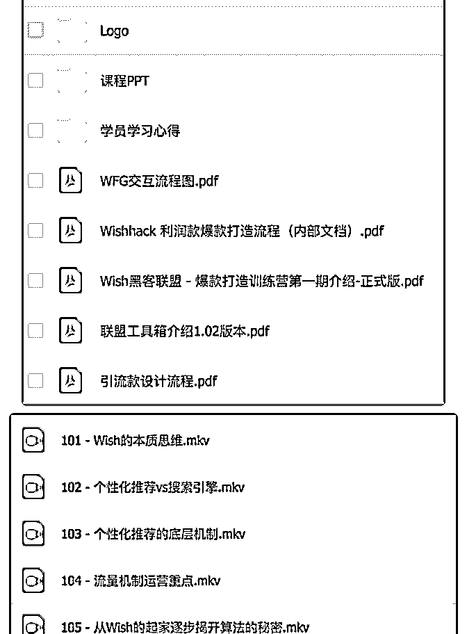
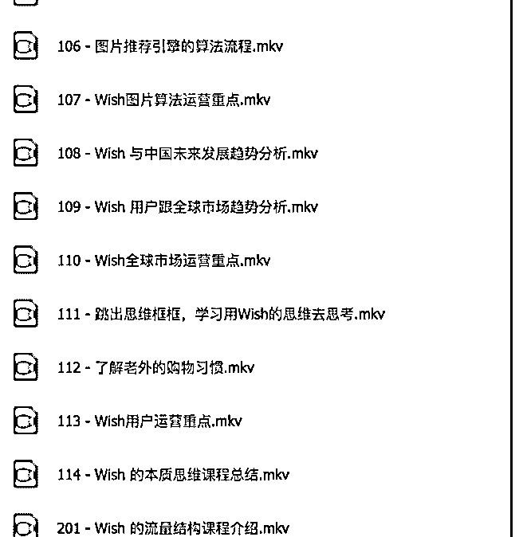

# 分享个内部的付费资

James.N.Re* : 分享个内部的付费资源：Wish 实战技巧：从 0 到

1 万笔订单的操作流程，内容目录如下：

1，联盟介绍文档 引流款设计流程

联盟工具箱介绍

Wish 黑客联盟 - 爆款打造训练营第一期介绍 正式版 Wishhack 利润款爆款打造流程（内部文档） WFG 交互流程图

2，理论课程视频 Wish 的本质思维-课程地图 101 - Wish 的本质思维

102 - 个性化推荐 vs 搜索引擎

103 - 个性化推荐的底层机制

104 - 流量机制运营重点

105 - 从 Wish 的起家逐步揭开算法的秘密

106 - 图片推荐引擎的算法流程

107 - Wish 图片算法运营重点

108 - Wish 与中国未来发展趋势分析

109 - Wish 用户跟全球市场趋势分析

110 - Wish 全球市场运营重点

111 - 跳出思维框框，学习用 Wish 的思维去思考

112 - 了解老外的购物习惯

113 - Wish 用户运营重点

114 - Wish 的本质思维课程总结

201 - Wish 的流量结构课程介绍

202 - 机器学习算法原理

203 - 机器学习算法运营重点

204 - Wish 怎么获取新用户的初始数据

205 - Wish 怎么解决老用户的深度学习数据

206 - 吸引买家眼球的运营手段

207 - Wish 新用户的行为数据优化

208 - Wish 老用户的行为数据优化

209 - 选款引爆运营重点

301 - Wish 讨好的是回头客课程地图

401 - 个性化推荐算法介绍课程地图

402 - 个性化推荐算法介绍

403 - 商品的 6 大核心纬度

404 - 商品属性权重运营核心重点

410 - 新品获取流量的运营重点

501 - Wish 爆款打造公式课程地图

503 - 提高 impression 的核心玩法

504 - 提高点击率的核心优化技巧

3，打造爆款的秘密 Wish 黑客订单倍增模型介绍课程

黑客联盟打造 1 万笔订单的社交流量玩法

引爆流量 Wish 黑客工具黑科技下载地址

[Wish](https://bbs.fuyuzhe.com/affiliate/122.html)[实战技巧：从](https://bbs.fuyuzhe.com/affiliate/122.html)[0](https://bbs.fuyuzhe.com/affiliate/122.html)[到](https://bbs.fuyuzhe.com/affiliate/122.html)[1](https://bbs.fuyuzhe.com/affiliate/122.html)[万笔订单的操作流程](https://bbs.fuyuzhe.com/affiliate/122.html)[+-+Affiliate](https://bbs.fuyuzhe.com/affiliate/122.html)[营销圈](https://bbs.fuyuzhe.com/affiliate/122.html)

2018-07-06(4 赞)

关注公众号"懒人找资源"，星球资源一站式服务