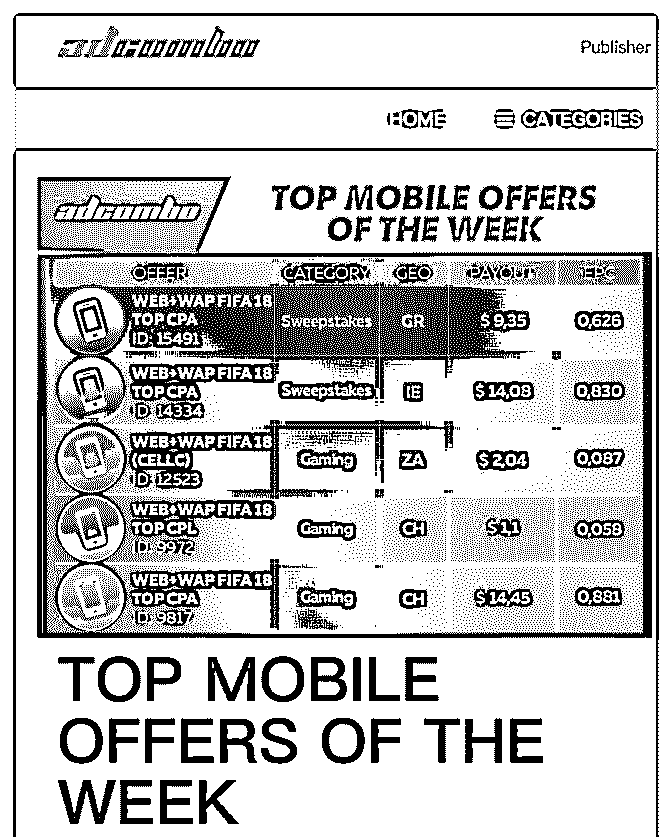
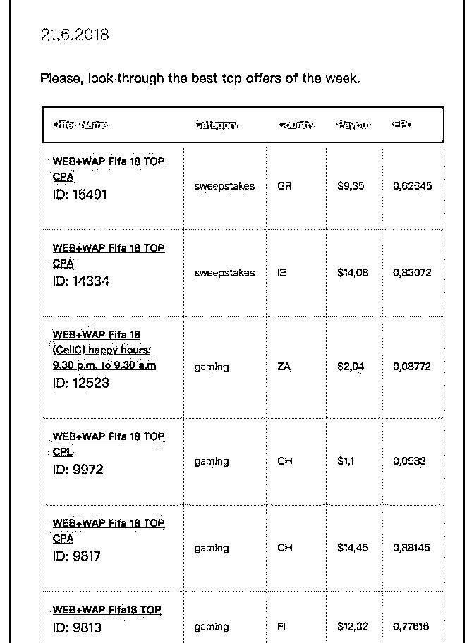
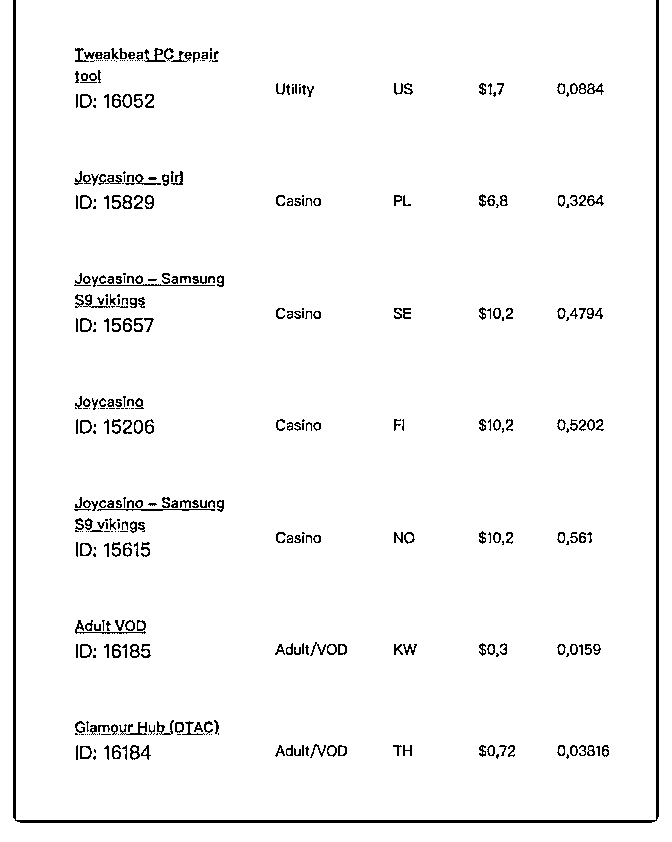
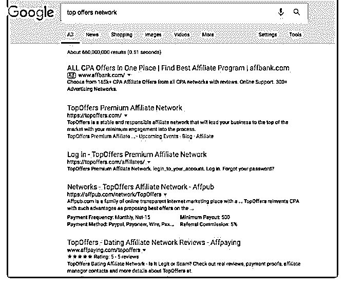

# 写一个思路.前段 A

富布斯 : 写一个思路.前段 Adcombo 在我博客上投了首页 banner 广告.看了下它们的官方 blog.

它们每周都会在 blog 上更新最近一周的 Top Mobile offers. 比如 最近全球都在看世界杯，赌 Bo 类的 Offers 基本占据 50%，这些 数据乍一看.可能也找不到什么感觉.

但是,数据量大，有对比分析就不同了。我们说测 offer 的另一 种方法可以跨联盟测同一个 offer 进行数据对比，刚好最近我 发了几个烧录 Rss，聚合网站,Huginn 数据采集的技术应用场 景，这时候可以派上用场了. 将你所有感兴趣的联盟 offers， 用 Huginn 聚合在一个页面.你就可以随时第一时间对比分析这 些 Offers 的 geo、payour、epc 之类数据指标.

当然 Huginn 远不止这么简单,它可以针对推特、ins 等等社交平 台的关键词监控，你可以把你专注的 verical 的关键词都聚合在 另一个页面. 这样的话,你每天就像看报表一样，打开一个网页 就可以一览全部你所关注的最近 Top offers 数据和人们讨论该 offers 相关的话题，你自然对于比别人更了解 verical、数据更 周全，当然会找到一个更好盈利的 Angle。

另一个小技巧，你可以在 Google 上搜索：top offers network， 你会找到很多 Offers 数据源网页进行采集.

你可以用自己熟悉的工具进行数据聚合，我推荐的是这种： [AdCombo](https://adcombo.com/publisher/?utm_source=fuyuzhe&utm_medium=banner&utm_campaign=900%252A150) [如何免费定制个人全自动化的](https://mp.weixin.qq.com/s/oFcWP__XP_CyJu58w253Bw)[“](https://mp.weixin.qq.com/s/oFcWP__XP_CyJu58w253Bw)[最勤劳员工](https://mp.weixin.qq.com/s/oFcWP__XP_CyJu58w253Bw)[”](https://mp.weixin.qq.com/s/oFcWP__XP_CyJu58w253Bw)[？](https://mp.weixin.qq.com/s/oFcWP__XP_CyJu58w253Bw) 2018-06-26(9 赞)

评论区：

俊 : 分享的很棒

Wolf(富布斯助理* : 6 月份基本是菠菜 offer 转换最好

麦田 : 找了几遍，没有看到这个 RSS 聚合插件，富大能发给我一下？

富布斯 : 搜索了吗，第三个就是

关注公众号"懒人找资源"，星球资源一站式服务