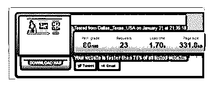

# 【提升 LP 加载速度

富布斯 : 【提升 LP 加载速度的建议】：一个 Lander 如何从加载

2 秒时间优化到 34 毫秒加载完成？

这并不是排版错误。研究表明，将你的 LP 的加载时间降到 100 毫秒内，放到用户面前可以大幅提升 LP 的点击率

从我刚开始使用 POF，我一直用本教程的老 Landing pages。 它实际上是基于一个 Stackman 早些时候提供的 landing pages 之

一：以及我在 landing pages 的最初设计我犯的错误。

以下是 landing page 的第一个版本，按照 Pindom 的说法，这是 美国的加载速度：

1.70 秒，还是很不错的，对吧？ 其实很糟糕 电子书下载：[`bbs.fuyuzhe.com/affiliate/91.html`](https://bbs.fuyuzhe.com/affiliate/91.html)

2018-06-05(2 赞)

关注公众号"懒人找资源"，星球资源一站式服务