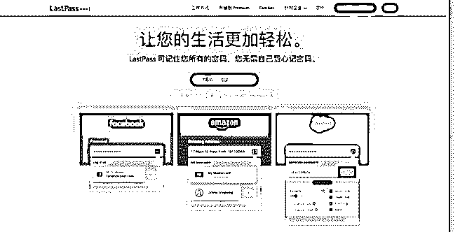

# 再推荐一个好用的软

富布斯 : 再推荐一个好用的软件，已经订阅过《Affiliate Mastery 完美中文视频教程》的朋友，都知道课程里推荐了上 百款高效工具提升你的工作效率。其中一款就是我极力推荐 并一直使用的：Lasspass。我说下它的三大功能，看看是否可 以说服你使用：

第一个功能：

Lasspasss 帮你记住所有的网站账号密码.就是说，如果你在一 百个网站上注册了账户，你只需要记住 Lasspass 密码，就可以 登陆这一百个网站的账户。每次在你登录前，Lasspass 都会在 登录框上提示你：这个网站是否有存储记录。

我们知道，有很多网站其实都有安全漏洞，被别人用软件爆 破，例如 Discuz 论坛和 WP，如果没有设置验证码，很容易就 被别人通过软件穷举破解，Lasspass 可以为你生成高强度的密 码，即使某些网站出现安全问题，别人也永远破解不了 Lasspass 生成的密码，因为在数据库里，你看到的肯定是加密 过后的 md5，而你不用去记住这些密码。

它是安全的：Lasspass 通过 PBKDF2 SHA-256 和加盐哈希方法 实施 AES-256 位加密，照理说这种加密是永远破解不了的。 照官方的说法，存储的密码通过加密后存储在数据库里，即 使是 Lasspass 也无法获取你的密码.因为密码并没有直接发送到 它的服务器上。

第二个功能 就是类似于《有道笔记》，这个国产的网易软件大家都熟 知，Lasspass 同样也有安全笔记的功能，而且很好用，因为它 本身就集成在插件里了。

第三个功能 表单填写。对，这个功能简直是 Affiliate 的福音啊。天天各种 注册，申请联盟，老外就是喜欢搞一堆表单让你填，有了 Lasspass，你可以节省一吨的时间做更有意义的事情

我建议你试用 Chrome 浏览器，Lasspass 已经开发了 Chorme 插 件。我一直在用，很省心。

当然，好东西肯定是收费的，但是免费的账户基本够用 了，Lasspass 收费本身也很良心，2 美元/月而已了。

其它的自己看官网介绍吧：

[LastPass+-+Welcome+to+LastPass](https://lastpass.com/f?62272028)

2018-06-03(10 赞)

评论区：

ZaichengQi : 一直在用，配合 yubico key 更安全

关注公众号"懒人找资源"，星球资源一站式服务