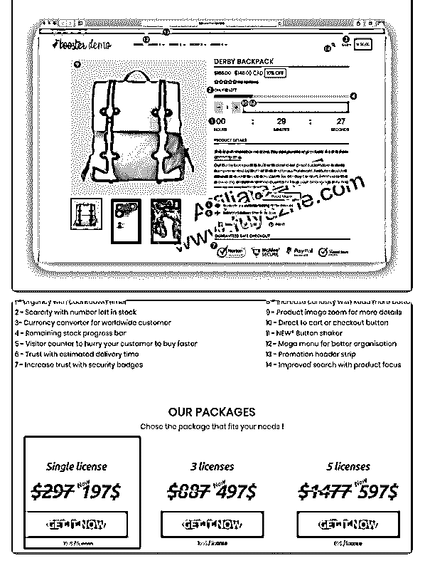
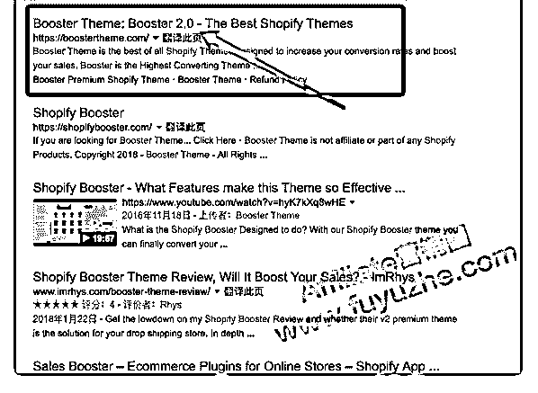

# 价值 197 美元的 S

富布斯 : 价值 197 美元的 Shopify 主题:Shopify Booster Theme Version 2.0 最新版本.

应圈友的建议，分享一些 Shopify 的资源。 我们知道 shopify 的开支大部分来自于购买 Theme 主题和各种插

件，一款主题高达 200 刀，相当于人民币就是 1278 人民币了。

对于一个还没有实现盈利的新手来说，负担确实有点大，土

豪可以略过。

如果你有开始玩 Shopify，可以看一下这款 Shopify Booster Theme 是否适合你的产品 Style，对比了下官网是最新版本的， 觉得合适可以拿去练练手，先找找感觉。

[下载地址：](https://bbs.fuyuzhe.com/affiliate/82.html)[价值](https://bbs.fuyuzhe.com/affiliate/82.html)[197](https://bbs.fuyuzhe.com/affiliate/82.html)[美元的](https://bbs.fuyuzhe.com/affiliate/82.html)[Shopify](https://bbs.fuyuzhe.com/affiliate/82.html)[主](https://bbs.fuyuzhe.com/affiliate/82.html)  [题](https://bbs.fuyuzhe.com/affiliate/82.html)[:Shopify+Booster+Theme+Version+2....](https://bbs.fuyuzhe.com/affiliate/82.html) 2018-05-28(8 赞)

评论区：

阿和 : 感谢富神分享 宋伟 : 感谢富大分享 miller-朱凡 1* : 十分感谢

关注公众号"懒人找资源"，星球资源一站式服务