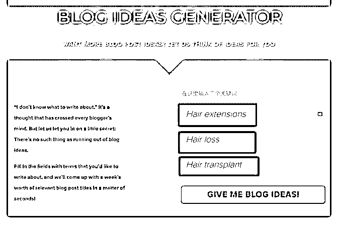
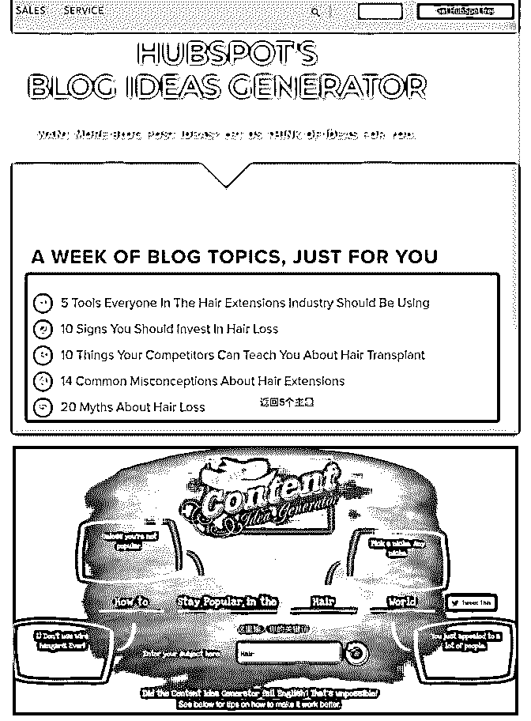

# 推荐两个比较实用的

富布斯 : 推荐两个比较实用的工具，我几年前就一直在自用， 希望对你有帮助。

在做 Niche 网站或者做 Landing Page 的时候，我觉得它都能给我 们这些半吊子英语水平的人很大的帮助。如果结合两个工具 一起使用，效果更佳。我简单介绍下它们的基本功能：

第一个是：Hubspot 它网站有很多业务软件.比如 CRM 营销、社交营销自动化的软 件.在国外社交和 CRM 是最大的免费流量主战场。但是我没有 用过，我使用它最频繁的一个小功能就是：

输入三个关键词，给你返回 5 个主题 这是一个很好的功能。比如我输入的 Niche 是：头发相关的三

个关键词

图片 1 最后返回来的结果是： 图片 2

头发是一个很小众的需求，文章写多了，你会发现没有更多 的主题内容要讲，这个工具会给你生成 5 个不同的主题给你参 考，这样你起笔的灵感很快就来了。

官网地址：

第二个工具：Portent Portent 可以在线为你生成标题的工具。我也有博客和公众 号，说实话想一个好的标题，又要兼顾 SEO 实在太难了，我 见国内还有专门有标题培训[捂脸]。

例如：输入 Hair，你会得到一个完整的标题建议.基本一个好 的英文标题就出来了

图 3 官网地址：

聊完工具自用，再说下机会。

这是一个不错的模式，完全可以搬运这个模式回国内。因为 国内的自媒体人实在太多了，简直可以秒杀欧美十国，嘿 嘿，夸张了一点。但是国内这种需求绝对是存在的。

[门槛是需要一些技术和算法、大数据的东 西。](https://www.portent.com/tools/title-maker)[HubSpot's+Blog+Ideas+Generator Content+Idea+Generator+-](https://www.portent.com/tools/title-maker)

[+Portent](https://www.portent.com/tools/title-maker)

2018-05-27(11 赞)

评论区：

富布斯 : 目前国内没有类似的网站，现在国内各种自媒体平台，公众号那么多，细想一下，做一个支持中文的满足类似需 求的网站，不用说也是可以获得可观的流量。有了流量，还愁变现吗？功能性网站除了更新优化一些细节、体验问题外，

基本是躺赚的。 比如：国内的爱站，就是给站在查网站信息，比如 ip138，就查 IP 和域名，流量大的惊人 宋伟 : 这个好啊，事半功倍

关注公众号"懒人找资源"，星球资源一站式服务