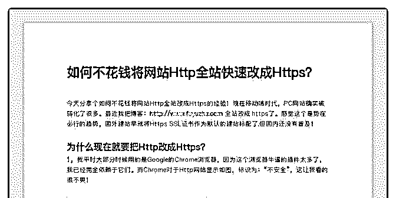
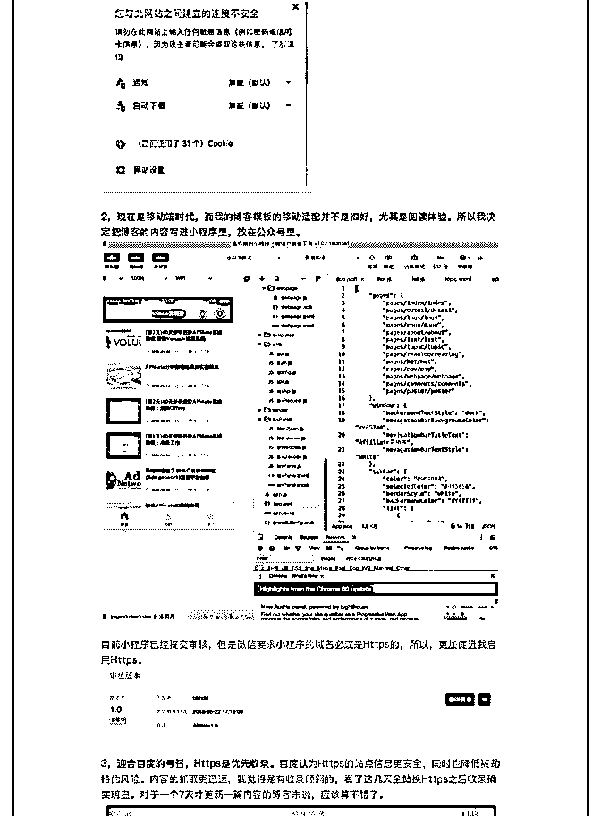
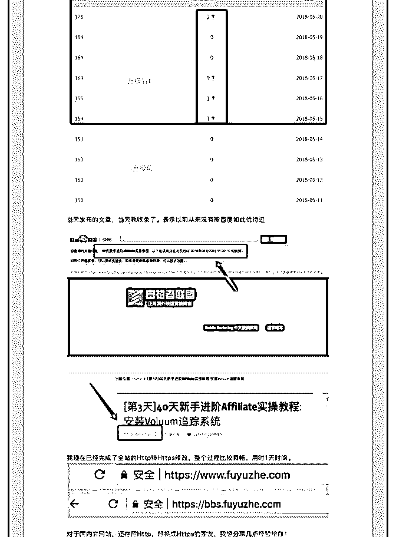
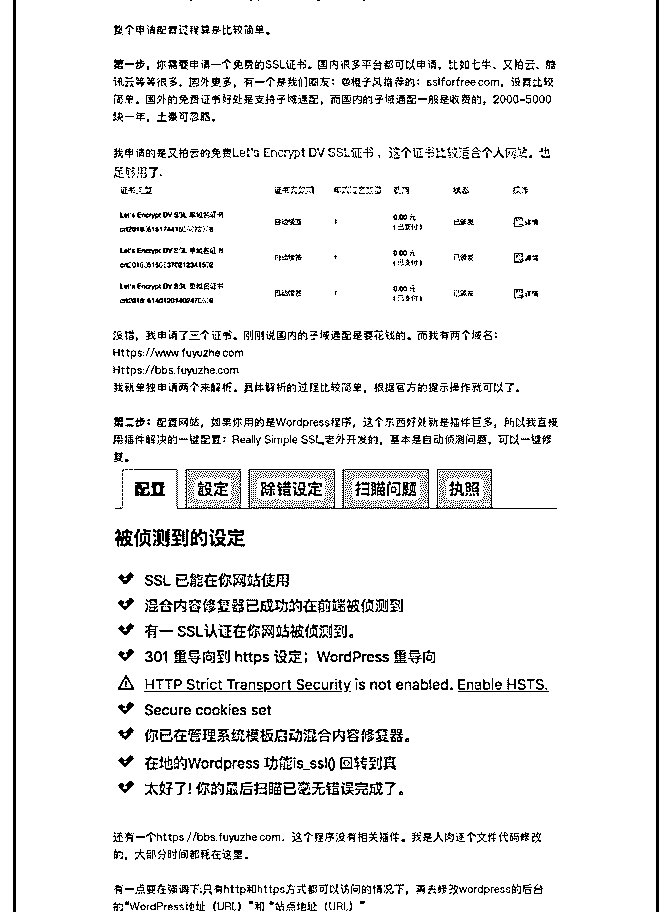
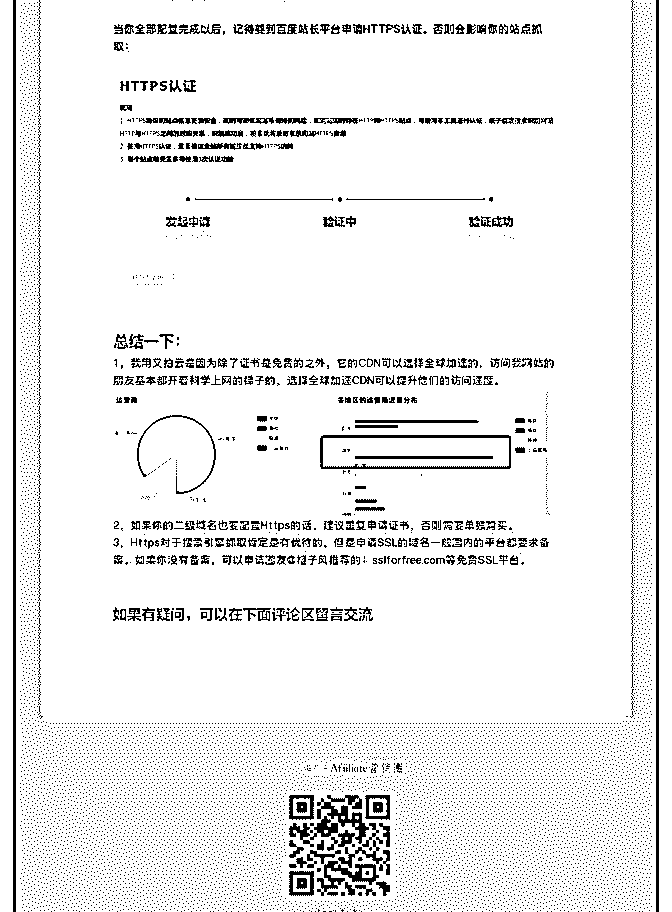
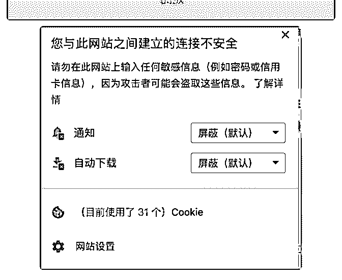
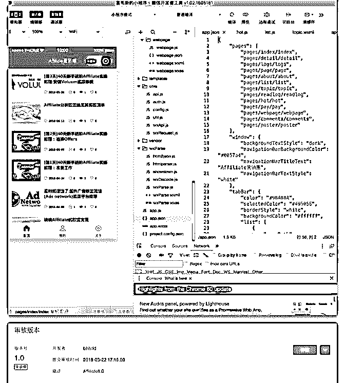
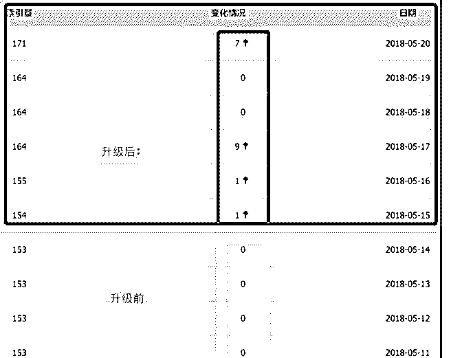
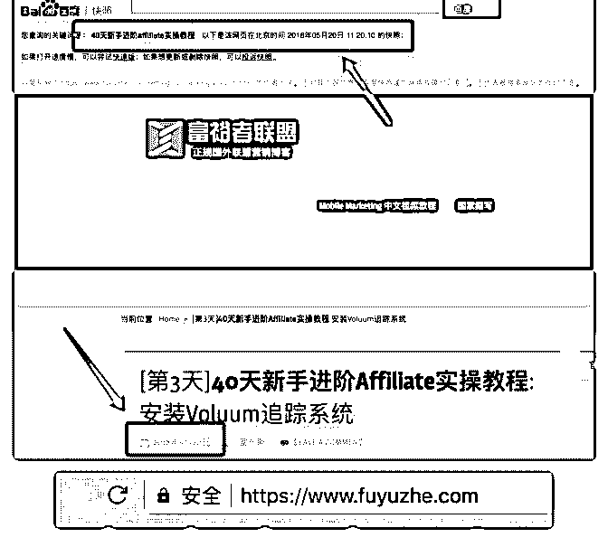
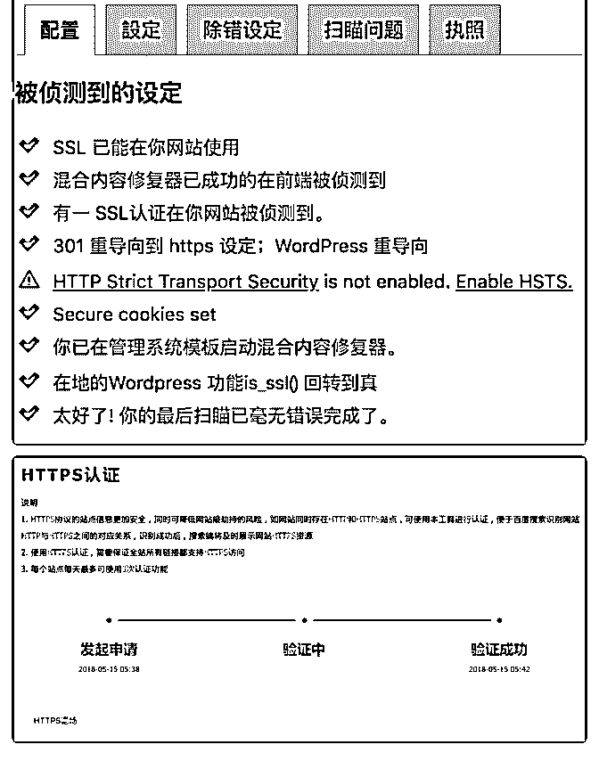

# 今天分享个如何不花

富布斯 : 今天分享个如何不花钱将网站 Http 全站改成 Https 的经 验！现在移动端时代，PC 网站确实被弱化了很多。最近我把 博客：

http:// w w w . f u y u z h e . c o m

全站改成:https 了。

全文也可以在这里看：

感觉这个逐渐是势在必行的趋势，国外建站早就将 Https SSL 证书作为默认的建站标配了.但国内还没有普及！主要是价格 比较高，这里刚好有转 HTTPS 需求的朋友可以参考下免费的 方案

本文图片比较多，你可以只看【图 1】用石墨来生成图文并茂 方便阅读。

为什么现在就要把 Http 改成 Https？ 1，我平时大部分时候用的是 Google 的 Chrome 浏览器，因为这 个浏览器牛逼的插件太多了，我已经完全依赖于它们。而 Chrome 对于 Http 网站显示如图，标识为：“不安全”，这让我看 的很不爽！

图 2 2，现在是移动端时代，而我的博客模板的移动适配并不是很

好，尤其是阅读体验。所以我决定把博客的内容写进小程序

里，放在公众号里。

图 3

目前小程序已经提交审核，但是微信要求小程序的域名必须 是 Https 的，所以，更加促进我启用 Https。

图 4

3，迎合百度的号召，Https 是优先收录。百度认为 Https 的站点 信息更安全，同时也降低被劫持的风险。内容的抓取更迅 速，我觉得是有收录倾斜的，看了这几天全站换 Https 之后收 录确实明显。对于一个 7 天才更新一篇内容的博客来说，应该 算不错了。

图 5 当天发布的文章，当天就收录了。表示以前从来没有被百度

如此优待过

图 6 我现在已经完成了全站的 Http 转 Https 修改，整个过程比较顺

畅，用时 1 天时间。

图 7 对于国内有网站，还在用 Http，想换成 Https 的圈友，我想分

享几点经验给你：

整个申请配置过程算是比较简单。 第一步，你需要申请一个免费的 SSL 证书。国内很多平台都可

以申请，比如七牛、又拍云、腾讯云等等很多，国外更多，

有一个是我们圈友：@橙子风推荐的：sslforfree.com，设置比 较简单。国外的免费证书好处是支持子域通配，而国内的子 域通配一般是收费的，2000-5000 块一年，土豪可忽略。

我申请的是又拍云的免费 Let's Encrypt DV SSL 证书 ，这个证 书比较适合个人网站。也足够用了.

没错，我申请了三个证书。刚刚说国内的子域通配是要花钱 的。而我有两个域名：

[Https://www.fuyuzhe.co](http://www.fuyuzhe.com/)m Https://bbs.fuyuzhe.com

我就单独申请两个来解析。具体解析的过程比较简单，根据

官方的提示操作就可以了。

第二步：配置网站，如果你用的是 Wordpress 程序，这个东西 好处就是插件巨多，所以我直接用插件解决的一键配置： Really Simple SSL,老外开发的，基本是自动侦测问题，可以一 键修复。

图 8 还有一个，这个程序没有相关插件。我是人肉逐个文件代码

修改的，大部分时间都耗在这里。

有一点要在强调下:只有 http 和 https 方式都可以访问的情况下， 再去修改 wordpress 的后台的“WordPress 地址（URL）”和 “站 点地址（URL）”

当你全部配置完成以后，记得要到百度站长平台申请 HTTPS 认证。否则会影响你的站点抓取：

图 9

总结一下： 1，我用又拍云是因为除了证书是免费的之外，它的 CDN 可以 选择全球加速的，访问我网站的朋友基本都开着科学上网的 梯子的，选择全球加速 CDN 可以提升他们的访问速度。

2，如果你的二级域名也要配置 Https 的话，建议重复申请证 书，否则需要单独购买。

3，Https 对于搜索引擎抓取肯定是有优待的，但是申请 SSL 的 域名一般国内的平台都要求备案。如果你没有备案，可以申 请圈友@橙子风推荐的：sslforfree.com 等免费 SSL 平台。

[如果你有疑问，可以在下面评论区交流！](https://bbs.fuyuzhe.com/)[文档出错 富裕者联](https://bbs.fuyuzhe.com/)  [盟社区](https://bbs.fuyuzhe.com/)[+-+Affiliate](https://bbs.fuyuzhe.com/)[营销圈](https://bbs.fuyuzhe.com/)

2018-05-23(5 赞)

评论区：

飛宇 : 大势所趋

天天 Joy : 我使用 sslforfree 下载了证书（issuer: let's encrypt）在 cpanel 安装之后，打开 HTTPS 网址，显示 your connection is not

private 请问这种该怎么处理呢？

富布斯 : 没有用 sslforfree，照着官方指引做一般没问题。这个问题估计是 ssl 证书不被信任，排查是看看是不是全部浏览器都

这样，还是只是 Chrome。 网上针对 Chrome 的办法是： 打开链接 chrome://flags.找到 quic 相关的两项，设置为启动，重启

chrome。 一般就是证书的问题，删除缓存目录重新导入试试

天天 Joy : 选择继续访问之后，好像好了。别人的 chrome 打开没有问题

关注公众号"懒人找资源"，星球资源一站式服务