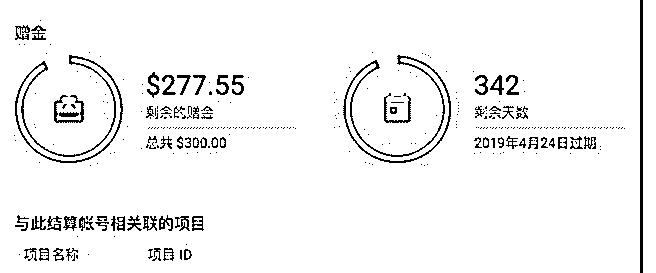
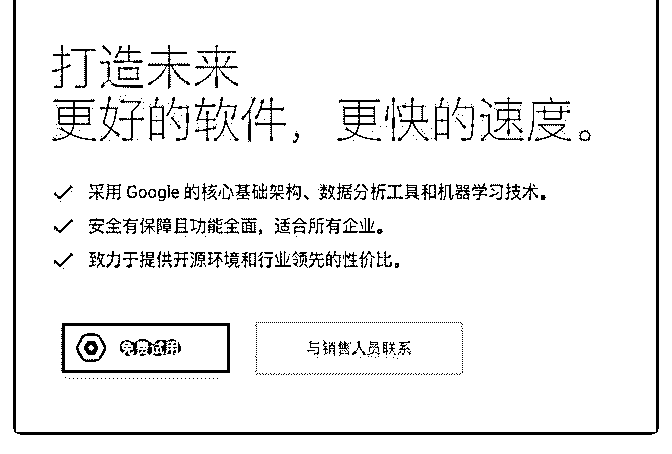
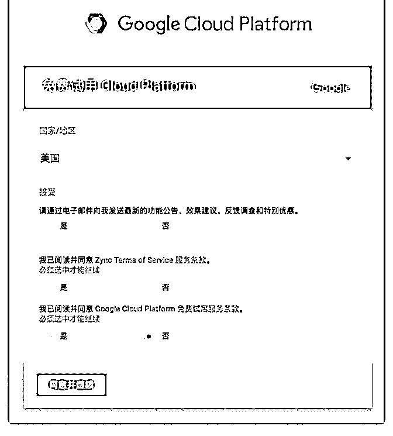
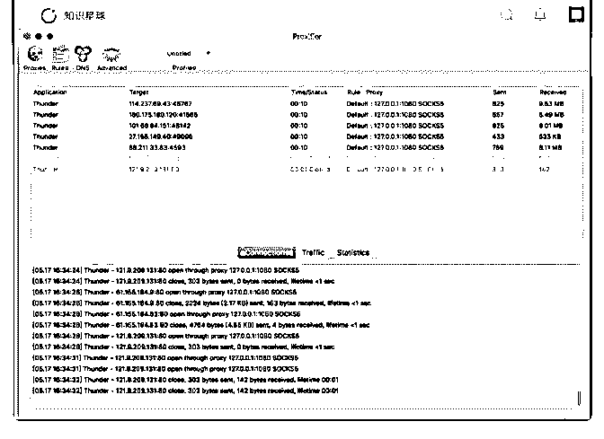

# 做海外营销，不管是

富布斯 : 做海外营销，不管是 Affiliate 还是跨境电商要想迈出 第一步，首先要有稳定的梯子.这是个敏感的话题，我很少在 这里展开讲。所以前段时候在官方群里我们讨论过大家都在 用什么梯子的问题、比如付费的蓝灯、搬瓦工以及我前几个 帖子说到的一个做 Google adwords 的站所推荐的那些，都比较 贵。尤其是它们都是属于共享 IP，这个会让上 FB 的朋友来说 比较蛋碎！随时都要被封的感觉，我这里总结再推荐一下， 因为各种付费免费的主机我都用过不少，最后从性价比来讲 感觉 Google Cloud Platform 还是最好的选择。

你可以免费申请一年的 Clound 主机，用独立的 IP，然后在主机 里搭一下 SS 就可以用了。反正 Google 的产品都是不错的，稳 定，速度快，至少我在线看 1080P 是流畅的。最重要它性价比 高，哦~ 也谈不上性价比，它是免费的. 默认 Google 送你 300 美 金，如图 1

申请地址： 图 2、3 我建议你选择台湾或美国节点的主机，台湾的应该会快一

些！如果你申请到主机，不会搭 SS，那可以加官方微信群@ 我。入群是自愿的，所以我不会在不经你同意的情况下拉你

入群，同时加群有个小要求，登记一下表格：

方便大家相互有一个大致的了解. 我看到登记信息会邀请你。 可能会有朋友需要用到 S5 怎么办.搭配 Proxifier 来用，这个绝对

是好东西！不过它只能试用一个月。往后就是收费的，如果

你要求不高可以用破解版的，如果要求比较高的. 可以买一个 保证最新和以后更新。也不算贵，39 刀. 看图 4

[如果有疑问也可以在下面留言，但是注意关键词的措辞，避 免被系统吃掉。](https://wj.qq.com/s/1969854/35c5)[`cloud.google.com/ Affiliate`](https://wj.qq.com/s/1969854/35c5)[营销圈](https://wj.qq.com/s/1969854/35c5)[-](https://wj.qq.com/s/1969854/35c5)[登记表](https://wj.qq.com/s/1969854/35c5)

[+-+Tencent+Questionnaire](https://wj.qq.com/s/1969854/35c5)

2018-05-17(11 赞)

评论区：

富布斯 : 可能会有朋友需要用到 S5 怎么办.搭配 Proxifier 来用，这个绝对是好东西！不过它只能试用一个月。往后就是收费 的，如果你要求不高可以用破解版的，如果要求比较高的. 可以买一个。保证用最新版本和以后功能更新。也不算贵，39 刀. 看图 4

Hao : 是不是注册的时候选的国家，就是主机所在的国家呢？

富布斯 : 那个是你个人注册地址的国家，建议你准备选 TW 的主机就选择 TW，如果准备选 US 的主机就选 US。节点肯定是从

TW 中转快一些

Hao : 明白了，谢谢

砍柴 : 如果配和 proxifier 使用，是不是节点要选择 U S 的？使用的时侯输入 IP 和端口对吗？

富布斯 : 选哪个节点看你自己用作什么用途.使用 proxifer 的时候只需要设置一下 Rules.这个东西好处就是太智能了，大部分只

需要你打勾，其它的不用你设置太多。它的日志信息很详细

砍柴 : 登录 US 的 EMU 联盟账户，是不是要选美国节点？ 富布斯 : 这个看你的联盟和 offer 要求

关注公众号"懒人找资源"，星球资源一站式服务