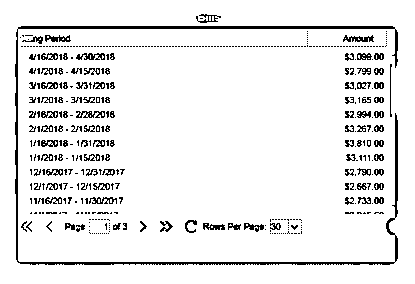
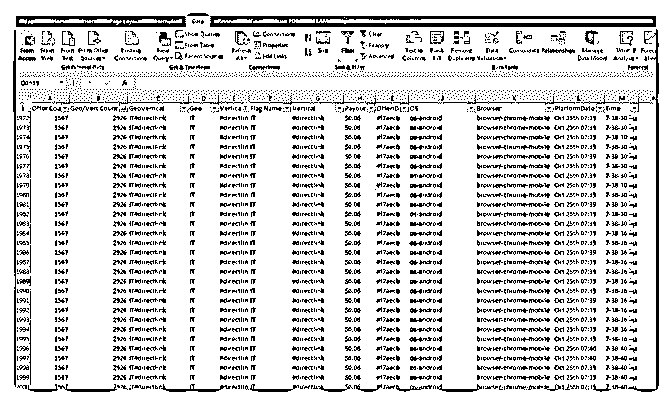

# 感谢富帅的邀请，我

廖斌 : 感谢富帅的邀请，我今天分享一下我做 EMU 的一些经 历和案例。我是个不太会分享的人，不是不愿意分享，而是 觉得自己懂的太少，写出来怕贻笑大方，各位大知们随便看 看吧。 我本身学财务专业的，个人比较爱好计算机，自学了一些简 单的网络技能，比如 PS，DW 等一些简单的修改，12 年做过淘 宝客返利站赚过一些钱，13 年接触 EMU 这一行一直到现在， 我的英文水平估计比群里的所有人都差，大学也就考四五十 分这样子，为什么来啃自己一窍不同的英文 affiliate，是因为 以前在广告中国看到了汉的骄阳的激励，人家一个残疾人一 根手指打字都能做得好，我们好手好脚为什么不可以。 我前期做 EMU 其实花了很多无用功，affpaying 测了至少上百 个联盟吧，能测到加钱的做到一两百刀，一般等到快发钱大 部分都被 K 掉，断断续续第一笔款收了 5 美金，大半年下来就 挣了几百美金。13 年那会用 ME 或 CACA 刷欺诈流量，后来做 flex,当时申请账号不需要域名邮箱，力批的，测试了一些保险 财经类任务,就这样刷 ME 居然第一个月收了 300 多（现在刷 me 肯定不行了各位好好 media buy），然后慢慢依靠这一资源扩 散慢慢上量上号，14 年又发现了一个财经类主力资源，就这 样依靠少许主力资源兼搭一部分测试。 15 年算是我的一个转折。这之后我主攻 dating 和财经类任 务，daiting 让我赚了不少。分享一下我做 dating 的的一些思 路。我做 dating 主要选择 2-8 刀左右这样的低单价 lead，选择 offer 前尽量查一查这个公司实力怎样，选择大公司支付有保 障一些。一般 dating 用廉价的 adult traffic 流量就可以，操作用 信箱必须是真实可接受邮件的，因为大部分 DATING 任务是 需要接受验证或是需要激活的，做活跃的时候还需要二次甚 至三次登录。完成二到三次任务后，再次操作时，最好是注 册完成后，多停留在帐户一段时间，进行浏览、搜索等常规

活动。邮箱尽量和注册资料的名字，地址等有关联，资料尽 量用黄页中真实的地址，姓名等资料，男女比例 1.5:1，最重 要的是 lead 资源要做转化，个人认为有转化率有人购买，广告 主才会发钱你。这里有一个三赢考虑，广告主付你的比他得 到的多，联盟有钱赚，你才有钱挣，这样是可持续的。点击 注册转化比率个一般控制在 200:10:1。贴个图吧，表示没吹牛 批，感谢各位大佬

2018-05-15(24 赞)

评论区：

富布斯 : 厉害了，说最近不景气的时候也比上班强多了 富布斯 : 大家有什么问题需要跟 解惑的可以在这里提问交流

Wolf(富布斯助理* : 请问大佬一直是几个人操作啊？如果几个人操作的的 ip 可以同一条线吗？还有一个人做的来不？

廖斌 : 老是感觉不稳定，生怕明天就没钱挣了

廖斌 : 如果你是用买的 s5 软件，可以同一条线呀，只需告诉操作人员每次提取 ip 的时候刷新一下尽快提取保证不重复就行

了。我 15 年之前都是一个人操作的

富布斯 : 感谢分享，已赞赏

狼噬夜 : 请教一下整个操作过程是不是要用到很多工具啊？

晓鹏 : 我是小白 EMU 从何学起。哪里有相关资料学习

关注公众号"懒人找资源"，星球资源一站式服务

# #实操案例# 今天

富布斯 : #实操案例# 今天讲的是 EMU 实操案例分享. 邀请分 享的主角是@廖斌 ，2015 年操作 EMU 收款达到 200W。

从 2010 年开始就不断有人说，Emu 已经做不了了，收款难等 等各种负面的声音。我觉得很多行业都会有这种唱衰现象， 除了一小部分真的没有吃到肉之外，很大部分可能是来自于 在这个行业赚到钱的人。

为什么赚钱的人最可能主动唱衰？潜规则就是不希望太多人 怀着好奇的心态了解和深入这个行业，小廖在 2015 年还做到 200w 收款的成绩就说明了这种现象。所以有句话说的好：“觉 得为时已晚的时候，恰恰是最早的时候”！

我之前看过一本书《玩法变了》改变了我一些做事的方法， 就是少说多验证自己的想法，不断满足自己好奇心，而不是 过于被那些负能量和谣言左右。有的时候不是项目过时了， 只是玩法变了而已...

看看小廖分享自己是如何在 EMU 实战收获 200w 的~ 知识星球 App 昨天已经更新到最新版本（建议大家更新，避免

部分功能无法使用），增加了写作业的功能。所以借此功能

邀请@廖斌 大神完成作业分享，各位也不吝点赞和评论感谢 才会看到更多人分享。

2018-05-15(18 赞)

关注公众号"懒人找资源"，星球资源一站式服务

# Afflow 自动化

Wolf(富布斯助理* : Afflow 自动化采集工具 AffMonster，在作 者看来

1,Afflow 的 campaign 是易变的，原因可能是 offers 轮 换，cap，day-parting 或其他原因。所以不要期望 Afflow 的 campaign 可以持续数个星期。(通常持续 1-24 小时或者几天) 2,你无法准确知道在跑什么 offer，所以无法制作 lander 或其他 素材。 3,Afflow 的统计不是实时的，而是有 3 小时延迟，所以通常你 因为 offer 饱和或者达到 cap 而会失去 offer。

官方地址：[Afflows+|+Master+Offers+Arbitrage](https://afflows.com/)

2018-05-13(10 赞)

评论区：

杰杰杰杰 : 作者现在有在用吗？去网站上看了下，发现做的不太完善啊

半仓哥 : 其实不用这么麻烦，用 PY 我自己架构了一套文章采集系统！随便怎么玩都可以

Orca : 大佬能否指点一下[抱拳]

Joke : 请问 PY 是 python 吗？

关注公众号"懒人找资源"，星球资源一站式服务