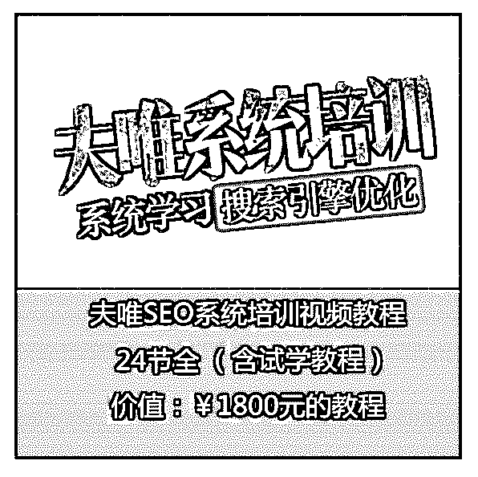

# 价值 1800 元：2

星矢 : 价值 1800 元：2017 最新 seowhy 夫唯 SEO 系统培训视频课 程 24 节全套教程

课时 1-1：前言：实用，简单可操作

课时 2-1：SEO 创业第一步：准备工作和内容来源

课时 2-2：SEO 创业第二步：域名注册

课时 2-3：SEO 创业第三步：网站设计越简单越好

课时 2-4：SEO 创业第四步：内容长度

课时 2-5：SEO 创业第五步：四处一词

课时 2-6：SEO 创业第六步：站内定向锚文本

课时 2-7：SEO 创业第七步：高质量内容的发布技巧

课时 2-8：SEO 创业第八步：外链建设

课时 2-9：SEO 创业第九步：日志分析

课时 2-10：SEO 创业第十步：更新频率和高质量的内容

课时 2-11：SEO 创业案例：搜外网站初期真实创业过程分享

课时 3-1：如何确定目标关键词

课时 3-2：如何优化目标关键词第一步：站内基础优化

课时 3-3：如何优化目标关键词第二步：首页关键词布局

课时 3-4：如何优化目标关键词第三步：站内锚文本

课时 3-5：如何优化目标关键词第四步：站内站

课时 3-6：如何优化目标关键词第五步：多样性的外链

课时 4-1：长尾关键词概念的重新定位

课时 4-2：长尾关键词排名的案例演示

课时 4-3：挖掘长尾关键词的各种技巧

课时 4-4：网站内容来源的全部思路

课时 4-5：优化长尾关键词的三大要素

课时 5-1：夫唯 SEO 系统培训课程介绍

发社区赚点金币：

[回复可下，无需金币](http://bbs.fuyuzhe.com/affiliate/53.html)[价值](http://bbs.fuyuzhe.com/affiliate/53.html)[1800](http://bbs.fuyuzhe.com/affiliate/53.html)[元：](http://bbs.fuyuzhe.com/affiliate/53.html)[2017](http://bbs.fuyuzhe.com/affiliate/53.html)[最新](http://bbs.fuyuzhe.com/affiliate/53.html)[seowhy](http://bbs.fuyuzhe.com/affiliate/53.html)[夫唯](http://bbs.fuyuzhe.com/affiliate/53.html)[SEO](http://bbs.fuyuzhe.com/affiliate/53.html)

[系统培训视频课程](http://bbs.fuyuzhe.com/affiliate/53.html)[24](http://bbs.fuyuzhe.com/affiliate/53.html)[节全套教程](http://bbs.fuyuzhe.com/affiliate/53.html)[+-+Affilia...](http://bbs.fuyuzhe.com/affiliate/53.html)

2018-04-12(16 赞)

评论区： 白白 : 赞一个

后天 : 赞，感谢！

富布斯 : 已加精

悟者 : 感谢分享

Zinky : 赞

田小田的甜 : 谢谢分享

须臾亦逍遥 : 感谢分享

言山 : 感谢分享

关注公众号"懒人找资源"，星球资源一站式服务