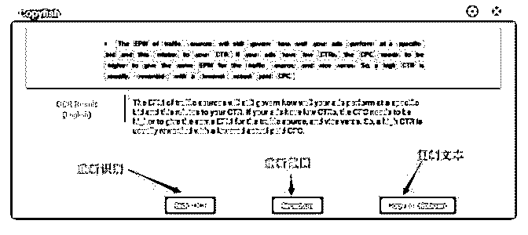

# 小知识: 如何阅读

Jeff : 小知识: 如何阅读英文 PDF 文档 作为 affiliate 时不时的需要阅读一些英文文档， 对于许多人来 说直接阅读英文在理解上会有一定的压力， 如何解决这个问 题呢， 下面就来谈一谈我个人的解决方案: 对于文字版的直接 复制翻译就可以了，对于不能复制的或者扫描版的文档， 需 要用到小工具: Chrome + Copyfish 插件 Chrome 浏览器大家都很熟悉, 自带的 PDF 阅读功能， Copyfish 是一个 Chrome 插件可以在应用商店里面下载安装。 使用方法很简单:

用 Chrome 打开 PDF 文档， 单击工具栏的 Copyfish 小图标，然

后像 QQ 截图一样选择需要翻译的文本区域， 插件会自动做

OCR 识别， 截图如下:

Tips： 工具自带翻译功能， 也可关闭该功能复制到其它地方 翻译。

该工具需要联网使用， 并且有可能会不稳定。 其实这并不是 服务器的问题，只需要开启 V-P-N 即可解决。 这个办法也适合用来翻译, 或作为一个辅助工具。

2018-04-05(10 赞)

评论区： 富布斯 : 加精

圣者无名 : 这插件是收费还是免费的？

Jeff : 免费的

砍柴 : 还有一个方法，将 PDF 文档用 adobe acrabat dc 导出 html 格式再用 chrome 浏览器打开，用 Google 的翻译插件进行一键翻

译或划词翻译。

富布斯 : 原理一样，这个插件其实就是简化了中间的环节更便捷一些

关注公众号"懒人找资源"，星球资源一站式服务

# Affiliate

圣者无名 : Affiliate 流量省钱脚本：最新 0 延时的 bots 流量检 测方法,测试可用【PDF 格式图文配合阅读更佳】 根据 2017 年的最新流行 bots 趋势制作的 bots 检测脚本！

这个脚本的特性： 可以获得 bot 实际点击广告链接的比例。 十分高效，对页面加载 0 延时，意味着你可以用在任何

campaign 上。

对于 CURL-based 或者 non-JavaScript bots 检测具有高精确性。 不会被在页面寻找链接的 bots 触发漏报。 使用这个脚本所必须的：

在任何流量上跑的使用一个 landing page 的 campaign。

一个外部追踪程序比如 voluum 或者 imobitrax——基本上任何

campaign 追踪工具都可以。

这些就够了！这个脚本对直链不起作用（至少在做一些大部 分 offer 拥有者不喜欢的事情之前不行——查看下面的“直链如 何使用这个方法”），但是你可以用在任何 landing page 上。

如何使用这段脚本？ 给你的 campaign 添加一个额外的 offer，命名为"Parses Javascript"。这个 offer 应该链接到一个互联网上某处的一个加

载快速的页面——我使用的是谷歌首页。到底连接到哪里真 的不重要，重要的是你的追踪可以追踪到这个 offer 的点击 率。

FunnelFLux： 如果你使用一个基于 flow 的追踪，比如 funnelflux，把这个 offer 作为你的 landing page 的一个分支来添加，就好像你还要在你 的 landing page 上添加一个额外的 CTA。

复制这个 offer 的 Action URL，就好像你准备粘贴到一个 landing page。

Voluum：

复制你的 Multi-Offer Click URL 就好像你准备添加到一个

landing page。你可能也需要调整你的 landing page 来使用 Multi-

Offer URL 来使用你的实际的 offer。

其他追踪： 如果你要给你的 lander 再添加一个 CTA，你就要复制你要使用 的 URL 来把人们传送到新的 offer 去。

第二步#

粘贴给你的 offer 的 Action URL / Multi-Offer Click URL 到一个

文本编辑器里。

在域名后面的"/"后面开始把它分成两行。 所以比如说，如果你使用 funnelflux，然后你的 action url 是

你就要把它分成：

和

undefined

如果你使用 Voluum，然后你的 Multi-Offer Click URL 是 undefined

你要把它分成：

undefined

和

undefined

第三步#

把下列 JavaScript 代码添加到你的 landing page，放在上方。

把 URL_PART_1 替换成你的 URL 的第一部分，URL_PART_2 替换成第二部分（就是第二步中所生成的）。

第四步# 把下列代码添加到你 lander 的标签内：

第五步# 上传你的 lander！

这里你就完成了，这个 bot 检测器已经开启。如果你在跑一个 campaign，你应该可以看到点击跑到"Parses Javascript" offer 了。

分析结果# 分析这个测试的结果是很简单的：对于每个 placement，查看

CTR 到你的"Parses Javascript" offer。

这个 CTR 就是你从 placement 收到流量中非 bot 流量的百分比。 百分比不会达到正好 100%因为通常的点损问题存在，它的准

确率误差应该在正负 10%上下，根据我的测试。它在一些网

络较差，或者没有宽带或者 wifi 的国家会更加的不精确，但是

仍然相对精确，对于网速快的国家更加精确，特别是你跑 wifi

的 campaign（或者移动互联网很快的国家也是）。比如，在美

国我觉得它的误差率能在正负 2%左右。

它也可以检测聪明的 bots，但是在 Google Adwords 生态系统 外，这些 bots 似乎非常罕见。

如果你需要使用这个数据去和流量源争辩你的 case：那些检测 器检测的是那些没有开启任何形式 javascript 的浏览器。这在 2017 非常罕见（并且可能在 2018/2019 也是，如果你读到这 里）：很多网页甚至离开 javascript 都不会渲染。因此，大量这 样的流量几乎肯定是 bots。

把这个测试用到直链中# 如果你想使用这个测试到直链中，有两个方法，但是也都有 不好的一面。

首先，你可以在 offer 前加一个 lander（或者如果你在 funnelflux，加一个 javascript node），它只负责跳转启用了 javascript 的客户。下面就是这个 lander 的全部代码：

能够经过这个隐形 lander 的客户都是可以解析 javascript 的，所 以就不是低级的 bots。

这个方法的缺点是你会额外增加 offer 的加载时间。如果你把 主页放在一个快速的服务器上，并且 DNS 查询已经完成了， 大概会增加 200ms——我会推荐你把它放在你追踪同一个服务 器上。

第二，你可以把 offer 放入一个不可见的 iframe 中，然后在 iframe 外使用 bot 检测。这个更有技术含量，但是更严肃的问题 是 offer 提供商讨厌 affiliate 这么做，他们有充分的理由。所以 如果你想要这么做，征求一下你的 offer 提供商或者联盟的意 见。

2018-04-05(6 赞)

关注公众号"懒人找资源"，星球资源一站式服务