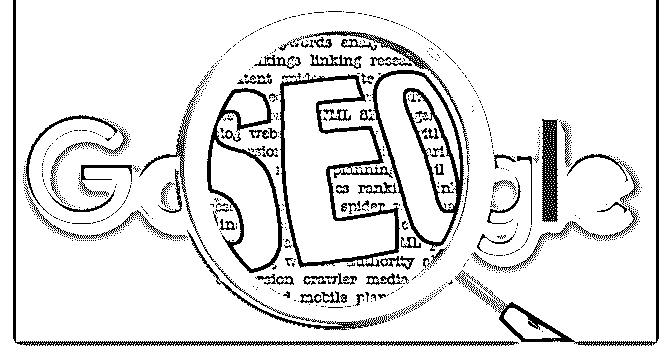

# 互联网上有太多的赚

富布斯 : 互联网上有太多的赚钱 Project 和教程，每个人都在积 极的寻找最佳的答案。可是按照大部分公开的资源和教程一 步步做都不会让你马上赚到钱，这是肯定的，就像那些花钱 和巴菲特吃饭的人一样，巴菲特也不会告诉他买哪支股票能 帮你赚回饭票道理一样，但是依然收获远超饭票。那每天花 那么多的时间阅读这些内容的意义是什么？如何筛选有质量 的内容让自己获得增长且赚钱？

阅读优质内容是一件有营养的事，但是要找到适合自己的阅 读方法。我也订阅了很多新闻和博客，每天固定 30 分钟以 内，除了使用 ReedOn、Feedly 之类的 APP 订阅一些高质量的 RSS 之外，最近还研究使用 slack+hubot 运维机器人。我做技术 出身的，是告别上班生活以后，懒散惯了，反正能让程序自 动化去干的事情永远不会浪费时间每天重复的去人肉做。

筛选内容的问题解决了，下一步就是考虑吸收内容。同一篇 文章，十个人阅读肯定花费的时间，感受都不同。尤其是看 一些实操性的内容，思路是不会过时的，阅后有反思、行 动？举一反三，考虑如何加以优化和变通操作？道理都懂， 我们来实操一下：

如何通过 ClickBank+YouTube 赚到 500$天？ 一，准备工作

注册 Clickbank 注册一个关联帐户，Animoto 注册一个 Youtube 帐户 选择低竞争相对高搜索的长尾关键字

已有账户的直接跳到第 4 步！不要问我这几个账户是干嘛的， 百度上有答案的我一般不会故作深沉解释的太多。

去 Clickbank 官网，选一个你看好的产品，至少 LP 看起来不错 的，转换应该不会太差，说白了就跟选美女一样，有吸引力 的就行。当然，选美女除了自己觉得美以外，还是有些技巧 的，没在 Clickbank 选过的建议先看看之前的《Clickbank 选品 指南》相关文章。

比如，我拿圈子里 选：“头发”相关的 Niche 产品来讲吧，有很 多时候女孩考虑的 Angles 比男的感觉更好，比某些数据更准。 要是让我去选，这个 Niche 我是永远想不到头发这个 Niche 的， 毕竟我一年都没用过几次梳子（强调一下本人不是秃头）。 但是对女人来说，做头发是个人形象的最大挖掘地啊。

二，关键词调研 先做个基础的关键词调研，我一直强调，找关键词的三原 则：

超过 50 个月的搜索（搜索指数趋势逐年上涨最佳） 少于 200 个 QSR（竞争越少越好） 关键词必须有意义

这是她找到一个关键词：”hair extensions“

基本符合条件哈，流量很不错，KQI 属于正常范围。 QSR224，并不算高，甚至自己建站优化也很容易获得 Google 前排。当然，本文的重点不是自己建站引流，后面会讲到。

再看一下长尾词，流量少点，贵在精准，小众市场竞争低。 只要转化可以，完全可以接受。这些关键词和长尾词在后面 会用到。

关键词选好，去 Clickbank 找产品，hair 方面的产品还是不少 的，尤其是掉发、假发类的比较多。选品的技巧前面已经讲 了。

三，制作视频上传到 YouTube： 插入链接：接下来，找一些关于这个 Niche 产品的相关素材、 图片之类的，发挥你的想象力。然后在 Animoto 上搞出一个至 少你自己觉得还不错的视频，上传到 YouTube。然后在视频描 述里插入 ClickBank 的 HopLink 链接。

插入关键词：除了联盟链接外，这里很重要的环节是填上关 键词，上面我们已经做过 Google 关键词调研并且已经确定它 的关键词是有利可图的，当然不要只放关键词，应该用一句 感言概括一下并自然的让这些关键词融入其中。

到这里思路已经很清晰了。 首先 YouTube 是仅次于 Google 搜索的第二大娱乐流量平台，有

大量的无聊人群在这里看视频，我们应该借助平台的流量获

得免费展现。

其次，YouTube 本身就是 Google 家的东西，在 Google 搜索中有 很大的排名权重，当用户搜索我们调研过有利可图的关键词 时，我们刚刚发布的视频页面包含了这些每日确保有搜索量 的低竞争关键词，那么刚刚发布的视频就会优先排名，只要 在第一页就会得到较高的展现。

借助 Google 搜索、你的视频更容易获得排名展现，而且搜索 的流量质量是最精准的，用户通过搜索引擎进入 YouTube 观看 视频，发现联盟链接，转化成交，获得佣金，这个案例的操 作流程就是这么简单。

当然，这不是案例的全部，我们前面说了，需要在操作过程 中不断的优化流程和细节。比如，我们在做关键词调研的时 候，还应该注意 YouTube 上是否有同样的视频关键词已经长期 占据排名，应该尽量避免同行的竞争，找到更精准的小而美 市场，确保你能从 Google+YouTube 上获得尽可能多的免费流 量。

四，如何继续优化操作思路和流程？ ClickBank 推广方式千千万万，有人很早之前利用 Bing+ClickBank 赚了一波，很多人认为现在并不好用了就放弃 了。其实借助这个思路我们可以尝试 Yahooo+Clickbank，XXXX 搜索+Clickbank？是不是可以思考 继续拓展? 关键词调研、选品、联盟、流量平台是核心，掌握 这个核心是可以延伸出很多的操作思路的。

这个操作思路跟之前写过的电子书如出一辙，感觉还可以继 续挖掘。

2018-03-29(15 赞)

评论区：

富布斯 : 如果有兴趣搞一下这个思路的朋友，有问题在下面盖楼交流吧.不要新开帖子 Bruce Deng* : 文章开头提到的 rss 有什么阅读推荐的 feebly rss 流吗？

富布斯 : 根据自己需求订阅，别人的订阅未必适合你

关注公众号"懒人找资源"，星球资源一站式服务

# 2018 最新版亚马

James.N.Re* : 2018 最新版亚马逊（Amazon）运营视频 完整 版，跨境电商里优质课程，需要的赶紧下回来。文件比较 大，没空下的建议先保存到网盘. 请叫我雷锋

链接: 密码: jiik[百度网盘](https://pan.baidu.com/s/1Ix7Tkhd3Nbo4g9JVwA-yIg)[+](https://pan.baidu.com/s/1Ix7Tkhd3Nbo4g9JVwA-yIg)[请输入提取密码](https://pan.baidu.com/s/1Ix7Tkhd3Nbo4g9JVwA-yIg) 2018-03-28(6 赞)

关注公众号"懒人找资源"，星球资源一站式服务

# Google 搜索引

富布斯 : Google 搜索引擎官方入门中文指南:SEO Starter Guide 最近 Google 更新了他们自己的搜索引擎官方 SEO 优化入门指 南，说是入门指南，其实已经囊括了几乎所有最关键的 SEO 重点。作为站长，尤其是英文 Niche 站的朋友，真的很要必要 仔细阅读一遍。

要讨好 Google，就应该看官方给出的答案。不要摆着好好的 官方试卷和答案不去阅读，却去看那些所谓的 SEO 大师的文 章和书籍，我认为把这本 29 页的电子书内容熟悉了，你就毕 业了！

Google 搜索引擎优化 (SEO) 入门指南(最新中文版）PDF-29 页 本指南的适用对象：

如果您通过 Google 搜索运营、管理或推广在线内容，或通过 在线内容获利，则本指南对您适用。如果您是业务快速发展 的商家、拥有十几个网站的网站站长、网络代理方面的 SEO 专家，或者是对搜索机制具有强烈兴趣的 DIY SEO 达人，则 本指南也适用于您。如果您有兴趣根据我们的最佳做法对 SEO 基础知识进行全面了解，那么本指南同样适用于您。本 指南不会提供任何可让您的网站在 Google 中自动排位第一的 秘诀（抱歉！），但是如果您遵循下面列出的最佳做法，则 有望让搜索引擎更容易抓取、理解您的内容并将其编入索 引。

2018-03-24(6 赞)

评论区：

富布斯 : 下载链接： 密码：3qzq[百度网盘](https://pan.baidu.com/s/1Y-oXSGResvmZgessE67q2g)[+](https://pan.baidu.com/s/1Y-oXSGResvmZgessE67q2g)[请输入提取密码](https://pan.baidu.com/s/1Y-oXSGResvmZgessE67q2g)

富布斯 :

关注公众号"懒人找资源"，星球资源一站式服务

# Affiliate

Affiliate Marketing 就是互联网联署营销，我看过网上很多针对

affiliate marketing 的解释，相对比较零碎，我重新整理了一

下。affiliate marketing 在国外是一种非常成熟的互联网联署营

销模式。所以，要进入这个行业应该先了解一些常见专业术

语，即使你英语水平不怎么样，熟悉下面常见术语就足以让

你操作大部分的英文管理后台，也大幅提升你的 affiliate 英文 博客的阅读能力！

什么是 Affiliate Marketing？

Affiliate marketing 在国外是一个极其成熟的互联网营销行业， 在国内通俗的讲就是网赚。网赚这个词在国内被各种良莠不 齐的培训机构以及黑灰产渲染的越来越倾向于贬义，其实国 内的“网赚”也是从国外的 Affiliate Marketing 延伸来的。

具体 Affiliate Marketing 的解释请看这篇：

《 》

什么是 Ad Network？

Ad Network 就是聚集了内容提供者，面向广告主或者 Affiliate

出售流量的平台。

解决了中小站点流量变现的问题，也解决了广告主或者

Affiliate 寻找流量的问题。

Ad Network 有不同的计价方式。

1、 什么是 BANNER（横幅广告）？ 放置在网站的页面上用于表现商家广告内容的图片，通常大

小为 468*60 像素，往往做成动画形式，这样更具有吸引力。

2、 什么是 PAGE VIEW（综合浏览量）？ 网站各网页被浏览的总次数。一位访客有可能创造十几个甚

至更多的 PAGEVIEWS。

3、 什么是 IMPRESSIONS（广告闪现次数）？ 广告 BANNER 出现的次数，一般情况下与含有该广告的网页

被访问的次数相同。

4、 什么是 CLICKS （点击次数）？ 访问者通过点击横幅广告而访问商家的网页，称点击一次。

点击这个广告，即表示他对广告内容感兴趣，希望得到更详

细的信息。

5、 什么是 CLICKS RATIO （点击率）？ 如果广告 BANNER 的闪现次数（IMPRESSIONS）为 10000

次，而其点击次数（CLICKS）为 300 次，那么点击率即为

3%。 目前，广告的平均点击率为 2% 。点击率可以准确地反

映广告效果， 也是网络广告吸引力的一个标志。

6、 什么是 FIRST VIEW（第一屏）？

是读者浏览一个网页时，所看到的第一屏，访问者不用拖动 滚动条就可以看到，效果较佳，这个位置条受到绝大多数客 户的青睐，因此价格也较高。

7、什么是 CPM？

CPM 是 Cost P e r Thousand 的缩写，即每千人次访问的收费或 Banner 闪现一千次的费用，例如一个广告 Banner 的报价是

$10/CPM，意味着每一千人次看到这个 Banner，就收费$10。 按 CPM 收费已经成为网络广告的惯例。

8、为什么不按点击广告 Banner 的次数来收费？ 按点击广告 Banner 的次数来收费，在国际上很少采用。因为

网页访客是否点击你的广告 Banner 去你的网站浏览，还取决

于很多因素，比如 Banner 的设计，客户的网站的内容等等。

9、PTC(Pay to Click)点击赚钱 10、surf 冲浪，即上网。 11、b/c = because

12、PO = Program Owner 13、plz = Please

14、addy = address

15、FYI = For Your Information

16、cmi = count me in

17、cmo = count me out 18、IMO = In My Opinion 19、IOW = In Other Words 20、ISO = In Search Of 21、BTW = By The Way 22、BRB = Be Right Back 23、BRT = Be Right There 24、IM = Instant Message 25、PM = Personal Message 26、LOL = Laughing Out Loud

27、LMAO = Laughing My A** Off 28、LMFAO = Laughing My F*cking A** Off

29、ROTFLMAO = Rolling On The Floor Laughing My A** Off

30、ROTFLMFAO = Rolling On The Floor Laughing My F*cking A** Off

31、SLMAO = Still Laughing My A** Off

32、Peeps = People

33、2QT2BSTR8 = Too Cute To Be Straight 34、NPA = New Program Alert

35、WM = Web Master 36、bank wire 银行汇款 37、TOS = Terms of Service

38、FAQ = Frequently Asked Questions 39、IMHO = In My Humble Opinion 40、AFAIK = As Far As I Know 41、PBUH = Peace Be Upon Him 42、SO = Significant Other

43、GF = GirlFriend 44、W8 = wait 45、U = you

46、AD views 广告浏览数，网幅广告被用户下载、显示的次 数，等同于 impression。

47、Advertisement Management 广告管理，利用特定的系统管 理网页或广告网络揪发的网幅广告，同时提供即的显示数、 点击数统计，高级的广告管理系统还能根据访问者的特点和 时间选择出现不同的网幅广告。

48、Banner 网幅广告?标准 GIF 格式以外的网幅广告称为 Rich Media Banner。

49、C/I Ratio(Click-through to impression ration) 点击与显示的 比率

50、Click Ratio 点击率，如果该网页出现了一万次，而网页上 的广告点击次数为 500 次，则点击率为 5%。

51、Click Through 点击某一链接的行为

52、Co-Brand 共同标志/商标，有时联盟成员之间可以将自己 的标志和商标放在框架顶部页面中，以便访问者浏览其网 页。

57、Commission 佣金，参加联盟程序所取得的收入，联盟成 员可从联盟站点介绍的访客的销售收入中提成，这个佣金可 能是购买或活动的固定费率。

58、charge 手续费

59、bonus 红包，红利，花红，奖励 60、money order 汇票

61、Hosting/Hosted 每当用户点击链接时进入一个网站的页

面，该页面的图像和 HTML 文档由网站服务器提供，当调用 该链接时，这些图像和其他部件就由服务器存储。

62、Impression 投放次数，网页被访问的次数。

63、Lead 引导，用户在广告商网站上注册、加入或下载

64、O/C Ratio 点击与定购的比率，实际点击数与商人网站定 购次数的比率。

65、Pay-For-Performance 行动付付，网站访客采取某一行动 而取得付款

66、Pay-per-Click 每点击支付额 67、Pay-per-Impression 每显示支付额

68、Pay-per-Lead 广告商对每一位介绍到该网站的合格注册访 客的网站，按固定费率支付的费用结构

69、Pay-per-Sale 广告商对每一位介绍到该网站的进行消费的 网站，按产品或服务销售收入的百分比支付的费用结构

70、Portal Page 点击广告后连到的页面， 通常是针对广告内 容重新设计的页面。

71、Return Days 返回天数，用户第一次访问和下一次访问商 人站点的天数。

72、Storefront 店面，用于显示新产品或特殊产品的定制页 面。

73、Sub-Affiliates 联盟分站点，用一个帐户维护一个以上的站 点，主要站点为联盟站点，其他站点为联盟分站点。

74、deposit 存入 75、withdraw 取出 76、refund 返还，报销 77、compansation 补偿 78、rate 比率 79、exchange 兑换 80、interest 利息 81、principle 本金 82、investment 投资 83、account 帐户

84、PPC，就是按点击付费，大家可以理解成国内的百度竞 价。每一个点击我们广告的用户，我们都得付一定的费用；

85、Social Network，国内目前貌似就是人人网有这种广告， 国外的，主流有 Facebook 和 POF，就是在一个社区里刊登我们 的广告，一般有 PPC 和 CPM（按一千次展示付费）两种形 式；

86、Display，买别人网站的广告位，以 BANNER 的形式为

主，一般是按 CPM 形式付费；

87、PPV，弹窗广告，这种弹窗跟国内的弹窗比较不一样， 通过 PPV 的联盟我们可以 TARGET 用户在打开特定的 URL 才 会弹出我们的广告。

做 Affiliate 接触最频繁的角色：

88、.广告联盟（Affiliate Network、CPA Network） 广告联盟是一个平台，是一道桥梁，他们的存在就是为了帮

助广告主刊登在线广告，而广告联盟本身不会帮广告主进行

任何推广，而是把广告推广交给 Affiliate 去操作，从而赚取差 价；

89、广告商（Merchant、Advertiser） 广告商就是从广告联盟里，投放广告的商家； 90、发布者（Affiliate、Publisher） 发布者就是从广告联盟里，选取广告商的广告去推广，从而

赚取佣金；

91、流量联盟（Traffic Network、AD Network） 这种联盟，他们以卖流量为主，他们卖的可能是自家的流量

（SELF SERVE)，例如 Facebook，POF，PPV 等；

也有可能是倒卖别人的流量，例如 Google Adwords 的内容广 告，也可以参照国内的阿里妈妈；

跑 media buy 操作最常见的：

92、ROI – Return of investment -投资回报率 我们做正规，最看重就是这个，假如我们在 A 广告投入 10 刀，

产出 15 刀，那么 ROI 就是 50%；同理，如果产出 5 刀，ROI 是-

50%

93、CTR – Click Thru Rate – 点击率 例如 100 个人看了你的广告，3 个人点击了，那么你的点击率

是 3%；在大多数有 PPC 模式的平台

（BING,ADWORDS,FACEBOOK)，你的广告点击率越高，你

每次点击的费用就越低；

94、Campaign – 广告活动 流量平台里，campaign 可以理解成广告组的意思，一个

campaign 下可以有多个 Creative（广告样式）。

95、Creative – 广告样式 就是你给用户看到的广告样式，或者指某个 campaign 下的一个

子广告，每个平台的 creative 都不一样，像 pof 和 fb 是以图片+文

字的广告样式；PPC 中，我们的 text ad 就是我们的 creative；

Display 的话，banner 就是我们的 creative。

96、.CTA – CALL TO ACTION – 呼吁行动

CTA 就是一些类似”join now“ ”click here“ ”start today“ ”countinue“ 等 LP 或者 creative 上，增加用户点击和转换几率的 广告语，常见于一些 LP 上的 BUTTON 点击按钮；

97、Pixel – 转换图素

Pixel 我们用于放在联盟后台对应的广告里，pixel 一般从我们的 追踪工具（tracking202 或者 cpvlab）里提取，然后放到联盟后 台去。这样追踪工具才能准确统计出哪里来的流量带来转 换。

98、LP – LANDER – LANDING PAGE -引导页

用于增加转换，是用户点击你的广告后和到广告商页面之间 的一个桥梁，绝大部分情况下，LP 可以增加我们的盈利。

99、CPA – COST PER ACTION – 按行动付费

CPA 是目前 AFFILIATE MARKETING 主要的形式之一，当用 户完全广告商要求的行动，你就会获得佣金。

但是 CPA 的模式，广告商会在乎你的推广质量，如果你带过 去一定的转换后，广告商无法从你的转换盈利的话，那么你 就会面临被广告商要求你停止推广的局面；

100、CPL – Cost Per Lead – 按引导付费 这种其实和市面上大部分 CPA 都差不多形式，但是 CPL 的话，

大部分时候广告商只要求有效的注册，对转换的质量要求偏

低甚至无；

101、Revenue Share – 收入分成 这种是，你带过去的用户，给广告商带来多少收入，广告商

就分成多少给你。常见于 DUBO 类和 CHENGREN 类广告，这

种模式你可以拿到多次分成；

101、Split test – 轮换测试 举个例子，你有 2 个 LP，用户访问的时候，50%到 LP 1，50%

到 LP 2，那么你可以测试得出哪个 LP 的转换率高一点；同

理，也可以同一个 LP，50/50 几率到 2 个不同的 offer，来测试

哪个 offer 的转换率高一点。

指标

Mobile affiliate marketing 有许多指标。 102、EPC（Earning per Click）:EPC=总收益/点击次数。

CTR（Click through Rate）:点击次数/展示 X100%，例

如，25000 次展示中有 50 个人点击=0.20%CTR。这种适用于

横幅 CTR（Banner CTR）和着陆页 CTR（Landing Page

CTR）。

103、eCPM(Effective Cost per Thousand):公式是-总收益/展示 次数 X1000=eCPM，即每千次展示你的收益。

104、CPA(Cost Per Action) ：每行动成本

CPA 计价方式是指按广告投放实际效果，即按回应的有效问 卷或定单来计费，而不限广告投放量。CPA 的计价方式对于 网站而言有一定的风险，但若广告投放成功，其收益也比 CPM 的计价方式要大得多。广告主为规避广告费用风险，只 有当网络用户点击旗帜广告，链接广告主网页后，才按点击 次数付给广告站点费用。

105、eCPA（Effective Cost per Action）:广告展示后实际每次

lead 或 sale 的花费

如果你正使用一个固定的追踪办法，它会自动地计算大多数 这些指标。你的终极目标是得到一个高的横幅 CTR 和着陆页 CTR，以及高的 CR，如果你有了高的横幅 CTR 和着陆页 CTR，却没有高的 CR，这时就需要 test：你要 test 几个变量 来找到一个能获利的模板。

Mobile affiliate marketing 术语与主流的 marketing 一致。 106、SOI(Singel Opt In):一种需要访客进入到 detail 不需要确

认的 offer。当确认为一次转化时也有可能需要其它领域的数

据。(SOI 是表格填写完就算激活)

107、Double Opt In(DOI):一种与 SOI 类似的，但是需要访客 通过他们在邮箱中收到的链接进行确认的 offer。(DOI 是表格 填写完，会受到邮件，点击里面链接确认才算激活)

108、Pay per Lead(PPL):一次成功的 lead(SOI 或 DOI)所得到 的佣金

109、Pay per sale(PPS):一次成功的付款交易佣金

110、Pay per Install(PPI):也称 PPD(Pay per Download)，一次成 功的安装/下载的佣金

111、Revenue Share(RevShare):当一个用户变成了付费会员 时，你能持续获得佣金或该会员付费一定的比例作为佣金

112、Direct Linking:将一名访客直接从你的广告页面带到 offer

页面而没有其它中间网页的链接

113、Landing Page(LP):中间页面，当访客点击你的广告时， 首先跳到 LP 页，通常作为预卖页面或分流访客的页面

114、Self Serve Network:一种授予你权力自主进行实时控制 campaign 的联盟（network）。例如，开始或暂停 campaigns 和横幅来挑整报价（Bids）

115、Managed Buy:一种替你管理 campaign 的联盟。例 如，managed buy 会根据你的指令暂停然后调整报价，通常是 通过邮件操纵。

116、Direct buy:直接与网站的拥有者谈判广告价格

117、AdServer:一个替一个或多个网站储存、循环、维护以及 展示广告的平台，也可以根据不同的标准追踪、报告统计数 据以及展示你的广告。

118、Impression:展示次数，即页面加载显示广告的总次数， 例如，一页加载有一个广告位，则称 1 Ad Impression,一页加 载有两个广告位则称 2 Ad Impression from 1 Page Load

119、Insertion Order(I/O):一个规定了 media buy 的日期与范围 的文档

120、CPL(Cost Per Leads)：以搜集潜在客户名单多少来收费 即每次通过特定链接，注册成功后付费的一个常见广告模

式。这是我们通常称谓的引导注册，比如很久之前很火爆

的“亚洲交友联盟”。

121、CPC(Cost Per Click；Cost Per Thousand Click-Through) ： 每次点击的费用

以每点击一次计费。这样的方法加上点击率限制可以加强作 弊的难度，而且是宣传网站站点的最优方式。目前 Google Adsense 就采用此方式。

122、CPS(Cost Per Sales)：以实际销售产品数量来换算广告刊 登金额

即根据每个订单/每次交易来收费的方式。用户每成功达成一 笔交易，网站主可获得佣金。比如现在比较火爆的淘宝客就 是这种方式，应该说对于国内来说，这也是最靠谱的网络营 销模式了。

123、CPR(Cost Per Response)： 每回应成本 以浏览者的每一个回应计费。这种广告计费充分体现了网络

广告“及时反应、直接互动、准确记录”的特点，但是，这个 显然是属于辅助销售的广告模式，对于那些实际只要亮出名

字就已经有一半满足的品牌广告要求，大概所有的网站都会 给予拒绝，因为得到广告费的机会比 CPC 还要渺茫。

124、CPP(Cost Per Purchase) ：购买成本 广告主为规避广告费用风险，只有在网络用户点击旗帜广告

并进行在线交易后，才按销售笔数付给广告站点费用。

无论是 CPA 还是 CPP，广告主都要求发生目标消费者的“点

击”，甚至进一步形成购买，才予付费：CPM 则只要求发 生“目击”(或称“展示”、“印象”)，就产生广告付费。

这些网络广告营销形式很多，但并不是所有的形式都合适， 根据网站的流量，内容定位来选择一个最合适的方式才能让 网络营销利益最大化，目前国内赚的很辛苦但也赚的很可观 的是 CPS 类的淘宝客，另外为了保证广告主的利益，对于流量 大的网站、论坛等 CPC 也是不错的选择。

125、CPI(Cost Per Install) : 按安装付费 比如以手机 app 为例，每一次安装，广告商就要付钱，而且只

要这 app 一直装着，广告商也只付这一次钱，并且只管你装不

装不管你看不看。CPI 算是一种比较有效率的收费方式。

126、CTA 是 call to action 的缩写，意在让目标客户立即采取 被期望的行动。

当然，你的客户不会随随便便的看到一个广告页面/图片就立 即点击过去，好的 CTA 才有这样的效果，它必须设计良好并 且和整个广告相得益彰，给用户一个极其吸引人的理由去跟 随着 CTA 操作，让用户不假思索的情况下就完成了你期望的 动作。

举例说明： 通常要使用祈使语气诸如“立即拨打”，“获取更多”或者“立即

前往”等等。

其他的 CTA 类型给消费者一个强烈的购买意愿，比如订单数 量有限，时间有限等（例如：“订单即将失效”，“商品数量有 限”）或者一个特别的限时优惠（比如：“今晚 23：59 分前下 单即送特别福利”，“前 50 名半价”等等）。

一个 CTA 可以是一个非苛刻的请求，比如“选择一个颜色”或 者“查看此视频”，或者一个更加苛刻的要求，比如促使让消 费者购买一个产品的请求或者要求提供个人信息和联系方 式。[Affiliate+Marketing+](https://mp.weixin.qq.com/s/jPmgdsILxytjq75j3_erGQ)[到底是什么？](https://mp.weixin.qq.com/s/jPmgdsILxytjq75j3_erGQ)

2018-03-16(21 赞)

评论区：

富布斯 : 这个帖子会持续更新，欢迎大家补充！以后有朋友问我这个那个是什么意思时候，我直接丢这个帖子过来，先看 看这里有没有，没有的话跟帖提问，然后我会补充进去。

关注公众号"懒人找资源"，星球资源一站式服务