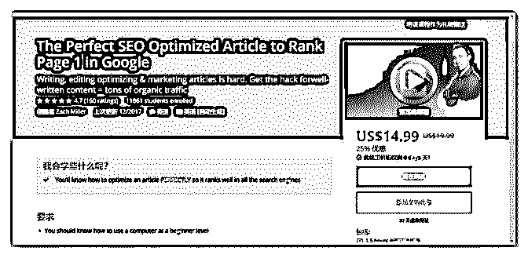
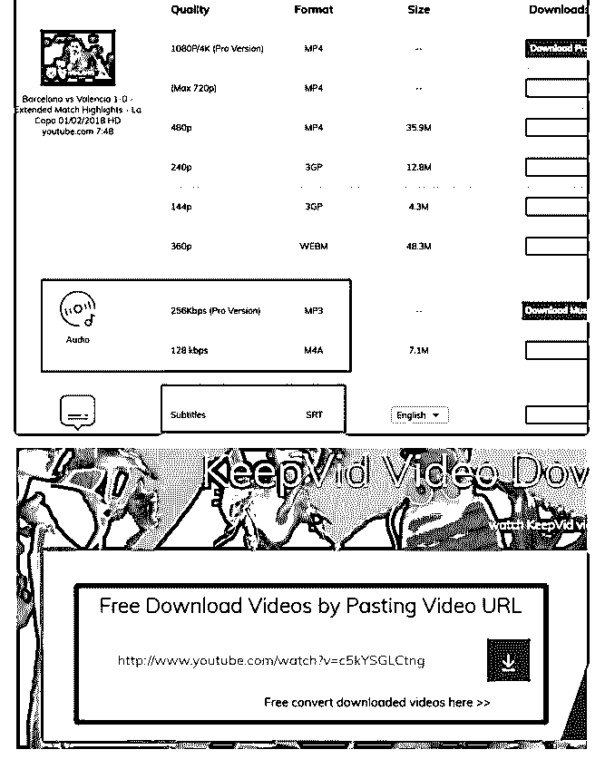
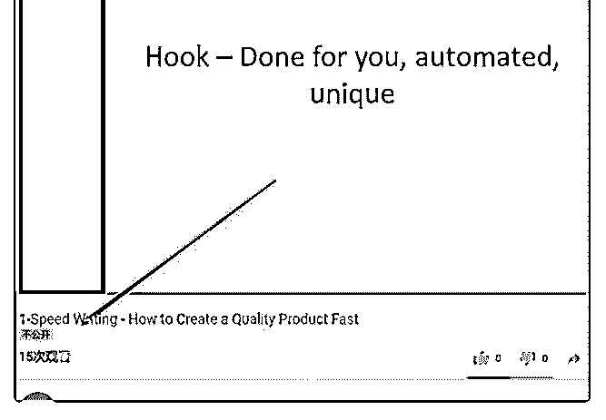
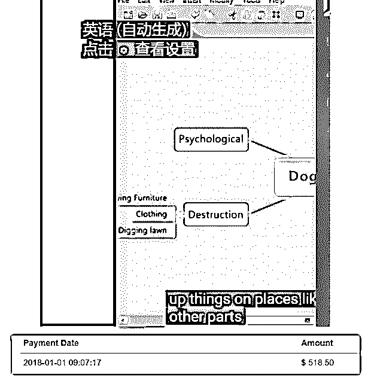

# 售价 15 美刀的 Go

富布斯 : 售价 15 美刀的 Google SEO 优化文章排名的视频教 程，看了一下。作者讲的语意精简，不废话，点到为止，比 较适合新手建立 Niche 站，有兴趣的可以下载，内嵌字幕。无 障碍看英文视频的方法翻一下我之前的帖子

具体内容自己看下链接：

链接： 密码：cwnj 解压密码：fuyuzhe.com[Access+to+this+page+has+been+denied.](https://www.udemy.com/write-the-perfect-seo-optimized-article-to-rank-page-1-in-google/?persist_locale&locale=zh_CN)

[百度网盘](https://pan.baidu.com/s/1jJ9LeHS)[+](https://pan.baidu.com/s/1jJ9LeHS)[请输入提取密码](https://pan.baidu.com/s/1jJ9LeHS)

2018-03-03(12 赞)

评论区：

大伟 : 富神，无障碍看英文视频的帖子不好意思没搜着，麻烦你在说下谢谢 富布斯 :

富布斯 :

关注公众号"懒人找资源"，星球资源一站式服务

今天分享个我本人前

今天分享个我本人前段在实操在盈利的国外 Affiliate 赚钱小项

目。前几个月大概撸几百刀/月，这种东西不会稳定，我也不

会投入太多时间干这个。所以有的时候思路来了，感觉有戏就

习惯去尝试一下，看看能不能赚点佣金，当然我认为这个东西

是可以放的很大的，毕竟类似的成功例子见过不少。所以，流

程和思路大概讲一下，理解了然后自己拓展、优化细节，举一

反三吧。

纯原创，如有雷同的，绝不可能。 很多朋友做英文站，就是所谓的 Niche 站的时候，无非最头疼

的就是内容更新，还是英文的。外包的成本又太高了，现在搞

伪原创基本都是瞎折腾。

有一次去 YouTube 看看视频，发现 YouTube 的视频播放下面右 小角是可以自动翻译成很多语言的。经常逛 YouTube 的朋友也 都知道，其原理就是将语音转换为英文文本，然后再转换为另 一种语音的文本。语音识别中如果有错误，也会导致转换到另 一种语言出现错误。但是请注意：Google 说它将语音转换为英 文文本的准确率达到 99%，当然最好是老外的标准母语才达到 这个标准。底层原理就是神经网络的东西就不深入讲了。

这个功能就是我们利用的几个地方： 利用 1，对于英文不好的朋友可以利用它，上传一些国外优质

教程学习下。当然机器翻译的结果肯定还不准，但是凑合能看

懂个基本意思。

利用 2，有个网站《》就利用了 Google 的语音识别技术专门针 对 YouTube 的视频，自动生成一个标准字幕文本。而且全程是 免费的。

到这里大家都看懂了。是的，就是利用这个文本可以做一些原 创的东西。不用急，这个文本不是直接拿来就可以用，字幕还 是需要排版的，可以透露下我找当地的在读英语系大学生排版 是 2000 字/30 块，我觉得很划算了，因为我很懒。这里我利用 这个原创的文本做了几件事：

1，更新到我的 Niche 站上，作为一篇原创文章更新，当然你也 可以插入一些 affiliate link。（你转换的文本需和 Niche 站主题一 致）

2，去找现在比较受欢迎的电子书排行榜，然后选一本务必跟 Affiliate 相关的主题。再找对应主题的相关优质视频，下载回 来，上传到 YouTube，再用《》下载字幕，排版。这次我们是 做成电子书。

到这里，再回顾一下，为什么要找 Affiliate 相关的主题电子书， 是因为我们是要做好给老外免费下载看的。盈利模式就是在电 子书里植入一些提前申请好的联盟 Affiliate link。通过老外看电 子书过程中引导点击链接跳转到联盟，完成 Lead，赚取佣金。

流程大概是这样，这里有很多细节需要考虑的。 比如，很重要的有几点： 1，首先。你的内容质量必须很好，否则很难完成 Lead。

2，其次.你申请的联盟的 Offer 必须是过去转换还不错的，而且 这个联盟必须长期存在，不要申请那种小联盟，过个一年半载 就消失了。因为你四处播种的时候，过个一年半载可能还是有

人下载的，下载的人如果觉得不错，也会分享到其它地方。那 么如果你植入联盟链接挂了，你的电子书就算老外人手一本， 结果毛也赚不到。当然如果你是放在 Niche 站上的话，就随时 可以换 affiliate link，换个联盟就好。

3，对了，你找的视频如果是 VIP 视频，最好上传到 YouTube 设 置为不公开，看我附件截图就是设置了不公开的。否则可能存 在版权的问题，国外对版权追究比国内厉害的多，YouTube 本 身也打击这类视频

一口气打下来的字，可能有点乱。但思路应该讲清楚了，有兴 趣的朋友可以试一下，有什么问题在帖子下面讨论吧。

知识星球不能图文并排，比较蛋疼。附件是帖子讲到的一些东 西的截图和我的佣金战绩，我已经好几个月没去看过了，这是 顺其自然的躺赚小项目。当然勤快的朋友会比我多不少。

另外，各位不要问我做的什么联盟和产品，这个还是自己找比 较好。太多人做同一个东西肯定大家都没的玩 了。[[OFFICIAL]+KeepVid:+Download+YouTube+Videos,+Faceb...](https://keepvid.com/)  [[OFFICIAL]+KeepVid:+Download+YouTube+Videos,+Faceb...](https://keepvid.com/)

2018-02-25(11 赞)

评论区：

汉超. : 当做好电子书后,如何让老外发现它呢?是上传到国外各大网盘站点么,然后用户在站内搜索以及 Google 等搜索引擎中发 现？

云棋 : 首先有个流量差不多的站，或者买流量？

富布斯 : 1，社交媒体：facebook，Twitter、Linkedin、Pinterest、Google+、Tumblr，还有很多。其次是，各种社区，根据你的

主题内容受众。也可以上传个电子书关键词相关 YouTube 视频，在描述区插入外链，引流到你的 LP 上。其它的原理一样，借

助平台导流量。因为这些平台本身权重就高，一旦收录就可以在 Google 搜索上截流。如果自己的 Niche 站，短期也不会有什么

排名。 2，如果电子书内容质量高，就可以推到亚马逊，得到推荐的话就大了。但这种专业的电子书平台不会让你放 Link。

3，去 iwriter,fiverr 找个英语母语的写手，弄篇这个电子书的软文出来，然后重点推这篇文章。 4，其它还有很多方法，楼下的

朋友来吧..

狼噬夜 :

关注公众号"懒人找资源"，星球资源一站式服务