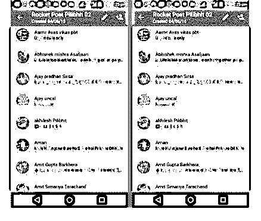
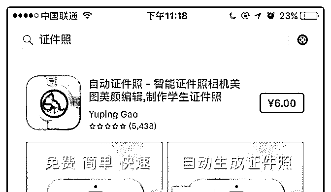
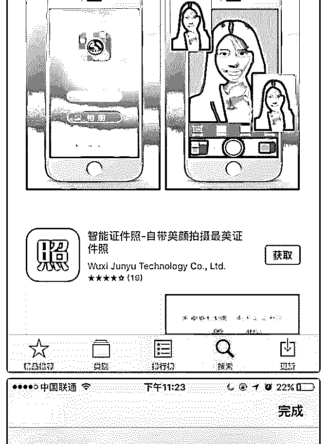
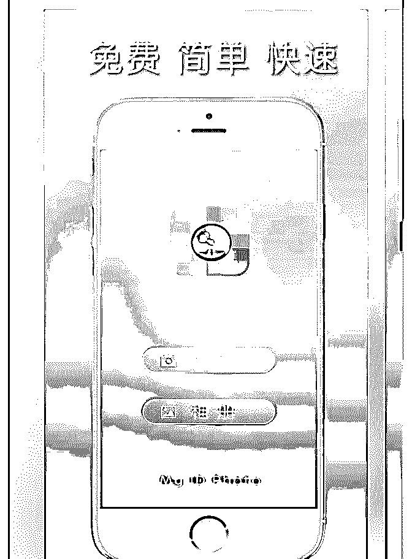
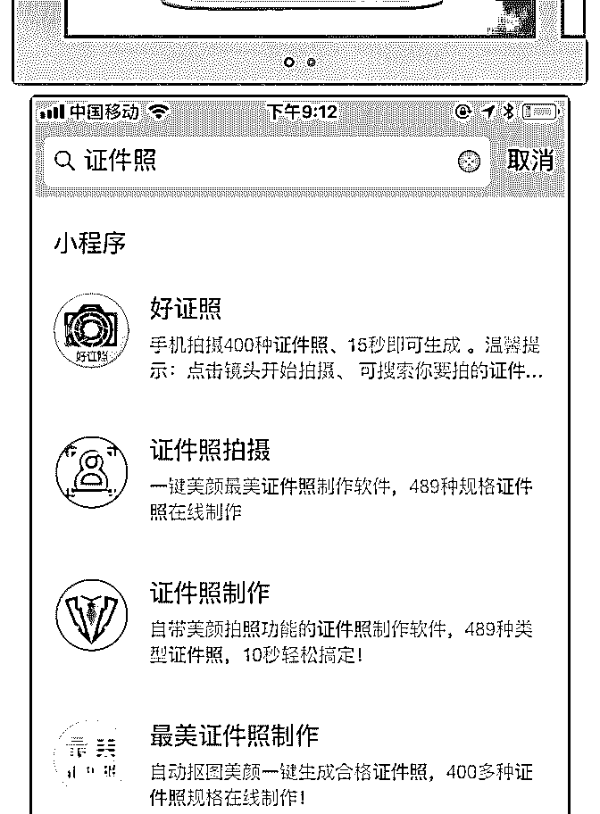
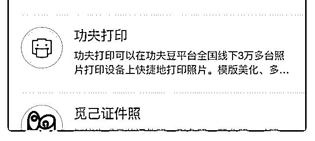

# 第 13 个 在印

陈子墨 每晚 9 点分享* : 第 13 个

在印度，有一个 RocketPostLive 团队，他们和国外很多创业者 不一样，不去开发自己的新闻网站，而是通过 WhatsApp,—个 类似微信的即时通讯 App，开辟了一个频道来传播本地的新闻 内容。

而为了解决资金来源，他采用付费订阅的方 式，成功获得 11400 多名用户，其中，有大约 8000 多人愿意支 付 1 年 100 卢布（约 1.5 美元）的订阅费用，成为付费订阅用 户。

[详情点这里](http://www.ifanr.com/814748)[在印度，有人用](http://www.ifanr.com/814748)[+WhatsApp+](http://www.ifanr.com/814748)[做了个公众号，付费](http://www.ifanr.com/814748)  [用户占比超](http://www.ifanr.com/814748)[+80%+|+](http://www.ifanr.com/814748)[爱范儿](http://www.ifanr.com/814748)

2018-02-04(3 赞)

评论区：

富布斯 : 有想法，说缺资金都是借口

关注公众号"懒人找资源"，星球资源一站式服务

第 10 个 这是 陈子墨 每晚 9 点分享* : 第 10 个 这是一个价值几十倍门票钱的信息。

几乎每个人都有证件照的需求，但绝大多数照相馆都不会给 你电子版，这就衍生出来一个需求：自动生成证件照。

APp store 上，搜证件照，排名前列的 App 付费 6 元，光点评 就有 5439 份，更不用说下载量了。

小程序上．目前还没看到做的很大应用，目前还是可以切入 市场。谁先做出来推广出去，谁就有很大的机会赚到几百倍 甚至几干倍的门票钱。

2018-02-01(1 赞)

评论区：

Joke : 这个支付宝里好像有这个功能？

关注公众号"懒人找资源"，星球资源一站式服务

关于 POP 流量的终 富布斯 : 关于 POP 流量的终极指南连载九 最终指南

我们来谈谈来源。正如你可以知道有很多不同的地方，当你 可以买 POP 流量。他们都有优点和缺点。

正如您所知道的“ 流量来源 ” - 这是一个连接广告客户（需要 流量的人）和发布商（拥有自己的网站并希望货币化的人） 的公司。而这个网络抓了一个％（可以是 20％或 80％ - 取决 于每个来源）。所以我们不会谈论他们的所有机制。只是你 应该知道，你需要选择你的来源非常有意义，因为有很多机 器人的狗屎来源或来源很多。

您可以使用一些不同的成本模式来购买流量： 中共 - 我们支付每次访问;

每千次展示费用 - 我们支付 1000 次访问;

注册会计师 - 我们支付每一个行动;

来源＃1≠来源＃2 您可以使用大约 300 个来源，但您必须了解没有理想的来源：

每个来源有不同的酒吧（站点），因此流量可以从源到源非

常不同。您只需运行两个具有类似定位/优惠/登陆器的广告系 列即可获得完全不同的结果！喜欢-70％和+ 400％！这是正常 的事情。

每个来源都有强大的垃圾 GEO。例如，一些网络可以给你+ 200％的欧盟活动，但在亚洲国家只能达到-90％。

所有的话都有不同的分。总的来说，这并不是一个保证，如 果你在一些新的基础上增加 1000 美元，你将会得到很好的投 资回报（因为有些网络喜欢说：“我们有一个很大的分数，因 为我们是一个超级严重的来源并有超酷的交通 - 这不是真 的！）; 每个来源都有自己的经理和 supoprt，谁可以帮助你创建你的 竞选活动，告诉你一个好的出价开始等... 每个来源都有他自己的百分比（是的是的，我在一些公司工 作，我完全知道，但不要害怕，最好的来源有约 1-10％的机 器人，不是很多。没有任何 bot 流量）。 在某些渠道，您可以使用 CPA 或 CPM 模式购买流量。有时对 于某些来源，使用 CPA 运行会更好，而使用 CPC 模型运行的 则更好。测试了很多！ 所有来源都有自己的最低和建议的出价。例如，您可以在源

＃1 中设置$ 1 CPM，在源＃2 中设置$ 15。经过测试，您可以 从＃1 = -20％ROI 和＃2 = + 170％获得！

我推荐的来源与

＃1 Popads 一起工作 这是我有史以来最好的来源之一，因为： 快速适度

便宜的交通 很多国家 一分钟。总和支付 良好的支持

他们允许进取的促进！ 一个好的设计。 最好的定位！

如果我们谈到这个来源，我可以说这些家伙在亚洲非常强 大，拉美，欧盟也很好，但是有些 GEO 我不能盈利。开始 时，您可以设置 0.002 欧元的出价，其他国家可以设置 0.001。 我也有一些有竞争力的竞标，竞标价格为 0.0004，竞争对手如 TR，BR 等等。有时候它很酷。你收到了一些流量，但你的投 资回报率可以达到+ 500％和更好。您可以定位所有参数，如 操作系统和浏览器版本，载体，语言等。

＃2 PopCash 第二个好的来源对我来说。因为： 这些人流量不大，但质量很好; 他们在欧盟非常强大; 最好的支持之一;

快速适度;

很多好酒吧。

他们允许在 2-3 层进行积极的宣传

这个来源对欧盟来说有一个非常酷的流量，但是在亚洲我没 有一个好的结果（90％的情况）。拉塔姆也很好。他们没有 像 Popads 那样的大型定位，但是你可以要求支持关闭一些浏 览器和打开/关闭运营商流量。注意！他们没有针对特定的运 营商，但你可以针对所有的 3G /所有 WiFi /所有 3G +的所有 WiFi。询问关于 TOP 投标的支持，它会帮助你很多，导致在 这个来源你可以收到一个非常酷的交通与高出价。

＃3 Propellerads POP 流量的另一个非常好的来源。

这是最大的 POP 网络之一。他们拥有数十亿的流量。 良好的 AM 可以帮助你的营地;

良好的 SSP 平台; 很多很好的流量，但在这个地方，如果你想要一个好的投资 回报，你必须付出很多！他们不会以低廉的价格卖给你。 一个很好的 CPA 模型

要小心，这些家伙不允许进行积极的宣传。你必须创建干净 的着陆器或 cxxxxx。如果你想使用这个来源，你至少需要 500 美元的预算，因为有很多的流量，你需要花费大量优化之 前。我建议为每个广告系列设置 50 美元的预算。他们也有一 个非常酷的 CPA 模型，我现在更喜欢使用它，因为如果使用 CPA 模型，您可以获得比 CPM 更多的定性流量。但是我们稍 后再谈。

2018-01-22(2 赞)

狼噬夜 :

关注公众号"懒人找资源"，星球资源一站式服务