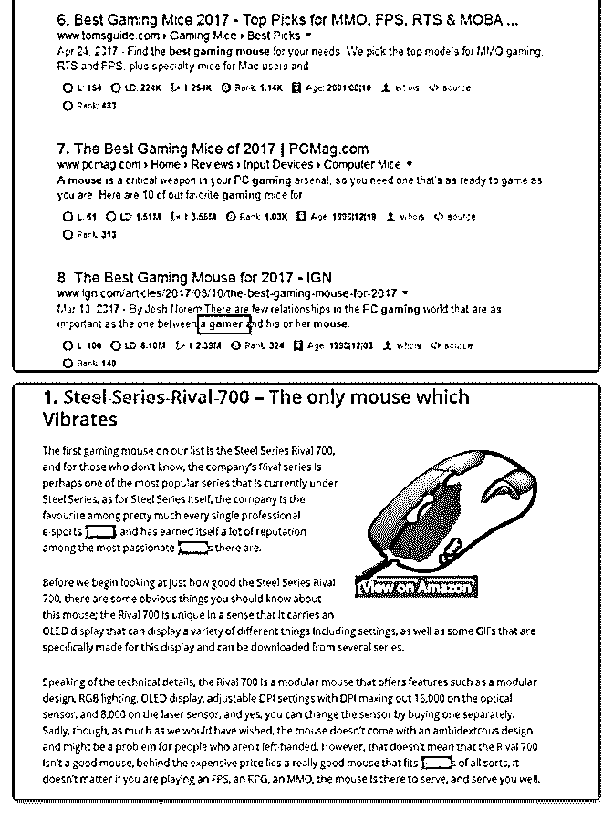

# 之前分享过一篇《

之前分享过一篇《 》，关于，很多人对这个网站感兴趣。我

也在博客上分享了这个网站的价值 99 美元的主题。这里还有 一篇针对 10beasts 的分析，大家可以看看

分析 10beasts 链接来源、on-page 优化等角度看 下别人是怎么 成功的。 我们先在 SimilarWeb.com 上面找到这个站 点，然后 看到 top 5 organic keywords，我们找到了其中一个 best gaming mouse, 因为他的增长速度去到 100%，非常抢眼。他的链 接 是

我们在 Google 搜索，发现这个网站排名在第四(顺便仔细观察 下， 他的 CTR Method 也做过优化，描述以及标题都是经过 处理的，而 不是由 Google 自动分配的)

链接来源:

我们可以从 ahrefs.com 那分析当前页面的链接来源。从 ahefs

导出 的数据来看，这个页面并没有什么反链，反链大部分是

一些 SEO 检 测，论坛等链接，而且论坛类的几乎都是

nofollow 的。 比较有用的链接:

DA 84

DA 78

对，真正有用的链接只有两个，但是 Alltop.com 这个要上去

就非常 难了, 他代表着高质量博客内容的象征。

On Page 优化

On Page 优化有很多细节，包括 标题、描述的设定

H 标签的规范使用

*   ody text 关键词的摆放

关键词密度设置

LSI 关键词的设置

超级长文

恰当的文章内容排版 。。 。

1)描述及标题设置

首当其冲的就是先把 title，description 设置好，这个可以通过

yoast SEO 提供的建议来进行优化，我们可以看到这个页面的

标题是

TITLE: Best Gaming Mouse 2017 – Buyer’s Guide 其中就包含了 best gaming mouse 这个关键词，而且关键词靠 前。 Description:A lot of factors backing this up. From grip to

sensitivity to DPI switching. It was not easy to create the list of Best Gaming Mouse 2017 描述一如既往，描述肯定会出现具体的关 键词 Best Gaming Mouse。

2)H 标签使用规范

一般文章内容页，我们只取标题作为 H1 标签，然后在各分段

标题里 分别配置 H2、H3 标签，一个页面的 H1 标签不能多

次使用。 而这篇文章中， 只用了一次 H1 标签，其余的小标

题都是用 H2 标 签，这个也是符合规范的。要记住一点就

是，H2 标签是对 H1 标签 的具体阐述。

3)body text 关键词摆放及 LSI 关键词设置

LSI 关键词其实与我们所说的同义词是有点类似，他是 google

在搜 索部分关键词时额外推送的一些关键词，这些关键词的

意思和我们想 要搜索的关键词意思相近，我们称之为 LSI 关 键词。

当我们搜索 Best Gaming Mouse 的时候，会发现有些粗体的关 键词 并不是我们搜索的，比如下图的 gamer，这个词就是我 们所说的 LSI 关键词。

那 10Beasts 有没有吧这个 LSI 关键词放到文中呢?显然是有

的。 整篇文章一共出现了 36 次。

而 text body 还有一条非常重要的要领，就是文章前端必须要 出现关 键词。 前面简短的说完几句话，在第三小段的时候就出现了文章的 关键词。

4)关键词密度设置 其实关键词密度设置已经淡化了，现在关 键词不仅仅包含我们做的关 键词，还计算加入了 LSI 关键 词。所以我们保持主关键词在 2-3%左 右即可，顺带加入 LSI 关键词来让搜索引擎明确你文章的内容。 查询关键词密度， 可以使用 SEObook 的关键词在线密度检测工具

5)排版以及长篇内容 上面所说的关键词密度检测工具，不仅 能检测密度，还能查看你的 unique word 究竟去到多 少，unique word 越多，说明文章的质量 度相对较高。

而且 10beasts.com 的网站排版非常简洁，包括文章内容都有 明显的 区分，看起来不会让人厌倦，这样有助于降低跳出

率。而深度长文又 能很好的增加读者的停留时间，让谷歌判 断这个页面就是搜索者想要 看到的内容。

6)压缩优化 我们点击文字的源代码来看，发现页面是有被压 缩过的(所有文字都 黏在一起，去掉了空格等字体) 这样能节省页面的加载内容，提高加载速度。 其中还有一个 非常小的细节，就是他每篇文章都会加入

评论区：

富布斯 : 10beasts 的那套 wordpress 付费主题，价值 99 刀。可以到这里下载： 主题跟官方这套一样的：[下载错误](http://www.fuyuzhe.com/download/1081/)

[Aspire+Pro+Theme+by+Appfinite](https://my.studiopress.com/themes/aspire/)

对方正在输入... : 提示下载错误，能不能重新编辑一下?

富布斯 : 到博客下载

Booger : 博客上的链接也失效了！

富布斯 : 资源转到论坛上了

关注公众号"懒人找资源"，星球资源一站式服务

# #案例分享# 看

James.N.Re* : #案例分享# 看到一个不错案例，转载过来 wordpress 的主题探测

不知道圈子里面用 Wordpress 博客程序的人多不多，用的话基

本也应该像我一样，折腾过各种主题。

特别是看到别人的博客装的主题很好的时候，想知道别人装 的什么主题。 这就像对于女生，看到别的女生身上的衣服很 漂亮， 很想知道是什么牌子，什么款式。 以上为需求和痛点。

衍生出来解决这个需求的产品是主题探测器。 只要将你看到的博客的任意一篇文章的链接放到探测器里面 去，就可以查到这个博客装的是什么主题，什么版本的，主 题网址是什么。

看具体案例：

Google 搜索 wordpress theme detector， 排名第一的网站：

流量月 67 万，日均 2 万多。 搜索和直接引流各一半。 盈利方式是推荐主题和主机获得佣金， 类似于淘宝客，很多

主题网站会提供非常高的佣金比例。 不像之前分享过的表情

或者 youtube 视频下载题材的， 博客主题和主机题材的佣金收 入非常高，这个网站的收入甚至可能不弱于月 670 万流量的表 情站。

按照 1000 个 IP 的估算收入 20 美元（可能还低估了），这个网

站的每月预估收入是 13400 美元，折合人民币 93800 元。

这个小需求目前在中文网站中好像还没看到有满足的，也许 是个机会，有兴趣的可以试试 看。[WordPress+Theme+Detector+-+Free+online+tool+to+fin...](http://www.wpthemedetector.com/) 2018-01-16(6 赞)

关注公众号"懒人找资源"，星球资源一站式服务