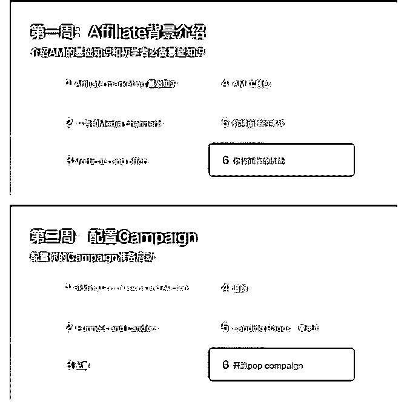

# 新人想通过好的联盟

富布斯 : 新人想通过好的联盟，总是会有各种担心和困扰，该 怎么推荐自己，应该填写什么信息？那么在本篇，我会告诉 你如何填写，并会提供一些自我推荐模板，以及目前来看比 较更容易接受新人申请的联盟

Tip #1: 做个网站 很多联盟申请表有“网站”一栏。那就做一个网站填进去。

网站可以一下子让你看起来很专业；买个域名，用一个想好 的商业名称（如果没有，就好好想一个，甚至可以注册一个 公司。否则就是个人）。

一个简单的网站就够了——这里我们提供一个简单的网站模 版，简单修改即可。

Tip #2: 制定周密的行动计划 你必须知道你自己在说什么，并且你希望得到什么。

这意味着你必须提前做好功课，然后做一些商业决策——你 是否会专注于 Facebook？或者大人约会？App installs？

然后把决定填入相应的空格。如果你确实不知道他们到底要 求你填什么，那可能意味着你需要再了解一些知识。

如果你已经被接受了，那这里也没什么了，你的新 AM 不是 你的私人助理，也不是你的私教。他们只是在你需要的时候 给你提供 offers，并且会试图让你推广那些他们需要推广的。 不要指望在联盟里学习你需要的知识，没人会教你。提前自 学。

Tip #3: 跟进 不要在没有很快收到答复的时候就急于进一步询问。

这么说的意思是，你要记住联盟每天会收到上百个申请，你 必须更加耐心一些。不要直接联系他们让他们把你通过。

你要等个几天再联系他们（邮件、论坛、Skype 都可以）。保 持专业，不要去求他们。

Tip #4: 告诉他们你参加过一些大神的培训 如果你参加一些国外大神的私人培训，或者直接让大神帮你 推荐都是获得通过的好方法。

接受新人的联盟 排序不分先后可以试试去注册。 Peerfly

Appflood

Avazut

Adsimilis

Clickdealer

Neverblue

Mundo Media

InterG Media

AffiliaXe

2017-12-02(11 赞)

评论区：

富布斯 : 注册联盟的技巧（自荐信模版） 对于那些担心的自我介绍不过关，或者英语不是母语的，按照下面的技巧，然后 加入自己的发挥。这些主要是给 Affiliate Marketing 中的新人看的！ 以下是模板 Hi, my name is Dave and I am an affiliate

marketer based in City, Country.I am relatively new to the world of affiliate marketing but eager to learn. I’m well-briefed on the basics of affiliate marketing, what to expect from networks and how to best grow my business with you over time. I am most interested in the X vertical and Y as traffic sources right now but am keen to see what offers you have available that may be suitable.I look forward to working with you! Please get in touch at any time on +123 456-7890-123 or contact me on Skype at ‘name_ here’ and I’ll be happy to answer any questions, proceed through any interview processes you have and so on. Regards, Dave X

Charon : 厉害了[呲牙]

帝都牛人 : 模板很有用，我就用这模板搞定了一个联盟

# #国外 affili

富布斯 : #国外 affiliate 教程# Affiliate Marketing 完美中文版视频 教程

1.《Affiliate Marketing 完美中文版视频教程》是什么？ 富裕者联盟+Affren 联手倾情打造的 Affiliate Marketing 完美中

文版视频教程。

这是 affiliate 业内最具价值的完美中文视频学习教程，本课程 内容涵盖全球顶尖 STM 论坛营销课程精华，课程内容包含所 有新手对于 Affiliate Marketing 基础概念、入门、实操、案例以 及课后实操任务清单，全套系列最科学的国外网赚系统的教 学体系。

STM 权威课程在国外高达 2997 美刀，让很多新 Affiliate 望而却 步，因此我们根据实战经验与案例，涵盖 STM 的精华营销思 想推出这套《国外网赚最具价值的 Affiliate 完全 STM 中文视频 教程》。

新手：我 TM 到底应该从哪里开始？ 每天看各种文章学习充电大量下载所谓的日赚 XXX”VIP 免费

教程”，但即使学习到一些碎片化知识,实际上仍然不知道从哪

里开始。糟糕的是，用了大量时间和金钱还是在阅读状态。

无法入门：尝试了很多次，但是失败了？ 照着一些不科学的教程和零碎的知识花费了几万元购买工

具、测试成本，却永远是亏损状态.在网上大家说的都很简

单，为什么到自己做就是无法实现盈利？

铺天盖地、质量参差不对称的网赚教程资料 每天习惯搜索各大社区国外网赚博客，看无数碎片式的教程

文章，除了不断的看，不断的忘，甚至被质量不对称的内容

误导，满屏鸡汤鸡血文，真正赚钱的事情，都不说出来。

2.如何解决以上通病？

学习 affiliate 的基础要点，竞争性分析评估，科学的 Offer 优 化技术

每个知识点结合案例讲解，展示我们如何通过策略盈利

循序渐进科学系统的视频教程.难点逐个击破

涵盖全球顶尖 STM 营销课程精华,跟着国外大神节奏走

3.它适合我吗？

上班族、大学生、兼职每天 2-3 个小时皆可，全职更佳。 此课程无需技术基础，技多也不压身。 对于数据有一定的敏感度更佳 具备 2018 年挑战国外网赚成功的机会和动力

4.课程怎么收费？

由于本次课程工作量较大，《Affiliate Marketing 完美中文版视 频教程》采取订阅的方式，每周一、周四推送课程。如果您 提前订阅，最大将获得 5 折的课程优惠价格，先人一步学习赚 取美刀。

正式推送《Affiliate Marketing 完美中文版视频教程》课程时间 为：12 月 4 日。

完整课程订阅价格：2597 元 提前订阅课程价格：1297 元（往后每隔 10 天恢复 100 元，直至 恢复 2597 原价） 12 月 4 日起，每周一、周四推送一课。越早订阅越优惠。

5，大神从不犹豫，只关注得失 学习本课程的所有学员，免费进入《富裕者答疑分享圈》，

获得富裕者本课程的所有学习和实操答疑。

大神从不犹豫，只关注得失 与其犹豫，不如找我聊聊。QQ:718079 具体本课程详情和实时费用，请见：

[国外网赚最具价值的](http://www.fuyuzhe.com/jiaocheng/affiliate-fuyuzhe.htm)[Affiliate](http://www.fuyuzhe.com/jiaocheng/affiliate-fuyuzhe.htm)[完全](http://www.fuyuzhe.com/jiaocheng/affiliate-fuyuzhe.htm)[STM](http://www.fuyuzhe.com/jiaocheng/affiliate-fuyuzhe.htm)[中文视频教程](http://www.fuyuzhe.com/jiaocheng/affiliate-fuyuzhe.htm)[-](http://www.fuyuzhe.com/jiaocheng/affiliate-fuyuzhe.htm)[富裕者联](http://www.fuyuzhe.com/jiaocheng/affiliate-fuyuzhe.htm)

[盟](http://www.fuyuzhe.com/jiaocheng/affiliate-fuyuzhe.htm)

2017-11-27(8 赞)

评论区：

Wolf(富布斯助理* : 支持富神

风影 : 博客站经常挂，老富该考虑换个服务器了~[咖啡]

风影 : PC 端无法访问

富布斯 : 阿里云的服务器，也不便宜啊。是哪个页面经常挂？

风影 : 整合 PC 站，哦，是我这边的网关问题，我关了 SSR 才能正常访问

