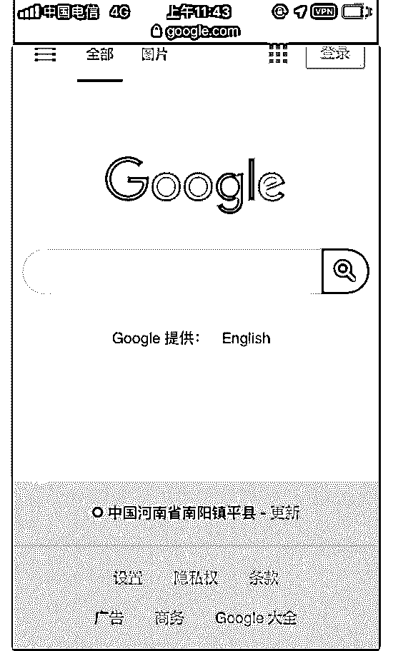

# vu ltr 搭建 s

(提问)沉默。 : vu ltr 搭建 s s，手机连接上，能访问。全剧模 式。

网页打开是美国 i，p 为什么登陆了 instagram，fb 这些软件里面的定位依然是我自己 位置。

我这叫暴露了吗？

2019-09-12

回答：也不能说是暴露，只是你这个机场的 ss 没有具备隐匿性

罢了(0 赞)

评论区：

郑成功一个姓、名小東* : 你可以用 ssr，打开全局，它得隐匿性就还可以哈！我平常就用 ssr 或者直接买 vps 远程，就可以完

美避免真实 ip 暴露的问题。如果你做灰色的项目就用 vps 远程

沉默。 : 我就用的 ssr 全局，查了一下是因为定位走的 wifi、gps 之类，用 ssr、vp，n 这些只要用手机软件里面的定位、附近的

人之类。都会定位到你本机 ip 位置、你可以试试…

郑成功一个姓、名小東* : 你只要不给它 wifi 或者授权就可以了

郑成功一个姓、名小東* : 你在电脑上操作显示的 ip 就是 vps 的地址了

关注公众号"懒人找资源"，星球资源一站式服务