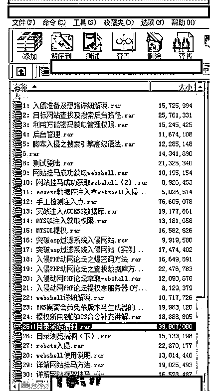
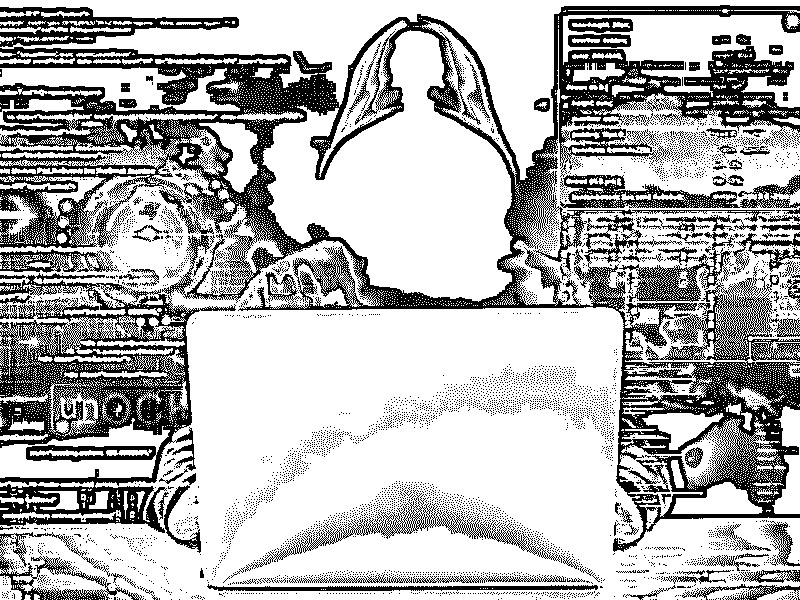
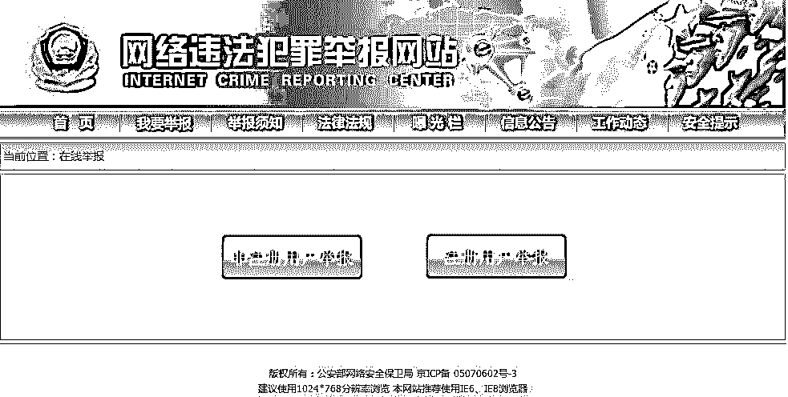

# 深度| 2017 年中国地区网络犯罪权威调查报告

> 原文：[`mp.weixin.qq.com/s?__biz=MzIyMDYwMTk0Mw==&mid=2247489510&idx=1&sn=268afc36f5aeeaa57e4861689ac019a0&chksm=97c8dcdea0bf55c8f06ddb684a5cc1307ba2384a4b431416af8656353fac7ab5439e7dae1b35&scene=27#wechat_redirect`](http://mp.weixin.qq.com/s?__biz=MzIyMDYwMTk0Mw==&mid=2247489510&idx=1&sn=268afc36f5aeeaa57e4861689ac019a0&chksm=97c8dcdea0bf55c8f06ddb684a5cc1307ba2384a4b431416af8656353fac7ab5439e7dae1b35&scene=27#wechat_redirect)

## 一.中国当前的网络犯罪情况概述

中国地下网络犯罪活动的利润现已超过了 151 亿美元（约合人民币 1004 亿元），并造成了超过 138 亿美元（约合人民币 917 亿元）的经济损失，其中涉及到数据泄露、身份信息/凭证窃取、以及网络欺诈等网络犯罪活动。根据一份最新的研究报告显示，这些地下黑客也在逐步展开和扩大国际网络犯罪业务了，因此将来越来越多的外国企业很可能将会受到中国地下黑客的攻击。值得一提的是，目前的网络地下黑市中开始出现了越来越多的高级黑客工具，例如僵尸网络、控制服务器基础设施、远程访问工具以及有针对性的漏洞利用工具等等。除此之外，地下黑客们甚至还开始提供恶意软件开发和开源代码编写等有偿服务。

除了上述攻击工具和服务之外，中国的地下黑市还提供了例如垃圾邮件、DoS 及 DDoS 攻击脚本、入侵路由器和网络盗号等服务。这些网络犯罪集团组织严密，并且主要通过扣扣来与客户建立买卖关系。

这些网络犯罪组织还会建立某种“师徒关系”，并依此来招募和培训新的成员，以求扩大其网络犯罪业务。根据统计数据显示，中国黑客在网上所销售的信息窃取工具以及社会工程学攻击工具已经给全球企业造成了数十亿美元的经济损失了。

## 二.网络犯罪组织的运营模式/结构

随着中国经济朝着数字化方向发展，中国网络犯罪地下黑市以及相应的服务也日趋成熟。这些网络犯罪集团的组织严密，分工明确，但是跟美国和俄罗斯的同行们相反，中国的网络犯罪组织并不十分依赖于暗网（深网）。

**关于暗网的详细调查请看视频**：**全球最大“暗网”被灭！揭秘全球最大网络犯罪交易平台**

[`v.qq.com/iframe/preview.html?vid=f054083ampj&width=500&height=375&auto=0`](https://v.qq.com/iframe/preview.html?vid=f054083ampj&width=500&height=375&auto=0)

越来越多的网络犯罪组织开始利用扣扣来实现自己的业务了，这些网络犯罪集团通常都有明确的网络犯罪运作机制。比如说，恶意软件开发人员通常会在网络上销售自己的产品来获利，但他们并不会参与地下犯罪活动。他们的代码通常都包含了“后门”，而他们可以通过这些“后门”来持续访问自己所开发的软件。

在中国网络犯罪组织的地下网络中，黑客扣扣群的群主（也被称为大虾或车主）一般就是网络犯罪团伙的主谋，而黑客扣扣群的群主会从恶意软件开发人员或“批发商”那里购买或获取恶意软件程序。如下图所示，黑客扣扣群的群主会招募成员或追随者，这些人通常被称为“学徒”，而群主则会向这些“学徒”们传授黑客技术，比如说“搭建钓鱼网站来盗号”或者“入侵银行账号”等等。在大多数情况下，黑客扣扣群的群主还会向他们所招募到的学徒们收取培训费。经过一段时间的培训之后，这些学徒中的一部分人将会成为专业黑客，并继续为群主工作。需要注意的是，这些学徒还需要参加多次网络犯罪任务才能顺利“毕业”。一般来说，这些黑客扣扣群是不允许随便加入的，群主可以接受或拒绝网络上的会员请求。

### “群主-学徒”机制

黑帽技术培训在黑市上越来越受欢迎了，因为黑客业务的利润率在近几年里一直在“直线”上升。某些黑客组织会利用各种培训项目来招募新的成员，一旦这些人完成了培训，被选定的成员将有机会作为“亲传弟子”来接受更加高级的黑客技术培训，而这些人之后将会成为全职黑客并负责发动一些有针对性的或十分复杂的网络攻击。经过一段时间的培训之后，学徒们可以通过参与网络犯罪任务来获取并积累更多的实战经验，这些网络犯罪任务包括窃取银行账号和密码、信用卡信息、私人照片、个人视频、以及 Q 币之类的虚拟货币等等。

地下黑客所提供的部分培训项目以及材料如下图所示：

## 三.产品和服务

在最近几年里，中国的网络犯罪地下业务不仅变得更加结构化和制度化了，而且离普通人的距离也更加近了。现在有很多黑客扣扣群都会提供黑客服务，这跟在现实世界中是一样的，网络犯罪分子和黑客在线接活，潜在的客户可以给他们提交自己的服务请求，其中需要包括攻击类型、目标 IP 地址、以及需要部署的工具等等，然后在线支付订单即可。比如说，某个黑客扣扣群可以提供网站攻击服务，而这项服务的成本可能高达几万块钱，具体金额需要根据任务难度以及目标系统的安全级别来定。除此之外，有一些黑客扣扣群甚至还会雇佣黑帽黑客来攻击企业或政府来谋取利益。下面给出的是其中的部分热门攻击服务：

> 1.   DDoS 服务
> 
> 2.   黑帽培训
> 
> 3.   恶意软件/漏洞利用工具出售
> 
> 4.   高级持续性攻击服务
> 
> 5.   开源软件代写
> 
> 6.   网站攻击服务
> 
> 7.   垃圾邮件服务
> 
> 8.   流量出售
> 
> 9.   钓鱼网站出售
> 
> 10.  数据库入侵服务

## 四.购买黑客服务/恶意软件

某些黑客组织还会给一些没有技术背景的客户提供 7*24 小时技术支持服务，而且他们也可以根据需要来给客户提供黑客技术演示。在某些情况下，黑客服务或产品的价格是可以商量的，价格达成一致之后，受雇佣的黑客会给客户发送一封带有详细支付信息的电子邮件确认函。而潜在的客户需要通过 X 宝或 X 付宝来完成交易转账。不过在大多数情况下，客户需要支付一定的预定金，定金金额大约是总金额的 50%。一旦任务完成，黑客将要求用户支付剩下的金额。

### 黑客服务交易流程步骤如下：

> 1.   协商价格
> 
> 2.   交付定金
> 
> 3.   攻击演示（如果需要的话）
> 
> 4.   开始黑客服务
> 
> 5.   支付余额

如果需要购买软件工具（例如恶意软件、攻击工具和漏洞利用工具包）的话，买家则需要一次性支付全款。

### 恶意软件购买的交易流程步骤如下：

> 1.   协商价格
> 
> 2.   支付全款购买
> 
> 3.   收到产品

## 五.网络犯罪案例之骗局项目揭秘

网络犯罪往往伴随着欺骗的行为，他们大多数以实际项目为诱饵，以高回报的许诺来诱惑那些想低投入高收入的人群，下面灰产圈来揭秘 2017 年最常见的网络骗局项目：

**一：低价手机充值卡**

超低价手机充值卡，无法想象的便宜，只需一折，就是说 100 元的充值卡只需

要 10 元就可以买到，叫你拿到网上卖或地面上，卖来赚钱。并且还是货到付款

的。实际上这些都是空卡，但是做工和包装都是很好的，看着像真的，收货的时

候，快递员不让刮开验货的。有的让验货就是最面上一张是真的，其它是假的，

这些年我遇到好几个被这个骗术给骗，大多是想赚钱的，还有一个是想买来自已

用的。这类广告这两年较少见，但还是有，需要注意别被骗了。

**二：  淘宝刷信用，刷单**

现在不仅仅局限于淘宝了，天猫，京东都在刷。这行鱼龙混杂，有真刷的，有骗

人的。真实的刷单价格是一单的价格在 1-10 元左右，主要是根据淘宝账号等级

来决定的。坚持做下去也可以赚到一些钱，但是累，不多。如果要做也要通过朋

友找到靠谱的组织，一般有一千元左右就可以启动了，花几百买账号，几百交平

台压金，剩下的来做刷单费用。骗子宣传的技俩是按成交额来算收入的，刷一单

100 元的给 20，刷 1000 一单就给 200 元了，就几分钟就完成的事，实在是诱

惑人。这个时候越想赚钱，被骗的越多。刷一次还不够，后面会找各种理由让你

接着刷，电视上面经常曝光有人被骗几万元的。这些钱都进入了骗子伪造的网站

上面了。现在骗子也学聪明了，刷单价格跟普通的一样，什么都模仿正规刷单平

台的来，最后就是本金不给你，刷单佣金更不用谈。对于刷单，我们要拒绝诱惑，

找信得过的人介绍靠谱组织。

**三：先培训赚钱再交钱的陷阱**

毫无悬念，绝对的骗子，这个行业没有雷锋。比较好的就是可以免费分享一些心

得，但不是免费培训你赚钱，就是免费培训教你赚钱，即然免费了还收什么学费

了。先培训赚钱，再交费的都是骗子，培训的过程就是给你洗脑，很多课程看完

了就想交钱买他们的网站软件之类的，还有的是自已准备了网站最后做的是他们

自已的联盟，最后还是不给结算，又要交钱，总之各种坑。现在这种模式经过各

种伪装，你看到的不一定是我刚才说的那样，模式非常多，所以请远离先培训赚

钱再交钱，否则要么浪费时间，要么被骗。

**四：支付宝漏洞刷钱**

无论哪种模式都是骗子，你照着演示一次，你自已支付宝的钱就转到骗子支付宝

了。不用多考虑，这种是不可能存在的。即使有，没有傻子会把他公布出来。

五：时时彩保底日赚五百元

俗话说，十赌九输，靠玩彩票赌博怎么可能日赚五百元了，这个铁定是骗人的。

一般会先让你加入 QQ 群，里面全是托，不停的发购买计划，发赢了钱的截图，

不少人因这个输的很惨。做时时彩代理可以赚钱，但是这个伤天害理，骗人的，

电视上也曝光过，警察叔叔在打击，切记不要操作。

**六：点击赚钱**

真实的点击赚钱项目是存在的，比如国外的 neobux，国内的点击赚钱要么连个

电费赚不到，要么就是骗子。常见的手法有先到网站花多少钱买个会员，级别不

同，点击广告的价格不高，最少都是几块的，有的夸张到上千块一个点击，简直

太浮夸了。还有就是先让你点，最后要提现的时候，要么不给你支付，要么要你

交一定的费用再让你提现。就目前来看，一个新人靠点击是赚不到钱的，不用注

意这方面的项目，全当骗子来识别就好了，可以有效的防止被骗。

**七：做任务赚钱**

体验任务站点注册送几十元，一个任务几十元 真实的任务网，游戏体验站点是

存在的，简单做下赚个电费没有问题，做的比较久的朋友也可以月入两三千元。

有人专门利用这个可以赚钱来欺骗新人，说的非常诱人，注册一个任务网就送几

十元，见过的 10 到 50 元不等，然后做几个任务就可以到一百元提现了。任务

也非常简单就是注册某某网站，下载某某软件，修改个签名等。等到提现的时候

就不给提了，此时又要交纳一定的费用，交了之后直接拉黑 K 号。诱导目标人

群去下载软件或者注册网站是网赚人经常会做的事，这个没什么，你贪小便宜，

想快速赚到钱，人家让你去下载几个软件，去注册几个网站没有什么，很正常。

但是事后又要交钱提现，交了更不给提，就是骗子了。

**八：挂机赚钱**

有人说挂机赚钱的项目都是骗子，这个也不对的，真实的挂机赚钱项目是存在的，

但是涉及的问题太多，软件，平台等等，只有极少数的高手可以操作，并且这样

的项目都是自已个人或团队研发，是能真正做到挂机赚钱的，但绝对是不可能收

你几百块培训费用就公布出来的。所以说在网上有人跟你说有个挂机项目交个几

百块就可以日赚多少的，你全当他放屁就好了，有这么好赚他跟你费话做什么，

直接去包个小网吧，自已买电脑挂着赚钱了。作为新人不用考虑有挂着软件就能

赚钱的项目等着你，都兑现不了承诺的，你试十次就会被骗十次，切记！

**九：投资分红**

此类项目在 2009 年开始流行，我第一次接触的是美国酷网基金，我也充进去了

100 元测试了一下，最后到提现的时候网站就登陆不上去了，大概就是这个套路，

描述的很美好，现实很残酷。这类网站还有个特点就是投资少的账号一提现马上

封，因为没啥投资潜力。投多一点的，如果你先提小部分，他不会封你的，等你

投更多，再提多的时候再封你。经历了五年多的发展，这种模式还非常多，不过

有通过各种方式伪装，你只需要记住，非正规机构，要你投资个几百块就可以自

已赚钱的就是骗子。

**十：各种云创富平台**

基本不用考虑，全是一些课程，互动性并不好。而且骗子复制的越来越多。交了

钱之后就是要你去推广他们的平台来赚钱。有的还融入了挂机赚钱，就是加入后

可以有个软件挂一天多少钱，真假你觉得呢，关于挂机参考骗局八。

## **六，总结：**

中国的地下网络犯罪活动主要针对的是中国公民和企业。然而，越来越多的网络犯罪组织开始提供针对国外网站或企业的黑客服务了。这些地下集团的组织十分严密，并能够通过一系列结构化的指挥链以及“师徒关系”来扩展其业务运作。在进行沟通和交易的过程中，他们则主要利用的是中国国内目前流行的扣扣以及 X 付宝（X 宝）来完成。

**（如果你被上述网络犯罪骗取钱财或者侵犯到个人利益，可点击阅读原文进行举报****）**

点击“阅读原文”加入高端社群。