# 深度调查|揭开“网络黑色产业链”的真实面纱，揭秘地下社工数据库的黑暗“艺术”！

> 原文：[`mp.weixin.qq.com/s?__biz=MzIyMDYwMTk0Mw==&mid=2247489489&idx=1&sn=933747e2bd832aac617c9fa7b903dc3d&chksm=97c8dce9a0bf55ff0607a073861d66950a7f8231d5b46a0f9694c61dba15221d808c1b81a6ce&scene=27#wechat_redirect`](http://mp.weixin.qq.com/s?__biz=MzIyMDYwMTk0Mw==&mid=2247489489&idx=1&sn=933747e2bd832aac617c9fa7b903dc3d&chksm=97c8dce9a0bf55ff0607a073861d66950a7f8231d5b46a0f9694c61dba15221d808c1b81a6ce&scene=27#wechat_redirect)

导语：

所谓的“网络黑色产业链”，是指以互联网为载体，以盈利为目的的有组织、分工明确的团伙式犯罪行为。一般来说，上游为提供技术支持的黑客或泄露个人隐私数据的内鬼，下游则是实施黑产犯罪行为（如诈骗、洗钱、骗贷）的团伙。

社工库，就是黑产地下数据库，其广博的深度，不比任何“大数据公司”差。黑客们盗取数据，留存在社工库中，供黑客们查询。通过地下数据库可查询到身份证号、银行卡号、常用密码、家庭住址，甚至开房记录众多维度的数据，这些数据被反复清洗、榨取价值，“直到渣渣都不剩下”。

本文将告诉大家社工库的存在有着怎样的危害？它是怎么让你“一步到位”的？你的个人信息是如何被盗窃的？

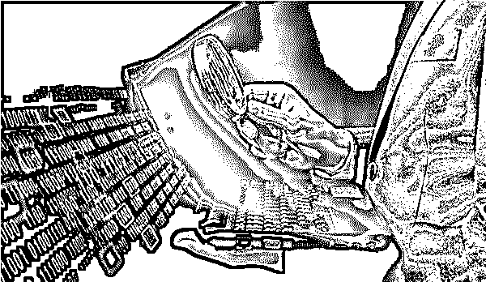

14 年，一家名为“我就是社工库”的网站，可通过输入 QQ 号查看该号主人大量隐私内容。这一附有数张网站截图的消息，立即在微博中被转发近 2000 次。

网站被群众举报后，当晚已无法打开。这家网站是网络中众多社工库的一个。

1、社工库是什么？

社工是社会工程学的缩写，是一种黑客攻击方法，利用欺骗手段骗取对方信任，获取机密情报；是一种利用人性脆弱点、贪婪等的心理表现进行攻击，防不胜防。

听起来似乎跟人肉搜索好像一个概念，其实不能把人肉搜索跟社工对等，准确的说，人肉搜索可以算作社工的一种应用。

了解了社工，社工库也就好理解了，字面意思是社工数据库。从上面的社工介绍大家明白了社工在信息收集方面的作用，这些信息中可能有个人信息有密码等等，那么，那么与其每次需要社工的时候再去搜集信息，当有某网站或某应用之类的数据库或相关一些数据泄漏出来或其他方式可以获得，那么为什么不提前收集起来，然后在需要时候再查询呢？这样不是更省事？

社工库看似简单，数据量足够大时，就容易查到自己想查的信息，但是其实也有许多问题，如不同数据库如何处理后入库，不同数据之间如何关联，大量的数据如何做到快速搜索……还是涉及挺多问题，当然这些就是数据库处理方面问题了。

就社工库来说，应该很多组织及个人手里都有一个社工库，可能来源主要都是那些泄漏出来的数据库，比如酒店登记数据，以前天涯、CSDN 数据泄露等。不同的社工库量都有多少？内容是什么，这个不尽相同。对很多社工库来说，存储达到 T，数据量达到亿级别都是小菜一碟。内容方面，账号密码、邮箱地址、个人信息等，也看大家自己的处理方式，这个就不一定了。

再看看网上的社工库，其实是作了处理，对外提供搜索服务。一个社工库，威力多大，就看数据库数量和质量，理论上达到了一定的量，很多的东西都是可以查出来的，特别是那些基本所有网站都一个密码，只要一个社工库收集其中一个数据库有他的帐号密码，那么查出来密码就可直接登陆该用户其他帐号了。

2、社工库的危害

“查一下社工库，哪怕你什么代码都不会编写，也不是黑客，但是却能得到本来十分隐秘别人的信息资料。”

在网上搜“手持身份证”关键词，就有一堆照片。如果你的这种照片被人得到了，他们都会用来做什么呢？

可能会用你的手持身份证照片开网店卖假货，出事后马上跑路，更严重点，他们会用你信息借网贷，不太正规的应急借贷认证非常宽松，坏人用你身份借了钱就消，这笔钱就要你这个冤大头去还。

灰产圈通过调查获取的销售手持身份证的网站

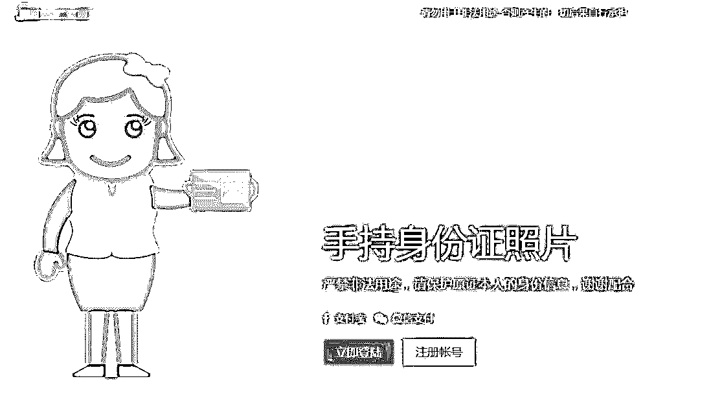

网站注册登录后显示购买界面：提供手持正反面，身份证正反面购买

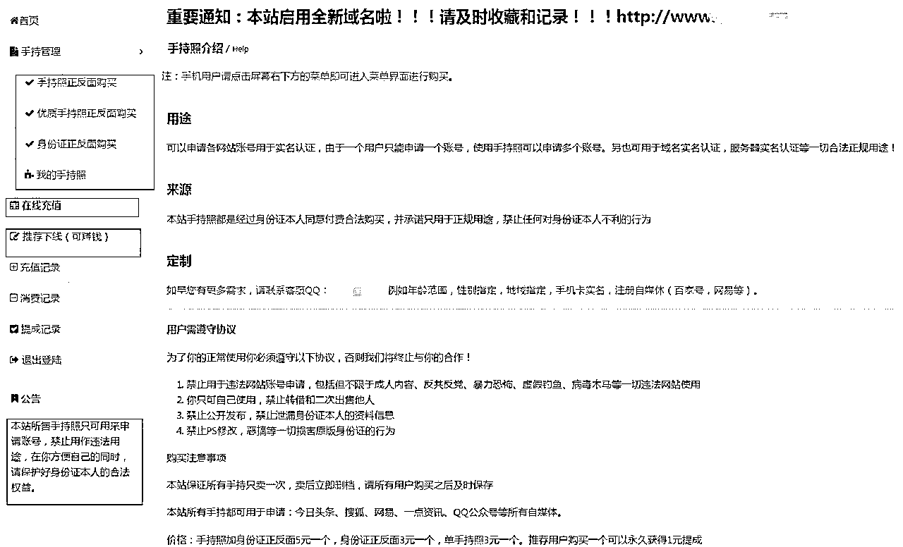

网站显示 手持正反面照片 单价 10 元每个

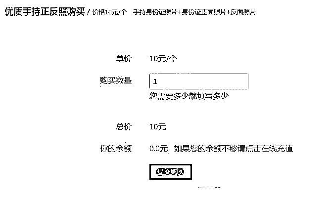

也许你想自己没拍摄上传过类似照片，就可放心了。然而这只是冰山一角，在互联网时代，想接近你，了解你个人隐私，很容易……比如，网上有种身份证查询工具，可通过身份证号查出你户籍年龄信息。

这还不算什么，因为身份证号是有规律的，知道了规律就很容易分析出来，比较简单。

如想获取一个人更多生活信息和个人隐私，手机号和邮箱之类是首选。

比如有些网站可查出你用手机号或邮箱注册过什么网站。其实这也不难，当你注册某平台账号时，如果输入一个已经注册的账号，网站会提醒已经注册过。所以这类网站就利用爬虫脚本（按照一定规则自动抓取网络信息的脚本）遍历各大网站，通过网站回执结果判定你输入的手机号注册过什么。

现 QQ 、微博 、微信 、人人社交网站都有“ 通讯录好友 ”，“ 可能认识的人 ”功能，只要在自己手机通讯录存这个号码，就能通过 “ 通讯录好友 ”功能来添加他了！关注了他微博，就可以看他过去微博找到他照片，了解他年龄，工作，所在地等，还能默默窥探他动向。如果想，甚至可关注经常和他互动的人（这种人很可能是他的朋友），从他身边的人身上来进一步了解他生活环境和其他信息。甚至可假装偶遇加他 QQ 或者微信跟他聊天，直接从他嘴里“ 套话 ”。

知道了 QQ 邮箱账号之类信息，通过社工库网站可以查询曾用（没准也是现用呢）密码。如果这个密码现在还能用，那事情可就变得很可怕了。因为除了可以查看他曾经的邮件来了解他，还可以通过邮箱账号查询曾经注册过的网站，然后再利用通过邮箱的密码找回机制获得登录这个邮箱主人其他网站账号的权利。通过登录这些网站，就可以短时间内获得账号主人的大量信息，这个人就变成了一个透明人。

还有更厉害的社工库可以让你 “ 一步到位 ”。一次搜索，搞定所有！姓名、住址、身份证、手机等等应有尽有。搜索结果还有来源这个选项，数据有很多来源，比如 “ 淘宝买家 ”，“ 7K7K ”，“ 天涯 ”，“ CSDN ” 等……

由于社工库里信息往往涉及隐私，所以社工库网站往往是非法的。很多网站经常被举报或查封，过段时间会换一个网址重新出现。一些社工库网站的服务器还设置在境外，躲避公安机关调查。

3、社工库的案例

国外案例：

Leakedsource.com 是一个著名的社工库网站（见图 2-8），被称数据泄露界的谷歌。用户可在该网站找到很多严重数据泄漏事件中泄漏的数据，还包括很多热门网站（例如 LinkedIn 和 Myspace 等）数十亿用户账号及相应登录密码。但在 2017 年年初，多家新闻媒体报道执法部门已经拿下 Leakedsource 的服务器。

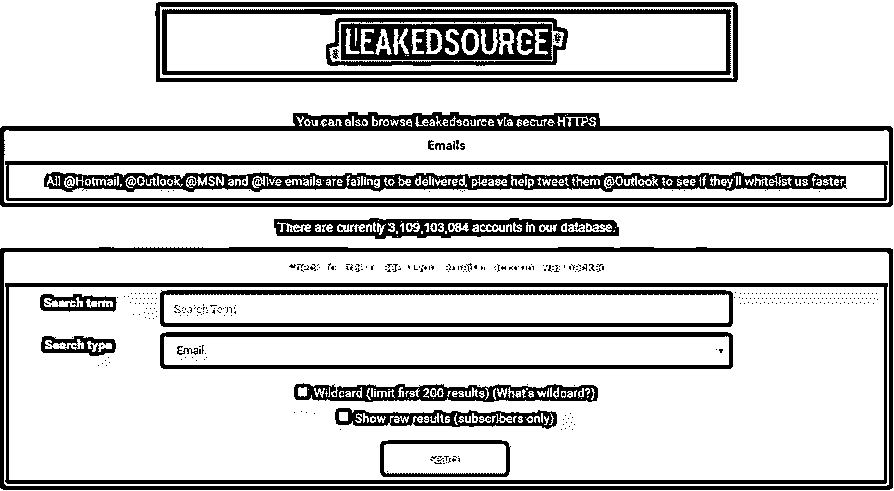 LeakedSource 网站

 LeakedSource 团队掌握并计划公布多达 1 亿被黑且尚未公开的“中国大型网站”泄露数据，而仅经过一年，LeakedSource 积累泄露数据就将近 30 亿， LeakedSource 原计划 2017 年通过其数据引擎公布 20 到 30 家被黑网站多达 1.05 亿条记录。然而随着网站关闭，这一计划失败了。 LeakedSource 成立目的在于，尽可能多提醒普通互联网用户其泄露个人信息正面临安全风险，同时，对那些被黑的第三方网站形成压力，迫使其承认黑客攻击事件，对用户负责。

“有心人”利用 LeakedSource 查询其他人泄露信息，通过查询出来密码信息对其他人的账号进行登录尝试，可通过查询出来的其他个人相关信息，实施进一步的社会工程攻击。这种情况下，LeakedSource 也确实为那些潜在的攻击者创造了他人敏感信息的公开获取渠道。

此外网站不但销售数据库数据，还提供密码破解服务。也就是说，虽然你的密码并没有被明文泄露，但是该网站会把你的密码破解出来。而 LeakedSource 匿名运营这一点，也引人争议，没人知道谁在运营管理这些数据，又会如何利用这些数据。所以 LeakedSource 网站最终被有关部门关闭。

**灰产圈团队通过调查获取到国内几个社工库：**

**社工库 ①**

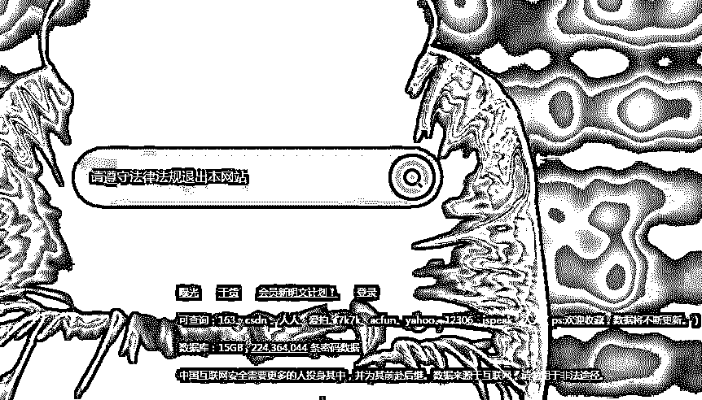

**可查询：163、csdn 、人人、爱拍、7k7k、acfun、yahoo、12306、ispeak、人人（ps:欢迎收藏，数据将不断更新。）**

**数据库：15GB , 224,364,044 条密码数据**

**社工库②**

**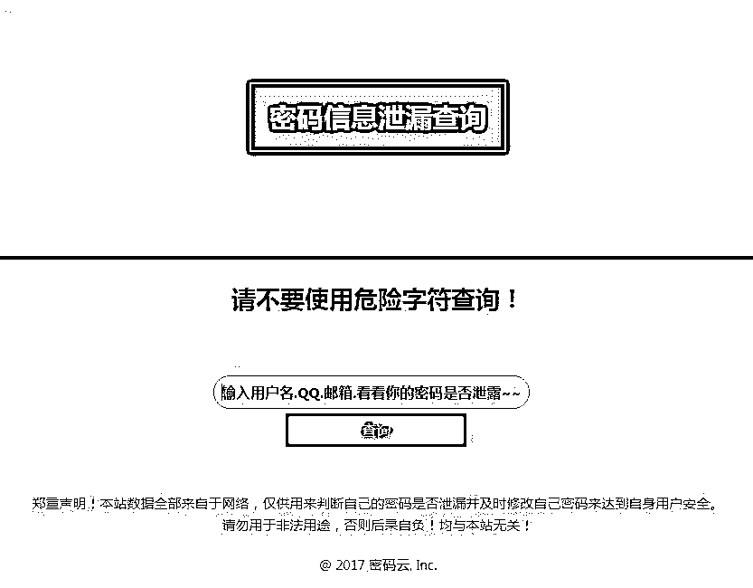**

**灰产哥输入自己的 QQ 号验证此社工库真伪，结果显示我的 QQ 账号密码全部泄露！**

**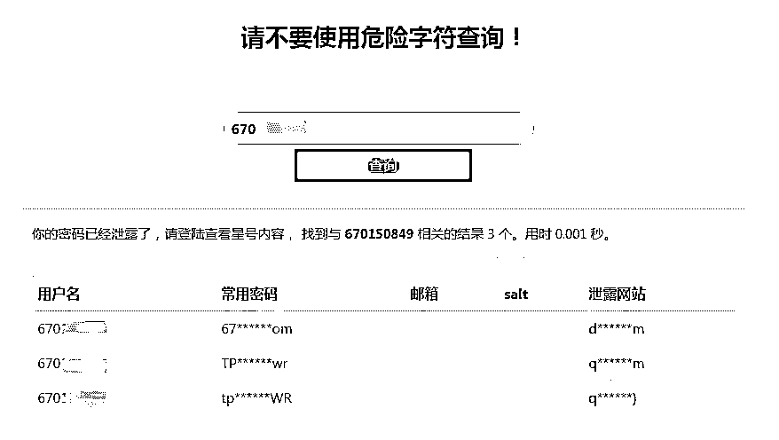**

**社工库③**

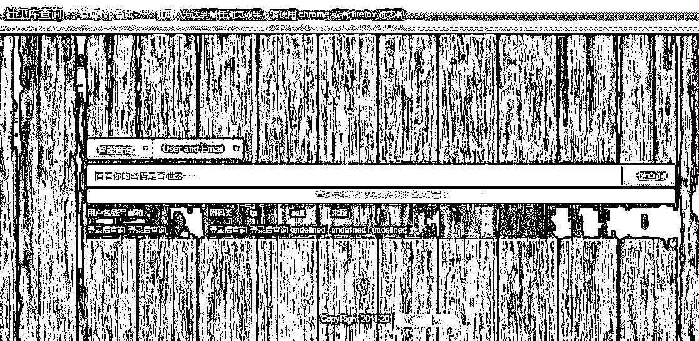

**社工库④**

**可查询你的手机号或者邮箱注册过那些网站。**

**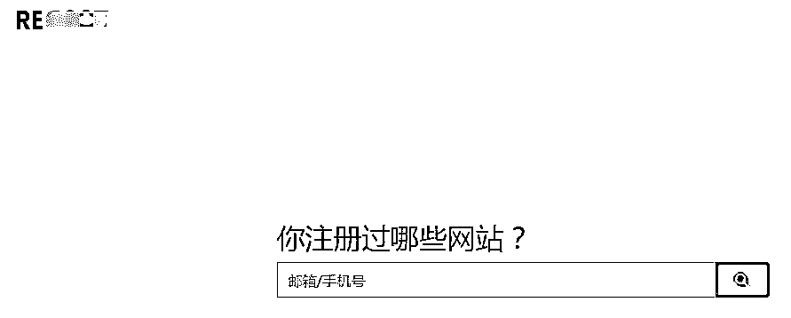**

**灰产哥输入常用邮箱 ，结果显示我的邮箱注册过 ：**

**爱卡汽车，58 同城，剩余的需要注册后查看，显示完全正确！**

**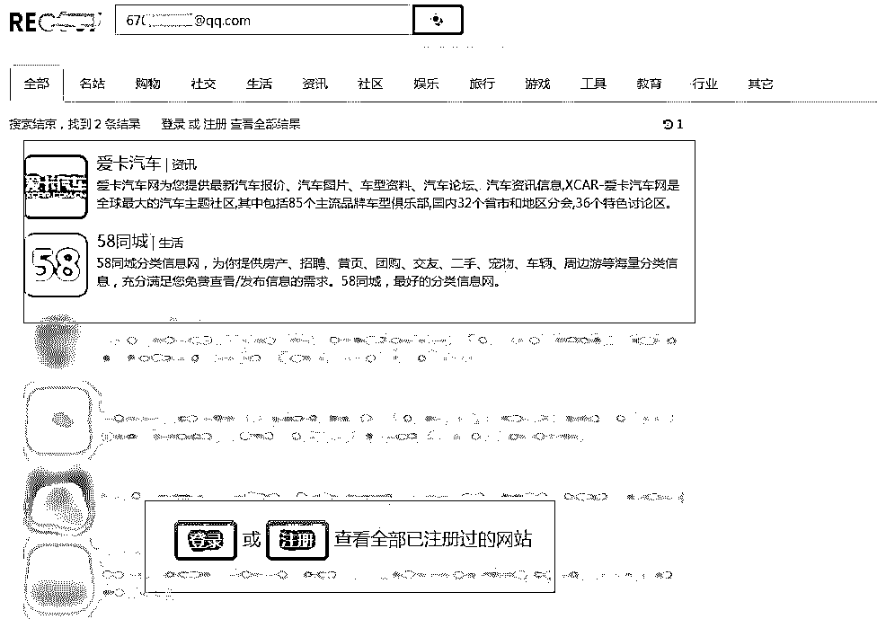**

 **同时这个网站还可以进行分类查询：****购物 社交 生活 资讯 社区 娱乐 旅行 游戏 工具 教育等等**

每个黑客的攻击手法都不同，破解的方式也千奇百怪，没有统一的作战方式。尽管有护城河、城墙，但攻击者，可以从正门攻，也可以从地下挖地道，甚至逮住一个老鼠洞，都能钻进来，防不胜防。电信网络欺诈层出不穷，网络黑产也已经从过去的黑客攻击模式转化成为犯罪分子的敛财工具和商业竞争手段。从某种意义上来说，企业也好、用户也好在信息泄露事件中，都是受害者。

**4、由社工库引发的网咯黑产调查**

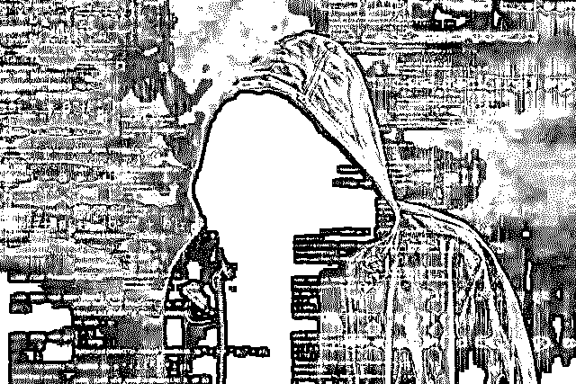

相信大家时常会碰到浏览器弹出广告，电脑突然蓝屏，个人电脑资料泄露，微博被盗，QQ 被盗，游戏账号被盗，手机收到莫名其妙消费短信，接到各类推销电话对方对你的信息了如执掌，上网进入钓鱼网站等情况。不仅仅个人的电脑出现问题，各大企业的服务器网站被黑，国家政府网站和军用系统被黑的事件，各大网络公司例如去哪儿网，如家酒店等客户信息泄露等。近年来此类新闻层出不穷，这背后就隐藏着黑色产业链。

## **① 黑产是什么**

黑产是黑色产业链的简称，就是黑客利用技术手段如流氓软件、数据库拖库撞库等进行违法犯罪活动。

所谓的流氓软件就是骗你说是某正规软件，当你打开后，各种各样的安装包病毒等就会入侵进你的电脑，你的电脑就成为了案板上的鱼肉任黑客宰割， 进行 DDoS 攻击或者通过你的电脑获取隐私数据等，以此获得利益。

所谓拖库，顾名思义就是把数据库拖出来，将网站的数据导出保存。而撞库，就是利用拖出来的数据去尝试登录其它网站。此前 CSDN 数据泄露，之所以成为互联网史上规模最大泄露事件，有一部份原因是用户在其它网站也使用与 CSDN 相同的账号和密码，黑客进行批量撞库攻击盗取账户。

黑客先对不法操作所得的数据进行洗库，即层层利用数据库中的资源，全方面发掘里面资源进的价值。然后将部分数据做成社工库，用以收取会员注册费用，会员能直接查询到泄密的明文。

由于黑色产业链的蓬勃发展，以及快速的盈利模式，引起了很多人的关注，业内业外人士都开始从事黑色产业，甚至出现了黑客培训的网络教育产业，这进一步导致国内黑产的层出不穷，欺诈案件的不断发生。图 2-9 是黑色产业链其中一种犯罪模式。

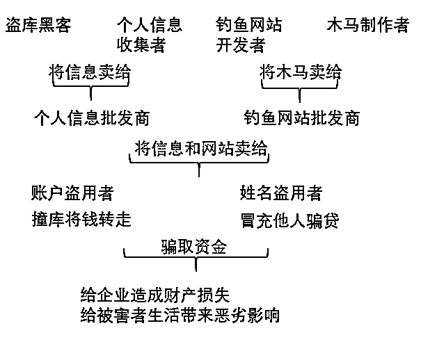

图 2-9 网络犯罪过程

## **② 钓鱼网站**

“钓鱼”是一种网络欺诈行为，指不法分子利用各种手段，仿冒真实网站的 URL 地址以及页面内容，或利用真实网站服务器程序上的漏洞在站点的某些网页中插入危险的 HTML 代码，以此来骗取用户银行或信用卡账号、密码等私人资料。

通常，钓鱼网站看起来像来自合法公司，有的还有商标，和真正网站界面相似，让用户信以为真。它试图诱惑用户把账号和相关密码给他们。钓鱼网站经常解释说，公司记录需要更新，或者正在修改一个安全程序，要求用户确认你的账户，以便继续使用。

黑客通过钓鱼网站牟利的方式有在钓鱼网站设下陷阱，大量收集用户个人隐私信息，通过贩卖个人信息或利用隐私信息敲诈用户；利用钓鱼网站收集、记录用户网上银行账号、密码，盗取用户的网银资金；假冒网上购物、在线支付网站如淘宝、工行电子银行网页版等，欺骗用户直接将钱打入黑客账户；通过假冒产品和广告宣传获取用户信任、骗取用户金钱；伪造团购网站或购物网站，假借“限时抢购”、“秒杀”、“一元购”等噱头，让用户不假思索提供个人信息和银行卡号，这些恶意网站直接获取用户输入的个人资料和网银账号密码信息，进而获利。多地出现的仿冒“非常 6+1”节目中奖信息骗取网民钱财的网络诈骗事件，就是以中奖为诱饵，欺骗网民填写身份信息、银行账户等信息。

## **③恶意代码**

恶意代码是一种程序，它通过把代码在不被察觉的情况下镶嵌到另一段程序中，从而达到破坏被感染电脑数据、运行具有入侵性或破坏性的程序、破坏被感染电脑数据的安全性和完整性的目的。最常见的恶意代码有计算机病毒（简称病毒）、特洛伊木马（简称木马）、计算机蠕虫（简称蠕虫）、后门、逻辑炸弹等。

计算机病毒是利用计算机软件和硬件所固有的脆弱性编制的一组指令集或程序代码。它能潜伏在计算机的存储介质（或程序）里，条件满足时即被激活，通过修改其他程序的方法将自己的精确拷贝或者可能演化的形式放入其他程序中。从而感染其他程序，对计算机资源进行破坏。计算机病毒就如同生物病毒一样进行繁殖，当正常程序运行时，它也进行运行自身复制。计算机病毒也具有传染性，通过修改别的程序将自身的复制品或其变体传染到其它无毒的对象上。此外，计算机病毒还有潜伏期，可以依附于其它媒体寄生的能力，侵入后的病毒潜伏到条件成熟才发作，会使电脑变慢。2017 年席卷全球的勒索病毒，就是一种典型的计算机病毒（见图 2-10）。

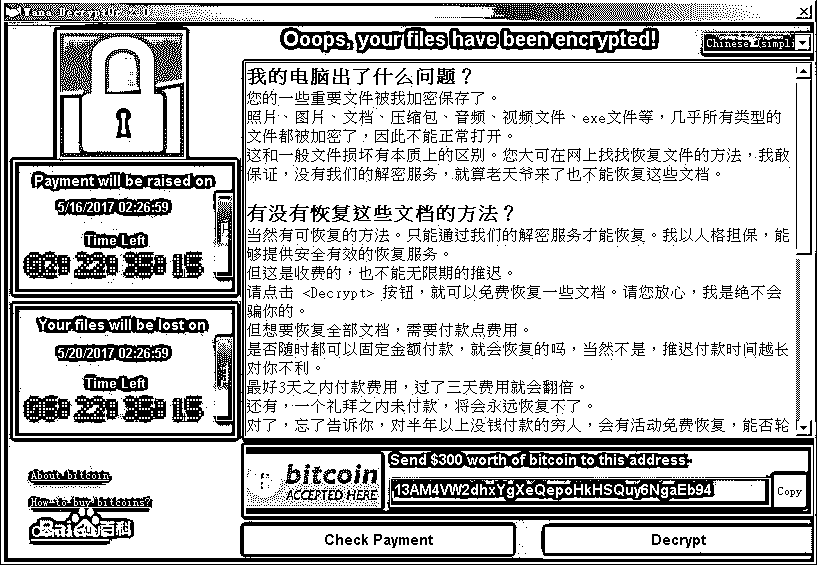

图 2-10 WannaCry 病毒

计算机病毒有许多的分类方式，按照根据病毒存在的媒体划分：网络病毒、文件病毒、引导型病毒和混合型病毒。按照病毒传染渠道划分：驻留型病毒、非驻留型病毒。根据算法划分：伴随型病毒、“蠕虫”型病毒、寄生型病毒、练习型病毒、诡秘型病毒、变型病毒等等。这里就不一一赘述了。我们主要介绍特洛伊木马病毒和蠕虫病毒。

## ④ 恶意应用

而随着移动互联网的发展，欺诈分子的犯罪手段也在不断升级，黑色产业扩展到移动服务中。比如类似钓鱼网站的山寨应用（盗版 APP），黑客将正版 APP 进行破解、篡改后重新打包，再上架到移动应用市场让广大手机用户下载使用。盗版 App 的作者常常会在盗版应用中植入恶意广告插件。这些恶意广告插件不仅会在手机上乱弹广告，骚扰用户，还常常会偷偷在后台自动下载其它应用，消耗用户手机流量与存储空间。更有甚者，一些恶意广告插件还会盗取用户的通信录、短信、通话记录以及账号密码等信息。

面对黑客各式各样的欺诈行为，工信部发布了《八大恶意应用标准》

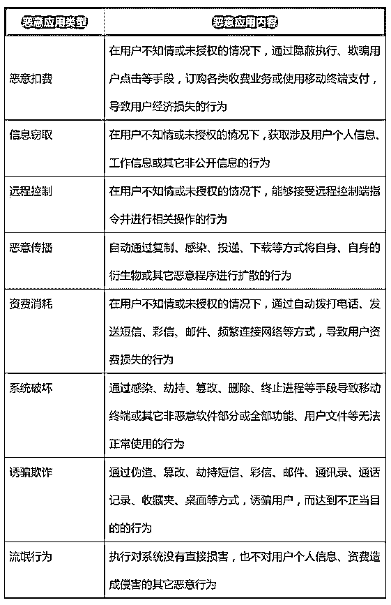

**五。结尾：**

**像电影《欺诈游戏》里伊甸园的果实那样，因玩家需要在游戏里互相欺骗来获得巨额奖金，人性的弱点被暴露出来。**

**现实中，电信网络欺诈层出不穷，而且已经发展到了方法专业化、欺诈人员职业化的阶段。**

**网络黑产也已经从过去的黑客攻击模式转化成为犯罪分子的敛财工具和商业竞争手段，呈现出明显的组织化、产业化趋势。**

**然而“免费的奶酪只存在于捕鼠器上”。世界上并没有免费午餐，假如习惯于去尝免费甜头，势必会为此付出惨痛代价。**

* * *

**延伸阅读：**

**[深度|揭秘隐藏在黑产中的“地下黑市”：深不可测的“暗网”江湖](http://mp.weixin.qq.com/s?__biz=MzIyMDYwMTk0Mw==&mid=2247489454&idx=1&sn=ee4fc633eaecc20e315f874c8e08df6e&chksm=97c8dc96a0bf5580998f159cd576c2aeb0d87ac1721329e1225ab8bffe0ad64fec786fe30add&scene=21#wechat_redirect)** 

**[深度：信息买卖黑链：淘宝 25 页和京东 3 年数据仅需 1 元，揭秘你的信息是如何被黑市买卖的。](http://mp.weixin.qq.com/s?__biz=MzIyMDYwMTk0Mw==&mid=2247489263&idx=1&sn=e1baf7a32570e65968fd8ab3bfee5649&chksm=97c8ddd7a0bf54c151b62d46024846d2eb1e6b07c55d69bc46d515284d275c858aefbc128be4&scene=21#wechat_redirect)** 

**[深度|勒索软件黑产研究：制马人，传播者，受害者 ，环环相扣，年锁百万终端，勒索上亿元](http://mp.weixin.qq.com/s?__biz=MzIyMDYwMTk0Mw==&mid=2247489234&idx=1&sn=16e05c37a5b6548ae2fa0a91e50a6c11&chksm=97c8ddeaa0bf54fc1a4ca35155572972f38d3f2f76230e2a2a2bc98779a57a358434114aec99&scene=21#wechat_redirect)** 

**[深度|揭秘数据黑市之殇:，带你走进地下征信数据的黑客帝国！](http://mp.weixin.qq.com/s?__biz=MzIyMDYwMTk0Mw==&mid=2247489199&idx=1&sn=338e9ac5002f1bd51355b1ffaf530f95&chksm=97c8dd97a0bf5481dee485dcdec318a9212f2d2ed74ab0d9097598801fe4db7dba522f37fc98&scene=21#wechat_redirect)**

* * *

                            **              欢迎加入知识星球：【灰产圈】高端社群 与 灰产圈团队在线交流 （目前已经 923 人）**

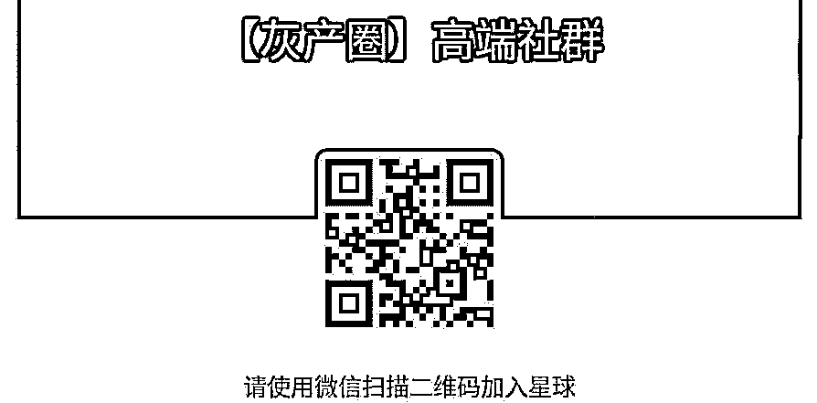

点击“阅读原文”加入高端社群。