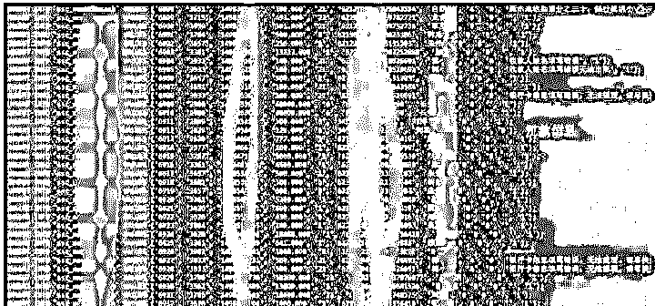
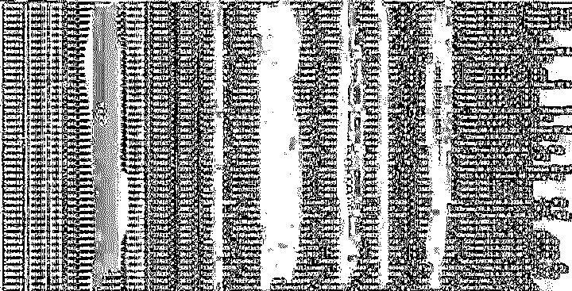
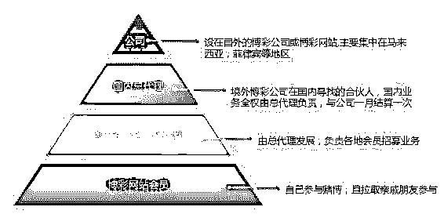
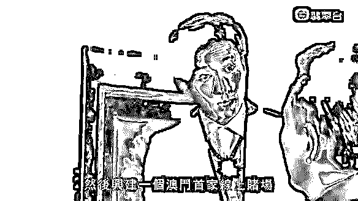
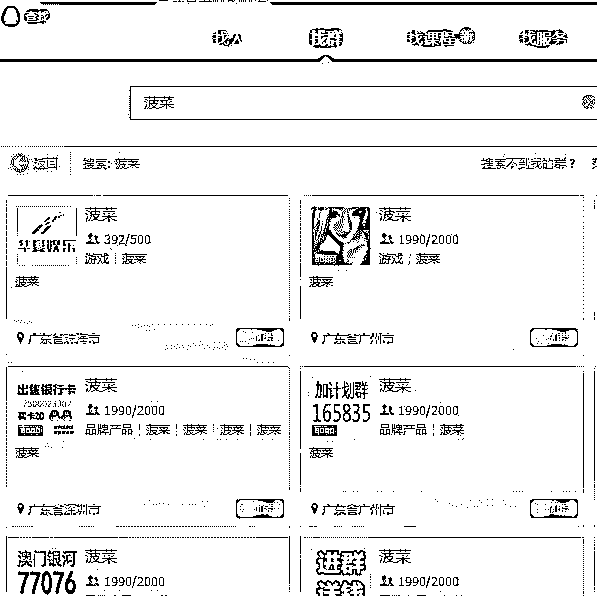
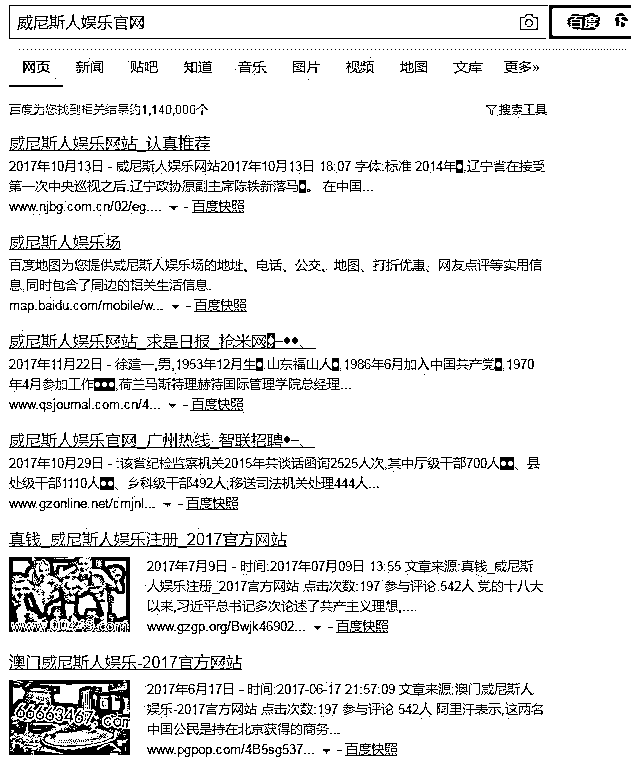
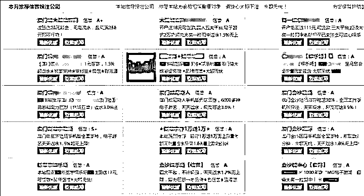
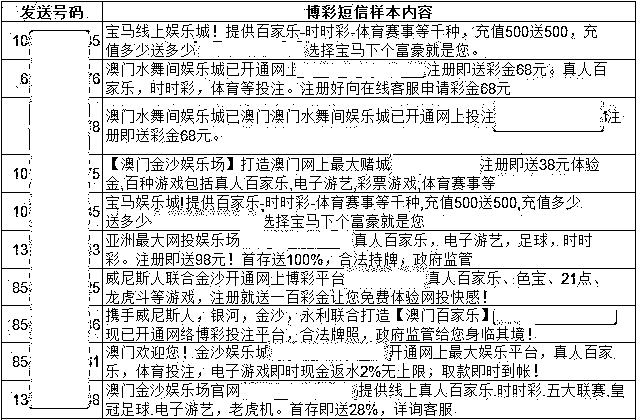
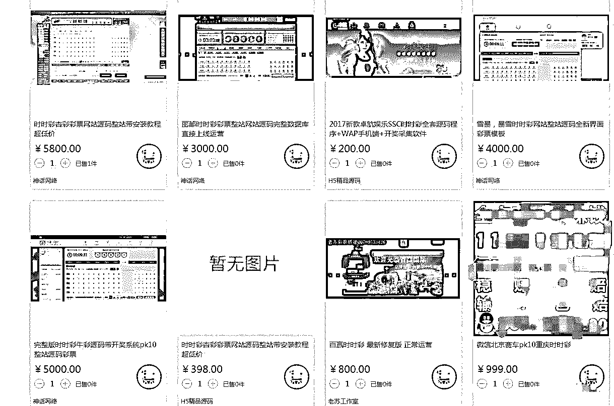
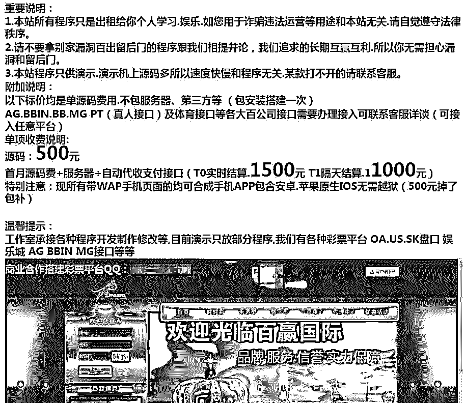

# 深度|揭开层层迷雾,带你走进网络博彩的暗黑世界:500 万赌徒，年输上千亿！

> 原文：[`mp.weixin.qq.com/s?__biz=MzIyMDYwMTk0Mw==&mid=2247489469&idx=1&sn=068689f941b55b11473a6595f2da08f1&chksm=97c8dc85a0bf5593f4f24fb20775b6448d2bd8a21cc0bc78b95a2fbf64a0e64eebe00449ed68&scene=27#wechat_redirect`](http://mp.weixin.qq.com/s?__biz=MzIyMDYwMTk0Mw==&mid=2247489469&idx=1&sn=068689f941b55b11473a6595f2da08f1&chksm=97c8dc85a0bf5593f4f24fb20775b6448d2bd8a21cc0bc78b95a2fbf64a0e64eebe00449ed68&scene=27#wechat_redirect)

**导语：**

网络赌博的规模有多大？看看色情网站、中小网盟甚至一些 1080P 电影的开头，都充满了“真人荷官发牌”、“充一万送一万”的广告，可以推想网络赌博的火爆程度。据不完全统计，我国每年通过网络博彩业流出到境外的资金过千亿，且实际规模应该远超预估。

十赌九输是大家对传统赌博的认知。在网络上，赌博变成了“十赌十输、有输无赢”，无数网民的血汗钱通过这个吞金怪兽流出。灰产圈安全团队对网络赌博产业进行了分析，揭示了其中的运行规律。 

**一，契机：博彩网站数据泄露事件**

近日，某博彩网站存在严重安全风险，已被黑客渗透，导致网站数据库严重泄漏。

其中有大量的用户的个人信息，内容包括汇款信息，用户姓名，手机号码等等，涉及人数高达上万人数。

**以下为用户注册该网址的帐号密码等信息：**

**这样的隐私泄露问题还真是让人不寒而栗，然而这并不是最可怕的。最可怕的是网络赌博会让你输到倾家荡产**

**前不久警方破获了一个巨大的网络赌博案 ，警方曝光了其内幕：**

[`v.qq.com/iframe/preview.html?vid=b0393e37w6v&width=500&height=375&auto=0`](https://v.qq.com/iframe/preview.html?vid=b0393e37w6v&width=500&height=375&auto=0)

**通过上述视频大概可以了解到网络赌博的犯罪组织的构架和内幕。**

**二，揭秘：网赌骗术之套路重重 ！**

**1：庄家偷看底牌，实时调整盈率 **

传统赌场有一套精密的计算分析方式和赔率方式，保证赌场和庄家只赚不赔。现在的网络博彩网站更高一步，因为每个客人必须通过唯一账号才能进入博彩网站或博彩客户端，庄家第一时间就能了解到有多少人员参赌和下注方式。

庄家可以实时来调整赔率，保证自己的利益，通过抽水就能实现稳赚不赔的盈利。（所谓抽水，可以将其理解为简单的手续费，在每笔交易中，都会拿出一定比例的资金上缴给赌场，这个比例大概在 5%）

2：机器人陪玩

前不久，机器程序阿尔法狗战胜世界围棋冠军李世石震惊世界。事实上，网络赌场中很多所谓的“玩家”都是机器程序，庄家以机器人跟赌徒对赌。

所有真实用户在下注时都可能与被系统安排的机器人同桌，有可能看起来火爆的台面上都是客户和机器人在玩，由于机器人知道客户手上的底牌。机器人连围棋冠军都能斩落马下，更何况能看到你底牌的机器人了，你还想赢？

3：真人荷官发牌，网络延时

为了应付机器人玩家，有些网民喜欢跟“真人荷官”对赌，有些网络赌场可以通过视频直播看到真人实时发牌（例如真人百家乐等），认为这种赌博盈率会高。但实际上，庄家可以通过网络延迟，即你看到的画面比庄家延迟几秒，那么你觉得你还有赢钱的机会吗？ 

4：注册送现金引人参赌

在论坛、成人网站等做广告，通过“免费试玩、注册送现金、充一百送一百”等手段吸引注册，前期调高概率让用户赢小钱，小额提现马上到账（但如果想大额提现，会以各种手段拖延，拒付）。客户尝到轻松赢钱的滋味后，就会慢慢主动充值再入局，由于庄家资金和规则上的优势，最终客户只会越输越多。 

**这些手段经过了传统赌场几千年的锤炼，在细节操作上有很多方法，让你觉得赌钱来钱快，等你迷上赌场之后，就只能卖房子卖地了。 **

**以下视频来自“找靓机”独家调查 **

[`v.qq.com/iframe/preview.html?vid=a05454hf8v5&width=500&height=375&auto=0`](https://v.qq.com/iframe/preview.html?vid=a05454hf8v5&width=500&height=375&auto=0)

## **二、起底：赌博网站传播途径**

赌博网站分为两大类，代理制和非代理制。

A、代理制

以线下渠道为主，层层发展下线方式吸纳参赌人员，组织严密，多呈金字塔型，类似传销。这种类型的博彩网站一般口口相传为主，或拉取亲戚朋友入会。 

B、非代理制

多由境外赌博集团直接控制，境外的运营人员通过各种推广方式发布和诱导客人注册充值进行赌博，参赌人员分布分散无规律，大多直接通过网银或第三方支付平台进行现金转账来赌博。 

**主要推广方式如下： **

1.  **在成人网站、不良网站做广告，最近比较流行在电影文件前插播广告片头。**

    
2.  **通过 qq 群、微信公众号、搜索引擎 SEO 等传播**

    **QQ 群传播渠道：**

    **黑帽 SEO 案例（站群技术）**

1.  **博彩网址导航：有人制作专门的博彩网址导航，赚取广告推广费用**

    
2.  **垃圾短信群发：IOS 安卓 渠道**

    

**三：卧底：揭秘网络赌托黑幕，“抠脚大汉”包装成“美女”诱赌。**

**  灰产圈通过网络招聘卧底博彩公司调查内幕：**

**通过渠道找到了一家公司在网上应聘：**

公司负责人说：本公司主要销售彩票，会有老员工带新员工，“平时要在 QQ 上装成‘白富美’和男性聊天“。

通过深入了解：这个公司要求员工从微博上找美女的照片，通过微信朋友圈和 QQ 空间发布照片来包装自己，一般将身份虚拟成服装店或化妆品店的女老板，28 岁左右。在与客户熟络后，赌托会在 QQ 聊天时，不经意说自己在网上投注玩了 2 年的彩票，从最初的几万元，现在赚到几十万元。如果对方有兴趣，就会直接发过去一个名为“BBQ”的网络“黑彩”平台链接，诱骗客户在该平台上充值投注。赌托其实就是帮该“黑彩”网络平台拉人头从中提成。

**四，调查：网赌最大名门之第三方支付平台**

在通过第三方支付平台的交易中，由于第三方支付不需要买卖双方进行面对面的交易，与传统的资金支付结算方式相比更加方便快捷，因而发展迅猛。关于第三方支付平台，现有法规又相对滞后，缺乏监管的第三方支付平台很简单成为资金非法转移和套现的工具。

当第三方支付平台为赌博公司服务以后，它就把**整个赌博的范围给扩大化**了，因为第三方支付平台具有全国网上银行收支这样一个功能，利用它就可以把整个的会员布及到全国各地。只要通过几分钟你就可以把这个赌资打入赌博公司账号，同时你也可以几分钟获取你赢的钱，你不需要再通过汇款传统模式或者当面交易这种模式，非常快捷也很方便，在家里也像置身赌场。即时到账甚至于比去赌场还要方便，因为大赌场中你还要去购买筹码，现在你只需要一台上网的电脑就完成了整个收支过程，钱都在你的网上银行跟第三方支付平台赌博公司之间这三方进行了一个流转。通过这个很便捷的渠道，**整个网络赌博就简单讲就变成了一个网络购物行为**。

与网络赌博的庄家相比，更重要的是，在网络赌博的背后一个巨大的利益链条。包括为**网络赌博提供一个技术，网络技术支持的运营商，包括提供广告服务的运营商，包括提供赌资结算的这些第三方支付平台。**
**这些运营商和平台大多数为人说熟知的合法大企业。**

**五.深度：博彩网站源码随意买卖？网上竟有一条龙服务！**

随着调查的深入，一条网络赌博的灰色产业链展现在我们面前：

从网站制作到网站推广再到实体公司招募员工进行诱赌，这其中的各部门环环相扣，有条不紊的在黑暗的角落里不停运转，灰产圈再次深入到产业链的源头——网站制作者 来探寻其中的真相。

灰产圈团队找到了其中网站源码的销售渠道，类似于淘宝的交易模式，店主入驻这个源码交易平台，将自己的源码和服务上架到店铺，还可以担保交易。 

如上图所示，价格公开透明，经过咨询，大多数可提供一条龙建站服务。

**如下图所示：（某博彩网站源码）**  

**宝贝描述：（明码标价）**

****

从中可以看出除了提供源码销售，这个工作室还提供支付接口，盘口接口，网站建设，高防服务器等一条龙服务，这种违规源码竟然在公开交易，可见如今的网络监管还存在诸多问题。

**六.结尾**

**至此，一条关于网络赌博的的灰色产业链浮出水面：**

**网站制作者——网站运营者——代理团队或公司——下级代理——赌博参与者**

整个产业链分工明确，环环相扣，缺一不可，每个节点上的人都只赚取属于自己的那份收益，很难想象，这条产业链存在了数十年之多，虽然相关部门一直在严厉打击查处，但在利益面前，很多人依旧铤而走险，等待他们的终将是法律的严惩！

**灰产圈所能做的只是把这条产业链曝光出来，让更多的人看到！**

**珍爱生命，远离赌博！随手转发，传递正能量！**

**同时感谢素材提供方：猎豹安全中心**

点击“阅读原文”加入高端社群。