# 深度|揭秘“吃鸡”外挂工作室轻松月入百万的黑幕：卧底内部，层层解密，利欲熏心，套路重重！

> 原文：[`mp.weixin.qq.com/s?__biz=MzIyMDYwMTk0Mw==&mid=2247489294&idx=1&sn=d5bccb01075b0068c8c34559f6b4cb41&chksm=97c8dc36a0bf5520c3ccd99199f34cd36af0de798249cc215a031f352aa83dd2409cc880e411&scene=27#wechat_redirect`](http://mp.weixin.qq.com/s?__biz=MzIyMDYwMTk0Mw==&mid=2247489294&idx=1&sn=d5bccb01075b0068c8c34559f6b4cb41&chksm=97c8dc36a0bf5520c3ccd99199f34cd36af0de798249cc215a031f352aa83dd2409cc880e411&scene=27#wechat_redirect)

**前言 ：**

《绝地求生：大逃杀》是一款大逃杀类型游戏，每局游戏 100 名玩家参与，他们被投放在绝地岛的上空，游戏开始跳伞时所有人都一无所有。玩家需要在岛上收集各种资源，对抗其他玩家，生存到最后。最终胜利者，系统会提示 8 个字“大吉大利，晚上吃鸡”，所以又称“吃鸡”。

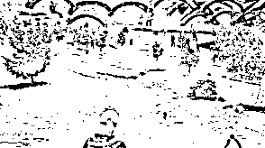

目前，“吃鸡”已经连续 30 周霸占 STEAM（世界最大游戏平台）的周榜冠军；王思聪、陈赫、林更新、鹿晗、胡歌在玩；腾讯砸了 4 亿元参股 5%，拿到代理权。

吃鸡如此火爆，外挂工作室坐不住了，在利益驱使下，各类外挂迅速出现，从基本的透视、自秒，到传统复古的变速齿轮，甚至炸飞机、灵魂出窍斩杀这种超自然外挂也层出不穷。

疾跑外挂（比车快）

▼

穿墙外挂

▼

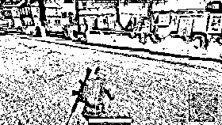

不扣血外挂

▼

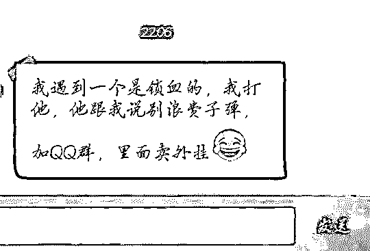

显示全图交通工具信息

▼

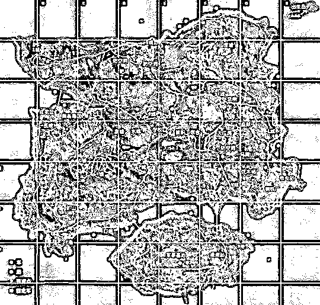

> **“新京报”对“吃鸡”外挂进行了深度的调研：**

 **[`v.qq.com/iframe/preview.html?vid=h0512vs5uvs&width=500&height=375&auto=0`](https://v.qq.com/iframe/preview.html?vid=h0512vs5uvs&width=500&height=375&auto=0)** 

> **灰产圈团队针对“吃鸡”外挂行业深入外挂团队内部拨开层层迷雾，为大家带来一个真实的“外挂世界”**

百度搜索：绝地求生辅助  ，可以搜到很多销售“外挂”的官网，

灰产哥从官网开始下手。

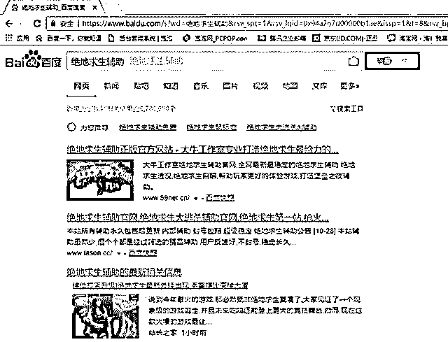

灰产哥跟其中一个官网的客服聊天过程中发现。

你说人家是外挂，人家很有尊严地回复你：“我们不是外挂，我们只是一个辅助工具。”百度搜索“绝地求生辅助”，居然还有多个称自己是“辅助官网”的链接，不禁令人咋舌。

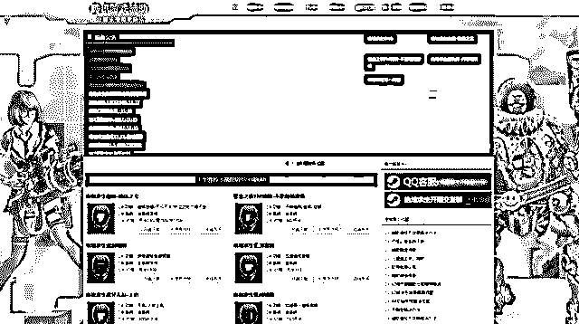

至于这些所谓“辅助官网”的画风，除了“呵呵”也没有别的形容词了。互联网时代，效率就是第一生产力，卖外挂就是卖外挂，不需要复杂美工来伪装自己。

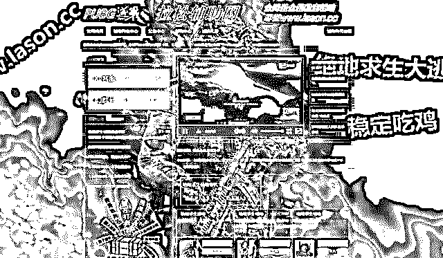

这些统一看起来就像民间“黑作坊”一样的外挂售卖网站，核心功能就几样：外挂交流 QQ 号，不同外挂种类介绍，不同外挂下载地址和付款地址。简单、高效，全心全意为外挂用户服务。

伪装起来深入敌后，与恶势力进行正面交锋

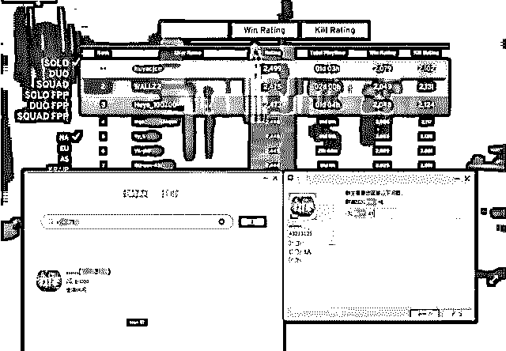

既然要找个卖外挂的人交流，那我就索性找个榜上有名的！果不其然，人家这个群已经人满为患了，看来卖外挂生意是真好做。“群满加 3XXXXXXX1”，我就乖乖地加上。

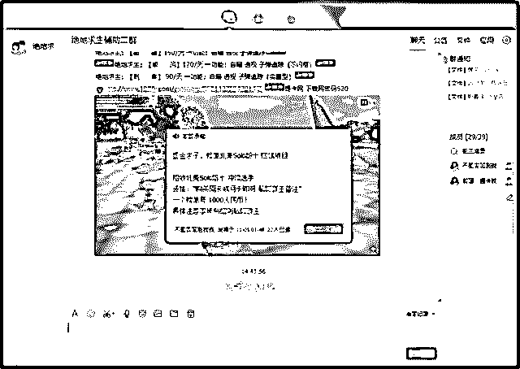

这个名为“绝地求生辅助二群”，一进来就被群主的“重金求子，榜单北美 Solo 前十赚钱项目”给霸屏了。用他们的外挂能进北美前十名的，奖励 1000 元人民币。真是优秀！

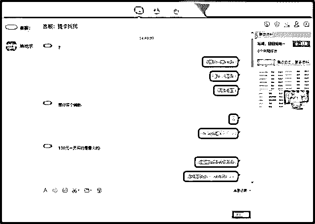

接下来就是我被所谓的“客服”提问的环节，人家直接一个“？”砸在我的脸上，立马让我感觉这个人不好惹。混迹社会多年的我深明其理，横的人惹不起，所以面对“敌人”的愤怒也有些许收敛。“我要买挂”，这是我的“诉求”。“130 一天的最火”，这是人家的回答。

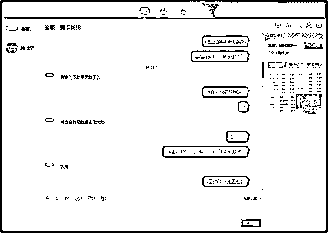

然而不甘于沦为一般外挂使用者的虚荣心还是作祟了，我表示“自瞄没意思，有没有带锁血功能死不了的外挂，人我自己打”。人家意思是“锁血”太变态会被封，自己 130 元一天的外挂不会被封。

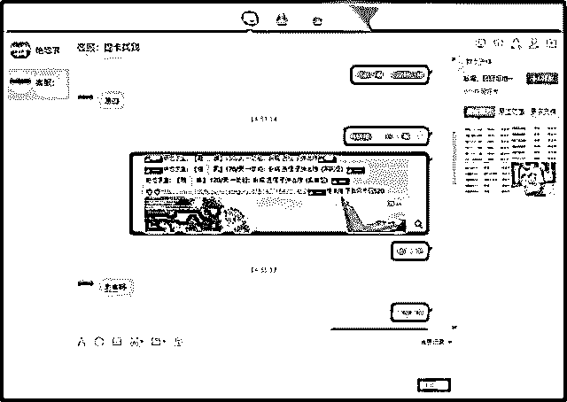

这位客服所说的 130 元一天的外挂，全名“雅兰-原海洋之星”，看来还是在业内认知度挺高的一款。

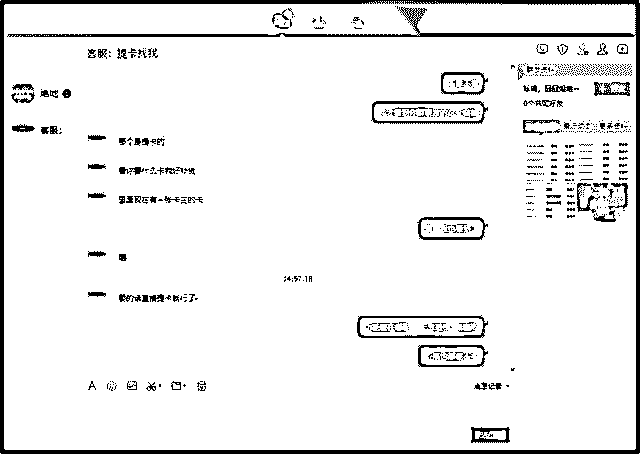

想买什么不能直接买，需要经过这位“客服”来“补货”，这里有什么猫腻呢？我接着问了这些外挂的具体区别在哪里。

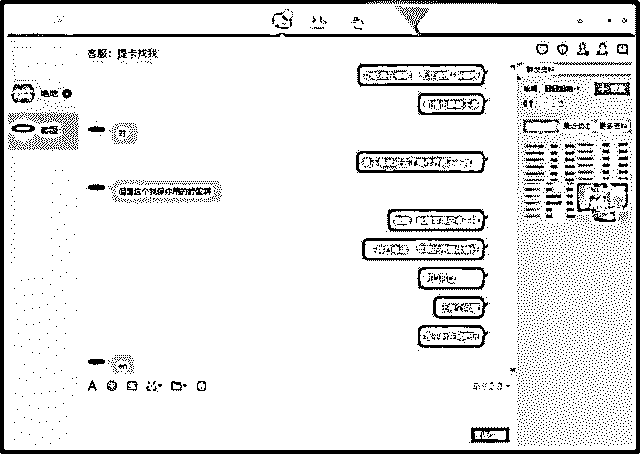

这个客服的回答是“能不能用得舒服”，看来外挂在基本的透视、自动瞄准等作弊功能基础上，还有界面交互友好度以及稳定性的区别，啧啧。

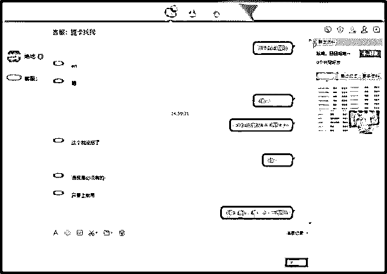

最后我又问“如果在公共场合开挂，能不能不被别人看出来”？

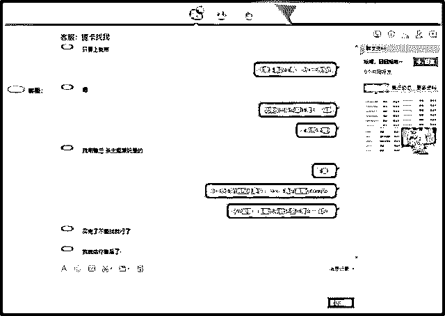

客服表示他没辙，基本的透视作弊肯定会被公共场合里的别人看到，他们的产品只能保障作弊体验好，能多多杀人多多吃鸡。其实这个卖外挂的人的业务水平并不高，交流过程中关于“锁血”和“用挂不被人看出来”这两个点，他都没有回答到位。为了再弄明白一些，我换个平台继续“暗访”。

百度“绝地求生辅助”出来的第一个网站，想必是各方面都做得比较优秀的模范吧？直接加客服 QQ！

然后这一次的交流果然更有火药味了。主播们直播用的外挂其实只要钱到位谁都能用，连人家客服都直接以国骂的形式羞辱了“主播外挂审核制度”。

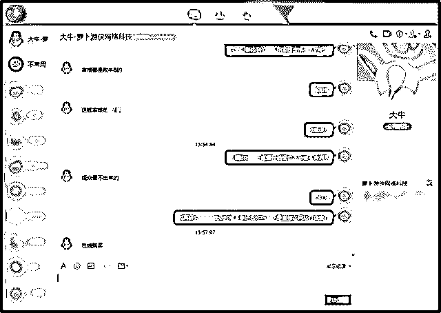

然后这位明显江湖资质更深的客服解答了我的疑问，主播用的外挂开透视的话，观众的视角是看不到的。在这里我奉劝心里苦的广大玩家，不要去跟这些人讲道理，也不要加上人家的 QQ 直接爆粗口，一来二去最后恶心到的肯定还是自己，不值。

从售前介绍到售后服务，吃鸡外挂产业链比想象的成熟

这个视频里的内容，就是“雅兰-原海洋之星”这个外挂的演示。透视、自瞄等基础作弊功能可谓炉火纯青，遇到这种外挂的普通玩家，除了在屋子里躲着也就只能认命退游戏了。“消费者”在选择外挂种类的时候，就能获得这样的功能体验视频介绍服务。

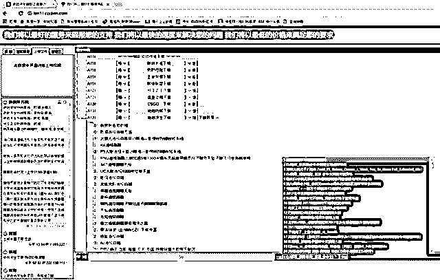

借助发达的网盘功能，各种各样的绝地求生外挂得以高效地传播。“消费者”在选择使用什么样的外挂的同时，还能享受到外挂网站提供的在线绝妙 DJ 舞曲音乐，真是精神层面的双重熏陶。

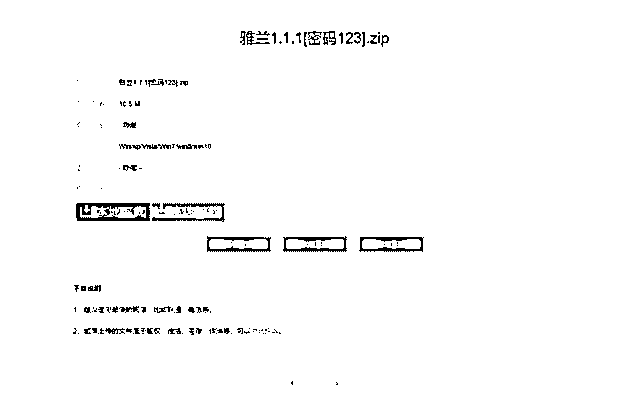

文件大小几兆到几十兆的外挂程序，几秒钟下载下来，支付一到位就能立马体验，挂多难道不是很正常嘛。

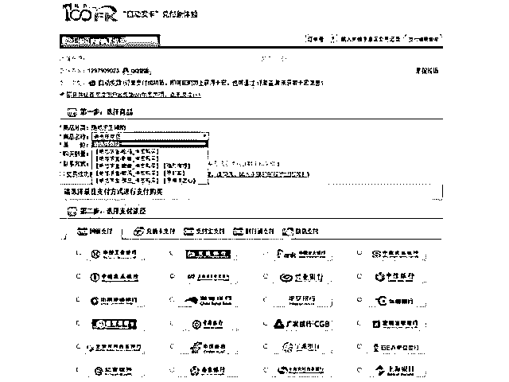

至于支付途径，网银、支付宝、微信几乎所有支付平台都可以支持。毕竟是生意，要卖出去产品就得让消费者获得良好的购物体验。这么公然地卖外挂违法吗？违法。然后没有然后了。

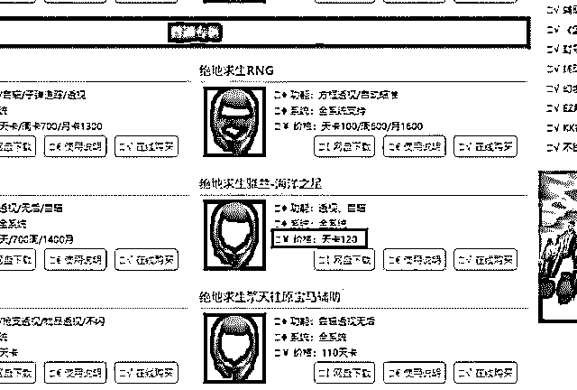

之前接触到的第一个外挂贩子不是说他们的“雅兰-原海洋之星”一天 130 元吗？这里我

发现一个同样产品一天只要 120 元的，再结合上之前那个人说的现买要补货，看来他只是一个赚差价的中间商。花钱买人冲榜的行为，也是他们为自己这个中间商平台做宣传的手段。

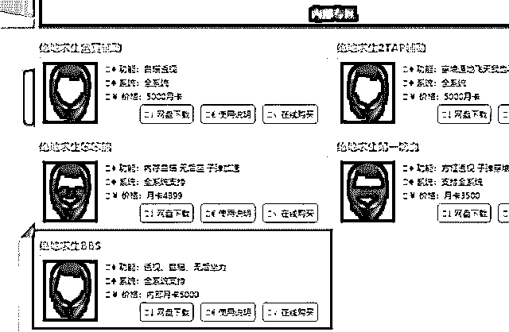

那么第二个人说的主播专用“BBS”卖多少钱呢？内部月卡 5000！看似很贵，一年六万的成本对于可能能赚到几百上千万的草根新人主播来说，基本也不算钱了吧。草根新人主播都能赚到成百上千万，我都想去干了，主播开个挂岂不是很正常？

最后为大家献上一个网友自制的外挂功能体验视频，这里就很明确地把外挂作弊手段以幽默生动的视频呈现了出来，也解释了主播开挂玩透视为什么观众看不出来的原因。

除去经常崩溃的服务器不提，《绝地求生·大逃杀》这款游戏就内容而言还是非常成功的，对于枪械的使用技巧、战术的规划和对时机的把控，这么大的玩家可操作空间以及基于随即机制的多种可能性都让人为之痴迷。被外挂搞到毫无游戏体验可言，那我们购买游戏的 98 元和在其中投入的时间精力岂不是都打了水漂吗？

**腾讯出手，吃鸡外挂闹剧终将收场**

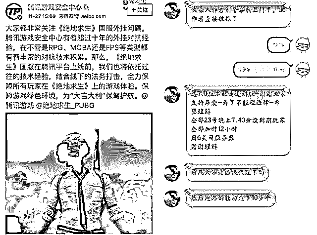

在腾讯代理《绝地求生》后，就发布声明将严厉打击外挂。以腾讯在反外挂领域的作为，《绝地求生》的这些所谓辅助工具根本不堪一击。到截稿日期，另一位长期卧底在外挂群里的玩家为我们爆料：腾讯代理吃鸡的消息一出，已经有十多个外挂开发商跑路了。随着腾讯代理《绝地求生》国服的临近，留给外挂商贩老钱的时间已经不多了。

卖吃鸡外挂有多赚钱？据了解，现在谱挂的价格是 140/天，1300 元/月。很多工作室甚至开出 400 万年薪招外挂技术员……那么，吃鸡外挂到底是怎么挣钱的？规模化的外挂工作室又是怎么运营的？这个行业到底有多暴利？有请行业老司机为大家作答。

> **“吃鸡”外挂工作室靠卖外挂 ，轻松月入百万？**
> 
> **  灰产圈采访到了从事这一行业的团队主力。**

**口述：KK，网络灰产资深从业者**

大家好，我是 KK。外挂产业算是目前众多网络黑产中比较大的一个市场，这个产业能在国内做的风生水起，主要因为国内法律对知识产权的保护相对薄弱，加上中国庞大的玩家人数倒逼了外挂的产业规模化。而产业的规模化发展又进一步推动了技术的革新，加上与游戏厂商的斗智斗勇，中国外挂制作者的技术基本碾压全球。

> **01 ******外挂产业特性********

在产业利益驱动和法律监管不严的环境下，国内外挂从业者堪称铁军。举个例子，国内一款热门游戏系统检测更新，作者能在 6 小时内再做一款最新版外挂并对外出售，相当敬业，卖命。

为什么外挂屡禁不止呢？你可以把它看做一种病毒。病毒的特性是病变，病变出更多的亚种。一个游戏发行的时候只能尽量杜绝一些比较简单的外挂，剩下的只能等外挂出来后根据它的研发思维进行逆向研究并制定封堵方案。那么，有没有完全没有外挂的游戏呢？也有，比如棋牌类游戏大部分就没有外挂，因为它的算法并不在本地而在服务端，而外挂基本是在本地修改数据。

目前反外挂技术最牛的当属腾讯，DNF 火爆的时候，我们外挂从业者与腾讯反外挂部门打了一场惨烈的攻守保卫战，最疯狂的一天是游戏一天更新检测系统五次，中间间隔不过半小时，技术员们就在 30 分钟内做出了新版外挂。不过也因为此举彻底惹怒了腾讯，他们加大火力绞杀，枪打出头鸟，端掉了萝卜外挂等一批大型工作室。

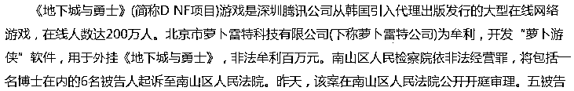

> **02 ******外挂产业食物链********

外挂产业从业者可分成作者、分销商、渠道商、代理四大类。一般作者写出外挂后打包程序，会分裂出不同版本，分别出售给分销商，然后分销商再将其包装成功能和名字不同的外挂出售给渠道商，渠道商分发给代理进行销售。外挂作者处于食物链的顶端，掌控着核心技术，编写着产业的核心代码。但从整条产业链来看，最暴利的并不是作者而是渠道商。目前绝大多数人只能接触到代理这一类，也就是食物链的最底端。

可能有人会问：为什么一个外挂需要分裂成不同的版本？这种做法主要基于风险规避的考虑。大家都知道，“鸡蛋不能放在同一个篮子里”，放在一起可能被一锅端。比如 DNF 火爆时，腾讯大力打击外挂就导致了萝卜外挂等一批知名工作室被整个端掉。后来，为了尽可能将风险最小化，业内都开始倾向于将程序包装成不同的外挂分散出售。

除了规避风险，将外挂区分为低中高端不同版本也有利于收益最大化。比如，根据外挂功能不同，销售价格不同的外挂，甚至推出专门定制版本的外挂。这么做是为了让更多人根据自己的消费能力来选择从而将利益最大化——因为一般低端的外挂程序都是高端上淘汰下来的，基本不需要付出额外成本。比如，吃鸡游戏支持子弹跟踪的外挂 140 元/天，1300 元/月，除此以外，还有 6000 元/月的定制高级外挂。

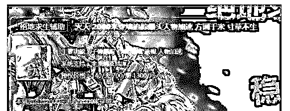

如果你购买过外挂产品，一定知道（这也是所有灰产从业者都有的共同特性），那就是从来都不会透露自己的真实身份。可能一个 QQ 号跟你交易之后再也不会亮起，下次是不同的 QQ 与你交易，但实际上这些号码的背后或许就是同一个人。这种打一枪换一个地方也是基于安全考虑。

> **03 ******渠道商和代理怎么挣钱？********

接下来重点说说渠道商。渠道商是整条产业链最赚钱的，因为他们掌握着销售渠道和引流方法。这些经验都是多年的摸爬滚打积累下来的。渠道商通常都有自己建的卡盟（虚拟供货交易平台），或者手握一些大型卡盟的供货权。

渠道商一般在建站之后就要开始引流，万年不变的引流套路当然是 QQ 群，只有 QQ 群排名上去了，别人才能最快找到你，才能吸引流量。但具体怎么通过 QQ 群来引流呢？外行人很难弄清楚 QQ 群的排名方式，其实这些工作都有专门的人在做。群排名根据关键词不同，价格也不同。一般热门的关键词报价都是非常贵的，竞争也非常激烈。

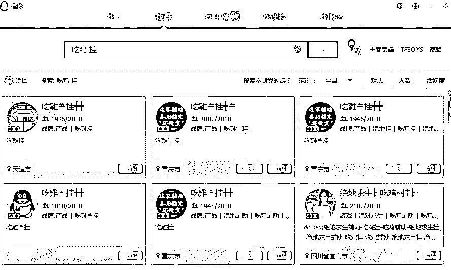

另一种常见的引流方式就是淘宝店铺。外挂属于违禁商品，所以一般店铺几天就会被封。总体来说，开淘宝店铺这种引流成本还是比较贵的，毕竟一天上千元的引流费用，不是谁都能玩得转。

整个产业链中，代理商处于产业链的底端，赚钱最少也是最苦逼的，基本就是一名销售员。不仅人多，竞争也激烈。

代理常常为了卖外挂自己也会去玩这个游戏，然后在游戏里卖。例如绝地求生这款吃鸡游戏，就有人经常在游戏里被搭讪：“兄弟，要不要外挂？什么功能都有哦。”还有更拼的代理商——开着外挂追吉普车推销；帮客户报点：游戏地图哪里有敌人，哪里有好装备；甚至开黑陪玩。说到底，代理商卖的不是外挂而是服务，毕竟让客户爽了人家才会买单。

> **04 ******外挂产业链利润如何？********

那么，整个产业链的利润如何呢？

以吃鸡为例，目前其外挂产值预估至少有 3 亿。一款外挂的市场售价大概 1000—6000 元/月不等。也有按天数收费的，一天几十上百的都有，质量也都不一样。以售价 4000 元的外挂为例，每卖出一个，作者大概只能分到 800 元 ，剩下的都通过渠道层层剥削，到终端代理这里，大概能拿到 2000 元的利润。

有经验的外挂代理月入上万是比较轻松的。这个主要还是要靠个人的销售经验。我见过一个渠道商，进淘宝店铺十几个霸屏，一天就赚了 7 万。当然，这中间的引流成本也是非常高的，十几个淘宝店铺市场黑价单个在八百左右，引流成本差不多就要 1 万了。万一店铺上线就被封，这些钱等于打了水漂，风险也是蛮大的。

渠道商也分大小，老渠道商引流经验相当丰富，一款热门游戏赚个 50 万不成问题，当然也承担着相应的风险。据吃鸡官方公布的数据显示，目前已有 30 多万个号被封，这个数据也从侧面反应了外挂产业的规模之大。

> **05 ******外挂工作室构成********

最后简单说下外挂工作室的结构。外挂工作室结构非常简单，技术人员加卡盟客服就可以了。技术人员是核心，他们多是大咖，也有野生程序员，做灰产一般都有自己的圈子，比如经常混某个技术论坛，论坛里的大佬多多少少都认识，发现项目时也会一拍即合。而客服主要解决售后问题，一般一个工作室需要 3~4 名客服，工资五六千，没什么技术含量，效益好还会有红包。

灰产项目一般都是短平快的，外挂工作室也是，红利期快速跟进，撸完钱就解散。具体需要几个技术员，工作室会根据项目需求灵活配置，像开发外挂这种技术含量比较高的项目，一般 3~5 个技术员，通常技术股占百分七十左右，他们开发完外挂就没什么事儿了，剩下的交给渠道引流即可。能活到现在的工作室，都是大风大浪挺过来的，没有那么简单，要么掌控着技术，要么掌控着渠道，这些都是长时间的沉淀的不可复制的资源。

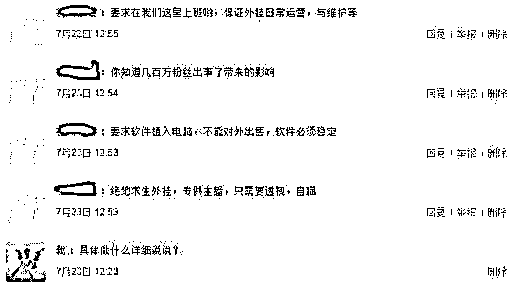

> **结尾：**

最后还是强调一下，尽管我不建议大家去卖外挂，但大家要知道，每款现象级游戏的背后，都有一批靠卖外挂赚大钱的灰产工作者，百万在线的游戏，食物链顶端的作者与渠道商短期收入上百万，不是神话或吹牛。这是我的总结，谢谢大家。

**文章素材部分提供： 匡方**

点击“阅读原文”加入高端社群。