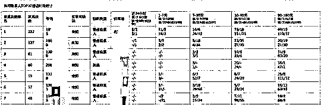
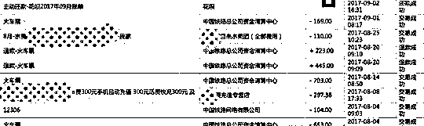
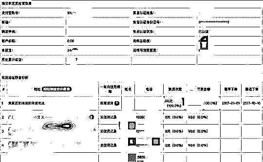
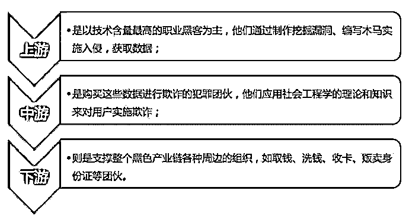
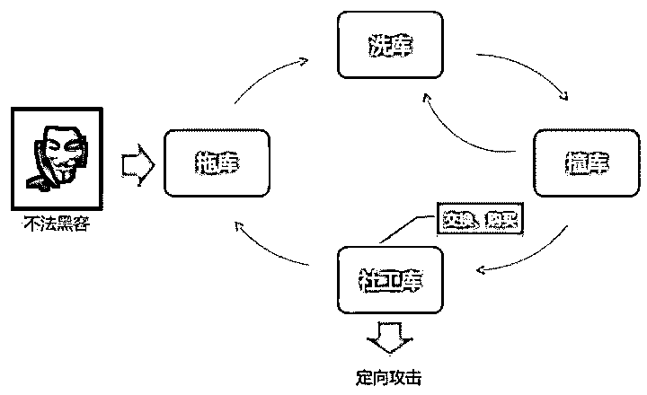

# 深度：信息买卖黑链：淘宝 25 页和京东 3 年数据仅需 1 元，揭秘你的信息是如何被黑市买卖的。

> 原文：[`mp.weixin.qq.com/s?__biz=MzIyMDYwMTk0Mw==&mid=2247489263&idx=1&sn=e1baf7a32570e65968fd8ab3bfee5649&chksm=97c8ddd7a0bf54c151b62d46024846d2eb1e6b07c55d69bc46d515284d275c858aefbc128be4&scene=27#wechat_redirect`](http://mp.weixin.qq.com/s?__biz=MzIyMDYwMTk0Mw==&mid=2247489263&idx=1&sn=e1baf7a32570e65968fd8ab3bfee5649&chksm=97c8ddd7a0bf54c151b62d46024846d2eb1e6b07c55d69bc46d515284d275c858aefbc128be4&scene=27#wechat_redirect)

**仅用 3.8 元！身份信息、通话记录、消费账单、人脉关系、门牌号全买到**

KK 向探知数据购买到自己信息，报告多达 33 页，并有详细的量化评分；他们通过打擦边球获得用户授权，大量爬取、搜集个人隐私

KK 从探知数据公司花了 3.8 元买到自己的详细运营商报告。报告把 KK 常用的 30 位联系人单独拎出，统计了近 24 小时、1-7 天、7-30 天、30-90 天、90-180 天 5 个通话时段的联系次数。

在 KK 获取的支付宝报告里，更是将花呗的历月账单，还款金额和时间都显示出来。不仅如此，还罗列出支付宝的历史消费统计，甚至连 KK 8 月 25 日在家缴了一次 110 元水费都有记录。

被爬取的淘宝账户信息里，有关联的支付宝信息，记录了账户和余额宝金额，和花呗总额度、可消费额度等。

你的通话记录里，最常用的 30 个联系人是谁，你家住何处，经常在哪儿活动，余额宝里还有多少钱，在什么时候买过几件内衣……这些你以为的私密信息，其实都可以被轻易查到。

KK 调查发现，一个隐藏在现金贷平台背后的数据产业链正在悄然活动，其危害较之于一些开房记录查询服务更甚。

具体做法是，现金贷平台向数据公司购买所谓的“数据产品”，由后者通过爬虫技术，爬取用户在移动通信运营商、淘宝等知名电商网站、微信支付宝等社交网络上的行为轨迹，以及包括央行征信报告、水电煤使用等在内的生活信息，作为平台放贷前评估用户风险的“风控奇招”。此举在维护现金贷企业一己之利的同时，将用户的个人隐私置于极大的风险当中。

更惊悚的是，数据公司在采集了这些数据后一般会“深度开发”，将其分割成千百个维度来进行分析，然后一张关于你的完整用户画像就此诞生。而被多维度分析的你，却并不知道自己是如何授权他人获取到这些信息的。

“你孩子那么可爱，不想他出啥事吧？”

“我上岸了。”这是每个深陷网贷漩涡的人共同的心愿。

两个月前，32 岁的 TT 跑路了。因为迷上游戏厅的赌博机，TT 几乎赔上了所有积蓄，曾两天内输光了一个月的工资 3000 多元。在身无分文的情况下，他注意到了一则“2 分钟注册，5 分钟审核，极速放款”的现金贷广告。

一开始能向平台贷多少钱？这往往需要用个人隐私来交换。上传本人持身份证照片，填写详细住址，读取手机通讯录，认证运营商和电商信息等，用阿伦的话来说，“交出的个人信息越多，可借款的额度也就越高。”

初尝来钱快的甜头后，TT 一连借了十几个平台，直到“拆东墙补西墙”都难以填补漏洞。在被威胁爆“通讯录”，群发欠钱不还短信前，他逃走了，怕在亲朋好友前“失了面子”。不过这四五万元的欠款，一天天利滚利，他想甩都甩不开，只能靠拼命打工苦苦支撑着。“小贷吸血，慢慢熬吧。再也不赌的话，也许就上岸了。”TT 对 KK 表示。

除了网贷平台自行收集的用户信息外，有业内人士表示，一些数据公司还可通过技术手段，为平台提供借款人的更多信息。

**定位到经纬度，还有所谓风险信息扫描**

日前，KK 通过随机检索，在一家名为探知数据的科技公司，仅花了 3 .8 元就买到了自己的详细运营商报告。

报告达 33 页，内容涉及 KK 的基本身份信息，近半年的通话记录详情、账单消费、出行信息和人脉关系等，并有详细的量化评分。

数据显示，这半年时间里，KK 共煲了 3 次超过一小时的“电话粥”，累计通话时长达 214 分钟。该报告还量化了夜间活动情况占比，为 3%。其中，KK 通信最频繁的是今年 6 月。

在消费记录方面，KK 每月的手机话费在 200 元左右，半年充了 6 次话费，最大单笔充值金额达 500 元。

此外，报告还记录了出行信息。比如今年国庆期间，KK 曾往返惠州、广州和深圳三地。过去半年有过一次出境旅游，在日本呆了 10 天。

更令人惊讶的是，这份运营商报告里还根据联系次数，将与 KK 进行过通话的 1000 个手机号码罗列出来，包括完整号码、归属地、通话时长、最早和最后通话时间等。

其中常用的 30 位联系人更是被单独拎出，统计了近 24 小时、1-7 天、7-30 天、30-90 天、90-180 天 5 个通话时段的联系次数。也就是说最近一天，被查询人给谁打过或者接到过几次电话，均可从报告中得知。

此外，报告中还能看到借款人的身份信息，定位到经纬度、门牌号的居住地址等，还有所谓的风险信息扫描。比如入网时长，黑名单通信记录，民间借贷、银行、P 2P 平台与互联网小贷等通信记录，甚至还有公检法和澳门通信记录等。

运营商报告并不是简单罗列一个通话详单，需要很多数据进行交叉分析，据此可判断借款人是不是欺诈团队，最近有没有被其他网贷平台催收。

通过通话记录，甚至能大概判断出这是个怎样的人。例如正常人的通话记录一般有来有往，而打出的电话较多，且都是几秒钟（快递送餐员例外），那这个用户的逾期率风险可能会高一些。

**淘宝 25 页、京东****3 年数据仅需 1 元**

除了运营商报告，KK 从探知数据的一名产品经理处获悉，该公司可提供的服务产品还包括电商、社保、公积金、央行和学信网，查询结果五花八门。

其中，探知数据称可抓取的淘宝数据量最多为 25 页订单数据，而京东的抓取时长则包括用户近 3 年的数据，这样的电商报告价格并不贵，仅需 1 元。

对比两份电商报告，内容都非常详细。一年内，KK 使用过哪些地址网购，使用的频率，消费类型和购买金额等均被一一标出。关于商品类型包括教育、演出商务、面部护肤、内衣等数十项，根据用户的不同消费占比，最后形成了一张消费价格区间和消费兴趣和行为分布图。

除了消费记录以外，用户的金融支付信息也有涉及。在探知数据提供给客户的京东报告中，标出了该账号绑定的银行卡信息，以及京东白条使用情况。而淘宝则关联支付宝信息，记录了账户和余额宝金额，和花呗总额度、可消费额度等。

在 KK 获取的支付宝报告里，更是将花呗的历月账单，还款金额和时间都显示出来。不仅如此，还罗列出支付宝的历史消费统计，甚至连南都记者 8 月 25 日在家缴了一次 110 元水费都有记录。

事实上，数据公司所能提供的数据还远不止这些。

该行业知名企业聚信立对外称，其数据源还包括社交网站，网上银行，水电煤，航空公司网站等，能从 5000 多个维度整合数据，已为 4000 多万独立借款人提供服务，日均撮合 7 亿多元贷款。

换句话说，在某个时刻，从个人的衣食住行到生活工作社交，你所产生的任何互联网数据都有可能被“人肉”出来，并进行多达 5000 个维度的解读。

**预充值越高价格越低，甚至到几角钱**

**那么，这些细致无比的数据从何而来？**

11 月 10 日，KK 实地走访这家公司，相关工作人员只是强调数据是经过爬虫技术获取而来的，并经过用户授权。

据 KK 了解，爬虫技术是一项被广泛应用于互联网行业的技术。

在现金贷领域的应用，爬虫技术常见于抓取用户相关的运营商数据、电商数据等信息，作为人工智能风控技术的数据补充。以往为了反欺诈和确定放款额，现金贷平台通常需要几天时间对借款人进行信审工作。现在依托爬虫技术所爬取的大数据，

则可能实现秒贷。有业内人士称，如果借款人有借呗、京东白条、微粒贷额度，平台就直接放贷了。

此外，一些数据公司还专门面向现金贷领域推出同业爬虫产品，可以爬取到借款人在其他平台的贷款情况，如放款额、放款时间等结果数据。

这对发愁数据源和风控系统的现金贷公司来说，无疑是一项贴心的服务，可在风控环节省去不少力气，甚至直接使用别人的风控成果。这在一定程度上也降低了用户的实际借款利息。因为借助机器，从申请、审核到放贷的效率提高了，花在风控上的人工成本也就减少了。

一家刚起步的数据公司产品经理向 KK 透露，使用自家产品预充值越高，每份报告的价格就越低。如果预充值是 1 万元的话，运营商和电商报告售价不足两元，预充值达 10 万元的话，包括简单的多头黑名单等报告，几角钱即可买到。并且一提交申请即可秒出。

基于如此强大的数据分析和低廉的价格，这些爬虫产品受到市场的欢迎。但是通过爬虫技术获取各大网络平台的数据也存在不小争议。

今年 3 月，58 同城被爆出简历信息泄露。有卖家在淘宝上出售该平台的个人信息爬虫服务。只要支付 700 元就能购买一款爬虫软件，在登录卖家提供的账号后，每小时可采集全国 430 多个城市，以及 464 个职业的简历数据上千份。

除了自行爬取外，卖家还可出售经过简单清洗的信息数据，将姓名、手机号、求职方向、年龄等简历信息自动录入到 excel 表格中，具体价格 1000 条 50 元。58 集团对外回应称，这属于恶意抓取，将追查并加固信息安全系统，提升防爬虫技术手段。

对于互联网企业来说，最重要的资产是价值堪比石油的数据。谁也不愿自家积累的数据就这样被白白爬取，因此也都纷纷推出相应的反爬虫措施。

**“主动把自家的钥匙给了一个路人”**

尽管如此，爬虫有时仍防不胜防。因为一句用户授权，似乎让其有了合理的说辞。

支付宝相关负责人 KK 表示，探知数据并非其开放平台的合作伙伴，也没有对其开放数据接口。对方平台通过用户给他们的授权，以用户的名义登录支付宝后，就可以看到该用户的信息。

“简单来说，这相当于你主动把自家的钥匙给了一个路人，然后这个路人用这把钥匙开了你的家门。”

现金贷平台要求借款人进行电商和运营商等认证时，通常由借款人提供账号和密码，审核员人工登录运营商和电商网站，然后截图打印。

现在借助爬虫，道理其实相似。网贷公司先接入数据公司的 A P I 接口，出现数据公司的一个授权页面，让用户通过扫描二维码等方式，输入账号和密码。然后数据公司在自家服务器上通过爬虫模拟用户行为，登录相关网站获取数据。

有业内人士透露，其实爬虫已经算是很合规的渠道了，毕竟还是要用户授权的。还有些公司会通过各种渠道花钱买数据，“想买的话都买得到”。

不管是为了更好地做风控评估，防止“黑户”欺诈，还是用于后期催收，借助爬虫工具，现金贷平台所能获取的个人信息超乎想象。

爬虫引导用户去访问自己的账户系统，然后偷偷爬取信息

虽然数据公司宣称有用户授权，但专家对其中的授权方式也提出了质疑。

有爬虫行业的从业者表示，“我们爬虫业务几乎不跟 P 2P 平台合作，因为国家打得严。而其中的灰色地带在于签约环节。”而且，在个人隐私保护和数据买卖等问题上，可能触及红线。

**自己打开门但不知被爬取多少信息**

很显然，用户并不知道自己会被爬取出这么多具体的信息。“所以这里的用户授权实际上存有瑕疵。”高富平对南都记者表示。“借款人要是知道了这些，肯定会不愿意的，尤其是因为这些数据借不到钱的人。”

**网贷公司有泄露个人信息嫌疑**

网贷平台采用外包模式，让第三方公司去爬取用户信息，有泄露用户个人信息的嫌疑。一方面，网贷平台无法保证第三方技术公司不留存数据，不将数据用作其他用途。另一方面，用户以为是网贷平台获得信息，但实际上不仅网贷平台获得信息，第三方技术公司也获得了，而且可能是全部信息。

更糟糕的是，网贷平台可能只要求技术公司获取三个内容，但技术公司获取了 30 个内容，最后只给了网贷平台 3 个内容，其他的都留给自己用了。

所谓的授权还体现在数据公司和网贷平台的用户协议上。以探知数据为例，在其查询页面有相关的授权协议称，“您确认获得有效的转授权我们查看您拟查询的第三人（电商网站、运营商、学信网等）信息。”

不少网贷平台在用户协议里也提及，用户同意其公司有权将用户个人资料和信息，提供给依法设立的征信机构和个人信用数据库和关联方、合作伙伴，以及给第三方进行逾期账款催收。并且有权与任何第三方进行数据共享。

原则上借款人要借哪家网贷公司的钱，就授权把个人信息交给哪家。“当中的数据公司都是工具，拿了数据别悄悄卖就好了”。

**大数据公司私自保存他人信息违规**

大数据公司在帮助金融机构了解和分析客户的同时，也保存了数据。这样私自保存是违规的。数据积累越多，风险也越大。“毕竟数据不是自己业务产生的自然数据，再加上万一保存不好泄露了，好比定时炸弹”。

有数据公司已悄悄推出微信爬虫产品。不过，每家公司都有反爬虫技术，能否不间断稳定爬取数据，也是一大挑战。

**被爬取的个人信息**

基本身份信息，近半年的通话记录详情、消费账单、出行信息、人脉关系、详细量化评分情况

联系次数，通话过的 1000 个手机号码罗列出来，包括完整号码、归属地、通话时长、最早和最后通话时间等。

其中常用的 30 位联系人更是被单独拎出，统计了近 24 小时、1-7 天、7-30 天、30-90 天、90-180 天 5 个通话时段的联系次数。

定位到经纬度、门牌号的居住地、入网时长，黑名单通信记录，民间借贷、银行、P2P 平台与互联网小贷等通信记录、公检法和澳门通信记录

淘宝 25 页订单数据、京东近 3 年数据

电商、社保、公积金、央行征信报告和学信网

文章部分节选自： 南方都市报 

**你的个人信息是如何泄露的？ 解析个人数据买卖黑产**

个人信息泄漏问题大部分用户都是有感知的，比如刚订完机票没几天，就接到骗子声称退票改签的诈骗电话或者短信；下了个学习英文的 APP，连续几天接到雅思培训机构的连番电话轰炸；最深恶痛绝莫过于演技直逼奥斯卡的江湖骗子，他们精确说出你的姓名和证件号，摇身一变就成了你的老板、亲人，甚至公检法……这全部的全部，都是因为，你的个人信息遭到泄漏了。

至于个人信息泄漏的程度，如果将每个泄露个人信息的用户比喻成一滴水，那么这些水滴汇聚而成的汪洋大海，正养育着年产值高达 1100 亿元「海底生态」的蓬勃发展，这就是我们常说的网络黑色产业。

庞大的网络黑产已经近乎完善，可以简单分为上游、中游、下游三个部分：

## **上游**

**上游中的不法黑客通常会主动寻找「含金量」高的网站，主要涉及的是一些与金钱交易有关的公共服务行业**，如信用卡或网络支付、火车票购票网站、航空公司购票系统、网络购物网站等等，然后侵入网站，窃取数据。**再通过「拖库」、「撞库」、「洗库」等手段进一步挖掘价值数据或直接变现。**

「撞库」攻击是账号类攻击的重要一环，如今已经成为盗号的主流手段，同时不法黑客也能通过「撞库」直接谋得利益。比如此前央视曝光过一起离奇电信诈骗案，受害者既没有接到不明电话或短信，手机也没有中毒，账号里的钱就莫名其妙被盗刷，受害者完全是躺着中枪。后来经过警方深入调查，发现是不法分子利用用户在其它网站泄漏的密码，使用「撞库」手段扫描用户网银的登录密码，再用非常规手段对用户网银绑定手机号修改所造成的案件。

此外，**不法黑客会利用窃取来的数据构建庞大的社工库，进一步进行数据交换、购买，或实施定向攻击行为，这一环节也直接推动了黑产中游的发展。**

下图是整个账号类攻击链条：

*名词解释：*

*   *撞库：使用他人在 A 网站的账号密码，去 B 网站尝试登陆。*

*   *拖库：不法黑客从有价值的网站盗取用户资料数据。*

*   *洗库：不法黑客将用户账户的财产或虚拟财产或账户信息本身变现。*

*   *社工库：不法黑客将获取的各种数据库关联起来，对用户进行全方位画像。*

*   *定向攻击：不法黑客根据用户画像，对特定人或人群进行针对性的犯罪活动。*

## **中游**

上述提到的数据交易，不法分子通常难以将数据全部转卖出去，这就孕育出了信息中间商。**如果是首次出卖，包含银行卡号等含金量高的内容可卖到一条一元的高价。多次转卖，往往就以一两百元一万条的价格打包出售。最后，包括诈骗分子在内的信息使用者，会利用个人信息进行电话推销，或实施大规模的电信网络诈骗。**而这些犯罪团伙便是黑产中游的主要构成者。

需要进一步强调的是，现在的电信诈骗团伙不仅组织性强，并且分工非常明确。仅在诈骗实施环节，就包括「电话诈骗经理」、「短信群发代理」、「在线推广技师」等多个工种。此前引发社会极大关注的「徐玉玉案」，几个犯罪嫌疑人不仅明确分工了「教育局工作人员」、「财政局工作人员」，细致到取款、分赃环节也均有专人负责，绝不是外界所想的「草台班子」。不过，尽管他们是人们日常最容易直接接触到的诈骗人员，**但在整个地下产业链中，他们通常只是参与分赃的一份子。**

## **下游**

**黑产的下游是支撑整个黑色产业链周边的组织，包括洗钱团伙、取钱团伙、收卡团伙（收购游戏点卡、话费等赃物）、贩卖身份证、信用卡团伙。这些黑产周边组织不仅破坏了金融管理秩序，更极大助长了电信诈骗等违法犯罪行为。**

**结尾：**

以信用卡买卖来讲。目前电信诈骗的实施均通过银行转账来实现，而网络上已基本形成一个半公开的信用卡买卖市场，「市面」上普通的信用卡 200 元一套（包括开户手续），带身份证原件的 280 元一套，带网银的 450 元一套（参考于公开报道）。犯罪分子在作案时为隐藏自己真实身份，购买大量的信用卡用以转账、提现，一旦诈骗得逞，就将信用卡丢弃、销毁。下一次作案时，再通过网上批量购买信用卡实施诈骗。

点击“阅读原文”加入高端社群。