# 深度|勒索软件黑产研究：制马人，传播者，受害者 ，环环相扣，年锁百万终端，勒索上亿元

> 原文：[`mp.weixin.qq.com/s?__biz=MzIyMDYwMTk0Mw==&mid=2247489234&idx=1&sn=16e05c37a5b6548ae2fa0a91e50a6c11&chksm=97c8ddeaa0bf54fc1a4ca35155572972f38d3f2f76230e2a2a2bc98779a57a358434114aec99&scene=27#wechat_redirect`](http://mp.weixin.qq.com/s?__biz=MzIyMDYwMTk0Mw==&mid=2247489234&idx=1&sn=16e05c37a5b6548ae2fa0a91e50a6c11&chksm=97c8ddeaa0bf54fc1a4ca35155572972f38d3f2f76230e2a2a2bc98779a57a358434114aec99&scene=27#wechat_redirect)

## 导 读

> 灰产圈今天为大家揭秘手机勒索软件的地下产业链
> 
> 手机勒索软件相信有的人碰到过，在大部分勒索信息中都会同时出现 QQ 号和 QQ 群号。在相似页面布局的勒索页面中，变化是只是 QQ 号而 QQ 群号基本不变。
> 
> 锁机源码、测试视频、视频教程、软件源码及制作工具等等上传到群文件中，共享给群里其他人，甚至还有人制作木马一键生成器。
> 
> 通 QQ 群查询“锁机”关键字得到的结果，带有“锁机”关键字标签的 QQ 群有 200 余个，由此可见 QQ 群是勒索软件的主要传播源。
> 
> 大部分一键生成器由简易工具 AIDE 制作而成，一键生成器能够制作 22 种不同类型的软件，其中包括了 12 种不同类型的勒索软件、6 种钓鱼软件、2 种套路软件、 1 种拦截马软件以及 1 种表白软件。
> 
> 生成流程包括三个部分，选择生成软件的类型、填写生成软件的配置信息和添加生成软件 ROOT 锁。

## 一、手机勒索软件肆虐严重

今年 5 月，WannaCry 勒索病毒全球大爆发，中国部分 Windows 操作系统用户遭受感染，校园网用户首当其冲，受害严重。部分大型企业的应用系统和数据库文件被加密后，无法正常工作，影响巨大。

面对这突如其来的病毒攻击，勒索软件成为人们热点关注的话题。相比 PC 的勒索软件，手机勒索软件近年来在数量和种类上也得到了逐渐迅猛发展演变。

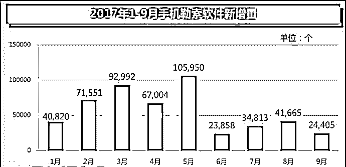

图 1

二、新型勒索软件不断涌现

我们发现了勒索软件使用的三种新型的技术手段：

语音识别、二维码和文件加密。

语音识别采用 STT（Speech to Text）技术，不再使用手动键入密码来解锁，通过使用者的语音输入，进行识别、匹配从而进行解锁；

二维码技术手段是通过扫描制马人生成的二维码进行转账支付勒索金额，整个转账过程中双方信息交互仅为微信用户的昵称与转账账目相关信息，微信用户的昵称可以随意改变且不唯一，转账过程中不涉及双方微信账号的信息，转账后无法自动解锁，让受害者再次陷入制马人的骗局中。

 

锁机界面

文件加密类型的勒索软件，在国外早已出现，国内开始出现仿冒页面布局、图片及功能的手机版 WannaCry 勒索病毒，甚至将手机版可编译的源码上传至 Github。

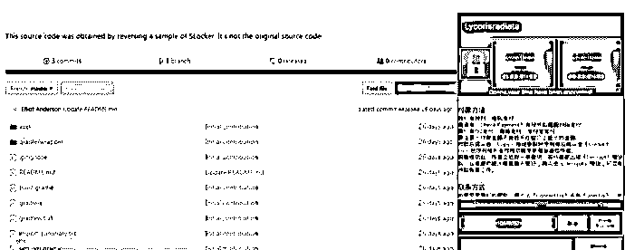

图 3

我们发现了一款冒充时下热门手游“王者荣耀”辅助工具的手机勒索恶意软件，会对手机中照片、下载、云盘等目录下的个人文件进行加密。并向用户勒索赎金，金额在 20 元、40 元不等。并且宣称三天不交赎金，价格将翻倍，七天不交，将删除所有加密文件。这个恶意软件由于可以在加密算法、密钥生成算法上进行随机的变化，甚至可以选择对生成的病毒样本进行加固混淆，很大程度上增加了修复难度，对手机中文件和资料造成了严重破坏。

## 第二章      社交网络成为勒索软件主要传播渠道

### 一、QQ 服务被滥用

我们发现勒索软件在勒索页面的设计和文字上都有很多相似的地方，其中最为典型的特征是勒索页面中都留有制马人联系方式，方便中招的受害者与制马人联系，以便制马人对受害者进行敲诈勒索，这些联系方式几乎都是 QQ 号或者是 QQ 群。

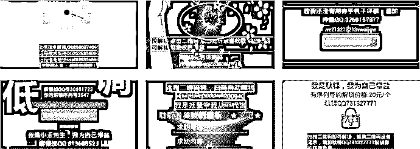

常见锁机界面

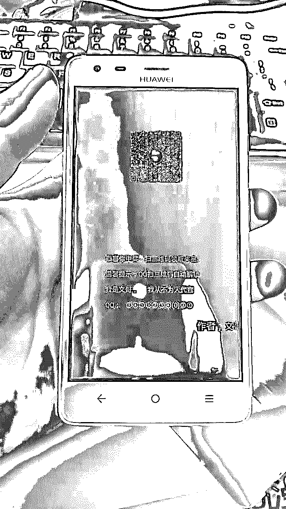

安卓锁机案例

2017 年勒索软件腾讯系调查报告：

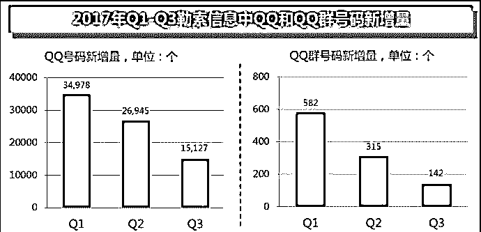

勒索软件腾讯系调查报告

二、QQ 群是主要传播源

### （一）QQ 与 QQ 群关系

通过对勒索软件预留的 QQ 号与 QQ 群的分析，我们发现大部分勒索信息中都会同时出现 QQ 号和 QQ 群号。在相似页面布局的勒索页面中，变化是只是 QQ 号而 QQ 群号基本不变。

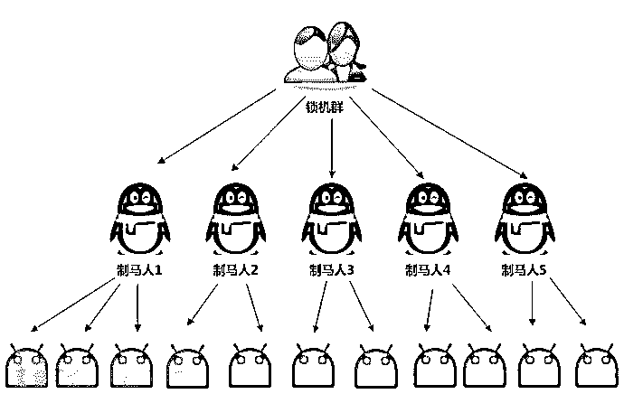

锁机群和制马人关系

例如，QQ 群号 30****23，与该号码同时出现有 325 个不同的 QQ 号，包含这些 QQ 号的勒索软件 6 千余个。

附：QQ 群传播的勒索软件感染地区调查报告

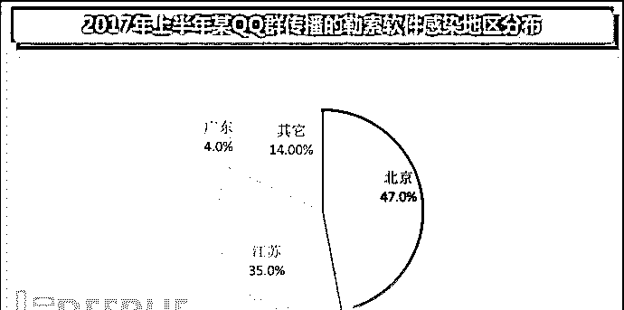

图 7

### （二）QQ 群共享资源

我们进到一些锁机 QQ 群后发现，群里有人将一些锁机源码、测试视频、视频教程、软件源码及制作工具等等上传到群文件中，共享给群里其他人，甚至还有人制作木马一键生成器。

这种一键生成器操作简单，不需要具备编程知识而且能够自定义生成多种类型的手机恶意软件。由于使用门槛低，造成了勒索软件从数量、类型上的不断增长与变化。

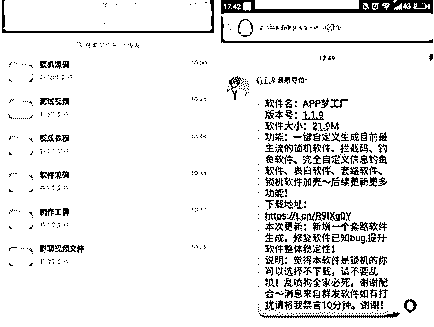

**附：锁机群内的锁机软件源码**

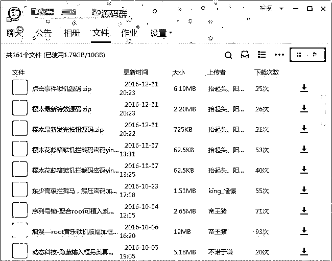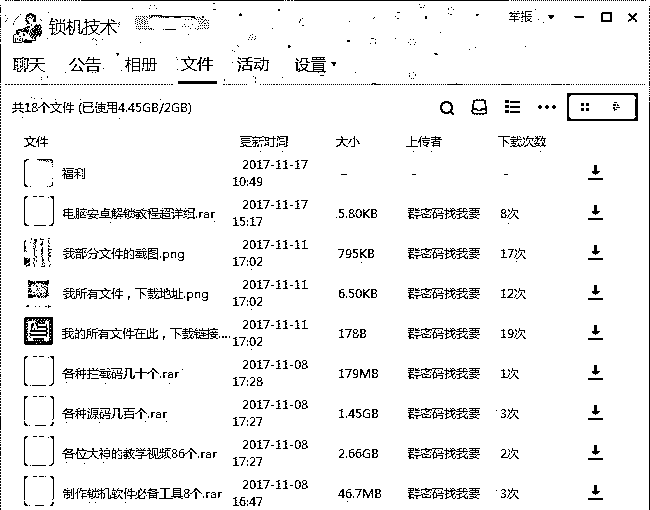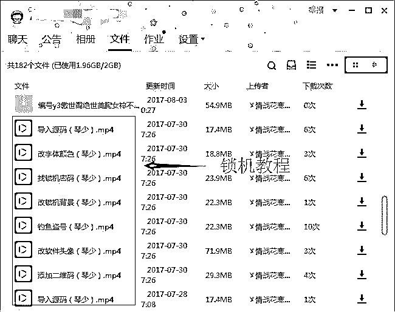

上图是某锁机 QQ 群的锁机教程

三、传播影响与范围

通 QQ 群查询“锁机”关键字得到的结果，带有“锁机”关键字标签的 QQ 群有 200 余个，由此可见 QQ 群是勒索软件的主要传播源。

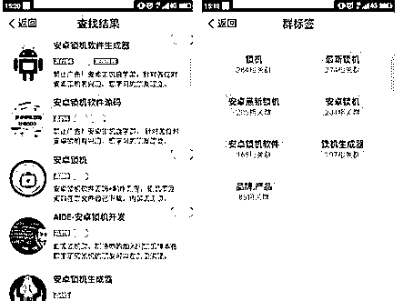 

QQ 群搜索：锁机获取到大量的相关 QQ 群

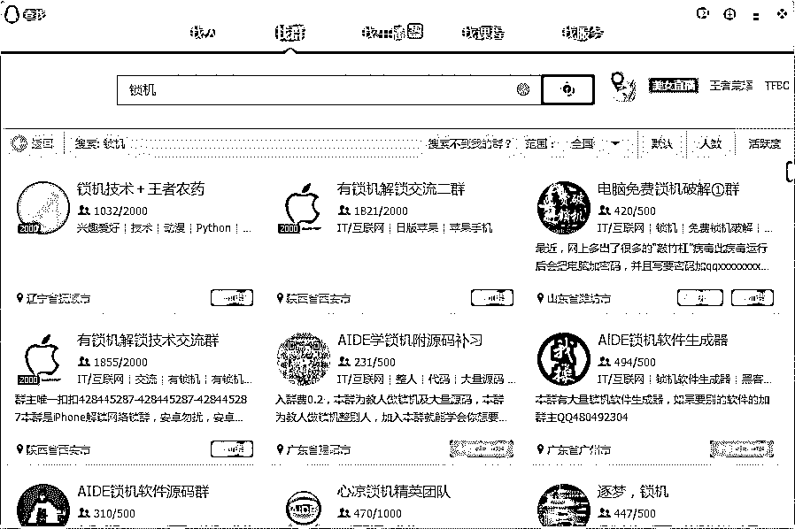

## 百度搜索:  安卓锁机软件生成器  更可以轻易获取 锁机软件生成器和源码

**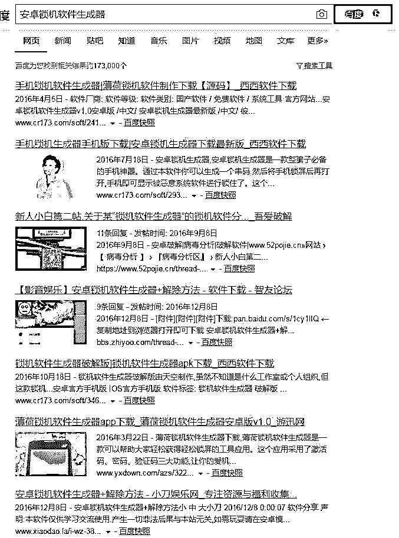**

## 第三章      勒索 软件定制与工厂化

### 一、大部分一键生成器由简易工具制作而成

勒索软件一键生成器不仅能够根据需求定制手机恶意软件尤其是勒索软件，而且还能够批量生产进入工厂化模式，这种一键生成器与大部分国内勒索软件，同样是使用 AIDE 开发工具开发。

AIDE 是一款用于直接在 Android 设备上开发 Android 应用程序的集成开发环境（IDE）。支持编写-编译-调试运行整个周期，开发人员可以在 Android 手机或者平板机上创建新的项目，借助功能丰富的编辑器进行代码编写，支持实时错误检查、代码重构、代码智能导航、生成 APK，然后直接安装进行测试。使用 AIDE 能降低软件作者的学习成本和开发门槛，同时拥有更灵活和快速修改代码的能力。

创建 APP 工程

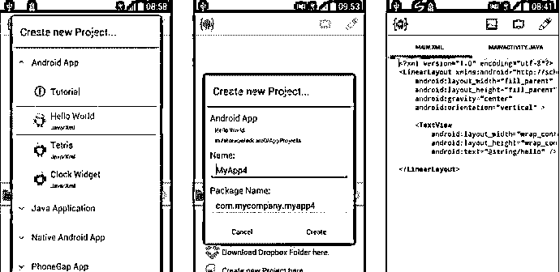

 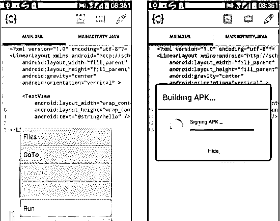

APP 编译签名

图 11

二、一键生成器介绍

我们从某安卓锁机源码 QQ 群中下载到名为“APP 梦工厂”的一键生成器。

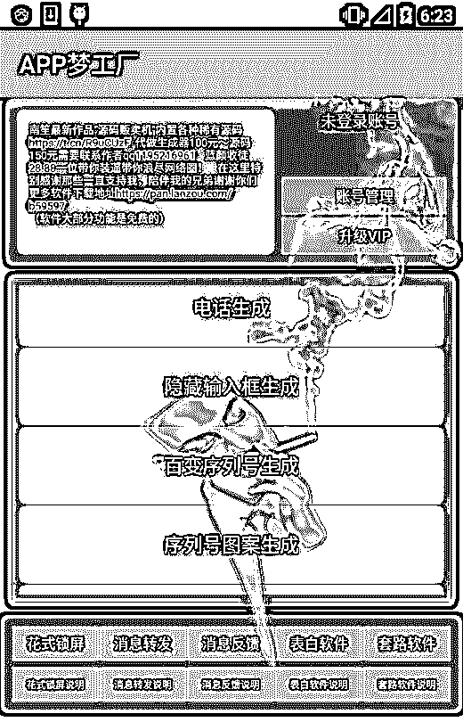

梦工厂 软件界面

经过分析，一键生成器包结构主要有两部分构成，一部分是定制模板，另一部分是签名工具，均存放在 APK 包的 assets 资源文件夹下。

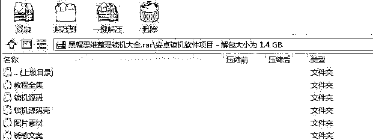

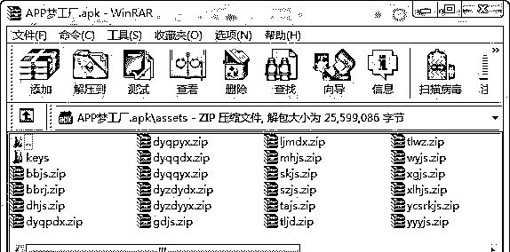

生成模板共有 22 种不同类型的软件，其中包括了 12 种不同类型的勒索软件、6 种钓鱼软件、2 种套路软件、1 种拦截马软件以及 1 种表白软件。

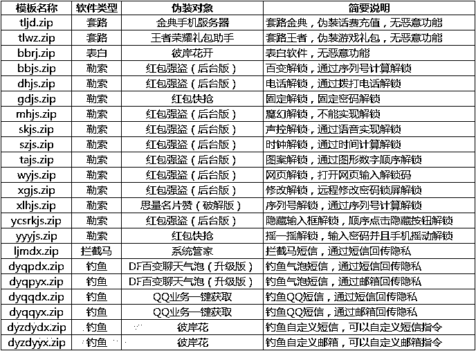

三、生成器制作流程

### （一）选择生成软件的类型

选择花式锁屏，类型包含固定密码生成、序列号生成、网页生成、电话生成、隐藏输入框生成、声控生成、魔幻粒子版远程修改密码生成、时钟生成、百变序列号生成、摇一摇生成、序列号图案生成和远程修改密码生成。

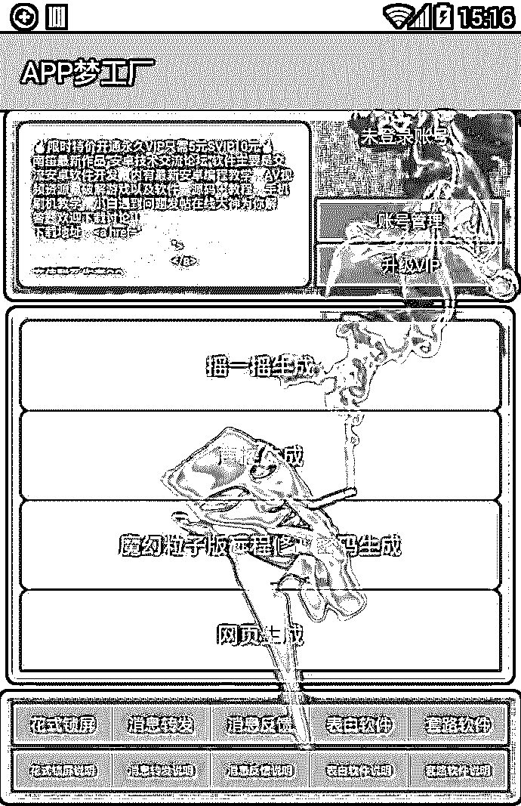

锁机软件界面

选择消息转发，类型包括消息转发（手机号版）和消息转发（邮箱版）

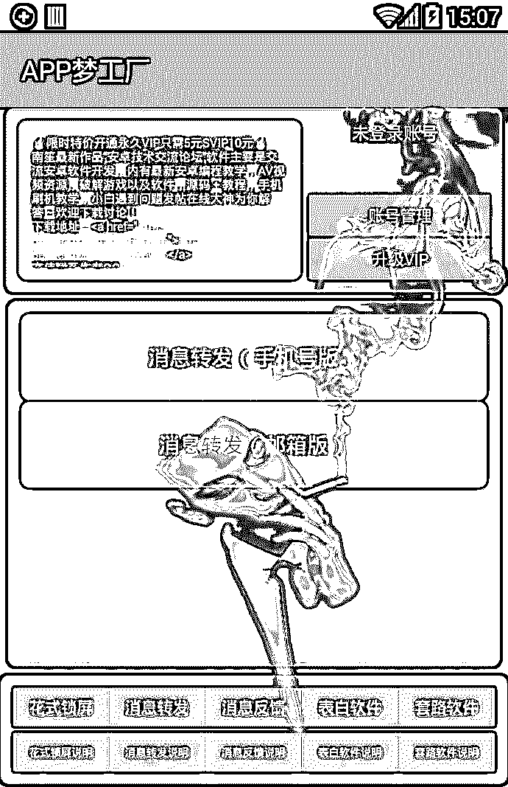

选择消息反馈，类型包括消息反馈 1（手机号版）、消息反馈 1（邮箱版）、消息反馈 2（手机号版）和消息反馈 2（邮箱版）

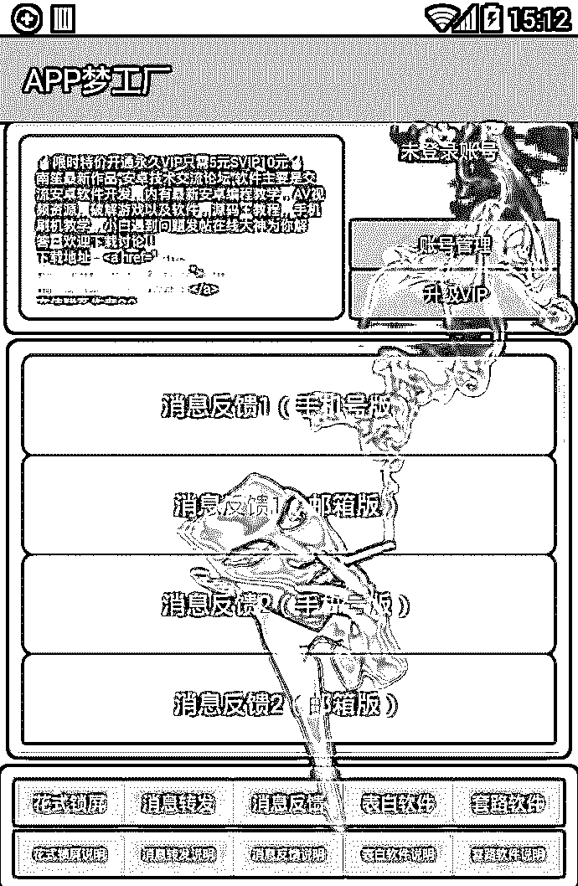

选择表白软件，只有一种类型无声的表白

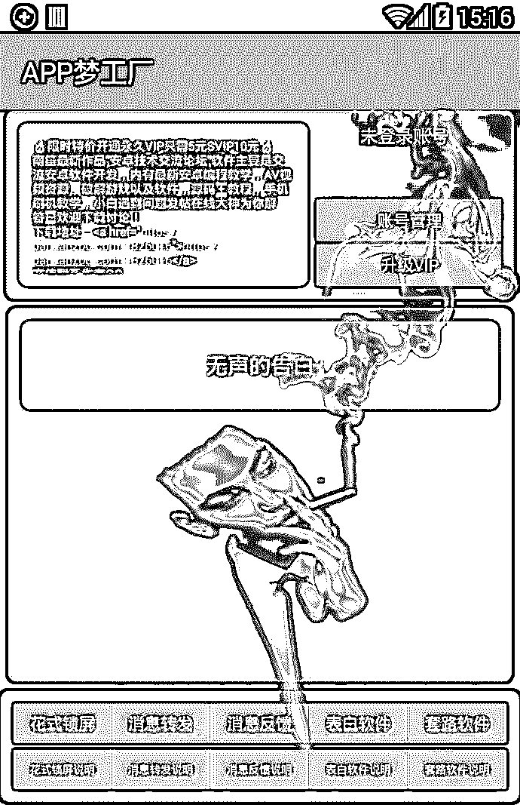

选择套路软件，类型包括金典手机服务和王者荣耀礼包

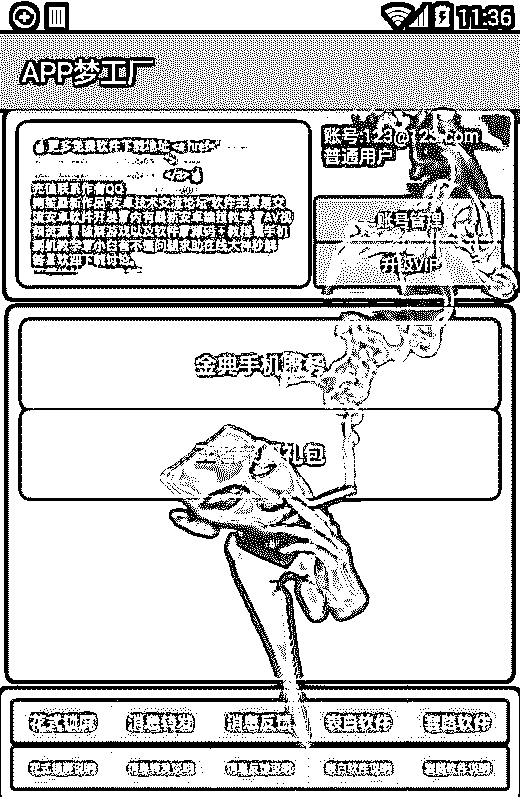

### （二）填写生成软件的配置信息

需要选择图标、软件背景图文件路径、填写软件名称、PIN 码、解锁密码以及页面上显示的文字内容。

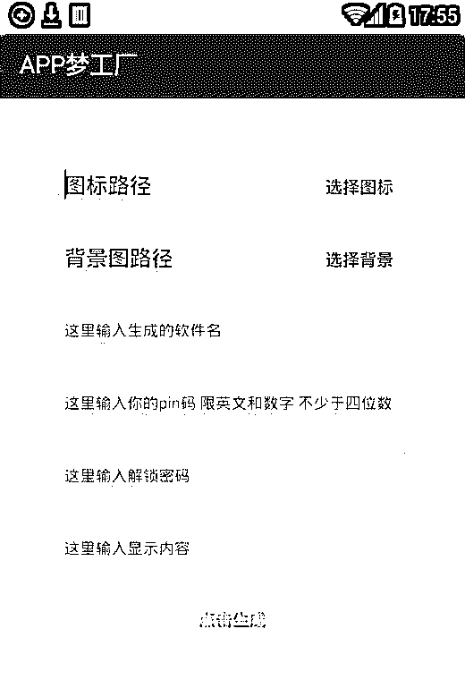

这些自定义的勒索软件配置信息，被插入到生成器的模版文件中，重新签名后在 SD 卡目录下生成定制的 APK 文件。

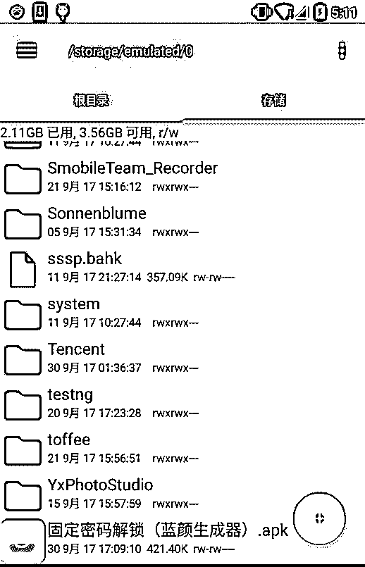

### （三）添加生成软件 ROOT 锁

这里添加 ROOT 壳，并不是指 APK 的加固加壳。而是指将之前一键生成的勒索软件以子包的形式隐藏在另一个软件中，后者伪装成正常软件安装运行后会通过一些文字提示诱导用户授予 ROOT 权限，同时将前者安装到手机系统软件目录中，这种子母包组合的锁机方式被制马人称为“ROOT 壳”。

一般伪装的正常软件都与 ROOT、清理加速、文件管理相关，主要因为从这些软件的功能上，更容易让人们授予 ROOT 权限，从而更加顺利的隐藏到系统目录中。

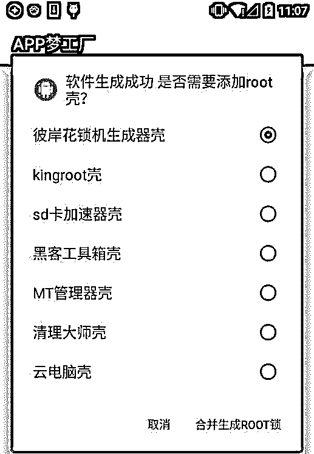

**四.   深入制马人和操作者内部挖掘信息**

通过灰产哥深入调查，发现某社交软件群组贩卖锁机程序。只要付了费，卖家会根据你要求生成“锁机生成器” ，这个行业入门成本低 极度泛滥！

**附：我与相关从业人员的对话**

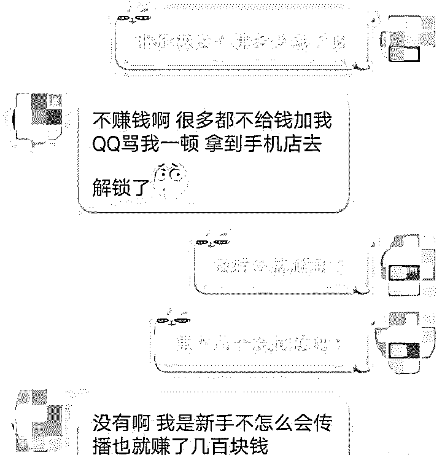

手机恶意程序已经形成一条黑色产业链，制作、传播、敲诈、洗钱、教学。

在这个行业内鱼龙混杂 由于技术门槛要求低 不少初中、高中生也加入其中 。“

黑客”KK 还告诉灰产圈团队 一款锁机病毒之前能卖到 200 元，现在学生们开学了 一个病毒几十到十几块钱就可以买到。

这让灰产哥不寒而栗，虽然对于我来说这种东西是小儿科，但是如果是小白中招的话还是会很头疼的。

更有人制作了二维码付款锁机软件，用户中了锁机病毒后扫描二维码支付一定金额后自动解锁。这真是够省事儿的 即使你看不懂代码 也可以利用 E4A、AIDE 等软件轻松制作锁机软件。

## 五，  结  尾

社交网络的飞速发展，让人与人之间的沟通变得更加方便。由于社交网络平台的灵活多变，也让一些人能够更加轻松的获取、传播恶意软件，平台的监管也带来了更大的困难。

制马人肆无忌惮制作、传播勒索软件进行勒索敲诈，并且大胆留下自己的 QQ、微信以及支付宝账号等个人联系方式，主要是因为他们年龄小，法律意识淡薄，认为涉案金额少，并没有意识到触犯法律。甚至以此作为赚钱手段，并作为向他人进行炫耀的资本，加速了手机勒索软件的演变。

恶意软件一键生成器取代了人工繁琐的代码编写、编译过程，进一步降低了制作门槛，不仅生成速度变快，并且能够根据需要进行定制。

自从 WannaCry 勒索病毒全球大爆发后，国内效仿的勒索软件层出不穷。以加密文件方式进行敲诈勒索的手机勒索恶意软件逐渐出现，改变了之前的手机锁屏勒索的方式。手机勒索软件技术上更加复杂，造成的用户额外损失更加严重，同时也给安全厂商带来更大的挑战。

**延伸阅读：****[深度|在黑市里，苹果 iPhone 是这样被解锁的：解密苹果“被盗洗白”的地下产业链，暗无天日，深不见底！](http://mp.weixin.qq.com/s?__biz=MzIyMDYwMTk0Mw==&mid=2247488772&idx=1&sn=887a6b98e233cb6d5e54677547261f91&chksm=97c8de3ca0bf572a04809ce9511c4993cfabcf768afb8d4889622ead568ebc951055bd49cd00&scene=21#wechat_redirect)**

**隐藏在手机里面的黑色产业、灰色产业还有多少呢？** 

**请持续关注我们：解密互联网骗局、实战揭秘互联网灰产案例、网赚偏门项目解析、分享网络营销引流方案。深挖内幕、曝光各类套路。**

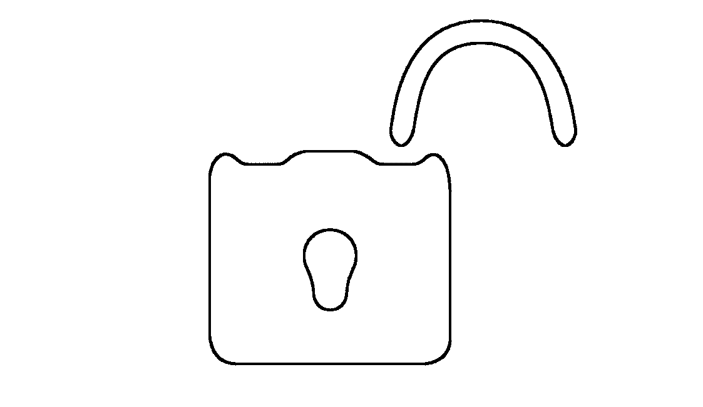

**福利： 当你的手机被锁机时怎么办？**

** 灰产圈提供 ****安卓锁机破解方法   **

**关注公众号：灰产圈  回复 ：锁机   **

点击“阅读原文”加入高端社群。