# 深度|号称中国式“比特币”的迅雷“玩客云”，究竟是过度炒作？还是暴富机遇！为你揭秘最真实的“玩客云”！

> 原文：[`mp.weixin.qq.com/s?__biz=MzIyMDYwMTk0Mw==&mid=2247489110&idx=1&sn=aeab5f34e9676159913408f975f5d0e2&chksm=97c8dd6ea0bf5478fed0ae3f682c56431d2ed1aa8af10eecdaa8f3c4f17be8e23399bcb32419&scene=27#wechat_redirect`](http://mp.weixin.qq.com/s?__biz=MzIyMDYwMTk0Mw==&mid=2247489110&idx=1&sn=aeab5f34e9676159913408f975f5d0e2&chksm=97c8dd6ea0bf5478fed0ae3f682c56431d2ed1aa8af10eecdaa8f3c4f17be8e23399bcb32419&scene=27#wechat_redirect)

迅雷，在大多数人心目中相信是下载工具的代名词。可以说 10 多年前就家喻户晓，成为不少人电脑中的一款必备软件。

今年，迅雷在此基础上又换了一种玩法，叫做“玩客计划”。在其中加入了时下流行的“区块链技术”，“挖矿”，“数字货币”的概念，一时风头无二，非常能忽悠小白。

迅雷邀请到了王祖蓝，陈子由作为形象代言人，官方宣传片如下：

[`v.qq.com/iframe/preview.html?vid=n0551cc8klg&width=500&height=375&auto=0`](https://v.qq.com/iframe/preview.html?vid=n0551cc8klg&width=500&height=375&auto=0)

**具体的玩法是：**

用户先在玩客计划首页抢激活码，抢到激活码后即有资格做“矿工”来“挖矿”，获得一种名为”玩客币“的数字货币。在迅雷官网，是这样介绍玩客币的：

> 玩客币是玩客云共享计算生态下的基于区块链技术的原生数字资产，它的产生过程与玩客云智能硬件、共享 CDN 的经济应用有强关联，必须通过玩客云智能硬件分享网络带宽、存储空间等资源来获得。在玩客云共享计算生态系统中，它将成为用户交换可共享计算资源的媒介，保证用户的权益和提供的计算资源对等。
> 玩客币分发总量有限且每 365 天产出量减半，随着时间的推移获取难度越来越大，前期参与更有优势。

而光有激活码有资格做“矿工”还不够，还需要购买“玩客云”硬件设备做为“矿机”。这个矿机，目前也是处于一机难求的火爆状态：

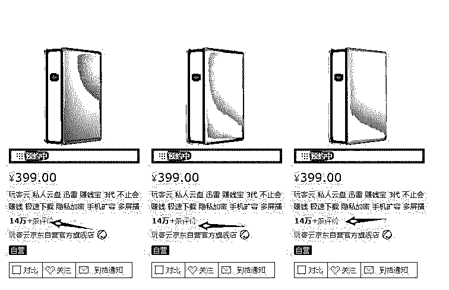

灰产哥在京东看到，玩客云矿机自 9 月发售以来已经有了数万条评价，目前仍然一机难求，页面处于预约抢购的状态。

而在一些二手交易平台，我们看到原价 338 的玩客云已被炒到了近千元的价位，玩客计划官网免费发放的激活码也要卖到 300 一个，而通过“挖矿”挖出的玩客币也有人开价 3-4 元一枚在收。

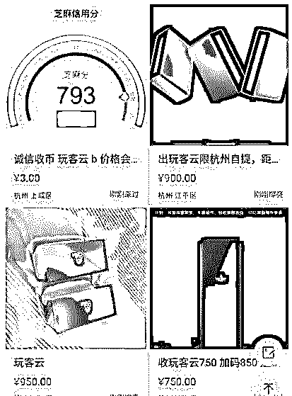

根据玩客云论坛用户交流的数据显示，一台矿机每日收入几十个币，按照目前 3-4 元一个币的价格来算的话，日入百元没有问题；而且根据这位用户的描述，按官方价格计算，玩客云矿机+硬盘的成本在 500 元左右，3 天回本的节奏，后面全是利润，难道迅雷这次真的大发善心出了一个躺着也赚钱的玩意？

**下面灰产哥来分析下这个玩客计划的套路。**

* * *

**什么是玩客云？**

以上两张图来自于玩客云官网，关于玩客云，官方形容“躺赚”，是否真的是“躺赚”？请看灰产哥调查 

下图为玩客云 硬件设备 ，可以理解为矿机（挖玩客币必备的硬件设备）

**什么是玩客币？**

**官方解释：**

玩客币是玩客云共享计算生态下的基于区块链技术的原生数字资产，它的产生过程与玩客云智能硬件、共享 CDN 的经济应用有强关联，必须通过玩客云智能硬件分享网络带宽、存储空间等资源来获得。在玩客云共享计算生态系统中，它将成为用户交换可共享计算资源的媒介，保证用户的权益和提供的计算资源对等。

简单讲，就是通过硬件：玩客云 产出的币叫 玩客币。玩客币是通过玩客云的星域 CDN 技术+区块链技术生成的，属于区块链代币，所以他的总量是有限的，总量有 15 亿，团队保留 3 亿，开放 12 亿给大家挖，发币量会每年递减一半。由于今年区块链代币的关注度和投资热度爆发，所以玩客币也成为不少区块链代币玩家的青睐。

**玩客云挖矿是什么？**

通过玩客云共享家庭闲置的带宽和存储，获得玩客币奖励回报，我们把这个过程称之为“挖矿”。用户的上行带宽、硬盘存储空间（建议 200G 以上）、在线时长（建议保持每日 24 小时在线）三项数据决定挖矿的分数，按照分数占全网总分的权重向全网矿机分配当日产生的币。

加入玩客奖励计划中“睿智者”的玩客云，可以参与挖矿（玩客奖励计划详情）。

**挖矿开始时间：**2017 年 10 月 12 日 0 点

**挖矿收益发放时间：**挖矿开启后每天上午 9：00 前发放前一日收益（首次确认收益时间为 2017 年 10 月 13 日 9：00 前）

玩客币每天产量固定，第一年每天产量每天约 164 万个，每 365 天减半一次。玩客币是基于矿机硬件能力、上行带宽、可共享存储大小、有效在线时长等贡献进行的激励。矿机分数是代表其在当天的贡献，按照分数权重向全网矿机分配当日产生的币。

玩客币钱包

**什么是玩客币钱包**

玩客币钱包是用来生成和管理钱包地址、生成和管理私钥、接收和发送玩客币的工具。

1、 下载并安装玩客币钱包

扫码下载玩客币钱包 APP

2、 添加生成一个新账户

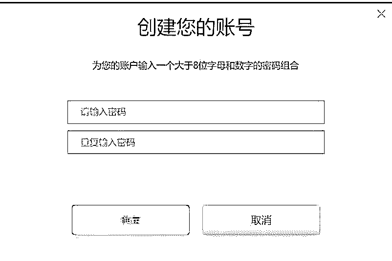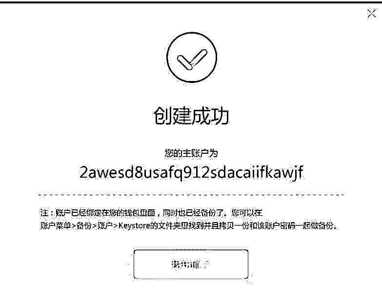

3、 显示账户二维码，用玩客云 app 扫码，进行手机验证，完成绑定

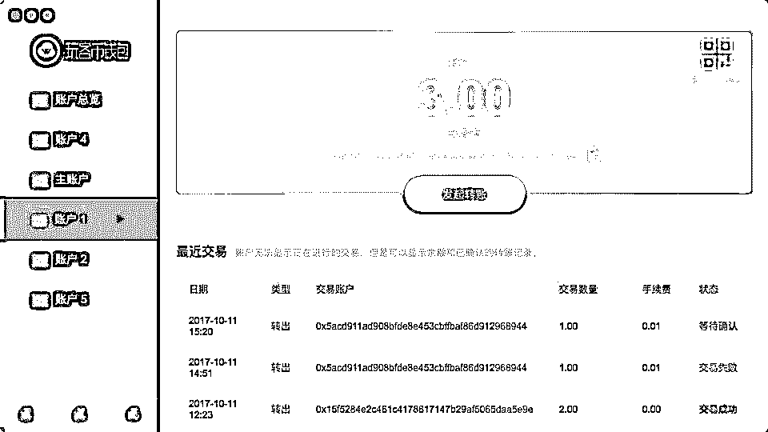

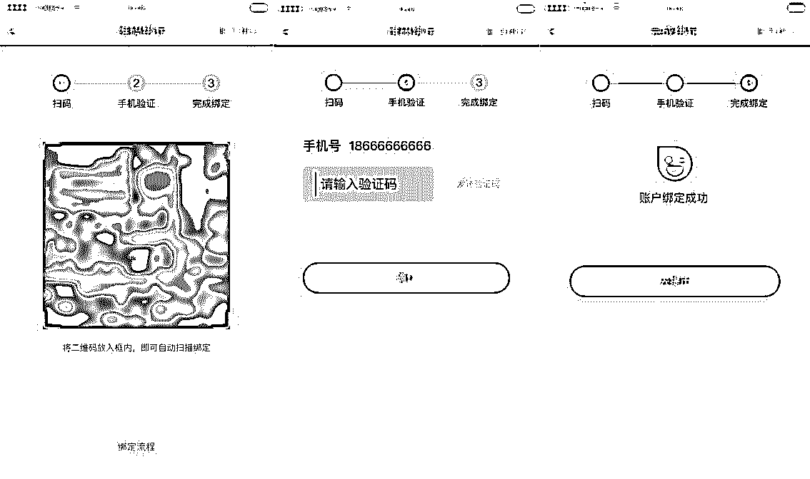

4、 将玩客云设备挖矿产生的玩客币提现到钱包

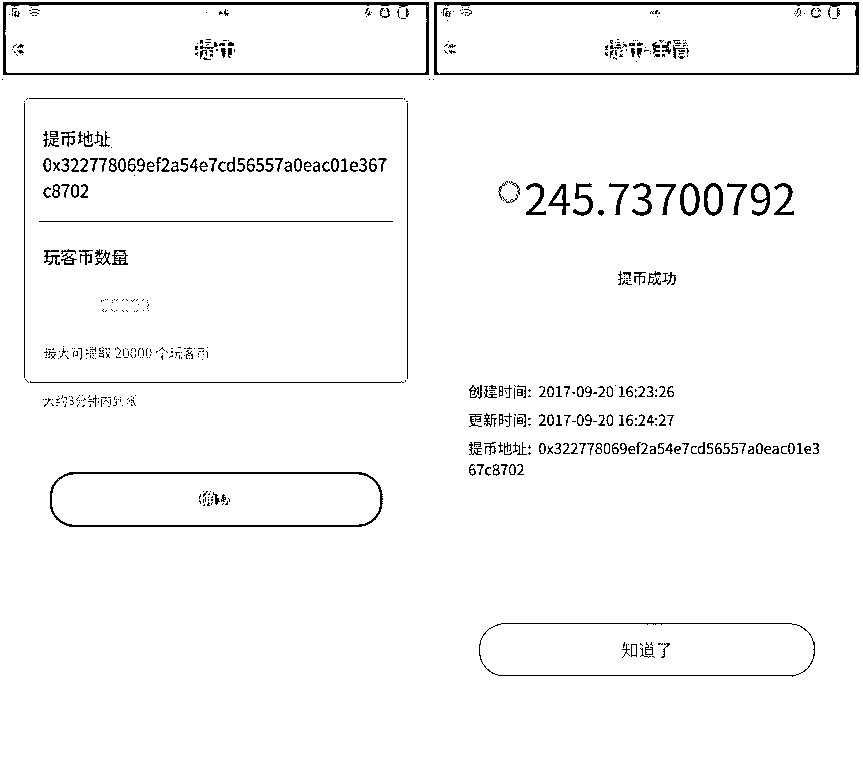

每周可提现一次，工作日的 9：00~17：00 可提现；提现免手续费，但到账受区块链确认交易时间限制，可能略有延迟。

玩客币的发放

那他的挖矿是怎么回事呢？

先来看玩客币发放公式，来自迅雷官网：

> 计算方式示意：
> • 矿机分数 M=（硬件能力*硬件因子+带宽*带宽因子+存储值*存储因子）*（在线时长/24 小时）；当天发币总量=Ct；
> • 则矿机 M1 当天产币量为

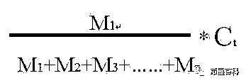

> 例如：
> 带宽：可信节点测得的上行带宽。为鼓励分布式节点的参与，带宽因子在 1-8M 时为 10，在 9-20M 时衰减为 5，在 21-100M 时衰减为 1；100M 以上按照 100M 进行计算；采用阶梯累进算法（详见下文举例）；
> 存储：可信节点测得的可用于挖矿的存储空间，为鼓励用户多分享自己的闲置存储资源，设定存储值在小于 200G 时为 0，200G-1000G 时为 1，大于 1000G 为 2；存储因子为 5；
> 在线时长：可信节点每日会对前一天有效在线时长进行总计，并进行全网分数的计算以及玩客币的分发。

原来，他这所谓的“挖矿”其实是根据用户每天上传数据量来进行的一个评判，用户带宽越高，数据量上传越多，存储空间越大，得到的分数越高，就能挖到越多玩客币。请看表格：

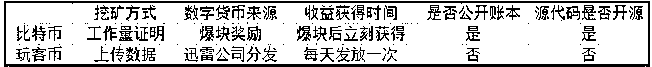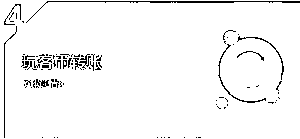

**使用钱包交易玩客币**

当你创建好钱包账户之后，就可以使用钱包交易玩客币了，具体步骤如下：

一、选择你已经创建的账户，点击【发起转账】按钮

二、发起转账的界面中，输入要转入的账户和金额，点击【确定】

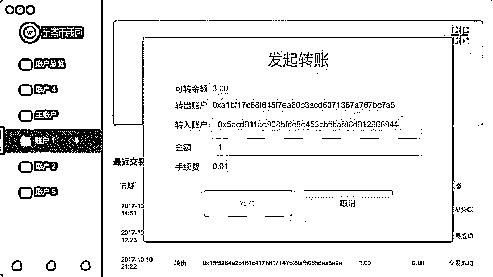

注：为防止恶意转账行为，每次交易固定收取手续费 0.01 玩客币

三、在确认交易的界面中检查交易信息，确认无误后输入密码，点击【确定】，等待发送完成

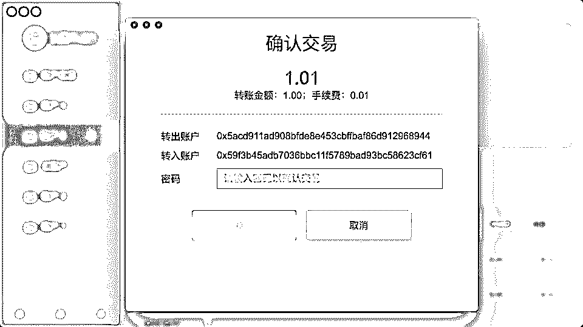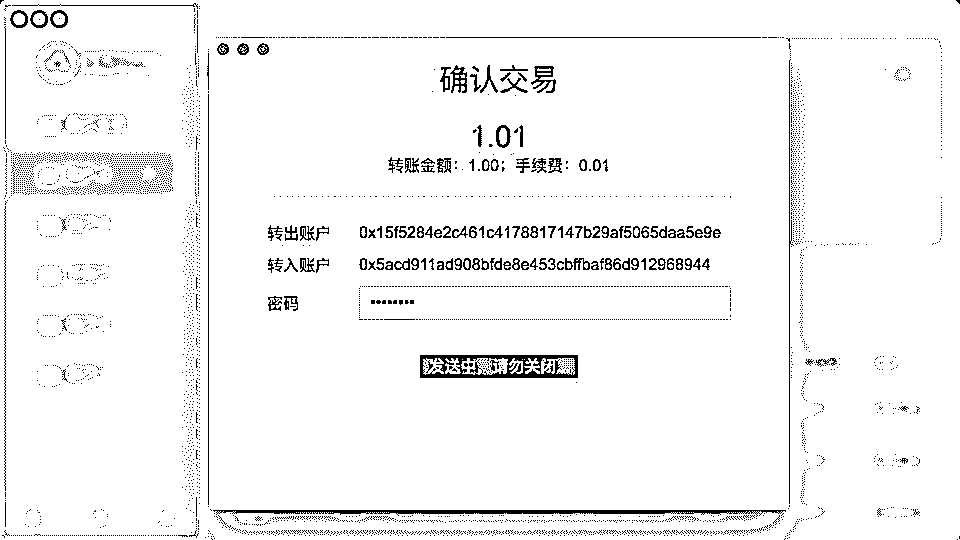

四、发送完成后，等待交易确认，页面自动刷新交易状态。

**玩客币区块链累计情况  和  玩客币挖矿昨日人均表现**

**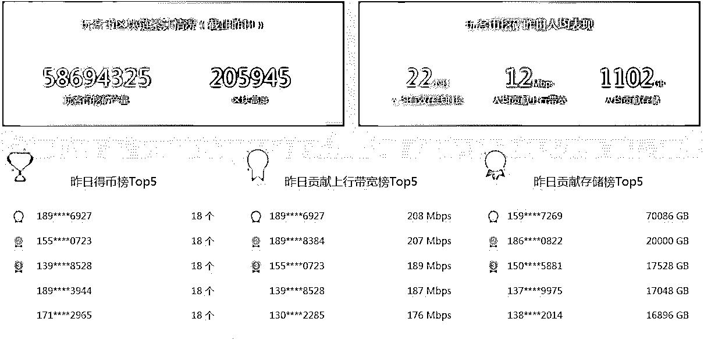**

### 玩玩客币的价值

由于众所周知的原因，玩客币目前没有上线任何交易所，因此目前玩客币交易的渠道只能通过第三方平台，在用户间私下交易。

关于玩客币目前的价格和一台玩客云目前的日收益，灰产哥只能说，超乎想象。能有目前这局面，除了上市初期炒作因素之外，并不排除有“庄家”私下现金收购玩客币来支撑价格。毕竟，通过销售玩客云矿机已经可以赚翻了（一台 399 的机器利润 500 元以上）。

至于有些玩家想把玩客币当作比特币这样的投资品投资的，还喊出几百倍几千倍增值空间的。

灰产哥只能说，您想多了。看看这份表格：

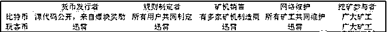

这就是一个公司的销售模式的创新而已。即使会有阶段性的炒作

**玩客币的未来**

由于中国已经禁止 ICO，所以迅雷并没有采用 ICO 的方式来运作玩客币，只是单纯通过共享宽带来挖币，自家也没有开设交易平台，但这有两个好处。

第一，国内资金实力不足需要 ICO 的同类平台，都被政策封杀掉，相当于天然的政策保障。例如流量矿石和 blockcdn 等等由于采用 ICO 方式发行运作，都被国家叫停了。

第二，让玩客云的价值会有一段时间都处于价值低洼期，让更多人可以获得参与机会。

玩客币还有其他交易价值吗？

由于官方和第三方都不能搭建玩客币的交易平台，那目前的玩客币有交易价值吗？或许是有的，官方说法玩客币未来可以兑换 CDN 服务和购买知识服务等。不过，网上有不少网友认为玩客币未来可以用来换迅雷会员、爱奇艺会员，小米产品等等，当然大家最期盼国家能对数字代币颁发牌照，像 P2P 金融一样通过监管等方式让其合法流通。

最后，我表达一下我的个人观点，我是看好迅雷玩客云的，毕竟按实力来说，迅雷是上市公司还有小米雷军做后盾，资金实力雄厚。而且拥有 CDN 牌照，加上赚钱宝第一、二代的技术积累，技术实力够强。在市场认可度方面，这已经是第三代产品了，市场接受度和认可度都较高，所以我会有一段时间持续看好玩客云。

深度解析

一、玩客云能赚钱吗？那是个什么东西？

能，相信玩过赚钱宝的人都知道，自己的闲置宽带能换 RMB。你平常也不在家，宽带除了给邻居蹭，有没有想过租赁给迅雷，让他用用给你分钱？原理大概就是这样的。

玩客云产出的是玩客币，是一种迅雷发行的基于区块链技术的新型代币，他们设计之初是希望矿工那这些虚拟资产换网络资源，或者获取知识什么的。当然理论上是不允许（富强民主文明和谐~）兑换人民币或者其他虚拟货币。

二、想玩玩客云需要哪些准备？

1、准备一块 1t 的硬盘，1t 以上的更好，最好是 2.5 寸的移动硬盘，觉得贵可以买 2.5 寸裸盘加易驱线。如果是 3.5 寸的还需要带电源的易驱线，3.5 寸并没有便宜到哪里去（而且托管不接收）。

2、准备一条宽带、宽带的下行速率不重要，主要是上行，上行越高，收益越高。本人郑州地区 50M 电信宽带，有 4M 上行，目前搭 1t 硬盘近两天收益已经跌破 16 个。每天下降 3-5%的收益。

3、抢玩客云，也是最难的。

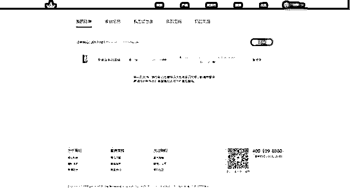

官网：京东商城搜索：玩客云*。*现在卖 399 元，挤破头，难买的很，拼网速手速拼智商。看看这些题，你要是想超过 3 秒，不好意思，没了。闲鱼转转黄牛那里更是超过 1000，闲鱼目前已不支持维权，也就是说在闲鱼上出售玩客云相关的东西，如果发生纠纷，闲鱼不保护卖家权益。慎买，慎买，骗子太多了。

预约：没预约的抓了个紧，马上开抢呢，京东可以用优惠券，所以你懂得！
！！

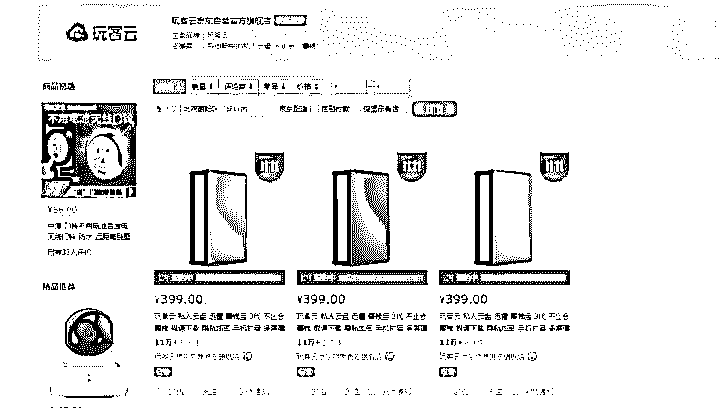

4、玩客计划激活码一个，百度搜索：玩客云官网*，下载一个 app，利用支付宝扫脸认证一下。注意从 11 月 1 日起，玩客云账号只能绑定此手机号抢来的激活码，一对一防止黄牛（嗯，挺管用的，我要是黄牛我也头疼哪里搞那么多人头）。*

*三、获得的玩客币在哪里换钱？*

*有个网站看行情超赞，可以收藏到微信。网址：https://t.miguan.in/monitor*

*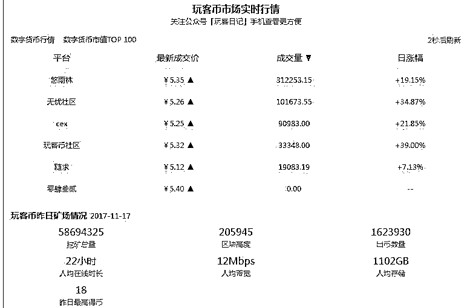*

*   *微信公众号：玩客社区，基于微信平台的*

*   *9 月份国家关停虚拟货币交易网站以后，原本能涨上天的玩客币并没有发挥太大的爆发力。截止目前我所知的几家平台还在运行比如玩客社区*（现更名为无忧社区 ，防止查水表，全部暗语，自己理解，理解能力差的请自动放弃），首次提现只要 1%的手续费，正常提现会有 3%，如果信用好的话可以做到 2%。网站做的很良心，交易不收费，C2C 模式，只做平台。有自主的信用体系，卖币自动确认到账，十分安全，提现也是秒到，贵有贵的道理。**

*   **CEX 官网，可靠就不用说了，只是门槛高普通玩家请绕道，支持大部分主流数字货币币币交易，比如比特币，以太坊，USDT 等等。**

**平台虽然说是顶风作案，随时都有关掉的可能，但是你只要及时提现出来了，还怕什么。**

**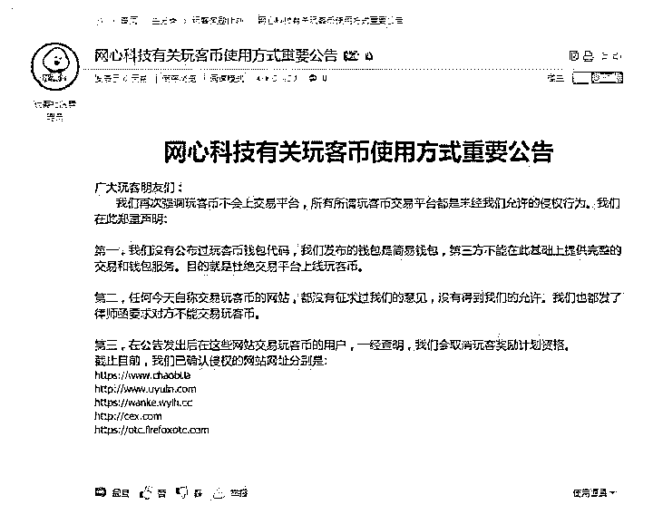**

**说一个搞笑的事情，迅雷发现平台太张扬，于是发了下面这个公告，我的天，硬广告！！迅雷你 TM 在逗我？？我都没你知道的网站多，你到底是让买卖不让啊，我好害怕啊哈哈哈哈哈**

****附：玩客币 交易网站：火狐狸网 ****

****

**四、玩客币可以拿钱去炒吗？**

**跟其他虚拟货币一样，只要有平台，有名气，央妈不发怒，就能炒起来。比特币也有曾经 3 块钱一枚的时候，现在 5 万。**

**但是如果没有太雄厚的经济基础，我不建议现在持人民币去投资，涨跌幅度巨大，动辄一天 30%的涨跌幅度，不要想着一夜暴富，也有可能一夜赔个几千块，心脏不好不要玩。**

**买币暴富一个月前有可能，现在很难了，价格出奇的稳定。**

**五、想要当矿工，需要投资多少人民币买设备，收益如何？**

**目前是 11 月份，官网定价 399，京东定价 399。代抢玩客云费用需要 200 元左右，成功率也不太高，黄牛现货 899 左右。**

1.  **激活码自己抢免费（注意抢的码只能这个手机号用，需要支付宝人脸识别认证一次，也就是说一个人头对应一个玩客云账号），自己抢不到代抢 58 元左右吧。老码随意激活（就是 10 月 31 日之前用别人的人头抢到的激活码，或者是迅雷京东早期赠送的激活码）一个 200 元左右。谨慎交易，防止受骗，骗子太猖獗了！怎么交易？我也不知道。**

2.  **硬盘 2.5 寸 1t 希捷大概 310 元左右，易驱线 20-35。移动硬盘 1t 希捷 360 元，西数 350 元。硬盘 3.5 寸 1t 的 280 元，2t 的 370 元，易驱线 45。**

3.  **电费：……**

4.  **网费：移动每月 30？各地方因地而异，移动上行比较便宜，目前挖矿很给力，但是将来不好说。（补充：这里补充一下，没有网线的话，可以去托管，龙岩家的比较可靠，只是现在人实在是太多了，加急上架的话还要额外交钱，但是挖矿嘛一天也不止这点，自己做决定。）**

**也就说，如果自己手速足够快，399 元（玩客云）+350 元（硬盘）=749 元就是主要的成本了。**

**就算按 800 块钱一套玩客云+硬盘+一个月的所有支出，目前每天按照 10M 上行宽带每天 11 个币来看，加上每天 3-4%的衰减（衰减速度逐渐减缓，非线性减少），假如下月这时候衰减到每天 5 个币，那么根据我很(XIA)不(JI)科(BA)学(SUAN)的计算，从现在开始一个月收入大概有 200 个币（好吧我数学菜得很，我瞎估计的），目前市价 3.35（假如一个月都不涨的话），那么能换来人民币起码 600 多元，两个月妥妥的回本，接下来多少都是净赚了。**

**当然，有人通过黄牛购买高价机器，高价激活码，那么回本的时间显然就要更长一些了。虽然看起来不是很理智，但是时间成本也要算进去的，一周时间耽误的可是收益啊，万一一个币涨到了 5 块钱，一周挖 60 多个币，你自己抢不到，耽误一周就是 200 块。不过我也不推荐购买黄牛的货，因为你多交的钱就是技术授权，与其交给别人，不如自己花点钱提高技术。没有技术真的是很难抢，手残党请自行放弃。**

**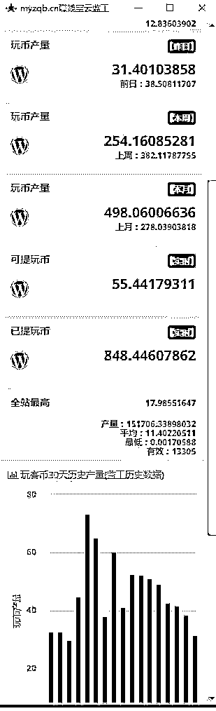**

**9 号上线的玩客云钱包，IOS 系统可以下载，好方便的。**

****

****

****以下文章来自于粉丝投稿，记录从抢购到盈利的历程。**** 

## **抢购**

**我是什么时候与他亲密接触的呢？就在前天也就是 11.1 号零点，为了当一把黄牛，准时定了个 11:50 的闹钟，起来抢玩客云赚钱。本来不报有任何希望，但是竟然意外的抢到了玩客云。之后立马在咸鱼和转 Z 上 850 发布了玩客云，结果秒拍…**

**抱着极大地好奇心认真的翻阅每一个关于他的问题还有知乎的回答，貌似所有都在告诉我，不要卖，卖了你只能赚 500，但是留下你能赚 N 个 500！**

**经过半天的心理斗争，终于决定留下来，又去京东卖了 2T 的机械硬盘和机械硬盘盒，从此走上了我的挖币之路…**

## **收货**

**1 号下午收货，他跟着我的硬盘还有硬盘盒飞速的向我走来。签收打开箱子，他并没有想象之中的那么惊艳，盒子里带上了，千兆网线，还有玩客云。**

**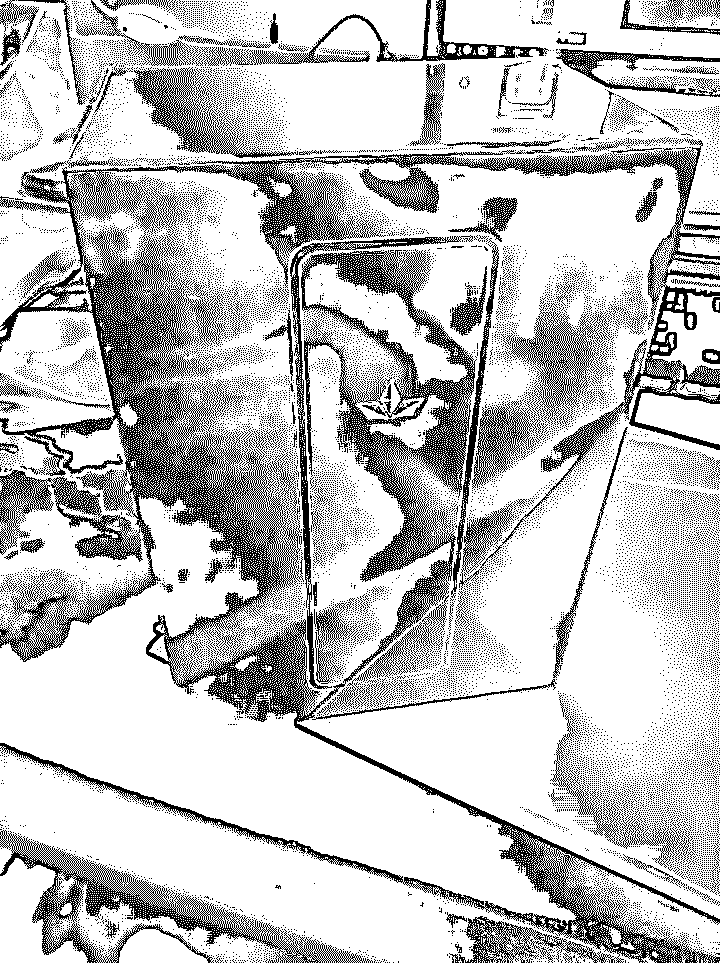**

**外包装**

****

**外包装**

## **开始使用**

**因为经过了解，所以知道玩客云并不是收到机械就可以挖矿的，而是需要激活码，所以便开始用 QQ 广泛搜索玩客云的交流群…果不其然，真的有很多人出售激活码，仔细观察了群里的交易模式之后，发现基本都是 1.看芝麻分，他是 700 多分高于他的先码后钱，低于他的先钱后码；2.群主担保交易 3.各类明显可以感觉出来是小号的骗子【再次提醒各位，不要轻易和任何一个不活跃的 QQ 交易！】权衡之后，选择了方法一，我的芝麻分只有 600 多分，但是貌似遇见了一个爽快的兄弟，直接发来他的截图，让我先激活后付钱，总之第一次合作非常愉快，100 元买了一个激活码。**

**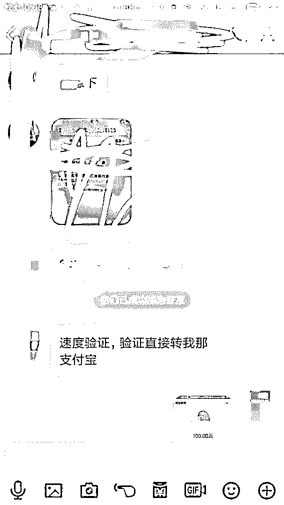**

**（本来京东好评赠送激活码，但是需要等待 3-5 天，为了早日开始挖币之路，所以我决定先购买一个激活码，等京东的码子到了之后再卖出去，我觉得大家也可以使用这种方式，毕竟早挖一天币早一天回本）**

## **开启挖币之路**

****

**输入激活码之后提示成功激活玩客币奖励，代表你的路由器已经可以开始挖币啦~但是貌似首先需要等待一下固件更新，我是开机没一会他就提示我有新的固件升级，升级也很快的。大约二三分钟就好啦！**

**在这里我想和大家说说我遇到的几个问题：**

1.  **·挖币是不显示任何东西的，APP 或者网页显示不出任何有关进度或者是否进行挖币的界面，但是我认为只要是蓝灯就是工作状态。**

2.  **·一开始我认为挖币的时候也和赚钱宝什么的一样，需要占用硬盘的空间，但是看来至少目前来说玩客云还不是这样的，目前他只是占用了网络的上传速度并没有占用硬盘实际的空间**

3.  **·有关收益或者挖多少币的问题，我寝室的网络是移动的 50M 光纤，上传速度在 10M 左右，现在基本一天 20 个币左右（第一天从下午三点开始一共挖了一共 9 个币）**

4.  **·币不会时时显示，他只是会在第二天七点左右的时候更新在玩客云 APP 的我的玩客币中（官方说明是 9 点）**

## **收币**

**在经历过第一天忐忑的心情之后，第二天七点准时看收益。**

****

**看到这个数字，我 TM 都要癫狂了，原本预计每天 15 左右的收币量，现在我可是每天这个标准的话就是 25+啊！我他么要走向人生巅峰了啊…**

**发现并不是这样的，玩客币的交易并没有想想之中的那么简单和轻松…**

**我们并没有官方提供的收购或者交易平台！！我们自能私下自己卖！！在 QQ 群里卖的方式和激活码大致是一样的，但是多了一种，那就是偶尔会有几个人上线一个交易平台…然后吸引一些人去注册，然后，，然后基本他就要挂了……国内禁止，任何此类的交易平台、交易。所以在此郑重提醒各位！！不要随便往任何一个平台扔钱！！首先风险特别大，其次提现手续费特别高！！**

**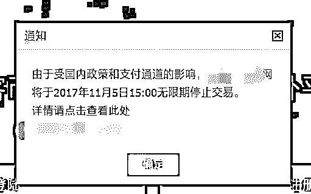

一交易平台通知** 

**我昨天就是因为不相信群里的人觉得不靠谱，然后就找了一个还没有快关闭的交易平台，选择试试水……结果感觉就是被套路了…首先他得实名绑定你的支付宝账号，然后需要绑定你的玩客币钱包（因为他们网站可以自动检测到你的钱包是不是对应这笔账单增加了或者减少，我觉得这个很好）但是！！他很贵！而且很坑！！首先你要充值至少 50 元验证你的支付宝是否正确…然后你懂吧…50 元是不够提现的……你必须要在这个平台交易才可以凑够他这个最低 100 元的体现门槛…我怕这个网站崩盘直接在网站上高价收了 20 个玩客币…**

**所以不推荐大家选择第三方交易平台！！！交易方式具体咋着我还没摸索出来！！但是我告诉大家……大家可以去交易网站看价钱走势，所有这种网站都搞得很详细……可以给你很好的参考价值……**

**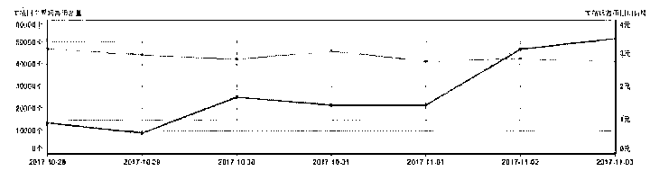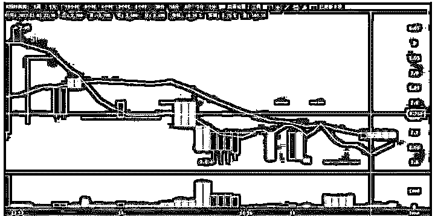**

**当然咯，我觉得最重要的是加几个 QQ 群，群里会有很多人收币，出机器，激活码什么的，你也可以多看看群里的消息，他们好多都是开矿场的会有很多前沿一些的消息。**

## **总结**

**基本操作就这样，给大家说说我这几天玩的心得吧：**

**1.小白入矿首先多了解多分析，不要轻易入矿，个人认为玩客云的加价购买时不太合适的。回本不太方便。**

**2.玩客币每天到底能挖多少呢？其实这个数值根据我在各个群里的交流分析认为：他是逐渐减少的一个过程，币的总数是固定不变的，但是挖矿的人在源源不断的进来，所以每个人获得的币是一定会下降的，群里玩的时间长的大神挖矿得数据也证实了这个问题，在每天网络环境和硬盘固定不变的情况下，挖币数量基本在下降。**

**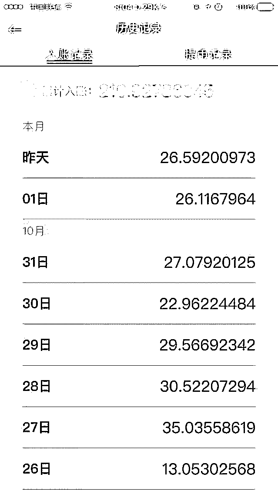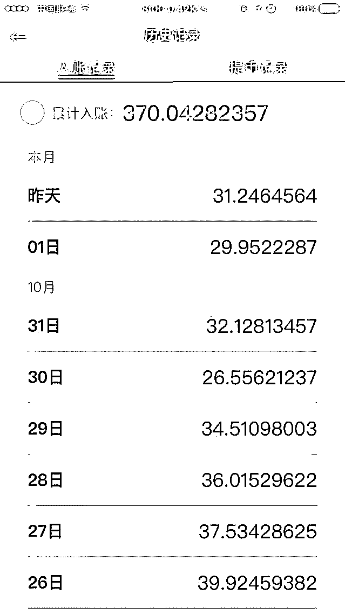**

**所以不要认为币现在好挖，以后就同样好挖。更别忘了一年之后产量减半？大家还可以分多少？群里很多大神都是先前一天 40，50 的币，现在一天 20 30 左右。**

**3.尽量通过咸鱼 转转 或者 群主交易，感觉这几个方面比较靠谱，今天又看群里打了好几个平台的广告，但是总觉得那么多币和钱放在里头不太放心，而且大多网站不支持人民币交易，总之换起来很麻烦，建议大家尽量不要选购，看看走势或者价格什么还可以。**

****附：**** 

****淘宝玩客云当前售价：****

**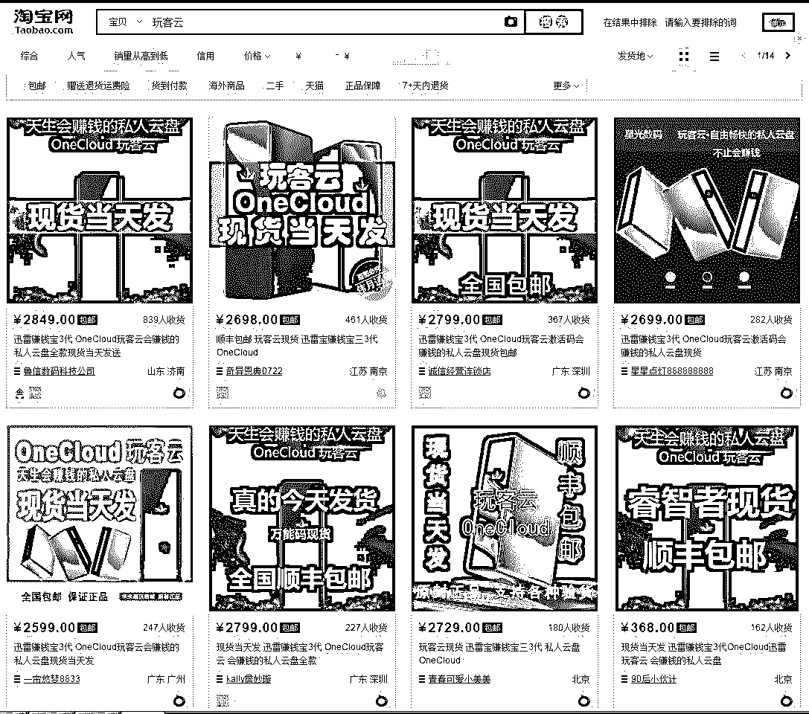**

****玩客币当前交易价格****

**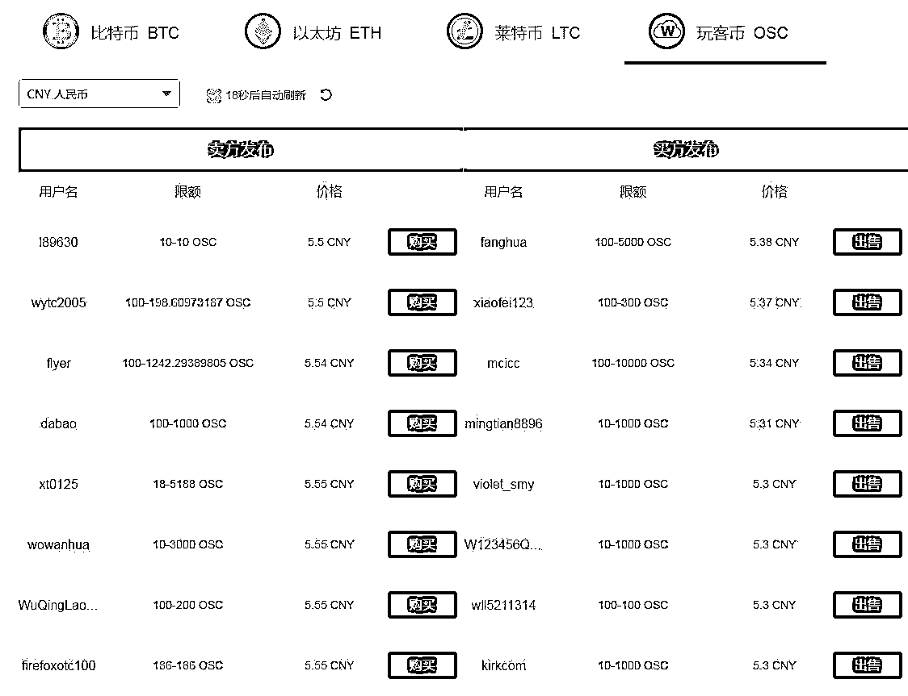**

****结尾：**** 

****玩客云自诞生自日起，背靠 迅雷的强大背景，和玩客云设备限量抢购，以及玩客币的稀缺性，大量玩家涌入其中，就目前来说，通过玩客云赚钱的模式有以下三种：抢购玩客云销售赚差价，玩客云盘产币卖币，玩客币二级市场交易获利等，最后，灰产哥提醒：入市有风险，交易需谨慎！****

****

****

**点击“阅读原文”加入高端社群。**