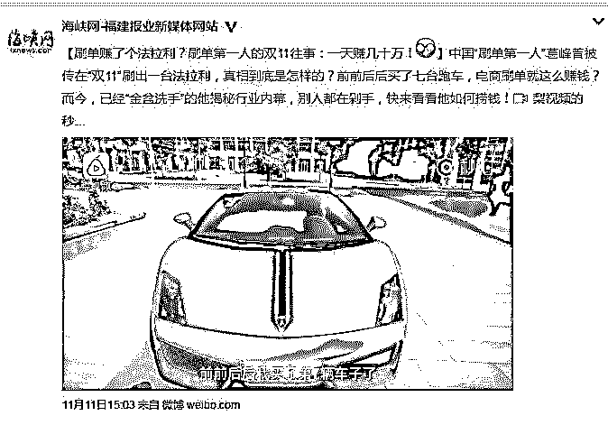
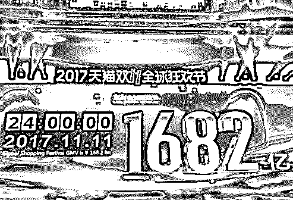
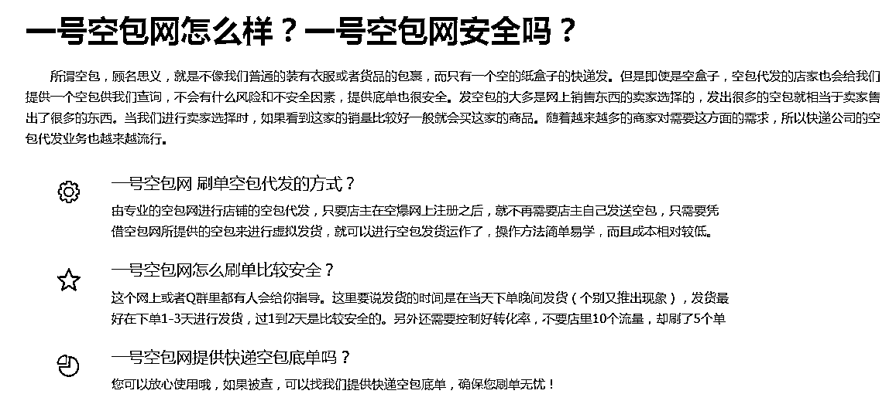
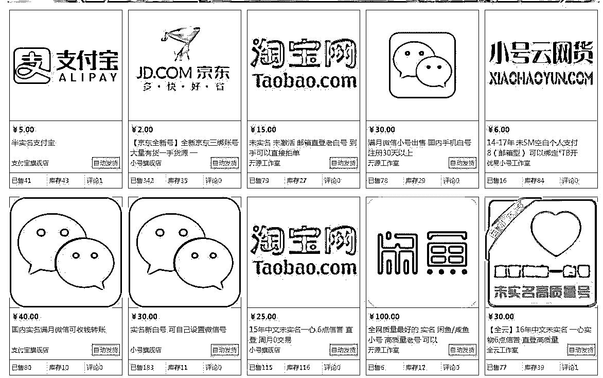
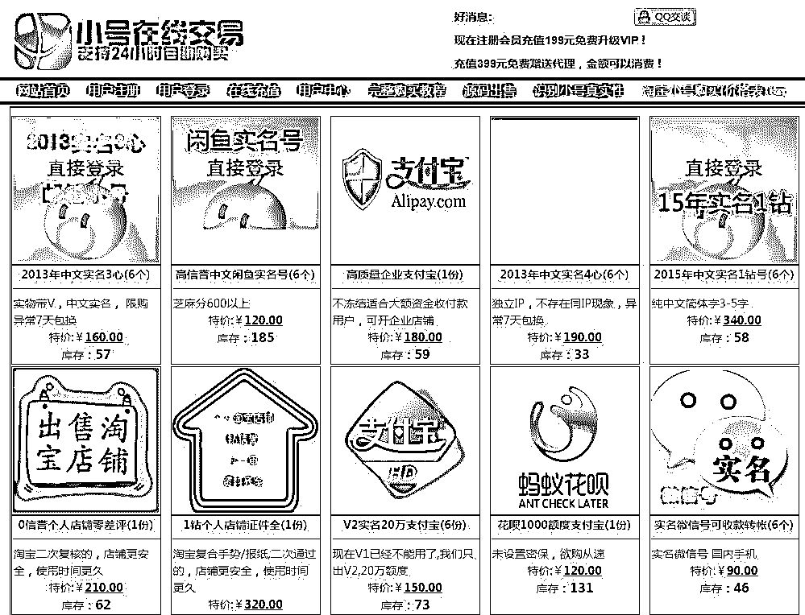

# 深度|2017 天猫双十一成交 1682 亿，刷单 800 亿？ 揭秘真实的刷单世界：有人赚了一辆法拉利！

> 原文：[`mp.weixin.qq.com/s?__biz=MzIyMDYwMTk0Mw==&mid=2247489054&idx=1&sn=4144474a2229b0fa9c796df43dc45058&chksm=97c8dd26a0bf5430170ebdd82bef40c0ab0165d190daec669f416a6e2eacb13a0d474da267e2&scene=27#wechat_redirect`](http://mp.weixin.qq.com/s?__biz=MzIyMDYwMTk0Mw==&mid=2247489054&idx=1&sn=4144474a2229b0fa9c796df43dc45058&chksm=97c8dd26a0bf5430170ebdd82bef40c0ab0165d190daec669f416a6e2eacb13a0d474da267e2&scene=27#wechat_redirect)

****

**近日一则新闻爆红网络： 刷单赚了个法拉利？刷单第一人的双 11 往事，一天赚几十万！**

**报道如下：**

**记者采访当事人：葛峰，被誉为中国刷单第一人！**

[`v.qq.com/iframe/preview.html?vid=a0503yjtcx4&width=500&height=375&auto=0`](https://v.qq.com/iframe/preview.html?vid=a0503yjtcx4&width=500&height=375&auto=0)

**正文：**

          "双 11"促销热浪已经过去，但“2017 天猫双 11 成交金额 1682 亿元，通过支付宝完成的支付总笔数则达到 14.8 亿笔”的销售神话仍在传说之中

各路电商不断地在朋友圈和微博上分享这个来之不易的大数据的时候，灰产哥采访的一些网店店主却无奈地说：自己和朋友的双十一销售额中有一大部分来自“刷单”。

　　千万元销售大户刷单占到五成

　　CC（化名）是灰产哥认识的一位淘宝店主，他对灰产哥讲：为了在这次双十一狂欢大战中博取一个好的业绩，他们和国内大大小小的电商一样准备了无数个日日夜夜，使出了浑身解数，双十一大战收官，看着嗖嗖增长的销售额，他们既高兴又无奈。

　　“双十一当天，我的好几个生意朋友的成交额都过了千万，但是其中到底含了多少水分，只有我们这些当事人知道，其中有几个过千万销售额的都有刷单的成份在内。”

　　“在整体销售中刷单率有多高？”灰产哥问。

　　“能占到一半，比如卖了一千万，刷单的占了五六百万。”CC 说。

　　“你刷么？”

　　“我也刷，和朋友们比，我的生意属于中小规模，刷单部分占到两成，不刷的话，排名无法靠前。”CC 笑着说。

　　不只是 CC 和他的朋友在刷单，三年来，被各大电商高调渲染的双十一销售数据一直被质疑，去年以来，公众和媒体所关注的焦点已经不仅仅停留在“有没有水分”这样简单的判断题上，而是更加尖锐——有多少水分？

　　电商为什么要刷单

　　何谓刷单，电商为什么要给自己的数据通过刷单造假呢？

　　每年“双十一”，前几个小时都是交易最疯狂的时候，根据赛马机制，在交易的第二小时表现好的商家才能进入接下来的“主会场”。一些商家为了抢主会场位置，就把刷单当做主要手段。

　　绝大多数电商平台上的优惠活动，都要求网店有一定销量和一定的好评才可以报名，而且买家有从众心理，零销量的宝贝，顾客很难下决心购买，而通过刷单可以提升店铺整体信誉，留住用户，刷单还可以提升宝贝销量。刷单还可以提升店铺的排名，销量越大，排名靠前的可能性就越高。

　　CC 说，电商的价值在于流量，大量的新网店没有足够的广告推广预算，又没有实际的销量作支撑，很难存活，在成千上万的淘宝店中默默无闻，直至死掉。所以选择刷单，就是给自己一个继续生存下去的通道。

　　“刷单找死，不刷等死”，这就是一部分电商的生存状态。

　　cc 告诉记者，他请的刷子(行内对刷单者的简称)一般每单在 10 元到 15 元左右。

　　谁在充当“刷子”

　　cc 介绍，目前国内各地都有“刷子”，河北有一个贫困县全县的人都在从事这一行业。之所以走上这条路，还是因为生存问题。他介绍，有的人开一个网店，没流量，没销售，一天赚不了几十块钱，这时就会有一些大商家跟你联系，允诺刷一单 10 块到 15 块，按照这个价格，如果一天刷个 10 单，就能拿到 100 多块钱，比做小本生意还划算，所以不如干脆当刷子。

　　目前电商界除了这样迫于生计转行做刷子的店主，还有一些专业的刷单公司，只要店主支付一定的刷单费用就可以操作，甚至还有专门刷恶评的，这些公司以交易给恶评为主业，胁迫卖家提供好处才删除评语。

　　刷单公司还会针对店主需求，提供了不同种类的细分产品，例如浏览单、红包单、代付单和垫付单，浏览单是为了增加浏览量；红包单是为了增加销量；而代付单和垫付单也是为了增加销量，差别在于支付方式不同。为了提升刷单速度和成功率，高科技手段也被用上，出现了专门刷单的软件。

  **深挖****刷单灰色产业链**

            今年双十一也被视为刷单最严重的一年。事实围绕淘宝、天猫、京东的刷单已经形成了一条庞大的灰色产业链，靠刷单营生的人有个称号“职业刷手”。

     然而，商家刷单是在平台电商生态环境恶化之下继续发展的，不刷单就做不下去，只有刷单把销量和信誉都做上去了，排名靠前了，消费者才有比较大的机会进自己的店铺浏览商品。在他们圈内开网店的流行一句话：“如果被查到，刷单或许会死，不刷只能等死。”

另一方面，像淘宝天猫这样的电商平台，每一个类目的“小二”（运营）都有 KPI，为了拿到业绩奖金，他们也会暗示商家刷单。

此外，O2O 补贴也滋生了刷单乱象，大家对刷单一词并不陌生，而刷单这条产业链是如何运作的，大家还是比较陌生。

全国职业刷单军团已过百万

淘宝店家：怎么说呢？通过我或者我周围的朋友，淘宝店铺最少 30%、40%都存在刷单行为，也就是虚假交易。而刷单就滋生了大量的职业刷手。这些刷手有的是孤军奋战，有的是并肩作战，他们主要通过 QQ 群或其他平台等方式进行联系。

职业刷手：现在基本上刷手特别多，江浙沪、山东、河北、黑龙江，基本上全国都有，差不多都刷。

大部分刷手是为了挣外快的大学生和家庭妇女，加入刷单组织接活非常容易。一般而言，一个刷单的主持人一天至少能放出 7000 到 8000 单，一单佣金大约在 8 到 10 块钱，费用主持人和刷手平分。特别好刷，一天挣两三百块钱一点儿问题没有。

记者了解到，目前网络上有上百家不同的刷单网站和社区。而淘宝店主小李介绍，他周围活跃着十几个刷手组织，每个组织者下面都有几万个的职业刷手。根据粗略估计，全国的刷单大军当中至少应该有百万人。

刷单组织庞大，隐私审核严密

这么庞大的刷单组织，他们都是从哪里获得店家刷单的订单？又是如何以假乱真完成这些刷单的呢？

灰产哥了解到，在这大大小小上百家不同的刷单社区当中，最火爆的是一个叫做“QT”的网络社区。这个刷单社区以高度保密性而流行于刷手圈。当然要想进去这些房间成为一名职业刷手，并不是一件容易的事情。

**请看媒体报道： 刷单内幕大揭秘 双十一成交靠刷单 客服人员宣称月薪过万**

[`v.qq.com/iframe/preview.html?vid=l0502clefy9&width=500&height=375&auto=0`](https://v.qq.com/iframe/preview.html?vid=l0502clefy9&width=500&height=375&auto=0)

首先进入 QT 的每个网络刷单房间要有推荐人。有了推荐人加入社区后，第一步进去的就是接待大厅，在那里要对一下接头暗号，把自己的推荐人和班级报上，刷单社区的主持人确认无误后，才会把你拉到相应的房间。

第二步，进入当前的房间会有专门的人来让你入会、交钱。会员有几个级别，普通会员 99 元，高级会员 139 元。当然卖家要想进入大厅放单也不是免费的，也需要交纳 99 到 159 不等的费用。记者进入房间后几分钟内就发现有十几个新会员陆续加入，而刷单的审核人员也在不停催促新会员付款。

记者交钱后成为会员后，发现仅这一个房间就存在五十多个不同的刷单班级，总数大约 1 万人。而在 QT 上活跃着至少几十个这样规模的刷单房间。

在刷单房间里待了没多久，刷单的审核主管再次登场，发给记者一份入会协议。令记者惊讶的是，审核主管要求填写一份十分详细甚至泄露个人信息的入会信息。按照规定，刷手需要提供身份证正反面、同时刷手手持身份证的半身照、户口本、结婚证、驾驶证，当前 IP 地址和支付宝截图等。

成为会员之后并不意味着你可以刷单了，为了保证这个刷单社区的刷单质量和规模，一入会，管理员就发来一份一个多小时的详实的刷单教程，主题只有一个：

如何成为一名成功而隐秘的职业刷手。

看完教程还要继续上课。培训的主持人再次强调，要在五天之内接受考核，考核通过后才会成为一名真正的刷手。这时才有资格进入神秘的放单和接单大厅。

刷单前接受培训、考核，刷单步骤有标准

你可能也会觉得好奇，一个以赚钱为主的刷单平台为什么要搞得这么复杂？灰产哥在调查中发现，刷单平台最重要的就是要做到以假乱真，这样躲过电商平台的打假，同时蒙蔽消费者的眼睛。

在灰产哥进入 QT 刷单社区接收到的培训中，对于刷单有着严格的规定。为了做到以假乱真，购物要严格遵守放单的商家的要求。比如一家要卖羽绒服的商家如果要你刷单的话，你不能直接到这家店里购买。而要首先装模作样的浏览两到三家店铺，并且做到一家店铺至少浏览几十秒。浏览之后才能选定要刷单的这家店，这时候就要开始假装询问了。这就是刷单界都知道的步骤：假聊

当然，为了提高此次购买的可信度，商家还会要求刷手写好评。此外，有的刷单的商家还会要求刷手收藏店铺，收藏单品，甚至规定刷手淘宝号的等级等等。

整个过程中，还有一条刷单界都心知肚明的规矩，那就是刷单需要循序渐进，采取“阶梯式”刷单，刷手表示，这样十几二十天，店铺就可以快速加入钻石卖家的行列。

刷手：一般的是，它那个刷单的情况是阶梯式的，比如说今天你刷了一单，明天又变成两单，第三天又变成四单，第四天又变成八单，证明我业绩好了，所以淘宝会扶持你。

刷单背后的利益链条

店铺为了提升销量，雇人刷单，刷手为了挣点外快，主动接单。在调查中，记者发现，针对淘宝、天猫、京东的刷单早已形成了一套成熟、完善的利益链条。

很多时候刷手购买的物品，店家并不真正打包发货。所以为了让这些刷单变得真实可信，刷手们还必须伪造物流信息。灰产哥在调查中发现，已经有服务商提供后续一条龙的造假服务。比如一个名为”一号空单”的网站就是其中之一。在这里，刷手可以购买龙邦、天天、全峰等快递公司的单号。

**一号空包网对于空包的解释如下：**

当然，刷手们为了多刷单多挣钱，只有一个淘宝账号肯定不够用。不用着急，在刷单社区里还有不同等你的淘宝账号任你挑选，价格从几十元到上百元都有。

下图是某淘宝账号购买平台，除了淘宝账号，支付宝，京东，微信号，闲鱼号一应俱全！

**网站一**

**网站二**

**就这样，通过这一连串看上去滴水不漏的造假，网店的交易金额在上涨，交易量随之激增，店铺也很快冲钻冲皇冠。但实际上，在光鲜亮丽的数字背后并没有产生真实的交易，只是虚拟的数据在空转。**

****

****

**点击“阅读原文”加入高端社群。**