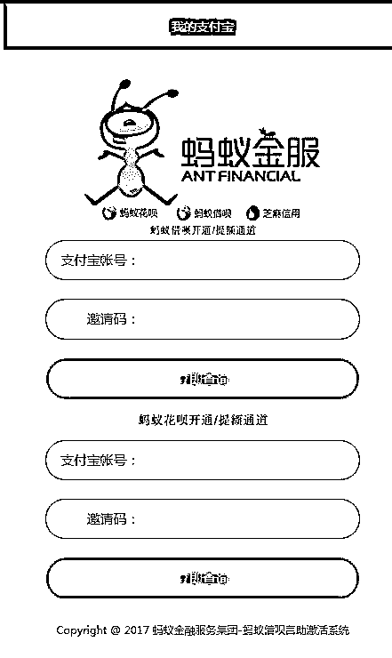

# 深度| 揭开重重迷雾，打开 “套现”灰色产业的潘多拉魔盒：利欲熏心，套路重重！

> 原文：[`mp.weixin.qq.com/s?__biz=MzIyMDYwMTk0Mw==&mid=2247489050&idx=1&sn=470dc89c01e4cba20a51cef1b5a21c40&chksm=97c8dd22a0bf543446473f665ea8a4d5a5088bf1ecdc786044d33f31486b8169c10fd910738e&scene=27#wechat_redirect`](http://mp.weixin.qq.com/s?__biz=MzIyMDYwMTk0Mw==&mid=2247489050&idx=1&sn=470dc89c01e4cba20a51cef1b5a21c40&chksm=97c8dd22a0bf543446473f665ea8a4d5a5088bf1ecdc786044d33f31486b8169c10fd910738e&scene=27#wechat_redirect)

****

**导语：真实的互联网世界，远比我们从媒体中看到的更加广大。在绝大多数人的视野之外，中文互联网世界存在着诸多隐秘，如同海洋中的深海区一样未知。只不过，在这个世界中区分层级的指标并不是温度与盐度，而是金钱与法律。本文提到的套现灰色产业链，只是互联网深海区的一个剪影。**

隐秘而暴利的生意

> 「老板在吗？不好意思，我刚刚不小心拍错了，这个学习卡我不想买了，可以帮我退款吗？」
> 
> 「可以的，亲。」
> 
> 「麻烦你把款退到我的支付宝吧，我这边马上确认收货。」
> 
> 「好的。您的订单号是 xxx，确定是这单不要了对吧？」
> 
> 「是的。」
> 
> 「好的亲，那扣除费用，退还您 900 元，对吗？」
> 
> 「对的，我的支付宝账号是 xxx。」
> 
> 「好的请稍等，马上给您安排退款。」

上面这段看似平常的淘宝交易对话，其实一度是淘宝官方重点防范的对象。

在这样的对话模型中，很可能隐藏着一个要从花呗套现的买家，和一个提供套现服务的卖家。他们通过学习卡、会员卡这样的虚拟商品进行交易，买家用蚂蚁花呗付款，然后双方配合，将早已演练好的对话模型在阿里旺旺中复制粘贴一番——这是为了向淘宝官方留下证据，证明整个交易是双方协商的结果，以避免纠纷。

演完这出戏，卖家会如约给买家的支付宝汇款，对话中所谈到的「扣除费用」，其实就是套现收取的手续费。一般来说，花呗套现千元以上，手续费是 10%。上述对话中买家确认退款 900 元，说明他刚刚用花呗消费了 1000 元，并向卖家支付了 100 元的手续费。

从本质上看，花呗套现和传统的信用卡套现并无二致，都是用虚假的交易将信用消费中不可提现的额度转换为现金。但是，由于交易环境的纯网络化，花呗套现展现出一些与众不同的新特征。

从业者自己建设网站，做 SEO 提高搜索排名，做微信公众号，找媒体发软文，找 QQ 群做推广，时不时还需要应对黑客和职业骗子。整体来看，他们被迫需要掌握更多的技能，而与此相对，这个行业也比过去更加暴利。

在这个既传统又新兴的行当里，年收入在六位数以上的只是及格，成规模的套现团队，日流水就可以达到千万。

京东白条，套现的练兵场

蚂蚁花呗于 2014 年底开始公测，在 2015 年 4 月正式上线。作为蚂蚁金服推出的消费信贷产品，花呗可以理解为是一张用于网络购物的虚拟信用卡，用户通过积累信用，可以不断提升消费额度，先购物，后付款。2015 年双十一，有 6048 万笔交易是用花呗支付完成，渗透率达到了支付宝整体交易的 8.5%。

最早的一批花呗套现从业者，在花呗开始公测的阶段就已经下海。他们这份敏锐的嗅觉，大多来自于京东白条套现的实操经验。京东白条比花呗早上线大约 10 个月，这 10 个月的时间，是早期套现团队的练兵期。

在京东套现并不是一桩好做的生意。京东的商品多数是京东自营，所以套现的交易是真实产生的，套现成本也因此变得很高。通常的流程是，客户用京东白条购买商品，收货地址由套现团队提供，套现团队确认收货之后，扣除手续费完成转账。

这种交易模式有诸多不便。首先，交易时间很长，因为有 1-2 天的物流运输时间。另外，交易完成后，商品还压在套现团队手中，他们必须再通过渠道将商品二次销售，能不能将二手商品卖出高价，决定了他们的收益。

正因为这种商业模型对二次销售的渠道要求很高，京东白条套现的手续费也远高于花呗套现。正常情况下，京东白条套现的手续费在 15%-20%之间。

此外，京东白条套现还有一个弱点，那就是站在客户角度看，他们受骗机率更高。如果商家收货后就此消失，他们几乎无法维权，所以京东白条的套现生意一直不温不火。

后来，有人将淘宝的交易担保引入到京东白条套现中，在一定程度上改善了交易双方的信任问题。

最常见的方法是，客户在京东购物，产生物流编号，马上到淘宝旗下的二手交易平台闲鱼发布二手商品，正常标价、写上物流编号。套现团队在第一时间拍下商品，等货到后，在闲鱼上确认收货，完成交易。

这种方式巧妙地让淘宝成为了套现交易的第三方担保，而京东与阿里这两家势如水火的企业，也用这样的方式在互联网深海区握手言和。

花呗，打开新世界的大门

面对繁琐的京东白条套现，花呗的出现打开了新世界的大门。

淘宝人人可以开店，换而言之，每个人在理论上都可以开一个店铺进行花呗套现，而且淘宝可以销售不产生物流的虚拟商品，交易几乎实时完成，这也就不再要求从业者有二次销售的渠道能力。套现的从业门槛在瞬间降到了最低，市场也红火起来。

迄今为止，花呗套现发展了约一年多的时间，但无论是手续费还是交易模型，都已经完成了数次的迭代。

最初，花呗套现的手续费只有 4%，而经过几次洗牌，现在的手续费稳定在 10%-15%之间。

至于交易模型，最初的形态是双方 QQ 沟通，淘宝拍下商品，卖家扣除手续费打款，买家确认收货。这个模式虽然高效，但漏洞百出，卖家可能会遭遇职业骗子的敲诈，买家的财产安全也很难被保证。因而时至今日，更常见的模式是商品正常交易，用户在收货之后申请退货退款，整个流程在淘宝官方的全程监控中完成，如此，交易的安全性大大提高了。

淘宝并非对花呗套现的行为毫无作为。2015 年 7 月，日益猖獗的花呗套现迫使淘宝进行了一次大洗牌。淘宝开始限制假聊天的对话模型，并查封了一大批退换货频率极高的可疑店铺。「黑色七月」引发的后果是，套现的风险和难度都有所增加，市场供不应求。套现的手续费因此暴涨，最高一度达到 20%，但套现行为并没有因此杜绝。

文字的假聊被封锁之后，买卖双方改为用图片进行交流，后来，日益演变到了退货退款的模式。为了降低退换货在整体交易中所占的比例，套现团队可以伪造大量的真实交易进行冲抵，平台方很难识别。

此时，花呗套现已经基本结束了各自为战的野蛮生长期，逐渐走向团队化经营。销售、推广、中介、客服、店铺运营以及资本提供方的职能逐渐清晰，步步形成链条。

两股势力：黑客与职业骗子

除了平台的监管之外，还有一些外力迫使花呗套现团队不断聚拢。

第一股势力是黑客。相比于套现团队，黑客的技术优势几近碾压。黑客会黑掉搜索排名更靠前的花呗套现网站，以此索取一笔费用。另外还有一些时候，黑客是受同行指使而来，解封网站的条件是要在网站留下指定的 QQ 账号，借鸡生蛋，强制性地进行合作。

这种攻击造成的后果，轻则损失数日业务，重则网站直接掉出搜索结果前排，因此，为了建立更强大的技术壁垒，花呗套现从业者不得不团结起来。

第二股势力是职业骗子。影响花呗套现的骗子有两类，一类面向消费者，伪装自己可以进行套现服务，在用户付款后人间蒸发；另一类骗子直接面向套现团队，他们伪装成消费者，在套现后以投诉店铺相威胁进行敲诈。

这两类骗子在搅乱套现市场的同时，其实令行业走向了某种意义上的规范化，为了维持本就很可怜的信任度和自我安全，套现团队必须想出更多办法，这就促使他们不断变化。

寄生经济样本

就在 2015 年 7 月淘宝集中打击套现活动的时候，还发生了一件深入影响套现行业的事件，那就是花呗在这时走出了阿里系的围墙，逐步接入了大众点评、唯品会、聚美优品等 40 多家电商平台。

自此，蚂蚁花呗成为了既有肥沃的自留地，同时又支持跨平台消费的多面体。而花呗套现就如同吸附在大鱼身下的小鱼，随着花呗漂洋过海，进入了更广阔的天地。

团购、消费券，每一样支持花呗支付的商品都可以进行套现。如果说早期的花呗套现，只是被折下来插入水中的鲜花，那现在的它，已经长出了茂盛的根系，在泥土中越扎越深了。

花呗套现在笔者看来，是一个典型的寄生经济样本。他们依附于庞大的互联网消费金融产业，随着后者的发展而发展。与此同时，他们也会产生一股反作用力，作用于平台。一个不得不承认的事实是，花呗的产品普及过程中，套现团队的推广是一股不容忽视的力量，他们用互联网深海区的方式，渗透到官方营销活动所不能到达的地方，挖掘了一批可观的用户。

花呗套现，究竟是不是一种恶？

讨论花呗套现，很考验是非观。因为从利害的角度考量，它的危害很不明显。被套现的钱终究是会由用户还给平台的，平台在经济上似乎并未受损；更何况，蚂蚁金服是一个估值 600 亿美元的庞然大物，从它手中攫取一点利益，偶尔挑战一下它的规则，人们说不定会有恶作剧般的快感。

就好像一些花呗套现从业者认为的那样，他们自认为自己并没有什么过错，只是一种服务的提供者，「至少比诈骗强得多吧。」

**好戏开场了，灰产哥深入挖掘 套现灰色产业链，为您揭开它的神秘面纱！**

**灰色产业链：花呗借呗 官方渠道强开**

花呗和借呗是蚂蚁金服在消费金融方面的两款主要产品。从产品本身的用途设计，前者用于用户消费，后者则是直接借款。花呗和借呗都对用户的芝麻信用有一定要求。

这就出现了两种需求未被满足的用户，一种是想要借钱，但条件未达标的。另一种则是资金需求超过了官方提供的额度。

网上也非常应景的出现了一批声称可以“强开借呗”的商家。这些商家也基本声称，可以强开微粒贷、京东白条、苏宁任性付的账户。对于第二种用户，他们则声称可以提额。

但蚂蚁金服内部人士当时给的答复是，所有的“强开”，其实都是诈骗。

**深度揭秘：**

**灰产哥找通过特殊渠道找到了花呗借呗强开的网站：**

**页面如上，网站上由 借呗和花呗查询 组成，骗子通过包装和诱导  ，**

**让小白以为输入支付宝账号和所谓内部邀请码即可开通花呗和借呗  。**

**同时灰产哥也找到了邀请码哥购买渠道 ，**

**如下图所示，一个邀请码仅需“22 元-28 元”**

**根据代理等级不同，价格也不同，**

**但是骗子们确通过这个所谓内部开通渠道****收取**

** 500-1000 元的费用，****利润高达 几十倍！ **

**下图所示，是这个“邀请码” 的介绍和 花呗借呗开通的 网址 **

**以及激活码查询链接，所谓的“官方内部渠道” **

**我只想说，马云真的是你的马爸爸么？**

**灰色产业链：请君入瓮**

**在百度上，可以找到不少专营套现业务的网站。这是第一步。**

此前沟通的时候，花呗团队有同学表示，他们一直在和百度沟通，已经撤掉了不少网站。但这种东西不好预防，通常只能是先发现后处理。

如今，搜索“花呗套现”已经找不到这些网站，但搜索“花呗提现”，马上就能看到它们的踪迹。

**第二步**，这些网站也在打造它们的“专业形象”。比如，不时更新一些关于套现的“科普贴”，以及还款的注意事项提醒。总之最后的目的都是，吸引你去和客服联系。

**第三步**，要从你和客服联系开始。客服会把从各种渠道拉来的人组建 qq 群或者微信群。通常情况里面还会有一两个托，用于哄抬气氛。比如，“我上个月套现很快诶。”

如果你恰好需要用钱，这时候你已经进入终极环节了。接下来的一步就是，套现。

**套现开始，高价和风险**

套现方式主要分为两种，淘系内和淘系外。淘系内主要是通过淘宝，部分套现团队也提供天猫途径。淘系外则主要是通过大众点评。通过淘宝的方式费率低，但时间长；通过点评费率高，但时间短。

**淘宝的套现过程是这样：**

卖家在淘宝上开店，在群里通知上货时间，用户按约定好时间去购买，使用花呗支付。为了应付淘宝和支付宝的数据监控，付款之前他们还会去旺旺沟通一下。拍完商品之后，卖家会寄一个空包。用户收货之后确认付款，钱支付给卖家，然后选择售后退货，钱转回买家手里，套现就完成了。

大概的费用是这样。

刚开始询价时，客服的官方报价是，通过淘宝链接则收费 10 个点，即套现 1000 元收 100 元，低于 1000 元的统一收费 100 元；通过大众点评则收费 15 个点，700 元以下收费 100 元。因为淘宝通过售后退货的方式到账较慢，点评可以即时到账。

别急，做生意嘛，还可以还价的。在告知对方我的蚂蚁花呗额度是 9000 元并要求优惠后，客服给出的最后报价是“9000 一起套的话，淘宝 7 个点，大众的 12 点”，比之前的报价便宜了 3 个点。

这个价格怎么样？我们用 1 万块来计算下。

花呗本身的设计，还款期通常是一个月，按时还款是不收取利息的，成本全部在于付给商户的套现费用。按照淘宝和点评两种方式的优惠点数，分别是 700 和 1200。如果是正常报价，则分别是 1000 和 1500。

所以，为了 1 万块钱的一个月使用权，你要付出 1000 或 1500 的代价。信用卡套现的费率通常最高也不超过 5%。长远来看，接近信用卡 2-3 倍费率的费用，并不是每个人都能负担。

更直接的风险，则是以套现为名义的诈骗。

通过淘宝诈骗，最常用的方式是拒不退货。如果保证金远低于其诈骗金额，他完全可以弃店跑路。通过店铺诈骗，则是商户直接跑路。提供套现的商户，通常业务会是电脑维修、点卡充值等服务或虚拟商品。

**灰色产业链：官方渠道 微粒贷强开**

      微粒贷是微信旗下类似于“借呗”的金融产品，对于资质好的人微信可能会对其开通微粒贷，但 微粒贷仅仅是很少一部分人拥有，那些没有开通微粒贷又急需要用钱的人，可能就会进入另一个陷阱 ：  **官方渠道 微粒贷强开  **

**以下是灰产哥与强开微粒贷的客服之间的对话：**

**上图所示，灰产哥询问开通微粒贷的条件，客服 假装正经的问我四个问题，**

**客服称，达到四个基本要求可以开通微粒贷 ，灰产哥继续提问**

**客服说，最低开通额度 3W 百分百开通，**

**灰产哥不忘调戏一下客服问她：为什么你不开通，她说：不需要！**

**开通价格：首付 500 元 开通后尾款 1000 元**

**接下来我让客服发送开通的案例给我，客服发来两段视频，**

**我截取了两张图片，图一显示开通额度，图二显示开通的后台**

****

**我与客服的谈话告一段落，客服通过所谓视频和话术迷惑小白，从而上当受骗！**

**利润一单 500 元 ，成本几乎为 0！**

**深度揭秘**

**灰产哥通过内部渠道找到官方开通微粒贷 网址：**

********

****如上所示，官方开通微粒贷 诱导页面 ，只需要输入 身份证 手机号 微信号  邀请码 即可查询****

****微粒贷额度，我与客服的聊天是骗子帮你代开微粒贷 直接骗钱，****

****而上图是销售给你邀请码你自己自行开通，****

****当你输入邀请码和所有信息时候，查询到的结果是：您未达到微粒贷开通条件！****

****继续下图，灰产哥找到了销售微粒贷邀请码的渠道，价格 25 元-35 元不等，****

****根据代理级别不同价格也不同。****

****

****以下是商品描述：所谓的内部激活网站，仅仅是安慰剂罢了****

****（网址我不打码了，有技术的可以去黑了）****

****

**成本 二十几元的微粒贷开通邀请码被骗子们包装成内部渠道。**

**售价 500-1000 元 ，利润 20-40 倍！**

**故事有始有终，我与“周小莹”爱恨情仇终于以她无情删除我结束！**

**我与“周小莹”的故事算是结束了，但是无数的“周小莹”还活着，**

**他们以美女的身份设置温柔的陷阱，只等寂寞无知的你上钩呢！**

**故事还远远未结束，灰产哥从此又踏上了另一个灰色产业链的揭秘之路，**

**下一期，我们不见不散！**

**延伸阅读****：[深度|揭秘灰色产业之“嗜血”的现金贷：有人发家致富，也有人家破人亡，光怪陆离,乱象丛生！](http://mp.weixin.qq.com/s?__biz=MzIyMDYwMTk0Mw==&mid=2247488869&idx=1&sn=0900360097d1ba0f8e88d55a1d32439e&chksm=97c8de5da0bf574b41a663d2ba4196584bf5a21e72a598217d1b5e7610e6d5ceed97d2bc6b98&scene=21#wechat_redirect)**

点击“阅读原文”加入高端社群。