# 深度| 记一次网络诈骗追踪过程

> 原文：[`mp.weixin.qq.com/s?__biz=MzIyMDYwMTk0Mw==&mid=2247489019&idx=1&sn=fbaa119e94f86b4075244f567a1f4c1d&chksm=97c8dec3a0bf57d5aab2d5fc35da4c6502497ff8a965a72800183f24b53f00accfc45e6c9e9e&scene=27#wechat_redirect`](http://mp.weixin.qq.com/s?__biz=MzIyMDYwMTk0Mw==&mid=2247489019&idx=1&sn=fbaa119e94f86b4075244f567a1f4c1d&chksm=97c8dec3a0bf57d5aab2d5fc35da4c6502497ff8a965a72800183f24b53f00accfc45e6c9e9e&scene=27#wechat_redirect)


本文素材均来源于真实事件，有关细节因隐私问题暂时隐去。事件是近日的某天，一位朋友通过微信联系到我，当时我正沉浸在 LOL 被坑的苦恼中…… 

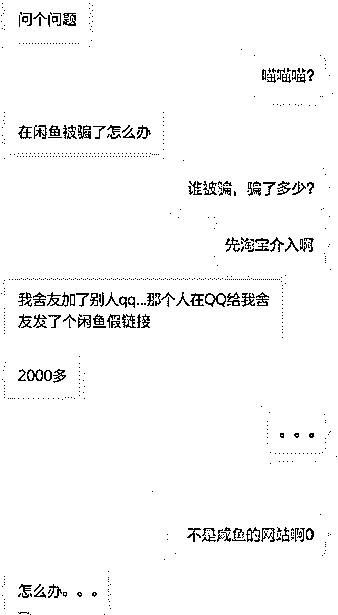

一开始我以为是咸鱼交易纠纷问题，那么这种情况就直接淘宝客服介入就可以解决。但是实际上却是，一个钓鱼网站。

随后我迅速结束了游戏，召集团队成员。然后，一切就从这里开始了……

* * *

## 查证

了解了事情的经过，原来是这位朋友的舍友被骗了，我们暂时称我这位朋友叫 R 吧，而被骗的人我们一如既往地称为— 受害者。

我先让 R 去平复受害者的心情，与此同时，最先的建议都是“ 先报警”。毕竟警察叔叔是我们最好的靠山，相信遇到这种事情，无论是安全专家还是像我们这种安全小白，都会将这个作为最优先的手段。

同时也取得第一手资料，也就是那个诈骗的网站，这里就不方便打出来，大概是这样的：

```
http://XXXXX/index.asp?cn=i&url=pro.opi&id=240&spm=92blb06EJaU61M7B8H#guarantee
```

XXXXX 是和谐后的地址。这里不方便发出来，先浏览一下，得出一个类似于闲鱼的页面，由于没有截图，就没有图了。首先针对域名进行查询，得出以下结果：

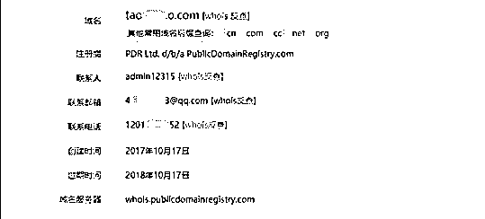

关键信息因为某些原因暂时抹去。服务器 IP 为直接 IP 地址，没有经过 CDN，系统是 Windows Server 2003，服务器供应商为这个：

```
服务器供应商：广州皇都网络科技有限公司
IP：103.195.1xx.xxx[ 香港 广州皇都网络科技有限公司]
公司网址：http://www.gzroyal.cn/
```

打开看了看这个服务器供应商的网页，除了一些客服联系方式外，还有一个大概就是托管的 WEB 服务管理页面。

与此同时，R 已经陪同受害者到当地的公安报案，既然这样，这边也不能就闲着，继续查找相关的证据。

回到域名注册的资料，不能放过任何细节的我们尝试性查询所有资料…

联系邮箱：一个有三年 Q 龄的 QQ；

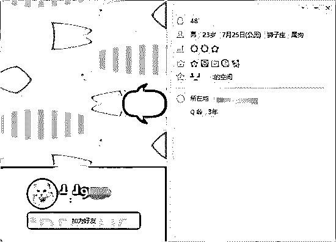

联系电话：不存在的，是一个假冒的电话号码。

另外一边帮忙查的小伙伴也在 whois 上查到一些资料，但是都是注册商的资料，查到一个广东茂名的 151 号段电话。但是可以知道，这应该是托管商的号码吧。

既然到这个地步了，感觉从域名与服务器层面应该没有成果，随后返回钓鱼页面去看看有什么信息。

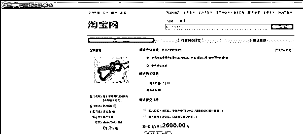

这个为受害者被骗的商品的页面，只能说各种东西都模仿得特别像真实的网站，但是咸鱼跳转到淘宝网不会感觉到诡异吗？

与诈骗商品页面不同的是，诈骗商品介绍页面上部分连接都进行了回源阿里处理，所有连接到连接到正规的网站，笔者尝试对商品介绍处的搜索栏进行 XSS，结果发现的是阿里的 WAF 。

而交易页面（也就是这个页面）的则“粗糙” 了一点，说好的“工匠精神”呢？与此同时，还找到其他商品的交易页面：

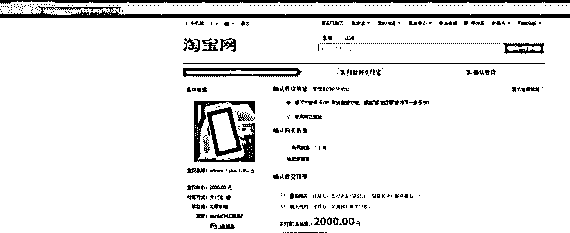

所以估计做的坏事还不止这么一件事情，这个时候 R 告知笔录貌似完毕了，团队也草草把查找到的一点资料（服务器供应商、服务器 IP 、服务器类型、可能涉案人员等等）发送给 R 希望她能够给予警方一点帮助，但被告知不需要，笔者提醒 R 记得拿警方给出的 “协助调查通知书”（貌似是这个名字）去希望某爸爸、还有服务器供应商，以及后期涉及到的携程帮助。

* * *

## 尝试

### 笔者询问 R 究竟是怎么被骗的，R 表示受害者在闲鱼看到一个东西然后就被骗了。虽然很含糊但是起码知道事情的起点是在闲鱼，并向 R 询问资金的流向。

她表示是走了携程。

携程？携程是什么情况？

于是笔者就收到这个交易清单：

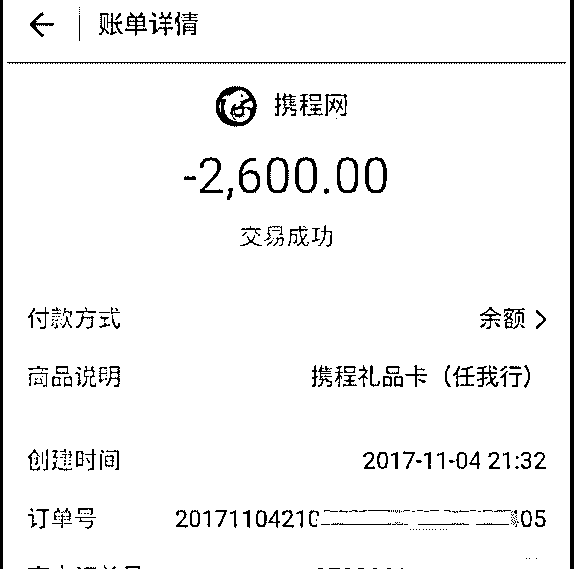

很明显是攻击者方便洗清自己（？）与方便交易受骗的钱，而走了携程网去买了个礼品卡。如图所示，是买了一个 2600 元的携程礼品卡（任我行）。

那么资金的走向就是这个样子：


正在纠结的时候，团队成员似乎发现了这个网站的一个后台，是一个笔者并不认识的 CMS，画面是这样的：

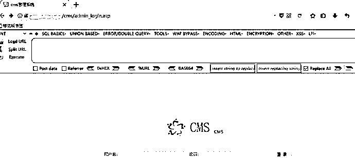

```
地址：http://XXXXX/cms/admin_login.asp
```

笔者首先使用最简单的绕过登录，但是别人又不是傻，无效。但是总算是到了较为擅长的领域了。

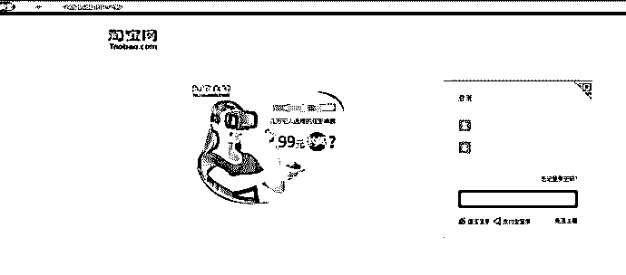

回到假冒的登录页面，如果对于一个普通网民来说还是挺真实的，但是只要打开源码一看就会发现，都是一些调用 IMG 的连接。

经过小师傅 的努力 获取到骗子的后台 。

然后就发现了一些信息：

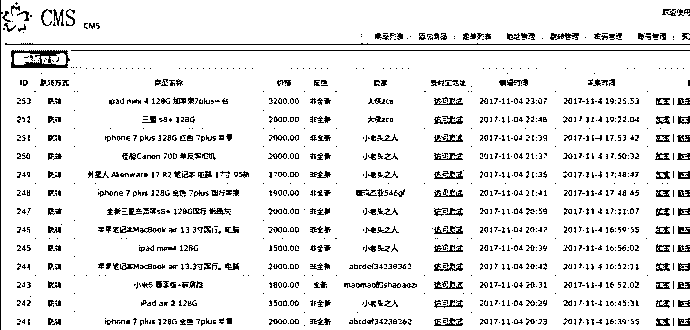

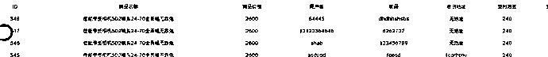

可见这里寄存了一些链接（钓鱼商品链接）以及假冒支付宝登录窗口所掉到的一些支付信息

最后还查到一个可疑的登录 IP：

```
IP：117.61.xxx.xxx，使用高精准 API 查出 IP 地址是江苏南京玄武区的某个大厦附近。
```

事到如今，可能信息收集到这里就已经没有任何可行的余地了，一切都要看警察叔叔了。我们的能力可能就只能到这里了。然后笔者尝试复现一下案例，但是总感觉有些许不对，线索联系不上。

是谁给受害者发链接的？

* * *

## 后期

笔者立马询问 R，她补充了一下，是一个闲鱼卖家给 QQ 号给受害者，受害者添加该 QQ 号后被骗。

R 说，这个闲鱼卖家是帮助代挂的，卖家也吓得把所有链接都删了。（看来是一个傀儡吗？）

查询 QQ 后得出：

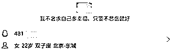

如果大家没忘记的话，页面上的地址也是：

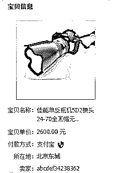

这样一来，大概就这这个就是骗子了，也就是攻击者。对方并没有用一个低等级账号去骗人，而是去使用一个创建时间较久，等级较高的 QQ 号进行诈骗，于是笔者便对案情进行一次整理。由于时间不太清楚，基本还原了一次时间轴：

> 1\. 受害者想购买单反相机一台，便在闲鱼寻找适合的商品；
> 
> 2\. 受害者找到适合的商品，联系卖家，卖家基于一个 Q 号并声称这是物主，他只是代挂；
> 
> 3\. 受害者添加物主（攻击者）的 QQ，并咨询，谈拢价格为 2600；
> 
> 4\. 物主（攻击者）到 cms 后台修改物品价格为 2600 人民币，并发送钓鱼连接给受害者；
> 
> 5\. 受害者点开支付（物品为携程礼品卡，暂不清楚具体细节），后发觉不对，发现受骗；
> 
> 6\. 受害者受骗后 R 联系到笔者，然后报案；
> 
> 7\. 11 月 5 号凌晨警方受理报案，案件开始进入侦查阶段；

笔者让受害者去联系携程与阿里，协助帮助。得出结果是携程并不配合表示礼券已被消费，阿里表示需要警方配合调查。

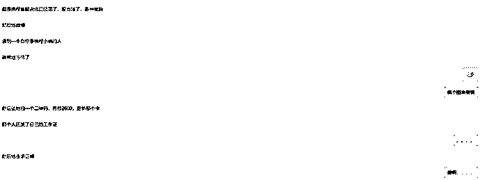

还有一个假冒携程的工作人员想进行二次行骗，公开处刑吧。

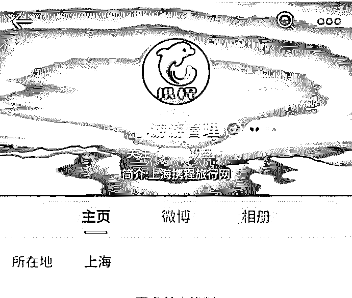

* * *

## 总结

总的来说，感觉这 2600 人民币大概也是泡汤了，算是买个教训。

这是一个很普遍的使用钓鱼网站诈骗的手段，通过模仿真实网站来构建一个钓鱼网站进行行骗，这种手法我们也已经见过两次。这类金额较少的案子，告破率也是很低，至于为什么，可能便是作案成本低、涉及金额少、取证难且成本高。

真希望你们能提高安全意识……

* * *

截止到文章编写前，受害者的资金仍未讨回。我们团队也在私下收到诸多此类的被诈骗、钓鱼的案件的受害者的求助（受限于团队能力  诸多求助皆不了了之）。当然，这种攻击行为也不会因此报案而结束，任何时候都可能有人上当受骗而受到不可言喻的伤害。

至今，此诈骗团队的网站已经更改，或许另一起诈骗案件也已经拉开帷幕… 


点击“阅读原文”加入高端社群。